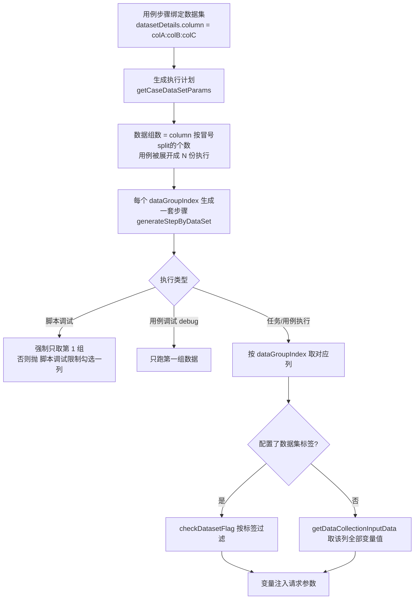

# 数据集与数据枚举实现

## 概述

数据集（`TestDatasetController` + `TestDataCollectService`）与数据枚举（`TestDataEnumController` + `TestDataEnumService`）共同实现参数化执行：数据集以"位置敏感的 JSON 二维数组"整表快照存储，绑定关系落在用例步骤上，执行时由 `ElementUtil` 按勾选的数据组列把用例展开成 N 份。产品功能与操作说明见 [数据集与数据枚举](../01-产品功能/数据集与数据枚举.md)。

## 数据模型

### 数据集 test_data_collect

DO：`src/main/java/cn/testin/dao/TestDataCollectDo.java`，核心字段：

- `parentId` / `parentIds`：所属目录（模块树 type=DATASET，复用通用模块树）；
- `detail`（BLOB）：**JSON 二维数组**，表格的完整快照。约定（综合前端默认值与后端解析代码）：

```
row 0: ["变量", "变量说明", "<列ID1>", "<列ID2>", ...]   ← 表头行；后端按列ID定位列
row 1: ["标签", "", "<数据组1标签>", "<数据组2标签>", ...]  ← 标签行（可按标签筛选执行）
row 2+: ["<变量名>", "<变量说明>", "<组1值>", "<组2值>", ...]  ← 变量行
```

前端新建时的初始结构见 `src/views/dataSet/components/DataSet.vue`（`['变量','变量说明','数据组1'...]` / `['标签']`）。后端遍历变量行时恒从 `i=2` 开始并跳过首列值为"变量"/"标签"的行（`TestDataCollectService.java` 的 `checkQueryCondition`）。

注意：界面与存储之间有一层转换——读取时前端把 `detail[0]`（列 ID 行）剥离存到 `collumnIds`、其余行进表格（`DataSet.vue`），保存时再拼回 `[collumnIds, ...data]`（`DataSet.vue`）。

- 其余字段：`status`（新增默认 "2"）、`deleteFlag`（"0" 未删）、创建/更新人与时间。

### 步骤上的绑定关系

绑定关系存在**步骤表**上：`test_case_step.dataset_id` + `dataset_details`（JSON，对应 `RequestInputDataSet`，含 `id / name / column / originList`）。`column` 是勾选的数据组列 ID，用冒号拼接（`DelimiterConstants.COLON`）。

### 数据枚举 test_data_enum

DO：`TestDataEnumDo.java` + BLOB 版 `TestDataEnumDoWithBLOBs.java`，字段：`name`、`description`、`detail`（BLOB，JSON 二维数组：row0 为表头，之后每行 `[枚举值, 枚举描述]`）、`enumNumber`（= detail 行数 - 1，`TestDataEnumService.countEnumNumber`）、`moduleId`、`isDeleted`。

### EnumDriver 与数据枚举无关

`src/main/java/cn/testin/commons/constants/EnumDriver.java` 是 **NoSQL 数据库驱动枚举**（MONGODB / HBASE / REDIS 的 JDBC driver 类名），被 `DataBaseUtil.java`、`NoSqlDataBaseUtil.java` 用于按驱动名路由连接逻辑。名字带 Enum 但属于 [数据库与NoSQL测试](../04-复杂功能细节/数据库与NoSQL测试.md) 领域，勿混淆。

## 关键流程

### 1. 数据集编辑（前端 handsontable）

- 编辑器是 **handsontable**（`DataSet.vue` 引入 `@handsontable/vue3`、`registerAllModules()`），前两列只读（变量名列除外）、表头/标签行有专用样式与 renderer（`updateCellSettings`）。
- **枚举联动**：行内变量名命中枚举时，该数据组列单元格变 `autocomplete`，候选值来自 `/data/enum/getEnumList`，展示为 `枚举_<value>（<desc>）`（`DataSet.vue` 的 `getEnumAutocompleteList` 的 cells 配置）。
- 保存走 `POST /case/dataset/save`（`src/api/dataSet.ts`），同时携带 `delColumnIds`（本次删掉的数据组列 ID）。
- 删除/重命名前先 `checkLockedByApi('DATASET', ids)` 做编辑锁检查（`src/api/dataSet.ts`），见 [编辑锁机制](编辑锁机制.md)。

### 2. 数据集后端接口

`TestDatasetController`（`src/main/java/cn/testin/controller/TestDatasetController.java`，前缀 `/case/dataset`）：

| 端点 | 说明 |
|---|---|
| `GET /list` | 分页；一级目录按项目查，子目录按模块 ID 递归（`TestDataCollectService.pageList`） |
| `GET /{id}` / `POST /save` | 详情 / 保存（同名同目录查重） |
| `POST /batchDelete` | 批量删除：先解绑所有引用步骤（步骤 `datasetId`/`datasetDetails` 置空），再进回收站（`ModuleType.DATASET`），最后物理删除 |
| `POST /copy` | 复制到指定目录，重名加 `_副本_xxxx` |
| `POST /replaceQuery` / `POST /replaceUpdate` | 批量替换：type=0 改变量名（行首列），type=1 改变量值（行内任意列）；先 query 预览、确认后 update |
| `GET /module/{moduleId}` | 目录树下钻（文件夹 type=dir + 数据集 type=dataset） |

保存时的两个重要副作用（`TestDataCollectService.saveDataCollections`）：

1. **编辑锁**：更新前查 `pageLockService.checkLockedForApiDirectOperation(ModuleType.DATASET, ...)`，别人正在编辑则拒绝。
2. **删列级联**：`delColumnIds` 非空时 `updateStepData`找出所有绑定该数据集的用例步骤，把步骤 `datasetDetails` 里 `column`（冒号分隔的列 ID 串）中已删列剔除，并按新列重建 `originList`——保证步骤不会因为列被删而引用悬空。

### 3. 数据集如何驱动执行

执行链路（`src/main/java/cn/testin/entity/vo/request/ElementUtil.java`）：



要点：

- 一个用例的执行份数 = 其所有步骤中**最大**数据组数（`getCaseDataSetParams` ，批量版 `batchCaseDataGroupCounts`）；没有勾选该组的步骤在执行时会出现数组越界，代码捕获后跳过（"越界说明对应的索引上没有使用数据组"）。
- 脚本调试只能勾一列；用例 debug 模式默认只跑第一组。
- 数据标签在执行入口的运行弹窗选择（前端 `src/utils/components/RunDialog.vue` 的"数据标签"表单项），报告中按"数据集标签"列展示（`src/views/report/TaskReport.vue`）。

### 4. 数据枚举接口与约束

接口 `TestDataEnumController`（`src/main/java/cn/testin/controller/TestDataEnumController.java`，前缀 `/data/enum`）：分页 `list`、详情 `view/{id}`、目录 `module/{moduleId}`、批量删 `delete`、保存 `save`、按名字批量查 `getEnumList`（数据集编辑器拉下拉候选用）。

保存/删除的约束（`TestDataEnumService.java`）：

- **校验**（`checkEnumExist`）：名称必填且不重复（同项目）、detail 非空、不允许存在完全相同的 [值+描述] 行。
- **绑定保护**：枚举被数据集绑定（有变量行首列 == 枚举名，`getDataCollectByEnum`，`TestDataCollectService.java`）时，**不可删除**（抛"该枚举已绑定数据集，不可删除"）、**不可改名**（抛"该枚举已绑定数据集，不可修改枚举名称"）。
- **改值级联**（`updateDataEnum`）：保存修改时 diff 新旧 detail——先标出完全未变的行（`identifyUnchangedEnum`），再按"枚举值相同"配对找修改，剩下的旧行当删除处理；每个变化都调 `updateDataCollect`把绑定数据集里所有 `枚举_旧值（旧描述）` 单元格替换为 `枚举_新值（新描述）`（删除则替换为空串）。单元格文本格式由 `getFieldValue`拼出：`枚举_<value>（<desc>）`。
- 描述兜底：枚举描述为空时前端显示用 `EnumConstants.DEFAULT_ENUM_DESC = "null"` 做空值标记（`src/main/java/cn/testin/commons/constants/EnumConstants.java`），读取时翻译回空串（`TestDataEnumService.java`）。
- 枚举删除是逻辑删除（`extTestDataEnumDoMapper.batchDelete` 置 `is_deleted`），**不进回收站**。

## 关键代码位置

后端（相对 `testin-api-backend/`）：

| 位置 | 作用 |
|---|---|
| `src/main/java/cn/testin/controller/TestDatasetController.java` | 数据集 REST 入口 `/case/dataset` |
| `src/main/java/cn/testin/service/TestDataCollectService.java` | 数据集保存（锁检查 + 删列级联） |
| `src/main/java/cn/testin/service/TestDataCollectService.java` | 批量删除（解绑步骤 + 回收站） |
| `src/main/java/cn/testin/service/TestDataCollectService.java` | 删列后同步所有引用步骤 |
| `src/main/java/cn/testin/service/TestDataCollectService.java` | 批量替换查询（变量名/变量值） |
| `src/main/java/cn/testin/service/TestDataCollectService.java` | 按枚举名反查绑定的数据集 |
| `src/main/java/cn/testin/controller/TestDataEnumController.java` | 枚举 REST 入口 `/data/enum` |
| `src/main/java/cn/testin/service/TestDataEnumService.java` | 枚举保存（校验 + 级联入口） |
| `src/main/java/cn/testin/service/TestDataEnumService.java` | 枚举 diff 并级联更新数据集 |
| `src/main/java/cn/testin/entity/vo/request/ElementUtil.java` | 执行时按数据组展开步骤 |
| `src/main/java/cn/testin/entity/vo/request/ElementUtil.java` | 数据组数 = column 冒号分隔计数 |

前端（相对 `testin-api-frontend/`）：

| 位置 | 作用 |
|---|---|
| `src/views/dataSet/components/DataSet.vue` | 表格初始结构（表头/标签行约定） |
| `src/views/dataSet/components/DataSet.vue` | 枚举下拉候选生成 |
| `src/views/dataSet/components/BatchReplace.vue` | 批量替换弹窗 |
| `src/utils/components/ChooseDataSet.vue` | 步骤上选择数据集/勾选数据组的弹窗 |
| `src/components/RequestParameters/RequestData.vue` | 步骤"请求数据"页签（绑定/解绑/预览） |
| `src/api/dataSet.ts` | 数据集 API（含编辑锁前置检查） |
| `src/api/enum.ts` | 枚举 API |
| `src/views/enum/components/EnumInfo.vue` | 枚举编辑页 |

## 注意事项与坑

1. `detail` 是**位置敏感**的二维数组：row0 是列 ID 表头、row1 是标签、row2+ 是变量行；后端大量 `getJSONArray(0)` / `i=2` 起遍历的硬编码（如 `TestDataCollectService.java`），前端若改表格结构必须同步改后端解析。
2. 步骤里的 `datasetDetails.column` 用**冒号**分隔列 ID，列 ID 若哪天允许含冒号会全盘错乱。
3. 数据组数按"步骤最大值"展开用例，勾了 3 组的步骤 + 只勾 1 组的步骤混在同一用例时，后者靠捕获 `IndexOutOfBoundsException` 跳过（`ElementUtil.java` 注释），属于设计如此，不要在日志里当异常报错治理。
4. 枚举级联更新数据集是**全文本替换**（`Collections.replaceAll`，`TestDataEnumService.java`），如果用户手工把单元格文本改成同格式的 `枚举_x（y）` 也会被一起替换。
5. 枚举删除/改名被绑定保护拦下时，前端没有"查看哪些数据集绑定了它"的入口，需要后端用 `getDataCollectByEnum` 排查。
6. 批量替换分两步（query → update），update 有编辑锁检查（`TestDataCollectService.java`），query 没有——并发下可能出现"预览有、更新被锁"的体验断层。
7. **批量替换的 type=2（字段名=字段值）后端未实现**：前端 `BatchReplace.vue` 提供三种替换类型（0 字段名 / 1 字段值 / 2 字段名=字段值），但 `TestDataCollectService.replaceQuery`只有 type 0 和 1 两个分支，type=2 走到方法末尾返回 `null`，前端表现为"暂无可替换数据集"。若产品上要启用 type=2，需补后端分支。
8. 数据集删除前会**先解绑所有引用步骤再进回收站**，因此从回收站还原数据集后，原步骤不会自动恢复绑定（步骤里的 `datasetId` 已被置空），还原后需手工重新绑定。
9. 前端 handsontable 为锁定版本（见仓库 README/CLAUDE 约定），升级可能破坏自定义 renderer/editor。
