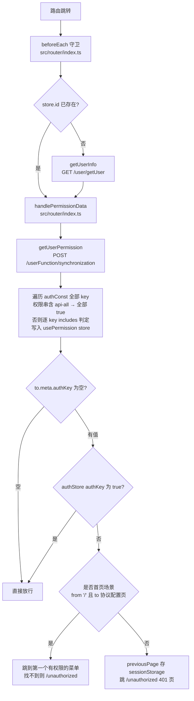
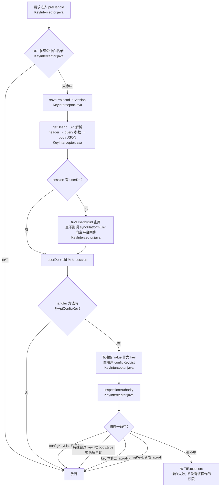
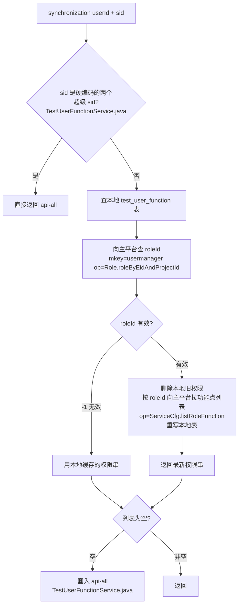

# 权限体系

## 概述

本平台的权限是**两层、两端各一套**的结构：

- **前端两层**：路由级（`meta.authKey` + 全局守卫，决定页面能不能进）和元素级（`v-auth` 指令，决定按钮/菜单渲染不渲染）。
- **后端两层**：`KeyInterceptor` 拦截器统一解析登录态（Sid → 用户 → 权限串列表），再按 controller 方法上的 `@ApiConfigKey` 注解逐个接口判定是否放行。
- **权限数据的真正源头是私有云主平台**：用户在某项目下的角色由主平台维护，后端通过 `mkey/op` 协议向主平台同步角色 → 功能点列表（configKey），缓存在本地 `test_user_function` 表。前端拿到的权限串列表也是后端同步后的结果。

前后端的 key 字符串（如 `api-interface-save`）必须保持一致，新增受控功能时**两端都要配**，否则会出现"按钮能看见但接口 403"或"接口放行但按钮不渲染"。

权限模型的兜底规则很特殊：**用户权限串列表为空时视为全权限（`api-all`）**，而不是无权限——新用户默认可用全部功能，只有主平台明确配置了角色才收敛。详见下文。

## 逻辑详解

### 权限 key 的命名与定义

所有 key 集中定义在两处，命名一一对应：

- 前端：`src/directives/permission/const.ts` 的 `authConst` 对象，按模块分组（协议配置、环境、执行机、T2、定时任务、测试计划、枚举、数据集、接口、脚本、用例、任务、回收站），每个模块通常有"菜单 key + view/save/delete 等操作 key"。
- 后端：`src/main/java/cn/testin/enums/ApiConfigKeyEnums.java` 的 `ApiConfigKeyEnums` 枚举。注意该枚举**不是全部真实生效值的来源**——controller 上实际用的注解值才是（枚举里环境相关的值有 `api-enviromment` 拼写错误，而 controller 注解用的是正确拼写 `api-environment-*`，见"注意事项"）。

key 的通用形态：

```
api-<资源>-<动作>           例：api-case-save、api-task-execute、api-interface-view
api-<资源>Module-<动作>     目录树操作，例：api-caseModule-save、api-scriptModule-move
control-<资源>              一级菜单可见性，例：control-machine、control-apienv
api-all                    通配全权限（前端后端都认）
```

### 前端：路由级权限



关键点：

- 路由表在 `src/router/index.ts`（`menuRoutes`），每条路由的 `meta.authKey` 填 `authConst` 里的 key。**一级路由的 `authKey` 必须是数组**（`src/router/index.ts` 注释明确要求），因为一级菜单的可见性由"任一子菜单有权限即显示"决定；叶子路由填单个 key。不配置 `authKey` 等于不做权限拦截。
- 守卫每次跳转都会重新调 `getUserPermission()`（`src/api/user.ts`）拉权限串列表，然后整体刷新 store：`res.includes('api-all')` 为真时**所有 key 置 true**（`src/router/index.ts`）。
- 权限串写到 `usePermission` store（`src/stores/permission.ts`）：state 初始化时把 `authConst` 全部 value 置 `false`（`src/stores/permission.ts`），另有 getter `isHas(key)` 供组件内读取。
- 无权限跳转到 `/unauthorized` 前会把目标路径和 authKey 存进 `sessionStorage.previousPage`（`src/router/index.ts`），401 页场景下守卫会重试一次：重新 syncProject + 拉权限，若此时有权限则补跳回原目标（`src/router/index.ts`）——这是为了解决"主平台侧刚授完权、iframe 里权限串还是旧的"的时序问题。

### 前端：元素级权限（v-auth 指令）

指令实现于 `src/directives/permission/index.ts`，全局注册名 `v-auth`（`src/directives/permission/index.ts`），在 `mounted` 和 `updated` 两个钩子都执行检查：

- 绑定值为空 → 直接显示；
- 绑定值为字符串 → `authStore[value]` 为 true 才显示；
- 绑定值为**数组** → **任一命中即显示**（`value.some(item => authStore[item] === true)`，`src/directives/permission/index.ts`），用于控制父级菜单；
- 无权限时不是 `display:none`，而是 `el.parentNode?.removeChild(el)` **直接把节点从 DOM 摘掉**（`src/directives/permission/index.ts`）。

用法示例（`src/views/machine/index.vue`）：

```html
<el-button v-auth="authConst.EDIT_MACHINE" type="primary" @click="addMachine">新建执行机</el-button>
```

一级菜单的渲染也走同一个指令（数组形式），所以"菜单看不见"和"按钮看不见"是同一套数据。

### 后端：KeyInterceptor 权限判定

后端只有**一个真实生效的权限拦截器** `KeyInterceptor`（注册于 `src/main/java/cn/testin/configuration/WebSecurityConfig.java`，未配路径模式 = 拦截所有请求）。判定流程：



三个要点：

1. **白名单**：构造函数里硬编码（`KeyInterceptor.java`），用 `startsWith` 前缀匹配。包含 swagger 资源、`/project/sync`（登录同步）、mock 相关、`/job/api`（xxl-job 执行器回调）、`/share`（分享报告免登）、`/t2Connection/view`、UI 自动化回调等。
2. **`@ApiConfigKey` 注解即配置**：方法上标了哪个 key 就校验哪个 key（`src/main/java/cn/testin/annotation/ApiConfigKey.java`）。想让接口不受权限管理：不加注解，或 value 填 `api-all`（`inspectionAuthority` 里 `api-all` 恒真，`KeyInterceptor.java`）。
3. **目录操作的特殊 key 替换**：目录树接口是公共资源（同一个 `TestModuleController` 服务全部模块），注解上只能写通用 key `api-module-save/rename/delete/move`（`specialConfigKeyList`，`KeyInterceptor.java`）。判定时读请求 body 里的 `TestModuleDTO.type`，把 key 里的 `api-module` 替换成 `api-interfaceModule` / `api-caseModule` / `api-scriptModule` 等再比对（`inspectionSpecialAuthority`，`KeyInterceptor.java`）。`type=DIR`（目录的目录）时还要按 `toModuleId` 查库反推目标目录类型（`KeyInterceptor.java`）。这也意味着目录接口的 body 必须可被重复读取——依赖请求包装器，见 [后端请求处理管线](后端请求处理管线.md)。

### 权限串列表从哪来

前端 `getUserPermission()` 打的是后端 `POST /userFunction/synchronization`（`src/main/java/cn/testin/controller/TestUserFunctionController.java`），核心逻辑在 `TestUserFunctionService.synchronization`（`src/main/java/cn/testin/service/TestUserFunctionService.java`）：



`KeyInterceptor` 内部用的 `getConfigByUserId`（`KeyInterceptor.java`）直接查本地表，同样遵守"空列表 → api-all"的兜底（`KeyInterceptor.java`）。

## 关键代码位置表

| 位置 | 作用 |
|---|---|
| `testin-api-frontend/src/directives/permission/const.ts` | 前端全部权限 key 常量 `authConst` |
| `testin-api-frontend/src/directives/permission/index.ts` | `v-auth` 指令实现，数组任一命中显示，无权限 removeChild |
| `testin-api-frontend/src/stores/permission.ts` | `usePermission` store，key→boolean |
| `testin-api-frontend/src/router/index.ts` | `menuRoutes` 路由表，`meta.authKey` 配置处 |
| `testin-api-frontend/src/router/index.ts` | `handlePermissionData` 拉权限并做路由级判定 |
| `testin-api-frontend/src/router/index.ts` | 全局守卫入口 |
| `testin-api-frontend/src/api/user.ts` | `getUserPermission` → `/userFunction/synchronization` |
| `testin-api-backend/src/main/java/cn/testin/interceptor/KeyInterceptor.java` | 后端权限拦截器本体 |
| `testin-api-backend/src/main/java/cn/testin/annotation/ApiConfigKey.java` | 接口权限注解定义 |
| `testin-api-backend/src/main/java/cn/testin/enums/ApiConfigKeyEnums.java` | 后端权限 key 枚举（有历史拼写问题，以注解实际值为准） |
| `testin-api-backend/src/main/java/cn/testin/service/TestUserFunctionService.java` | 向主平台同步用户权限串 |
| `testin-api-backend/src/main/java/cn/testin/configuration/WebSecurityConfig.java` | 拦截器注册（仅 KeyInterceptor 生效） |

## 注意事项与坑

- **新增受控功能 checklist**：① `ApiConfigKeyEnums` 加枚举（值必须从枚举复制，注解上的注释连写三遍"切勿手写"，见 `ApiConfigKey.java`）；② controller 方法加 `@ApiConfigKey`；③ 前端 `authConst` 加同名 key；④ 页面按钮加 `v-auth`；⑤ 路由 `meta.authKey` 配置；⑥ 通知主平台在角色管理里配置该功能点，否则主平台配了角色的用户拿不到这个 key——但由于"空列表=api-all"兜底，未配置过角色的用户不受影响。
- **空权限列表 = 全权限**：`KeyInterceptor.java` 与 `TestUserFunctionService.java` 都是这个逻辑。想在主平台"全部禁用"某用户，不能靠清空功能点，至少留一个无效 key。
- **枚举与注解不一致**：`ApiConfigKeyEnums` 环境相关枚举值是 `api-enviromment-*`（拼写错误），而 `EnvironmentController` 注解与前端 `authConst` 用的是 `api-environment-*`（正确拼写）。真实生效的是**注解值 + 前端 const + 主平台配置**三方字符串，枚举只是个易过期的参考。改 key 时全局搜索注解实际值，别只看枚举。
- **前端 key 与后端 key 并非天然同步**：例如 T2 模块前端注释写着"字符串暂时使用执行机待替换"（`const.ts`）。前后端 key 对不上时的典型表现：按钮渲染了但接口报"没有该操作的权限"，或反之。
- **目录权限 key 的运行时替换**：给目录接口配权限时，主平台里要配的是替换后的 key（如 `api-caseModule-delete`），不是注解上的 `api-module-delete`。
- **v-auth 是 removeChild 不是隐藏**：被摘掉的节点不参与布局，父容器里用 `:last-child` / 间距类样式可能因此变化；且 `updated` 钩子会重复执行，动态权限变化时节点不会自动加回来，需要刷新页面。
- **两个硬编码超级 sid**：`TestUserFunctionService.java` 写死了两个 sid 直接给 `api-all`，属于调试遗留，生产环境注意别泄露。
- 权限与登录态的完整链路（sid 从哪来）见 [登录态与主平台集成](登录态与主平台集成.md)；拦截器在请求管线中的位置见 [后端请求处理管线](后端请求处理管线.md)。
