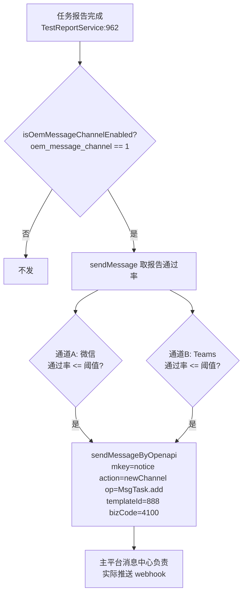

# 概览分析与消息实现

项目/用户概览统计、用户行为埋点、用例分析标注、消息通知、主平台登录态落地的实现细节。产品视角见 [概览分析与消息](../01-产品功能/概览分析与消息.md)。

## 数据模型

| 表 | 模型 | 说明 |
|---|---|---|
| `project_overview` | `src/main/java/cn/testin/dao/ProjectOverviewDo.java` | 每项目一行：`projectId` + 4 个 **JSON 字符串**字段（`interfaceOverview` / `scriptOverview` / `caseOverview` / `taskOverview`） |
| `user_overview` | `src/main/java/cn/testin/dao/UserOverviewDo.java` | 每用户一行：`interfaceNum / scriptNum / caseNum / taskNum / caseAnalysisNum / datacollectNum` 六个计数 |
| `problem_cause_config` | `src/main/java/cn/testin/service/ProblemCauseConfigService.java` | 问题原因字典：系统内置 `type=0`，自定义 `type=1` |
| `test_case_analysis` | — | 单用例分析（分析人 + 原因 + 描述），按 `reportDetailId + caseId` 存 |
| `test_report_detail` 的 `analysis_*` 字段 | — | 报告详情批量标注落点（与 `test_case_analysis` 是**两套数据**） |

## 关键流程

### 1. 项目概览

**统计内容**（`src/main/java/cn/testin/service/ProjectOverviewService.java`）：

| 维度 | 指标 | 口径 |
|---|---|---|
| 用例 | caseNum / thisWeekCaseNum / passCaseRate | 未删除用例总数；本周新增；`last_result=1`（最后一次执行成功）占比 |
| 任务 | taskNum / thisWeekTaskNum / passTaskReta | 未删任务总数；本周新增；任务维度报告通过率的**平均值**（`extTestReportDoMapper.selectPassRateByTaskReportIds`） |
| 脚本 | scriptNum / thisWeekScriptNum / passScriptNum | 总数（**不过滤删除标记**）；本周新增；调试执行通过数 |
| 接口 | interfaceNum / thisWeekInterfaceNum / interfaceCoverage | 总数（不过滤删除标记）；本周新增；被引用接口数 / 总数 |

"本周"边界是 `CommonUtil.getLastWeekLastDayTimestamp()`（上周日 24 点为界）；"百分比"由 `testCommonService.calculatePercentage` 生成。

**更新时机**：定时任务 `ScheduledTask.updateProjectOverview`（`src/main/java/cn/testin/commons/task/ScheduledTask.java`，cron `0 0/10 * * * ?`，每 10 分钟）遍历全部项目重算，`insertOrUpdateBatch` 每 50 条一批（`ProjectOverviewService.java`）。**概览数据最长滞后 10 分钟。**

**读取**：`GET /common/project/overview`（`src/main/java/cn/testin/controller/CommonController.java`），按 session 里的 projectId 直查主键。**子系统前端没有消费这个接口**（`src/` 下无引用），消费方是私有云主平台首页。`src/views/main/index.vue` 只是开发期 demo 骨架页，与概览无关。

### 2. 用户概览（贡献榜）

- 更新：`UserOverviewService.updateUserOverview`（`src/main/java/cn/testin/service/UserOverviewService.java`）与项目概览同一个 10 分钟定时任务触发，按 `create_user_id` 逐表 count。用例/任务过滤了删除标记，**接口/脚本/数据集/分析未过滤**——用户删了自己建的接口，贡献数不会减。
- 读取：`GET /common/user/overview`（`CommonController.java`），按 session userId 查；查到多条会抛"查询到您在此项目下的多条用户信息"。

### 3. 用户行为埋点

`UserBehaviorService`（`src/main/java/cn/testin/service/UserBehaviorService.java`）是**所有业务模块公用的记录器**——环境、环境配置、接口、脚本、用例、任务、数据集、枚举、执行机、定时任务等 Service 的增删改里都有 `recordUserBehavior(ids, id, name, type, action)` 调用（入参 ids 与 id 二选一， 同时为空或同时非空都只记日志丢弃）。

- **类型/动作枚举**：`UserBehaviorTypeEnums`（ENVIRONMENT_CONFIG/EVIRONMENT/INTERFACE/SCRIPT/CASE/TASK/DATA_ENUM/DATA_COLLECT/MACHINE/SCHEDULED_TASK/SCRIPT_COPY/FILE）、`UserBahaviorActionEnums`（INSERT/UPDATE/DELETE 等）。
- **去重**：UPDATE 动作在 30 秒窗口内（`INTERVAL_TIME`）对同一资源只刷新老记录时间戳，不新增行——防抖，避免"编辑中连续保存"刷屏。
- **定时任务特判**：type=SCHEDULED_TASK 时按 xxl-job 的 `addTime == updateTime` 推断是新建还是修改。
- **查询**：`GET /userBehavior/list`（`src/main/java/cn/testin/controller/UserBehaviorController.java`），按当前项目分页返回操作流水；**前端无页面消费**。记录时用户/项目来自 `SessionUtil`，属服务端埋点，前端无主动上报。

### 4. 用例分析与问题原因配置

两块配合：**问题原因是字典，用例分析是标注动作**。

**字典** `problem_cause_config`：

- 系统内置 8 类（`src/main/java/cn/testin/enums/SystemProblemCauseEnums.java`）：1 环境问题、2 产品变更、3 产品缺陷、4 用例问题、5 执行问题、6 脚本问题、7 工具问题、**1000 人工标记成功**。
- 内置项不可删（删除时过滤， 抛"系统定义错误原因不可被删除"）、不可改名（编辑时强制清空 name）；自定义项 `type=1`，名称 ≤16 字符且全局唯一。
- "人工标记成功"启动时幂等初始化（`@PostConstruct initManualMarkSuccess` ，id 固定 1000 以避开自增区间）。
- 接口前缀 `/custom/analysis`（`src/main/java/cn/testin/controller/ProblemCauseConfigController.java`）；前端页面 `src/views/problem/index.vue`（路由 `/system/problem`，"问题类型管理"），API `src/api/problem.ts`；前端对 `type === 1` 才展示修改/删除按钮，禁用走 `ElMessageBox.confirm` 二次确认。

**标注**有两条链路：

1. **单用例分析**（`test_case_analysis` 表）：`POST /analysis/save`、`GET /analysis/view`（`src/main/java/cn/testin/controller/TestCaseAnalysisController.java`）；查不到时返回预填当前用户的空表单（`TestCaseAnalysisService.java`）。
2. **报告详情批量标注**：`POST /task/report/analysis`（`TestTaskController.java`，用例报告侧是 `TestCaseController.java`）→ `TestReportService.saveAnalysisAndRefreshStatistics`→ `TestReportDetailService.saveReportDetailAnalysis`：
   - 选"人工标记成功"(id=1000) 且原结果为失败 → `exe_result` 改为成功；
   - 从 1000 改选其它分类 → 结果回退为失败；
   - 仅当涉及 1000 的选入/撤销时才 `refreshReportStatistics(reportId)` 重算报告通过率，普通标注不重算。

前端入口在报告页 `src/views/report/TaskReport.vue`（API `src/api/analysis.ts`）：单个标注走 `problem.viewProblem`（分析人预填当前用户），批量走"批量设置原因"按钮（`setErrorReason`）；选 1000 时前端隐藏"详细描述"并展示翻转提示、保存前清空描述；涉及翻转时前端本地重算统计并刷新饼图、重应用过滤；被标记行显示 `MANUAL_MARK_TAG_NAME` 标签。

### 5. 消息通知

通道数据**不落地本库**，全部实时读主平台（`TestMessageService`，`src/main/java/cn/testin/service/TestMessageService.java`）：

- **通道列表**：`GET /message/channel/list/{projectId}`（`TestMessageController.java`）→ 调主平台 `Channel.list`，过滤本项目且 `status==1`，把 `config` JSON 里的 `webHookUrl/secret/passRateConfig` 摊平返回；`GET /message/channel/check` 只返回 OEM 开关。
- **阈值语义**：`sendMessageByHttpApi`——通道上配置的成功率阈值 `successRate >= 0 且 报告通过率 <= 阈值` 才发，即"**通过率低于预期才告警**"。
- **报告链接**：`oem_api_test_url`（主平台 OEM 配置）或默认 `http://api-test.pro.testin.cn`，拼 `/#/report/2?reportId=..&projectId=..&sid=..`；sid 取**项目下最近更新用户**的 sid，因为定时任务执行时没有操作人上下文。
- 两个通道 ID 来自任务执行参数 `weixinMessageChannelId` / `teamsMessageChannelId`（任务上配置的通知通道）；前端在 `src/utils/components/RunScheduledDialog.vue`（type 5=企业微信、6=Teams，开关 + "通过率 <= N% 触发"输入框）与 `RunDialog.vue` / `RunSupplementalDialog.vue` 中配置。
- `isOemMessageChannelEnabled` 是 **static 全局变量**，任何一次 `list` 调用都会刷新它，意味着开关状态是"进程级共享、随查询懒更新"的。

### 6. 平台信息落地（登录态同步）

`POST /platformInfo/save`（`src/main/java/cn/testin/controller/PlatformInfoController.java`，**无权限注解**，是登录前置接口）→ `PlatformInfoService.save`（`src/main/java/cn/testin/service/PlatformInfoService.java`）：

- 入参 `info` 是主平台传来的大 JSON：`projectInfo`（项目 id/名称/描述）、`userOnline`（userid/sid/姓名/邮箱）、`roles`（权限串列表）、`url`；
- 项目不存在则插入 `test_project`；用户按 `userid` upsert `test_user` 并**刷新 sid**——本地 sid 有效期完全靠每次进入 iframe 时更新。
- 前端触发点：`src/api/login.ts`（`loginByApi`），由 `src/utils/Login.ts` 在收到主平台 postMessage 时调用。完整链路见 [登录态与主平台集成](登录态与主平台集成.md)。

### 7. 项目接口

`ProjectController`（`src/main/java/cn/testin/controller/ProjectController.java`）：

- `GET /project/sync`：按 sid 向主平台同步项目信息，返回 userOnline（校验登录态）；
- `GET /project/list`：按 sid 查本地项目列表（前端 `src/api/project.ts` 的 `getProjectList`）；
- `GET /project/systemParam`：主平台 OEM 参数列表（前端 `getOemConfig`）。

## 关键代码位置

后端（相对 `testin-api-backend/`）：

| 位置 | 作用 |
|---|---|
| `src/main/java/cn/testin/commons/task/ScheduledTask.java` | 每 10 分钟重算两个概览 |
| `src/main/java/cn/testin/service/ProjectOverviewService.java` | 项目概览统计主流程 |
| `src/main/java/cn/testin/service/UserOverviewService.java` | 用户贡献统计 |
| `src/main/java/cn/testin/controller/CommonController.java` | `/common/project/overview`、`/common/user/overview` |
| `src/main/java/cn/testin/service/UserBehaviorService.java` | 行为埋点统一入口 |
| `src/main/java/cn/testin/controller/UserBehaviorController.java` | `/userBehavior/list` 分页查询（前端无页面） |
| `src/main/java/cn/testin/service/ProblemCauseConfigService.java` | 内置"人工标记成功"初始化 |
| `src/main/java/cn/testin/enums/SystemProblemCauseEnums.java` | 8 个系统问题原因 |
| `src/main/java/cn/testin/service/TestReportDetailService.java` | 标注保存与结果翻转 |
| `src/main/java/cn/testin/service/TestReportService.java` | 标注后按需重算报告统计 |
| `src/main/java/cn/testin/service/TestMessageService.java` | 报告完成后的消息分发 |
| `src/main/java/cn/testin/service/TestMessageService.java` | 调主平台 MsgTask.add 发消息 |
| `src/main/java/cn/testin/service/PlatformInfoService.java` | 主平台登录态落地（项目/用户/sid） |
| `src/main/java/cn/testin/controller/ProjectController.java` | 项目同步/列表/OEM 参数 |

前端（相对 `testin-api-frontend/`）：

| 位置 | 作用 |
|---|---|
| `src/views/problem/index.vue` | 问题类型管理页（路由 `/system/problem`） |
| `src/api/problem.ts` | 字典 CRUD（`/custom/analysis/*`） |
| `src/views/report/TaskReport.vue` | 报告页标注弹窗、批量设置原因、标记翻转后的本地重算 |
| `src/api/analysis.ts` | 报告标注 API（`/task/report/analysis`、`/analysis/view`） |
| `src/api/message.ts` | 消息通道列表 |
| `src/utils/components/RunScheduledDialog.vue` | 定时执行弹窗里的企业微信/Teams 通知开关与阈值 |
| `src/api/project.ts` | 项目同步/列表/OEM |
| `src/api/login.ts` | `/platformInfo/save` 登录态上报 |

## 注意事项与坑

1. **概览是异步快照**，最长滞后 10 分钟；新建资源立刻看首页数字对不上是正常现象。多实例部署时每个实例都会跑这个 `@Scheduled`（无分布式锁），并发重算结果一致但浪费。
2. 概览各维度对"已删除"的口径不一致（用例/任务过滤，接口/脚本不过滤），用户概览同理——改口径时四个维度要逐个看，别只改一处。
3. 用户行为埋点**入参约束隐蔽**：ids 与 id 二选一，传错只记 error 日志不上报（`UserBehaviorService.java`）；整个记录过程 try-catch 吞异常，埋点缺失时先看日志级别。
4. "人工标记成功"翻转结果后直接改 `test_report_detail.exe_result` 并重算，**没有审计字段记录翻转前结果**（分析描述/analysisUser 会更新，原结果不可追溯）。
5. 消息发送依赖主平台协议（`mkey=notice, op=MsgTask.add`）与 `platform.url/apikey` 配置；`isOemMessageChannelEnabled` 是 static 共享变量，只在有人查通道列表时刷新——纯定时任务触发的报告可能用到**陈旧**开关值。
6. 消息里的报告链接拼接了"项目最近活跃用户的 sid"，链接接收人点击时实际以他人 sid 打开，存在越权查看报告的语义瑕疵，分享场景需注意。
7. `/platformInfo/save` 无鉴权（登录前调用），其入参完全信任主平台 postMessage；若服务直接暴露公网，任何人都能伪造项目/用户/sid 写入本地库——必须靠部署层隔离。
8. `TestCaseAnalysisService` 单用例分析（`/analysis/*`）与报告详情批量标注（`/task/report/analysis`）是**两套数据**（test_case_analysis 表 vs test_report_detail.analysis_* 字段），当前前端主要用后者；前者写入后在报告页不展示，别误以为保存成功就能看到。

相关文档：[定时调度体系](定时调度体系.md)、[登录态与主平台集成](登录态与主平台集成.md)、[测试报告与分享实现](测试报告与分享实现.md)、[权限体系](权限体系.md)。
