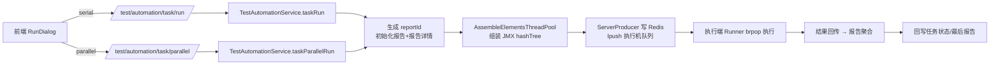

# 测试任务实现

> 测试任务模块的代码级解析：任务/用例关联模型、手动与定时执行编排、补测链路、删除约束。产品层功能与操作说明见 [测试任务](../01-产品功能/测试任务.md)。

## 概述

任务挂在 **TASK 类型的模块树**下（与用例、接口共用模块树机制），列表页是"左树 + 右 Tab 页"结构（`testin-api-frontend/src/views/testTask/index.vue`）。执行入口统一在 `TestAutomationController`，与计划执行、脚本调试共用[任务执行链路](任务执行链路.md)。

## 数据模型

```
test_module (type=TASK)                任务目录树
  └── test_task                        任务本体
        id(UUID) / taskNumber(项目内序号,100001起) / name / tag($a$,$b$)
        executionStatus('0'未执行 '1'执行中 '2'已完成)
        reportId(最后一次报告) / envId / envName / retestNum(自动重测)
        isTime / isDel / caseInfo(废弃的用例快照)
  └── test_task_case                   任务-用例关联(有序)
        taskId / caseId / caseNum(执行序号,允许同用例重复)

test_task_supplement_history           补测历史
  reportId / supplementId(每次补测一个UUID) / caseId / caseNum
  exeResult / supplementNum / content(当次补测的步骤明细)
```

- 任务的用例关联保存在 `test_task_case` 表（`TestTaskCaseDo`，`testin-api-backend/src/main/java/cn/testin/dao/TestTaskCaseDo.java`），字段只有 `id / projectId / taskId / caseId / caseNum`，`caseNum` 是**用例在任务内的执行序号**。
- 同一个用例**可以多次加入同一任务**（不同 caseNum），所以报告结果按 `caseNum` 分组聚合而不是按 caseId（`TestReportService.uploadTaskRunReport` 中 `groupingBy(RequestResult::getCaseNum)`，`testin-api-backend/src/main/java/cn/testin/service/TestReportService.java`）。
- 任务实体 `TestTaskDo`（`testin-api-backend/src/main/java/cn/testin/dao/TestTaskDo.java`）关键字段：`taskNumber`、`executionStatus`、`reportId`、`envId / envName`、`retestNum`、`isTime`、`tag`（存储格式 `$tag1$,$tag2$`，读取时去掉 `$`）。
- 历史包袱：`test_task.case_info` 是老版本的用例快照 JSON，现在以 `test_task_case` 关联表为准；`/task/testin/maintainOldCaseInfo`（`TestTaskController.java`）是把老数据迁移进关联表的一次性维护接口。**新代码不要再读 caseInfo**。

## 关键流程

### 任务的创建与用例管理

- 新建/保存走 `POST /task/save`（`TestTaskController.testTaskSave`，`testin-api-backend/src/main/java/cn/testin/controller/TestTaskController.java`），只保存任务基本信息；同项目同目录下名称唯一（`TestTaskService.checkNameExist`，`testin-api-backend/src/main/java/cn/testin/service/TestTaskService.java`）。
- 用例的增删排序是独立接口：
  - 添加 `POST /task/taskCase/add/{taskId}`（`TestTaskController.java`）
  - 删除 `POST /task/taskCase/delete`（`TestTaskController.java`）
  - 拖拽排序 `POST /task/taskCase/edit/{taskId}`（`TestTaskController.java`）
- 前端编辑页 `testin-api-frontend/src/views/testTask/components/TaskDefintion.vue`，选用例弹窗 `TaskSelectCaseDialog.vue`。
- 从用例列表勾选批量生成任务走 `TestTaskService.taskGenerationByCase`（`TestTaskService.java`），前端弹窗 `testin-api-frontend/src/views/case/components/CreateTask.vue`。

### 手动执行：串行与并行

执行入口统一在 `TestAutomationController`（`testin-api-backend/src/main/java/cn/testin/controller/TestAutomationController.java`），权限 key 为 `api-task-execute`：

| 方式 | 接口 | 说明 |
|---|---|---|
| 串行 | `POST /test/automation/task/run` | 全部用例在一台执行机上按 caseNum 顺序跑 |
| 并行 | `POST /test/automation/task/parallel` | 用例按执行机分配，多台机器同时跑，共享一个 reportId |
| 停止 | `POST /test/automation/stop` | 通过 Redis 记录的 reportId→机器列表通知执行机停止 |
| 继续 | `POST /test/automation/resume` | 断点续跑：在原报告上重跑未执行完的用例/数据集行 |

**执行参数（前端 RunDialog 收集，`TestExecutionParam` 承载）**：环境 `envId`、执行机 `machineId`（并行时是 `machineIds` 数组）、用例标签 `caseTags` 与数据集标签 `datasetTags`、消息通知（`weixinNotifySuccessRate / weixinMessageChannelId / teamsNotifySuccessRate / teamsMessageChannelId`——按通过率阈值向企业微信/Teams 频道推送结果）、`executeType`（serial/parallel）、`isTime`（0 手动 / 1 定时）。任务实体上的 `retestNum`（0-5，前端 `testTask/config.ts` 写死选项）在执行前被读出并覆盖到参数里（`TestAutomationController.java`）。

关键逻辑：

1. **参数校验**：`executionParamValidation`（`TestAutomationController.java`）要求 id / projectId / envId / type 非空；执行机连通性由 `TestMachineService.runnerCheckMachineConnection` 校验（`TestAutomationController.java`）。
2. **自动重测**：任务配置了 `retestNum > 0` 时失败用例自动重跑（`TestAutomationController.java`）。
3. **并行的退化**：并行执行时先用例过滤后不足 2 条，退化为第一台执行机串行（`TestAutomationController.java`）。
4. **用例过滤**：执行前按用例标签和数据集标签过滤，见 `TestTaskService.getCaseIdsByTask`（`TestTaskService.java`）。
5. **批次拆分**：JMeter hashTree 按每 50 条用例拆一个批次（`TestTaskConstants.MAX_CASE_COUNT = 50`，`testin-api-backend/src/main/java/cn/testin/commons/constants/TestTaskConstants.java`），由 `TestTaskBatchPoller` 每 3 秒轮询逐批下发到执行机，详见 [任务执行链路](任务执行链路.md) 与 [批次结果聚合](批次结果聚合.md)。
6. 执行开始后 `TestTaskService.beginDebug` 把任务 `executionStatus` 置为 '1'（`TestTaskService.java`）。



前端对应 `testin-api-frontend/src/api/task.ts`（`taskRunByApi`）与 `task.ts`（`taskRunparallelByApi`），执行对话框是公共组件 `testin-api-frontend/src/utils/components/RunDialog.vue`。

**前端状态轮询**（`TaskListTable.vue`）：

- 任务行"停止"按钮只在 `executionStatus === '1'` 时出现（`TaskListTable.vue`），点击后前端把任务 ID 放进轮询集合，每 3 秒调 `/task/getTaskListByIds` 直到状态变化才移除（`TaskListTable.vue`）。
- 执行中任务（`executionStatus === '1'`）同样有 3 秒轮询拉报告进度（`getReportList`，`TaskListTable.vue`），驱动列表里的进度条。

### 定时任务

- 定时配置保存在 xxl-job（服务端内嵌 xxl-job admin），接口 `POST /job/task/saveTaskJob`，前端 `saveScheduleRunByApi`（`testin-api-frontend/src/api/task.ts`）。调度信息支持"执行一次(once) / 重复执行(repeat，cron 表达式)"，配置弹窗 `testin-api-frontend/src/utils/components/RunScheduledDialog.vue`。
- 到点触发的是 xxl-job handler `JobTaskParallel`（`testin-api-backend/src/main/java/cn/testin/xxljob/jobhandler/TestTaskJobHandler.java`），它回调 `TestAutomationController.scheduleTaskRun`（`TestAutomationController.java`）：按 executeType 走串行或并行，并把 `isTime=1` 传入——**报告上的 `isTime` 字段就是用来区分"手动执行 / 定时执行"来源的**。
- 定时任务管理页是独立的 `testin-api-frontend/src/views/scheduleTask/index.vue`，支持启用（`/job/task/startTaskJob`）、禁用（`stopTaskJob`）、删除（`removeTaskJob`），页面 30 秒自动刷新。
- 删除任务时会同步删掉对应 xxl-job 定时任务（`TestTaskService.batchDelete` 中 `testJobTaskService.removeTask(id)`，`TestTaskService.java`）。

### 失败补测（supplement）与补测历史

补测 = **只重跑上一次报告中的失败用例**，结果写回原报告：

1. 入口 `POST /test/automation/task/supplementalTest`（`TestAutomationController.java`）。
2. `TestAutomationService.taskSupplementalTest`（`testin-api-backend/src/main/java/cn/testin/service/execution/TestAutomationService.java`）：
   - 从任务最后一次报告 `reportId` 查出失败用例（`selectFailCaseInfos`，`TestAutomationService.java`；没有失败用例直接报错"无需补测"）；
   - 生成新的 `supplementId`（UUID），**复用原 reportId** 执行；
   - 先把原报告中失败详情的 `exeResult` 标记更新并打上 supplementId（`updateFailReportDetail`，`TestAutomationService.java`）；
   - 继承原报告的用例标签 / 数据集标签过滤条件（`TestAutomationService.java`）；
   - 若报告关联了[测试计划](测试计划.md)执行记录，会把计划任务状态重置为执行中。
3. 每一次补测生成一批 `test_task_supplement_history` 记录（`TestTaskSupplementHistory`：`reportId / supplementId / caseId / caseNum / exeResult / supplementNum / content`），由 `TestReportService.initSupplementHistory` 初始化（`TestReportService.java`）。报告上的 `supplementTotal` / `lastSupplementId` 记录补测次数与最近一次补测 ID。
4. 前端补测按钮在任务列表（完成且失败或中断时出现），见 `TaskListTable.vue` 中 `supplementalTest`（`testin-api-frontend/src/views/testTask/components/TaskListTable.vue`），弹窗 `RunSupplementalDialog.vue`（只选执行机），API 封装 `testin-api-frontend/src/api/task.ts`。

### 删除与回收站

- 删除走批量接口 `POST /task/batchDelete`（`TestTaskController.java`）。
- **关联了[测试计划](测试计划.md)的任务不允许删除**：后端先查 `plan_task_relation`，有则返回计划清单（前端收到 code 508 弹出"该任务已关联测试计划"并列计划，`TaskListTable.vue`），见 `TestTaskService.batchDelete`（`TestTaskService.java`）。
- 删除是软删除进[回收站](../01-产品功能/回收站.md)（保存任务 JSON 快照），任务本体从 `test_task` 删除；用例关联表等彻底删除时才清理（`TestTaskService.java` 注释）。

### 列表与其他接口

- 历史报告：每个任务可开"历史报告"Tab（`TaskReportHistoryListTable.vue`），走 `GET /task/reportHistoryPageList`（`TestTaskController.java`）。
- 导入导出：`POST /task/export` / `POST /task/import`（`TestTaskController.java` / `203`），导出文件 `testIn-task-export.json`；导入弹窗 `importTaskDialog.vue`（覆盖模式/不覆盖改名）。
- 批量下载报告 Excel：`GET /task/batch/downloadReport`（`TestTaskController.java`），前端 `exportBatchReportApi`（`task.ts`）。
- 报告页跳转：点"查看报告"是 `window.open` 新页签打开 `/#/report/2?reportId=xx&sid=xx&projectId=xx`（`TaskListTable.vue`），报告页渲染细节见 [测试报告与分享实现](测试报告与分享实现.md)。
- 任务列表查询 `GET /task/list` 按模块过滤：选中一级模块按 projectId 查全项目，选子模块则连同所有子孙模块一起查（`TestTaskService.list`，`TestTaskService.java`）；返回前逐条补 `caseCount` 与创建人/更新人姓名。

## 关键代码位置

| 位置 | 说明 |
|---|---|
| `testin-api-backend/src/main/java/cn/testin/controller/TestTaskController.java` | 任务 CRUD / 详情 / 报告查询 / 导入导出 |
| `testin-api-backend/src/main/java/cn/testin/controller/TestAutomationController.java` | 任务/用例/脚本执行入口（run/parallel/supplement/stop/resume） |
| `testin-api-backend/src/main/java/cn/testin/service/TestTaskService.java` | 任务业务层（保存、删除、列表、标签过滤） |
| `testin-api-backend/src/main/java/cn/testin/service/TestTaskCaseService.java` | 任务-用例关联维护 |
| `testin-api-backend/src/main/java/cn/testin/service/execution/TestAutomationService.java` | taskRun / 补测 / 并行执行编排 |
| `testin-api-backend/src/main/java/cn/testin/service/TestTaskSupplementHistoryService.java` | 补测历史记录 |
| `testin-api-backend/src/main/java/cn/testin/service/TestTaskBatchPoller.java` | 批次缓冲轮询下发（3s） |
| `testin-api-backend/src/main/java/cn/testin/xxljob/jobhandler/TestTaskJobHandler.java` | 定时任务 xxl-job handler |
| `testin-api-backend/src/main/java/cn/testin/commons/constants/TestTaskConstants.java` | 每批次 50 用例常量、目录类型枚举 |
| `testin-api-frontend/src/views/testTask/index.vue` | 任务页框架（树 + Tabs） |
| `testin-api-frontend/src/views/testTask/components/TaskListTable.vue` | 执行/停止/补测等操作 |
| `testin-api-frontend/src/views/testTask/components/TaskDefintion.vue` | 任务编辑页（基本信息 + 用例列表） |
| `testin-api-frontend/src/utils/components/RunDialog.vue` | 执行参数弹窗（任务/计划策略共用） |
| `testin-api-frontend/src/utils/components/RunScheduledDialog.vue` | 定时执行配置弹窗 |
| `testin-api-frontend/src/utils/components/RunSupplementalDialog.vue` | 补测弹窗（仅选执行机） |
| `testin-api-frontend/src/views/scheduleTask/index.vue` | 定时任务管理页 |
| `testin-api-frontend/src/api/task.ts` | 任务相关全部 API 封装 |

## 注意事项与坑

- **`executionStatus` 是字符串**（'0'/'1'/'2'），前端判断写成了 `row.executionStatus === '1'`；前端模板里还处理了 `'3' 停止中` 和 `'4' 中断` 两个状态值（`TaskListTable.vue`），文档化的后端枚举只到 '2'，排查状态流转时以实际代码为准。任务表 `state` / `lastResult` 是另一组 Byte 字段，别混用。
- 任务的 `reportId` 只指向**最后一次**报告；补测、断点续跑都复用这个 reportId 写回原报告，所以"最后一次报告"会随补测不断变化。
- 批量删除任务时，只要其中任意一个任务关联了计划就整体拒绝（返回计划列表，前端按 code 508 处理），前端要处理这个非 200 响应。
- `caseInfo` 是废弃字段但仍存在于表结构里，查询时 `getTaskDTODetail` 会显式 `setCaseInfo(null)`（`TestTaskService.java`），不要再依赖它。
- 定时任务 handler 名叫 `JobTaskParallel` 但**串行并行都走它**，命名有误导性。
- 并行执行选择多台执行机，但过滤后用例不足 2 条会静默退化为串行单机——排查"为什么并行只用了一台机器"时先看用例数。
- 任务权限 key：`api-task-view / api-task-save / api-task-delete / api-task-execute / api-task-export / api-task-import`，前后端命名需一致，见 [权限体系](权限体系.md)。

## 相关文档

[测试任务](../01-产品功能/测试任务.md)、[用例管理](../01-产品功能/用例管理.md)、[测试计划](测试计划.md)、[测试报告与分享实现](测试报告与分享实现.md)、[任务执行链路](任务执行链路.md)、[批次结果聚合](批次结果聚合.md)、[定时调度体系](定时调度体系.md)、[数据集与数据枚举](../01-产品功能/数据集与数据枚举.md)、[测试机管理](../01-产品功能/测试机管理.md)
