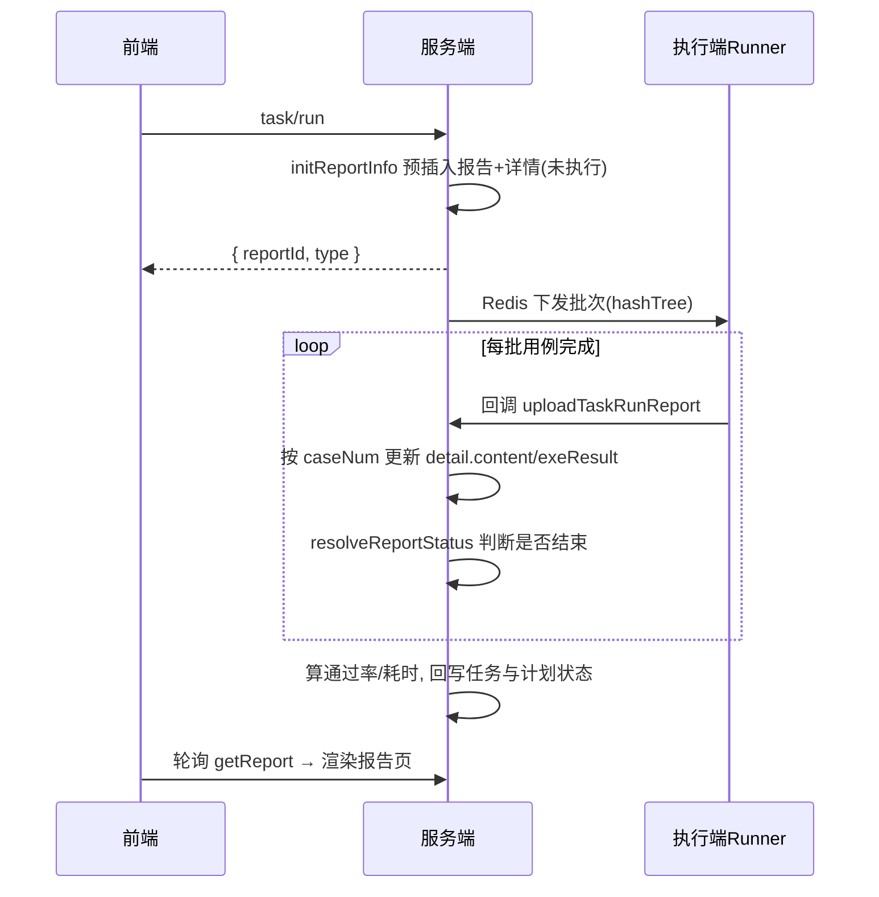
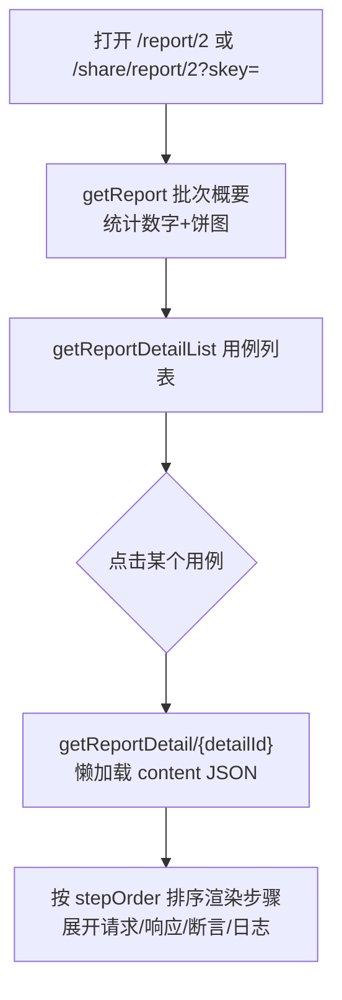

# 测试报告与分享实现

> 测试报告与分享模块的代码级解析：报告四级数据结构、预插入与批次聚合、失败归因与"人工标记成功"、Excel 导出、免登分享链接机制、报告页渲染链路。产品层功能与操作说明见 [测试报告与分享](../01-产品功能/测试报告与分享.md)。

## 概述

每次[测试任务](../01-产品功能/测试任务.md)/用例/脚本执行都会产出一份测试报告。报告是"**批次（report）→ 用例（report_detail）→ 步骤 → 请求/响应**"的四级结构，批次级存统计数字，用例级把步骤明细整体塞在一个 JSON 字段里。分享基于免登 skey 链接。

## 数据模型

报告由两张核心表承载：

- `test_report`（`TestReportDo`，`testin-api-backend/src/main/java/cn/testin/dao/TestReportDo.java`）——**批次级**：用例总数/成功/失败、通过率、耗时、状态、执行环境、接口覆盖率（usedInterfaceCount 等）、补测信息（`supplementTotal` / `lastSupplementId`）、`permanentFlag`（是否永久保存）、`isTime`（是否定时执行产生）、`caseTags / datasetTags`（本次执行的过滤条件）。
- `test_report_detail`（`TestReportDetailDo`，`testin-api-backend/src/main/java/cn/testin/dao/TestReportDetailDo.java`）——**用例级**：`reportId + caseNum` 定位一条（同一用例在任务中出现多次靠 caseNum 区分），`exeResult`（'1' 成功 / '0' 失败 / 空 = 未执行）、`machineId`（在哪台执行机跑的）、`dataGroupName`（数据集行标识）、`retestNum`（自动重测第几次）、`analysisId / analysisDesc / analysisUser`（失败归因）、`supplementId`（补测标记）、以及 BLOB 字段 `content`——**步骤级 + 请求/响应级明细的 JSON Map**。

`content` 的结构由 `TestReportService.generateReportContent` 生成（`testin-api-backend/src/main/java/cn/testin/service/TestReportService.java`）：key 是 `stepId_stepOrder`，value 包含 `stepName / inputData（请求体）/ requestBody / outputData（响应体）/ expectResult（断言期望串）/ errorMsg（断言失败明细、响应错误、SQL/脚本错误）/ exeResult / takeTime / statTime / endTime / logDetail（执行日志数组的 JSON 串）/ stepOrder`。

```
test_report (批次)
  └── test_report_detail (用例, reportId+caseNum)
        └── content JSON: { "stepId_1": {...}, "stepId_2": {...} }
              └── 每步骤: 请求 inputData / 响应 outputData / 断言 expectResult / 日志 logDetail
```

一个 content 步骤节点的实际字段示例（概念结构）：

```json
{
  "stepId_1": {
    "stepName": "登录接口(第3行数据)",
    "inputData": "{\"username\":\"...\"}",
    "requestBody": "...",
    "outputData": "{\"token\":\"...\"}",
    "expectResult": "状态码 equals 200;$.code equals 0",
    "errorMsg": "期望: 状态码 equals 200, 实际值:500",
    "exeResult": 1,
    "takeTime": 128,
    "statTime": "2026-08-10 10:00:01 012",
    "endTime": "2026-08-10 10:00:01 140",
    "logDetail": "[\"[INFO] ...\"]",
    "stepOrder": 1
  }
}
```

## 关键流程

### 状态机与报告类型

`TestReportConstants`（`testin-api-backend/src/main/java/cn/testin/commons/constants/TestReportConstants.java`）定义状态：`0 未开始 / 1 执行中 / 2 已完成 / 3 中断`。同一个枚举还定义报告类型：

| num | type | 来源 |
|---|---|---|
| 0 | script | 脚本调试 |
| 1 | case | 单用例执行 |
| 2 | task | 任务串行执行 |
| 3 | batch | 用例批量执行 |
| 4 | parallel | 任务并行执行 |
| 5 | debug | 用例调试（勾选步骤） |
| 6 | callApi | UI 自动化回调 |
| 7 | plan | 计划执行 |

### 创建：执行前预插入

执行开始时 `TestReportService.initReportInfo`（`TestReportService.java`）同步建好报告与全部用例详情行（exeResult 为空 = 未执行），并回填任务的 `reportId / executionStatus='1' / envId`；如果执行参数带 planId/executeRecordId，同时把[测试计划](测试计划实现.md)执行任务状态置为执行中。**补测与断点续跑复用原报告，跳过预插入**（`TestReportService.java`）。并行执行的报告由 `initParallelReport` 单独初始化（`TestReportService.java`）。

### 回传：批次结果聚合

执行端每跑完一批用例就回调服务端 `uploadTaskRunReport`（`TestReportService.java`），聚合逻辑：

1. 结果按 `caseNum` 分组，逐用例更新详情行 `content` 与 `exeResult`（`updateReportDetail`，`TestReportService.java`）。
2. `resolveReportStatus`（`TestReportService.java`）判定批次是否结束：成功+失败 = 总数 → 已完成；报告已被停止 → 中断；否则返回"执行中"直接 return，等下一批次回调。
3. 批次结束后：计算通过率/总耗时、更新计划执行记录（没有下一个任务则 ExecuteRecord 落终态）、回写任务 `lastResult` 与执行状态、通知执行机清理全局变量缓存、触发消息通知。细节见 [批次结果聚合](批次结果聚合.md)。

报告批次上还维护**接口覆盖率**字段（`usedInterfaceCount / unusedInterfaceCount / interfaceTotal / usedInterfaceRate`）：每次结果回传时按用例步骤引用的接口去重统计（`updateInterfaceParam`，`TestReportService.java`），用于概览看板，见 [概览分析与消息](../01-产品功能/概览分析与消息.md)。



### 失败归因与"人工标记成功"

报告详情支持**分析（归因）**：`POST /task/report/analysis` → `TestReportService.saveAnalysisAndRefreshStatistics`（`TestReportService.java`）/ `TestReportDetailService.saveReportDetailAnalysis`（`testin-api-backend/src/main/java/cn/testin/service/TestReportDetailService.java`）。归因分类来自"问题原因配置"；其中"人工标记成功"是特殊分类（前端常量 `MANUAL_MARK_SUCCESS_ID`，`testin-api-frontend/src/utils/ConstantConfig`）——会把该用例 `exeResult` 从失败改为成功并**重新计算报告通过率**（`refreshReportStatistics`，`TestReportService.java`）；改选其它分类则回退。前端保存后对涉及标记翻转的行本地重算统计并重绘饼图（`TaskReport.vue`）。

### 历史报告与任务-报告关系

- 任务每执行一次，就在 `test_task_rel_report` 里记一条任务-报告关系（`initTaskRelReport`，`TestReportService.java`；服务类 `TestTaskRelReportService`）。任务"历史报告"列表 `GET /task/reportHistoryPageList` 就是查这张关系表联报告表（`reportHistoryPageList`，`TestReportService.java`）。
- 任务实体上的 `reportId` 永远指向**最后一次**报告（`getLastReportId`，`TestReportService.java`）。
- 用例维度也有关系表，由 `TestCaseRelReportService`（`testin-api-backend/src/main/java/cn/testin/service/TestCaseRelReportService.java`）维护，支撑用例的"历史执行记录"（`/caseRelReport/list`）。
- 报告默认会被定期清理，标记 `permanentFlag=1` 的永久保存：`POST /task/updateReportIsSave`（`TestReportService.updateReportIsSave`，`TestReportService.java`）。

### 导出 Excel

- 单个：`GET /task/downloadReport?domain=&reportId=`（`TestReportService.downloadReport`，`TestReportService.java`），基于 EasyExcel 模板 `template/ReportTemplate.xlsx` 填充"测试概述 + 测试用例"两块。前端下载见 `TaskReport.vue` 的 `downLoadReport`（带 Sid/projectId 头的 blob 下载）。
- 批量：`GET /task/batch/downloadReport?taskIds=`（`BatchDownloadReport`，`TestReportService.java`），只导有报告的任务。
- **Excel 里的"查看报告"超链接就是分享链接**：`generateReportURL`（`TestReportService.java`）对 TASK 类型生成 `http://{domain}/#/share/report/2?skey=xxx`（每次导出时为每个报告生成一个 skey），其它类型生成带 sid 的 `/#/report/1?reportId=` 内链。

### 报告分享（免登链接）

- `TestReportShareService.generateTestReportShareUrl`（`testin-api-backend/src/main/java/cn/testin/service/TestReportShareService.java`）：生成去掉横线的 UUID 作为 **skey**，落 `test_report_share` 表，**有效期 30 天**（`expireTime`，`TestReportShareService.java`），context 里存报告 ID、分享人、分享时间。
- 查看侧 `getReportIdBySkey`（`TestReportShareService.java`）：先查 Redis（缓存 30 分钟），miss 再查库；**无效 skey 会缓存哨兵值 "0"**（`REPORT_SHARE_DEFAULT_VALUE`，`TestReportShareService.java`）防止缓存穿透。失效/不存在抛"无效的链接"。
- 分享查看接口在 `TestReportShareController`（`testin-api-backend/src/main/java/cn/testin/controller/TestReportShareController.java`）：`/share/task/getReport/{skey}`（批次概要）、`/share/task/new/getReportDetailList/{skey}`（用例列表）、`/share/task/new/getReportDetail/{reportDetailId}`（单用例步骤明细，直接用详情 ID 不过 skey）。
- **免登的实现**：`/share` 前缀在 `KeyInterceptor` 白名单里（`testin-api-backend/src/main/java/cn/testin/interceptor/KeyInterceptor.java`），不校验 sid 与权限。
- 前端**没有"生成分享链接"的按钮**：分享链接唯一来源是导出 Excel 时后端生成的超链接。

### 前端报告页渲染

- 路由：`/report/1`（用例报告）、`/report/2`（任务报告）都渲染 `testin-api-frontend/src/views/report/TaskReport.vue`；`/share/report/1|2` 渲染 `testin-api-frontend/src/views/share/report.vue`——它内部就是 `<task-report :is-share="true">`，同一套组件；分享模式下隐藏永久保存/下载/刷新/归因等操作。
- 打开方式：任务列表/历史报告里点"查看报告"是 `window.open` **新页签**，URL 形如 `/#/report/2?reportId=xx&sid=xx&projectId=xx`（`testin-api-frontend/src/views/testTask/components/TaskListTable.vue`）。
- **新页签里 Pinia store 是空的**：路由守卫把 `sid / projectId` 从 URL query 或 `sessionStorage('store')` 恢复（`testin-api-frontend/src/router/index.ts`），HTTP 层同样兜底（`testin-api-frontend/src/utils/Http.ts`）；带 `skey` 的分享链接直接跳过 sid 校验（`router/index.ts`）。细节见 [前端HTTP层与响应约定](前端HTTP层与响应约定.md) 与 [登录态与主平台集成](登录态与主平台集成.md)。
- 渲染流程（`TaskReport.vue`）：先取批次概要（`getTaskReport`，`testin-api-frontend/src/api/report.ts`）→ 取用例列表（`getReportDetailListOfTask`，`report.ts`；后端把数据集行/重测次数拼进 caseName，见 `TestReportDetailService.selectByReportId`，`TestReportDetailService.java`）→ 点击某个用例才**懒加载**其 content（`getReportDetailOfTask`，`report.ts`）→ 解析 content Map 按 stepOrder 排序，成功用例展开第一步、失败用例展开第一个失败步骤（`TaskReport.vue`）。步骤日志用 log4javascript 渲染（`TaskReport.vue`）。



## 关键代码位置

| 位置 | 说明 |
|---|---|
| `testin-api-backend/src/main/java/cn/testin/service/TestReportService.java` | initReportInfo 报告预插入； uploadTaskRunReport 结果聚合 |
| `testin-api-backend/src/main/java/cn/testin/service/TestReportService.java` | generateReportContent 步骤级 content 结构 |
| `testin-api-backend/src/main/java/cn/testin/service/TestReportService.java` /  | Excel 导出（单个/批量） |
| `testin-api-backend/src/main/java/cn/testin/service/TestReportDetailService.java` /  | 报告用例列表/单用例详情查询 |
| `testin-api-backend/src/main/java/cn/testin/service/TestReportShareService.java` | skey 生成与解析、30 天有效期、Redis 缓存 |
| `testin-api-backend/src/main/java/cn/testin/controller/TestReportShareController.java` | /share 免登查看接口 |
| `testin-api-backend/src/main/java/cn/testin/service/TestTaskRelReportService.java` | 任务-报告关系 |
| `testin-api-backend/src/main/java/cn/testin/service/TestCaseRelReportService.java` | 用例-报告关系 |
| `testin-api-backend/src/main/java/cn/testin/commons/constants/TestReportConstants.java` | 报告状态与类型枚举 |
| `testin-api-backend/src/main/java/cn/testin/interceptor/KeyInterceptor.java` | /share 白名单免登 |
| `testin-api-frontend/src/views/report/TaskReport.vue` | 报告详情页（用例/任务/分享共用） |
| `testin-api-frontend/src/api/report.ts` | 报告 API（正常与 share 两套 URL） |

## 注意事项与坑

- **报告详情主键是 Integer 自增 ID**（`TestReportDetailDo.id`），分享接口 `/share/task/new/getReportDetail/{reportDetailId}` 直接暴露它且不再校验 skey——知道详情 ID 就能看步骤明细，属于"通过 obscure 保护"，别在外部文档里宣传。
- `exeResult` 是**字符串** '0'/'1'，空串/null 表示未执行；前端按 `=== '1'` 判断成功。报告 status 则是数字 0-3，两套不要混。
- 执行中的报告：详情行已预插（显示"未执行"），批次概要接口的统计数字只对终态可信，前端对 status===1 的耗时/通过率显示"暂无"（`TaskReport.vue`）。
- 补测写回原报告：原失败详情行被覆盖更新并打 supplementId，历史过程在 `test_task_supplement_history` 里；报告 `supplementTotal` 记录补测次数。
- skey 有效期 30 天是**写死在代码里**的常量（`TestReportShareService.java`），改需求要动代码；失效后 Redis 里缓存的哨兵 "0" 还有 30 分钟 TTL，恢复数据后链接不会立刻可用。
- 导出 Excel 每次都会为报告**新生成一个 skey**（同一报告多次导出产生多条 share 记录），没有去重逻辑。
- 用例被删除后报告详情仍可查看（`setCasePathAndCaseModuleId` 对 null 用例做了兜底，`TestReportDetailService.java`），但用例路径只显示用例名。

## 相关文档

[测试报告与分享](../01-产品功能/测试报告与分享.md)、[测试任务实现](测试任务实现.md)、[测试计划实现](测试计划实现.md)、[批次结果聚合](批次结果聚合.md)、[任务执行链路](任务执行链路.md)、[前端HTTP层与响应约定](前端HTTP层与响应约定.md)、[登录态与主平台集成](登录态与主平台集成.md)、[概览分析与消息](../01-产品功能/概览分析与消息.md)
