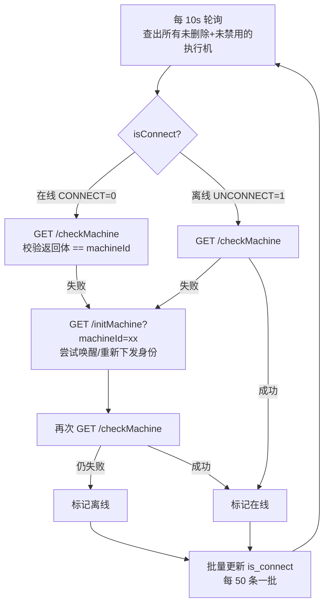

# 测试机管理实现

## 概述

测试机（执行机 / runner）管理面由服务端 `TestMachineController` + `TestMachineService` 组成，负责执行机的登记、10 秒级连通性守护线程、machineId 下发与按权重的任务切分；执行端侧对应 `RunnerServletController` / `RunnerService` / `RunnerConsumer`。产品功能与操作说明见 [测试机管理](../01-产品功能/测试机管理.md)；任务分发与 JMX 传递见 [任务执行链路](任务执行链路.md) 与 [执行端Runner详解](执行端Runner详解.md)。

## 数据模型

`test_machine` 表（DO：`src/main/java/cn/testin/dao/TestMachineDo.java`）：

| 字段 | 含义 |
|---|---|
| `id` | UUID，即 machineId（**不是执行端自己生成的**，是服务端登记时生成、再通过 `/initMachine` 下发给执行端） |
| `name` / `description` | 名称与描述，同项目重名校验（`TestMachineService.checkMachineExist`） |
| `machineIp` / `machinePort` | 执行端 HTTP 服务地址（执行端启动时的第一个位置参数 HTTP_PORT） |
| `status` | 启用 0 / 禁用 1（`TestMachineStatusEnums`），禁用后不参与探测与任务分配 |
| `isConnect` | 在线 0 / 离线 1（`TestMachineConnectEnums`，注意 **0 才是在线**），由守护线程维护 |
| `ratio` | 权重，并行执行时按比例切分用例（默认 100/前端默认 10） |
| `isDeleted` | 逻辑删除标志 |

**默认执行机**：分页查询时若库里 `projectId="-1"` 的机器一台都没有，会自动插一条 `127.0.0.1:8526`、`ratio=100` 的"默认执行机"（`TestMachineService.java` → `createDefaultMachine`）——即"服务端本机即执行端"的开箱即用形态。前端对名为"默认执行机"的行禁用修改地址/禁用/删除操作（`src/views/machine/index.vue` 的 `isDefaultMachine`）。

## 关键流程

### 1. 管理接口

`TestMachineController`（`src/main/java/cn/testin/controller/TestMachineController.java`，前缀 `/machine`）：

| 端点 | 说明 |
|---|---|
| `GET /machine/pageList` / `GET /machine/list` | 分页 / 全量（list 只查未删除未禁用，`selectAvailableMachine`） |
| `POST /machine/save` | 新增/修改；新增时 IP+端口全局唯一（抛"该执行机已存在"）；保存后 `isConnect` 强制置离线，等守护线程重新探测 |
| `POST /machine/delete` | 逻辑删除 + **同步清掉所有 xxl-job 定时任务里引用它的 machineId/machineIds**（`delete`） |
| `GET /machine/testConnect` | 手动探活：`GET http://ip:port/testMachine`，返回体为 `200` 即通（`testConnect`） |

前端页面 `src/views/machine/index.vue`（API 在 `src/api/machine.ts`），提供新增/编辑/禁用/启用/删除/测试连通；`src/views/machine/config.ts` 定义状态下拉 `MACHINE_STATUS_LIST` 与权重 `WEIGHT_LIST`（10%~100% 步进 10%）。

### 2. 上下线机制（initRunner 守护线程）

服务端 `Application.main` 启动后立刻 `new TestMachineService().initRunner()`（`src/main/java/cn/testin/Application.java`），其内部起一个**裸 while(true) 线程** `listenerRunnerConnect`（`TestMachineService.java`）：

关键细节：

- **连通判定不是简单 200**，而是 `GET /checkMachine` 的**返回体必须等于该机器的 id**（`checkConnection` ，`testMachineDo.getId().equals(res)`）——这保证 IP:端口 后面挂的确实是"那台"执行机，防止机器换绑 IP 后张冠李戴。
- 掉线会先尝试一次**重新初始化**（`initMachineConnent` ，即再发一次 `/initMachine`），二次确认失败才置离线；离线机器一旦探活成功会被自动拉回在线。所以**重启执行端进程后无需手工干预**，最多 10 秒级恢复。
- 状态变更走批量更新 `updateBatchTestMachineConnect`，50 条一批。
- 端口为 0 视为广播端口，初始化直接抛"参数异常"。
- 循环里没有异常兜底（`Thread.sleep` 的 InterruptedException 只是打印），若探活逻辑抛出非受检异常线程会**静默死掉**、全量执行机状态冻结——这是已知脆弱点。

### 3. machineId 的生命周期（执行端视角）

执行端 `RunnerApplication` 启动后只做一件事：开 Jetty HTTP 端口并等待（`src/main/java/cn/testin/runner/controller/RunnerServletController.java` 的 `start`）。之后：

1. 服务端守护线程（或首次任务执行）调 `GET /initMachine?machineId=<id>`；
2. 执行端 `RunnerService.initRunner`（`src/main/java/cn/testin/runner/service/RunnerService.java`）解析出 machineId，启动 `RunnerConsumer.runnerJedisLinter(machineId)` 线程；
3. 该线程把 machineId 记入 `RunnerTestExecuteService.setTestMachineId`（`src/main/java/cn/testin/runner/service/RunnerTestExecuteService.java`），并在 `RedisKeyUtil.getRunnerLinterRedisKey(machineId)` 对应的 Redis list 上 `brpop(0, ...)` 死循环等任务（`src/main/java/cn/testin/runner/jedisConfig/RunnerConsumer.java`）；
4. 之后 `/checkMachine` 就返回这个 machineId（`RunnerServletController.java`），服务端据此判定在线。

执行端另外暴露 `/stopTask`（停任务）与 `/task_finish`（任务完成回调），同样由 `RunnerServletController.service` 分发。Redis key 设计详见 [Redis通信与Key设计](Redis通信与Key设计.md)。

### 4. 任务执行时的机器校验与分配

- 单台执行：`runnerCheckMachineConnection`（`TestMachineService.java`）——未选机器或 `/checkMachine` 不通直接抛错。
- 多台并行：`runnerBatchCheckMachineConnection`——**至少两台**；用 `CompletableFuture` + cachedThreadPool 并行探测（单台超时约 20s：连接 10s + 读取 10s），避免串行累加。
- 用例切分：`assignTasks`按 `ratio` 权重比例分配，最后一台兜底取剩余全部，保证不漏不重。

### 5. MonitorController

`src/main/java/cn/testin/controller/MonitorController.java` 只有一个 `GET /monitor/test/user`：返回当前登录用户，供运维探活"服务活着且登录链路可用"（@UserAuth）。与执行机监控无关，勿混淆。

## 关键代码位置

后端（相对 `testin-api-backend/`）：

| 位置 | 作用 |
|---|---|
| `src/main/java/cn/testin/controller/TestMachineController.java` | 执行机 REST 入口 `/machine` |
| `src/main/java/cn/testin/service/TestMachineService.java` | 默认执行机 127.0.0.1:8526 |
| `src/main/java/cn/testin/service/TestMachineService.java` | `initRunner` 启动守护线程 |
| `src/main/java/cn/testin/service/TestMachineService.java` | 10s 轮询上下线主循环 |
| `src/main/java/cn/testin/service/TestMachineService.java` | 连通判定（返回体==machineId） |
| `src/main/java/cn/testin/service/TestMachineService.java` | 下发 `/initMachine?machineId=` |
| `src/main/java/cn/testin/service/TestMachineService.java` | 删除时清理 xxl-job 里的引用 |
| `src/main/java/cn/testin/service/TestMachineService.java` | 多机并行连通校验 |
| `src/main/java/cn/testin/service/TestMachineService.java` | 按权重切分用例 |
| `src/main/java/cn/testin/Application.java` | 服务端启动时调用 initRunner |
| `src/main/java/cn/testin/runner/controller/RunnerServletController.java` | 执行端 HTTP 端点常量（checkMachine/initMachine/testMachine/stopTask/task_finish） |
| `src/main/java/cn/testin/runner/service/RunnerService.java` | 执行端接收 machineId 并开消费线程 |
| `src/main/java/cn/testin/runner/jedisConfig/RunnerConsumer.java` | 按 machineId 在专属队列 brpop |

前端（相对 `testin-api-frontend/`）：

| 位置 | 作用 |
|---|---|
| `src/views/machine/index.vue` | 执行机列表/编辑/启禁用/删除 |
| `src/api/machine.ts` | 执行机 API |
| `src/views/machine/config.ts` | 状态与权重下拉配置 |

## 注意事项与坑

1. **`isConnect` 的语义是 0=在线、1=离线**（`TestMachineConnectEnums`），与直觉相反；`status` 同理 0=启用。写 SQL/判断时务必看枚举，不要想当然。
2. machineId 由**服务端生成下发**，执行端换端口重启没关系，但如果你在执行端机器上手工起了多个 runner 进程配同一端口，探测与初始化会互相打架。
3. 守护线程是裸 `while(true)` + `Thread.sleep(10000)`，没有退出条件与异常兜底；`Application.java` 用的是 `new TestMachineService()`（非 Spring 注入），线程内靠 `CommonBeanFactory.getBean` 拿 mapper——不要在 `initRunner` 之外的 Spring 生命周期里重复调用它。
4. 删除执行机只清 xxl-job 定时任务参数里的引用（`serial` 的 machineId 置空、`parallel` 的 machineIds 过滤），**不会阻止正在跑的任务**；正在执行的任务结果回写不受影响（走 Redis）。
5. `testConnect`（/testMachine）与 `checkConnection`（/checkMachine）是两个不同端点：前者只证明"端口上有个 runner"，后者证明"是我登记的那台"。页面上"测试连接"用前者，状态维护用后者。
6. 并行校验的线程池是 `Executors.newCachedThreadPool()` 且没有上限（`TestMachineService.java`），执行机数量巨大时有线程膨胀风险。
7. 权重分配 `assignTasks` 中 `(int)(ratio / totalWeight * caseIds.size())` 会向下取整，除最后一台外可能出现 0 台数（直接跳过），配合"最后一台兜底"保证总和正确——调整算法时注意保持这个不变量。
8. 改 `RunnerServletController` 的 URL 常量或 `/initMachine` 参数协议时，服务端 `TestMachineService` 与执行端 runner 是**两个独立部署产物**（pom.xml / runnerPom.xml），两端必须一起发版。
