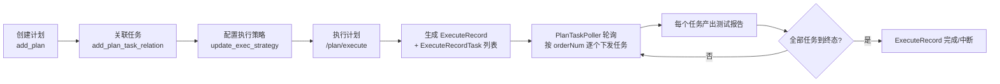

# 测试计划实现

> 测试计划模块的代码级解析：计划-任务关系与执行策略模型、ExecuteRecord 初始化、PlanTaskPoller 按序下发、状态回写。产品层功能与操作说明见 [测试计划](测试计划.md)。

## 概述

计划挂在 **PLAN 类型模块树**下，前端页面结构（左树 + Tab）与任务页一致：`testin-api-frontend/src/views/testPlan/index.vue`。计划本身很"薄"：`TestPlan` 只有 `id / projectId / moduleId / planName / status / 审计字段`（`testin-api-backend/src/main/java/cn/testin/dao/plan/TestPlan.java`）。**注意计划的主键和 projectId 都是 Integer 自增 ID，与任务/用例的 String UUID 不同**。计划的内涵在"计划-任务关系 + 执行策略"和"执行记录"两组表上。

## 数据模型

```
test_plan                        计划本体(id 自增 Integer)
  id / projectId / moduleId / planName / status(1有效 0已删)

plan_task_relation               计划-任务关联 + 执行策略
  planId / taskId(任务UUID) / orderNum(执行顺序)
  envId / executeType(1串行 2并行) / machineId(并行逗号分隔)
  caseTags / datasetTags

execute_record                   一次"执行计划"的记录
  id / planId / executeRecordName / executeStatus(0-3) / endTime
  └── execute_record_task        记录内每个任务的执行明细
        executeRecordId / taskId / taskName / orderNum
        reportId(该任务本次产出的报告) / expectCaseCount
        executeStatus(0-3) / envId / executeType / machineId
```

对应实体：`PlanTaskRelation`（`testin-api-backend/src/main/java/cn/testin/dao/plan/PlanTaskRelation.java`）、`ExecuteRecord`（`ExecuteRecord.java`）、`ExecuteRecordTask`（`ExecuteRecordTask.java`）。

`execute_record_task.reportId` 是计划与[报告](测试报告与分享实现.md)体系的连接点：计划里每个任务的执行就是一次普通的任务执行，产出的报告与手动跑任务完全同构。

`execute_record_task` 是策略的**执行时快照**（含 `taskName / expectCaseCount / reportId`），所以事后改计划策略不影响已产生的执行记录。

## 关键流程

### 计划生命周期



1. **创建/修改**：`POST /plan/add_plan`、`PUT /plan/update_plan/{plan_id}`（`testin-api-backend/src/main/java/cn/testin/controller/plan/TestPlanController.java`、`98`）。计划名必填且 ≤ 50 字。
2. **关联任务**：`POST /plan/add_plan_task_relation`（`PlanTaskRelationController.java`）。候选任务列表 `GET /plan/list_task` 会**排除已在计划内的任务**（SQL `NOT IN`，`testin-api-backend/src/main/java/cn/testin/mapper/ext/ExtTestTaskDoMapper.xml`），即一个任务在同一计划里只能关联一次；但一个任务可关联多个不同计划。
3. **配置执行策略**：单个改 `PUT /plan/update_exec_strategy`（`PlanTaskRelationController.java`），批量改 `POST /plan/batch_update_exec_strategy`（`TestPlanController.java`）。并行必须指定 2 台以上执行机，否则参数校验直接报错（`PlanTaskRelationController.java`）。
4. **任务排序**：`PUT /plan/move_task/{plan_id}`（`PlanTaskRelationController.java`），拖拽调整 `orderNum`，决定执行顺序。
5. **删除计划**：`POST /plan/delete_plan_list`（`TestPlanController.java`），同时删除计划-任务关系；**计划删除不进回收站**（与任务删除不同）。
6. **反向约束**：任务被计划关联后不可删除，见 [测试任务实现](测试任务实现.md) 的批量删除逻辑。

### 执行策略字段（plan_task_relation）

| 字段 | 含义 |
|---|---|
| `orderNum` | 任务在计划内的执行顺序（拖拽调整） |
| `envId` | 本次执行使用的环境，见 [环境与配置管理](../01-产品功能/环境与配置管理.md) |
| `executeType` | 1 串行 / 2 并行（`ExecuteTypeEnum`，`testin-api-backend/src/main/java/cn/testin/enums/ExecuteTypeEnum.java`） |
| `machineId` | 执行机 ID；并行时逗号分隔多台 |
| `caseTags` / `datasetTags` | 本次只跑匹配标签的用例（逗号分隔） |

执行时这些策略被 `TestPlanService.getTestExecutionParam`（`TestPlanService.java`）展开成 `TestExecutionParam`，同时从任务本体读 `retestNum` 自动重测次数。

### 执行计划：从 ExecuteRecord 到任务下发

`POST /plan/execute`（`TestPlanController.java`）→ `TestPlanService.executePlan`（`testin-api-backend/src/main/java/cn/testin/service/plan/TestPlanService.java`）只做**初始化**，不真正跑任务：

1. 校验计划存在、计划下有任务、**每个任务都配置了完整执行策略**（`checkExecStrategy` 校验 envId/executeType/machineId 非空，缺任何一个抛"计划任务执行策略未配置"，`TestPlanService.java`——前端按 code 505 弹"计划中存在无效任务"，`PlanListTable.vue`）。
2. 创建一条 `ExecuteRecord`（状态"未执行"）。
3. 按计划内任务顺序生成 `ExecuteRecordTask` 明细：解析标签过滤、算出每个任务本次要执行的用例数 `expectCaseCount`（无可执行用例直接抛错，`TestPlanService.java`）；**并行任务若过滤后只剩 1 条用例，自动降级为串行单机**（`TestPlanService.java`）。
4. 返回 executeRecordId，后续工作交给轮询器。

**下发由 `PlanTaskPoller` 驱动**（`testin-api-backend/src/main/java/cn/testin/service/plan/PlanTaskPoller.java`）：每 10 秒（`plan.task.poller.fixed-delay`，默认 10000ms）扫描所有"未执行/执行中"的执行记录，用 `getFirstNotStartedTask` 找出**第一个未开始且前面所有任务已到终态（完成/中断）**的任务（`testin-api-backend/src/main/java/cn/testin/mapper/ext/ExtExecuteRecordTaskMapper.xml`），调用 `TestPlanService.sendExecuteTask` 下发。

`sendExecuteTask`（`TestPlanService.java`）的关键防护：

- **执行机可用性校验**：机器不存在 / 已禁用 / 已离线都跳过下发（`TestPlanService.java`）。
- **原子认领**：用"仅当状态仍为未开始才更新为执行中"的 UPDATE 防止并发重复下发（`TestPlanService.java`）。
- 然后线程池异步执行：串行走 `serialTask` → `TestAutomationService.run`（与普通任务执行共用[任务执行链路](任务执行链路.md)），并行走 `parallelTask`（初始化并行报告后 `taskParallelRun`）。

**状态回写**：任务报告完成时 `TestReportService.uploadTaskRunReport` 会更新 `ExecuteRecordTask` 状态，并在没有后续任务时把 `ExecuteRecord` 落为终态并写 `endTime`（`testin-api-backend/src/main/java/cn/testin/service/TestReportService.java`）。补测失败用例时也会把对应的计划任务状态重置为执行中。

### 执行状态机

`PlanExecuteStatusEnum`（`testin-api-backend/src/main/java/cn/testin/enums/PlanExecuteStatusEnum.java`）：

| code | 状态 | 说明 |
|---|---|---|
| 0 | 未执行 | ExecuteRecord 刚创建 / ExecuteRecordTask 未下发 |
| 1 | 执行中 | 已有任务被认领下发 |
| 2 | 已完成 | 全部任务完成 |
| 3 | 中断 | 被停止（前端调 `/test/automation/stop`，type=plan） |

ExecuteRecordTask 的状态值与报告状态共用 `TestReportConstants` 的 0-3（见 [测试报告与分享实现](测试报告与分享实现.md)）。

**执行记录的管理**：执行记录按 `GET /plan/list_execute_record` 分页查询（`ExecuteRecordService.listExecuteRecord`，`testin-api-backend/src/main/java/cn/testin/service/plan/ExecuteRecordService.java`）；删除执行记录走 `DELETE /plan/remove_execute_record/{id}`，会连同任务明细一起软删（`removeExecuteRecord`，`ExecuteRecordService.java`）。**注意删除接口声明了 `@RequestBody`——DELETE 带请求体，前端 `removeExecuteRecord`（`testPlan.ts`）没有传 body，后端字段全空只按路径 ID 删，这个组合能工作纯属巧合，改动任何一侧都要回归验证。**

### 前端页面

- `PlanListTable.vue`：计划列表 + "执行"按钮（`executeTestPlan`，`testin-api-frontend/src/api/testPlan.ts`）。
- `TaskDefintion.vue`（testPlan 目录下）：计划详情页——关联任务（`addTaskToTestPlanByApi`）、移除（`deletePlanTask`）、拖拽排序（`editTaskToTestPlanByApi`）、单个/批量执行策略配置（`updateExecStrategy` / `batchUpdateExecStrategy`）。策略配置弹窗复用公共 `RunDialog`（传 `is-no-message-channel` 隐藏通知项）。
- `TaskReportHistoryListTable.vue`：计划的执行记录列表（`getListExecuteRecord`），可停止（`stopExecuteRecord`，实际调 `/test/automation/stop` type=plan，`testPlan.ts`）和删除记录；10 秒自动刷新。
- `TaskOfPlanRecordListTable.vue`：一次执行记录内各任务的状态与报告入口（`getExecuteRecordTaskList` → `GET /plan/list_execute_record_task`），从这里的 `reportId` 跳到报告页；10 秒自动刷新。

### 查询接口一览

| 接口 | 说明 |
|---|---|
| `GET /plan/list_plan` | 计划分页列表（按模块过滤，含子孙模块） |
| `GET /plan/detail/{plan_id}` | 计划详情（含关联任务数 `taskCount`） |
| `GET /plan/module/{moduleId}` | 模块下的一级内容（子目录 + 计划混合列表） |
| `GET /plan/list_task` | 可关联进计划的候选任务（排除已关联） |
| `GET /plan/list_plan_task` | 计划内已关联任务（按任务编号/名称/负责人过滤） |
| `GET /plan/list_execute_record` | 计划的执行记录分页 |
| `GET /plan/list_execute_record_task` | 一次执行记录的任务明细分页 |

计划模块树与任务模块树是两套独立模块（`type=PLAN` vs `type=TASK`），但共用 `TestModuleService` 的层级与计数缓存机制——新增/删除计划都会清 Redis 目录计数缓存（`TestPlanService.java`）。

## 关键代码位置

| 位置 | 说明 |
|---|---|
| `testin-api-backend/src/main/java/cn/testin/controller/plan/TestPlanController.java` | 计划 CRUD / 执行 / 模块树 |
| `testin-api-backend/src/main/java/cn/testin/controller/plan/PlanTaskRelationController.java` | 计划-任务关联 / 策略 / 排序 |
| `testin-api-backend/src/main/java/cn/testin/controller/plan/ExecuteRecordController.java` | 执行记录与任务明细查询、删除 |
| `testin-api-backend/src/main/java/cn/testin/service/plan/TestPlanService.java` | executePlan 初始化；`sendExecuteTask:287` 任务下发 |
| `testin-api-backend/src/main/java/cn/testin/service/plan/PlanTaskPoller.java` | 10s 轮询按序下发任务 |
| `testin-api-backend/src/main/java/cn/testin/service/plan/PlanTaskRelationService.java` | 关联关系与策略维护 |
| `testin-api-backend/src/main/java/cn/testin/service/plan/ExecuteRecordService.java` / `ExecuteRecordTaskService.java` | 执行记录持久化 |
| `testin-api-backend/src/main/java/cn/testin/enums/PlanExecuteStatusEnum.java` | 执行状态枚举 |
| `testin-api-backend/src/main/java/cn/testin/enums/ExecuteTypeEnum.java` | 串行 1 / 并行 2 |
| `testin-api-frontend/src/api/testPlan.ts` | 计划相关全部 API |
| `testin-api-frontend/src/views/testPlan/components/TaskDefintion.vue` | 计划详情（关联任务 + 策略配置） |

## 注意事项与坑

- **执行策略是计划-任务关系上的，不是任务上的**：同一任务在两个计划里可以跑不同环境/不同机器；任务本身的执行参数（RunDialog 里选的）与计划无关。
- `/plan/execute` 接口同步返回很快，真正的执行完全异步：任务一个一个地下发（前一任务到终态才发下一个），计划级"并行"指的是**单个任务内部**用例分配到多机，计划内任务之间永远是串行的。
- 计划 ID 是 Integer（数据库自增），与任务的 UUID 字符串混用时注意类型转换；`ExecuteRecordTask.taskId` 才是任务的 UUID。
- 执行机离线时 `sendExecuteTask` 只记 warn 日志并跳过，该任务会一直卡在"执行中"状态——排查"计划卡住不动"先查执行机状态，再看 poller 日志。
- `PlanTaskPoller` 与 `TestTaskBatchPoller` 是两个不同轮询：前者管"计划里下一个任务何时下发"（10s），后者管"一个任务的用例批次何时发给执行机"（3s）。
- 权限 key：`api-plan-view / api-plan-save / api-plan-delete / api-plan-execute`，见 [权限体系](权限体系.md)。
- `testPlan.ts` 里有大量从 `task.ts` 复制后注释掉的死代码（如 `saveScheduleRunByApi`），维护时注意别误读。
- `PlanTaskRelationController` 的 `/move_task` 与 `/update_exec_strategy` 用 `PUT`，`/add_plan_task_relation` 与 `/remove_plan_task_relation` 用 `POST`，写新前端封装时不要凭直觉统一成 POST。
- 计划删除是"本体软删（`status=0`）+ 关系物理删（`DELETE FROM plan_task_relation`）"，**不走[回收站](../01-产品功能/回收站.md)也没有还原入口**，删了就等于丢了全部策略配置；反过来任务侧会阻止"被计划引用"的删除，两个约束方向不要记反。
- 计划详情页"任务执行策略"单选（串行）是纯展示性控件（`TaskDefintion.vue` 中 `radio` 固定为 '1'，不随表单提交），真正的执行方式在每个任务的执行策略里——别把它当成可配置项。

## 相关文档

[测试计划](测试计划.md)、[测试任务实现](测试任务实现.md)、[测试报告与分享实现](测试报告与分享实现.md)、[任务执行链路](任务执行链路.md)、[定时调度体系](定时调度体系.md)、[测试机管理](../01-产品功能/测试机管理.md)、[环境与配置管理](../01-产品功能/环境与配置管理.md)
