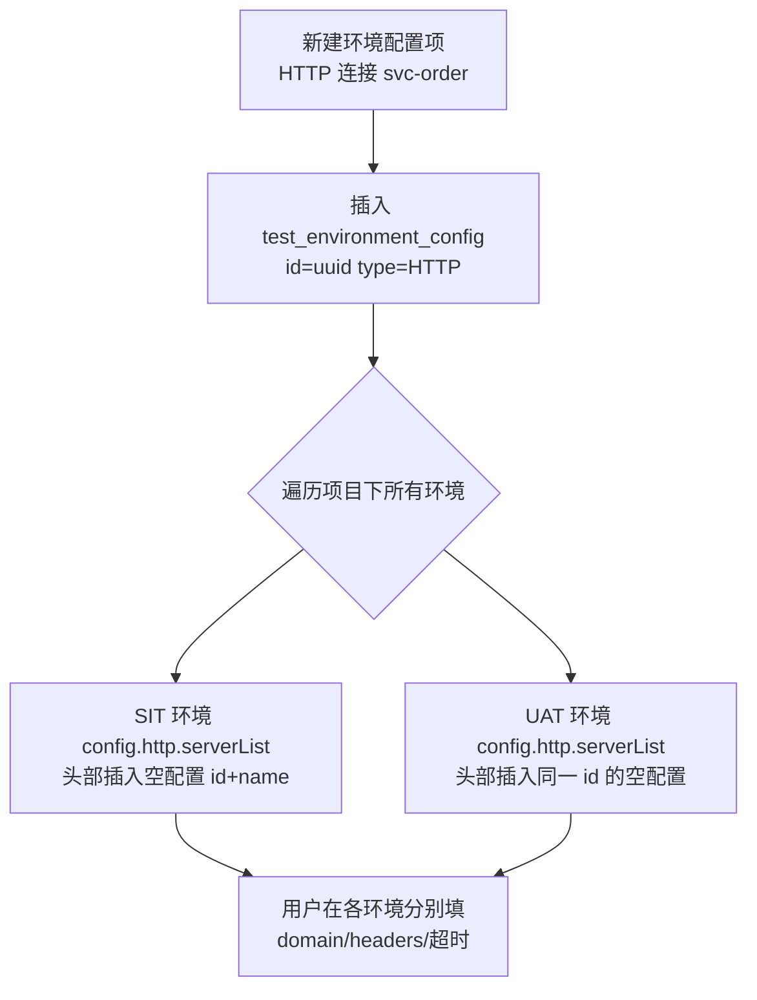

# 环境与配置管理实现

## 概述

环境模块的后端由 `EnvironmentController`（环境 CRUD）+ `EnvironmentConfigController`（命名连接 CRUD）+ 两个 Service 组成，核心难点是"命名连接注册表 ↔ 每环境一份 JSON 值"的级联同步，以及执行时环境 JSON 到 `ParameterConfig` 的注入。产品功能与操作说明见 [环境与配置管理](../01-产品功能/环境与配置管理.md)。

## 数据模型

### 两张表

- **环境（test_environment）**：一行记录代表一套环境，核心内容是 `config` 字段里的一整份 JSON（BLOB），包含所有协议的服务配置、数据库、全局变量、全局前后置脚本等。`status` 0=启用 1=禁用；软删除标志位 `isDeleted` 已弃用（删除走回收站快照 + 物理删除）。
- **环境配置项（test_environment_config）**：项目级"命名连接"注册表，只有 `id / name / type / description` 等元信息，不含实际连接参数。真正的参数保存在每个环境的 `config` JSON 里，通过配置项 `id` 关联。删除用逻辑删除（`is_deleted=1`）。

环境维度支持的配置类型（`type` 字段）：HTTP、DATABASE、TCP、WebSocket、Dubbo、ATP、OES、gRPC、GraphQL、MQTT、FIX（前端另有 LDP 页签，复用同类结构）。

### EnvironmentConfig JSON 结构

`config` JSON 的 Java 模型是 `src/main/java/cn/testin/entity/dto/environment/EnvironmentConfig.java`，顶层结构（省略值）：

```
{
  "commonConfig":  { "variables": [...], "enableHost": false, "hosts": [...] },
  "http":          { "serverList": [ { "id","name","domain","headers","timeout" } ] },
  "databaseList":  [ { "id","name","driver","url","userName","passWord",... } ],
  "tcpServerConfigList": [...], "webSocketServerConfigList": [...],
  "dubboServerConfigList": [...], "grpcServerConfigList": [...],
  "mqttServerConfigList": [...], "fixServerConfigList": [...],
  "atpServerConfigList": [...],  "oesServerConfigList": [...],
  "globalVariableList": [ { "name","value","enable" } ],
  "preProcessor"/"postProcessor": 全局前后置脚本(每个请求执行),
  "globalScriptConfig"/"globalAction": 全局脚本配置
}
```

前端读取环境详情时把 `config` 字符串 `JSON.parse` 后摊平成 `Env` 对象（`src/api/env.ts` 的 `getEnvByApi`），并给空 headers/locations 补占位行；保存时再 `JSON.stringify` 拼回（`src/api/env.ts` 的 `transEnvtoBackEndData`）。注意前端 `graphQLServerConfigList`（大写 QL）与后端 `graphqlServerConfigList`（小写 ql）字段名的差异靠这两个函数手工映射。

## 关键流程

### 1. 环境 CRUD 与状态管理

后端入口 `EnvironmentController`（`src/main/java/cn/testin/controller/EnvironmentController.java`，前缀 `/environment`）：

| 端点 | 说明 | 权限 key |
|---|---|---|
| `GET /environment/pageList` | 分页查询（名字转义 SQL 特殊字符） | api-environment-view |
| `GET /environment/list` | 项目下全量（供执行时下拉选择） | api-environment-view |
| `POST /environment/save` | 新增/修改（同项目同名查重） | api-environment-save |
| `POST /environment/delete` | 删除（**进回收站**，物理删除业务表） | api-environment-delete |
| `POST /environment/copy` | 复制，名称加 `_副本_xxxx` | api-environment-save |
| `POST /environment/updateEnvStatus` | 启用(0)/禁用(1)切换 | api-environment-save |
| `POST /environment/syncEnv` | 同步主平台环境（无权限注解） | — |
| `GET /environment/getOesConfig` | 读取 OES 配置文件 URL 内容（超时 5s） | api-environment-view |

关键逻辑（`src/main/java/cn/testin/service/EnvironmentService.java`）：

- **删除即回收站**：`delete`先把整条环境 JSON 快照写入回收站（`ModuleType.ENV`），再物理删除 `test_environment` 行——软删除标志位 `isDeleted` 已弃用（注释掉的代码）。详见 [回收站](../01-产品功能/回收站.md)。
- **环境状态**：`status` 0=启用 1=禁用；禁用只是不在执行入口展示，数据保留。
- **OES 配置读取**：`getOesConfigInfo`按 `oesConfigId` 找到环境里的 `configFile` URL，直接 HTTP GET 拉内容返回，注意这是服务端发起的出站请求（SSRF 面）。

### 2. 环境配置项（命名连接）的级联同步

`EnvironmentConfigService`（`src/main/java/cn/testin/service/EnvironmentConfigService.java`）是理解本模块的核心：

- **新增配置项**（`saveOrUpdate`  → `addEnvConfig`）：先插 `test_environment_config`，然后遍历项目下所有未删除环境，把对应类型的**空配置**（只有 id/name + 默认超时 10000ms 等）插到每个环境 `config` JSON 对应列表的**头部**（`add(0, ...)`）。
- **改名**（`editEnvConfig`）：遍历所有环境，按 id 匹配把 name 刷新进每份 JSON。
- **删除**（`httpDelete`  / `databaseDelete`  / `envServerConfigDelete`）：
  1. 先查引用——接口表 `server_id`、脚本表 `server_id`（HTTP/TCP/WebSocket 等"基础信息类"协议），或脚本/脚本副本的数据库引用（DATABASE/Dubbo 走 `extTestScriptDoMapper.findByProjectAndDatabase`），有引用直接抛"存在关联过的接口/脚本，请解除关联后删除！"；
  2. 再从所有环境的 JSON 里按 id 移除该项；
  3. 最后对 `test_environment_config` 做**逻辑删除**（`is_deleted=1`）。
- 配置项类型分发用 `switch (type)` 硬编码，新增协议类型要同时改 `addEnvConfig` / `editEnvConfig` / `envServerConfigDelete` 三处。



### 3. 同步主平台环境

`syncPlatformEnv`（`EnvironmentService.java`）在前端每次进入环境页时触发（`src/views/envList/index.vue` 的 `onActivated` 无条件调 `syncEnvByApi()`，`src/api/env.ts` → `POST /environment/syncEnv`）：

1. 调主平台传统协议接口拉环境列表：`mkey=realcfg, action=cfg, op=EnvCfg.list`（`findPlatformEnvList` ，走 `platform.url` + `platform.apikey` 配置）；
2. 过滤：只同步**绑定了当前 projectId 且已启用**的平台环境（`checkEnvApplicable`）；已同步过的（`platform_id` 相同）跳过；同项目同名跳过；
3. 创建本地环境（`createSyncedEnv`），`config` 用 `initEnvConfig`初始化——即把项目下已有的全部配置项以空值形式预置进去；
4. 若平台环境带数据库配置，再调 `op=DbCfg.listByEnvId` 拉数据源（`syncDatabaseConfigs`），为每个数据源建 DATABASE 配置项并拼 MySQL JDBC URL（`buildDatabaseConfig` ，硬编码 `com.mysql.cj.jdbc.Driver`、maxConnections=1、timeout=10000）；配置项重名时追加 `_平台` 后缀（`resolveConfigName`）。

### 4. 环境如何注入执行

执行入口在 `TestExecuteService.setGlobalEnvConfig`（`src/main/java/cn/testin/service/execution/TestExecuteService.java`）：

1. 按 `config.envId` 查环境，不存在或 `config` 为空直接抛"未发现执行环境/请增加配置"；
2. 把 `config` JSON 解析成 `EnvironmentConfig`，各协议列表塞进 `CurrentEnvConfig`，以 `projectId|envId` 为 key 放入 `ParameterConfig.currentEnvConfig`——JMX 生成阶段各 Sampler 从这里按 serverId 取真实连接参数；
3. `globalVariableList` 放入 `ParameterConfig.globalVariableList`，供变量体系使用（见 [变量体系与参数提取](../04-复杂功能细节/变量体系与参数提取.md)）。

### 5. 运行参数（RunningParam）机制

继承自 MeterSphere 的"运行期环境变量回写"机制，常量在 `src/main/java/cn/testin/commons/constants/RunningParamKeys.java`：

- `API_ENVIRONMENT_ID = "${__metersphere_env_id}"`——用户在前置/后置 JSR223 脚本里写这个占位符，生成 JMX 时被替换成 `"MS.ENV.<envId>."` 前缀（`src/main/java/cn/testin/entity/vo/request/element/TestinJSR223Processor.java`），于是脚本里 `vars.put("MS.ENV.<envId>.token", ...)` 就是一个"环境维度"的 JMeter 变量名。
- `RUNNING_PARAMS_PREFIX = "MS.ENV."`——约定前缀。
- `RUNNING_DEBUG_SAMPLER_NAME = "RunningDebugSampler"`——调试 sampler 名，`TestinDebugListener.java` 用它把调试采样从结果里过滤掉。
- `EnvironmentRunningParamService`（`src/main/java/cn/testin/service/EnvironmentRunningParamService.java`）提供把 `MS.ENV.<envId>.<key>=<value>` 文本解析并**回写到环境 `commonConfig.variables`** 的能力（`parseEvn`  → `addParam`）。**注意：当前代码库中该类只在 `TestResultService` 里被注入但从未调用**，即"执行后自动把脚本变量写回环境"链路是断的，属于遗留死代码——新需求若要启用需自行接线并评估并发写环境 JSON 的风险。

### 6. 前端页面结构

页面在 `src/views/envList/`，采用"列表 + 多页签"布局：

- `index.vue` 管理页签：默认页签"环境列表"（EnvListTable），点击环境名称/新建打开"环境定义"页签（EnvDefiniton）。
- EnvDefiniton 内部按协议分 tab（`src/views/envList/components/EnvDefiniton.vue` 的 `configTabs`）：HTTP/LDP/OES/ATP/TCP/Dubbo/WebSocket/gRPC/GraphQL/MQTT/FIX/数据库配置/全局变量，tab 是否显示由 `useProtocol` store（项目开通的协议）决定，"添加连接"按钮是否有权限由 `authConst.EDIT_PROTOCOL_CONFIG` 决定。

## 关键代码位置

后端（相对 `testin-api-backend/`）：

| 位置 | 作用 |
|---|---|
| `src/main/java/cn/testin/controller/EnvironmentController.java` | 环境 REST 入口 `/environment` |
| `src/main/java/cn/testin/controller/EnvironmentConfigController.java` | 配置项 REST 入口 `/environmentConfig` |
| `src/main/java/cn/testin/service/EnvironmentService.java` | 环境保存（含同项目重名校验） |
| `src/main/java/cn/testin/service/EnvironmentService.java` | 删除进回收站 |
| `src/main/java/cn/testin/service/EnvironmentService.java` | 同步平台环境主流程 |
| `src/main/java/cn/testin/service/EnvironmentService.java` | 新环境 config 初始化（预置全部配置项空值） |
| `src/main/java/cn/testin/service/EnvironmentConfigService.java` | 新增配置项级联到所有环境 |
| `src/main/java/cn/testin/service/EnvironmentConfigService.java` | 配置项删除（引用检查 + 级联移除） |
| `src/main/java/cn/testin/service/execution/TestExecuteService.java` | 执行时加载环境到 ParameterConfig |
| `src/main/java/cn/testin/entity/dto/environment/EnvironmentConfig.java` | 环境 config JSON 的 Java 模型 |
| `src/main/java/cn/testin/commons/constants/RunningParamKeys.java` | `MS.ENV.` / `${__metersphere_env_id}` 常量 |
| `src/main/java/cn/testin/service/EnvironmentRunningParamService.java` | 环境变量回写（当前未被调用） |

前端（相对 `testin-api-frontend/`）：

| 位置 | 作用 |
|---|---|
| `src/api/env.ts` | 环境详情读取与 config 反序列化 |
| `src/api/env.ts` | 保存时序列化回后端结构 |
| `src/api/env.ts` | 数据库连接测试 `/database/validate` |
| `src/views/envList/index.vue` | 进入页面自动同步平台环境 |
| `src/views/envList/components/EnvDefiniton.vue` | 环境定义页协议 tab 配置 |
| `src/views/envList/components/HttpConfig.vue` 等 | 各协议配置表单 |

## 注意事项与坑

1. **环境删除是物理删除**（先快照进回收站），`is_deleted` 字段已废弃但大量查询仍带着 `isDeleted=0` 条件，写新查询时保持带上以免读到历史脏数据。
2. 配置项删除分两套：`/environmentConfig/delete` 里 `switch` 没有 `break`（`EnvironmentConfigService.java`），直接调会**贯穿执行** HTTP→DATABASE→ATP 三段逻辑；前端实际用的是 `/environmentConfig/config/delete`（`envServerConfigDelete`），不要调错。
3. 改名配置项会刷写项目下**所有**环境的 config JSON（逐条 `updateByPrimaryKeyWithBLOBs`），环境多时是 N 次大字段更新，注意慢 SQL 与锁。
4. 前端 GraphQL 字段名大小写与后端不一致（`graphQLServerConfigList` vs `graphqlServerConfigList`），只改一端会导致配置丢失。
5. `EnvironmentConfig.java` 的 `graphQLServerConfigList`（大写 QL）与 `EnvironmentConfigDTO` 的 `graphqlServerConfigList` 并存于不同 DTO，fastjson 反序列化按字段名匹配，混用两个 DTO 类会丢 GraphQL 配置。
6. 同步平台环境依赖 `platform.url` / `platform.apikey` 配置项与主平台 `realcfg` 服务可用；同步失败只记日志不抛错（页面无感知）。
7. `getOesConfig` 是服务端代理拉取任意 URL（`EnvironmentService.java`），有 5 秒超时但没有协议/地址白名单，部署时注意出网管控。
8. `EnvironmentRunningParamService` 是死代码（注入未调用），不要假设脚本里 `MS.ENV.` 变量会在执行后自动持久化到环境。
