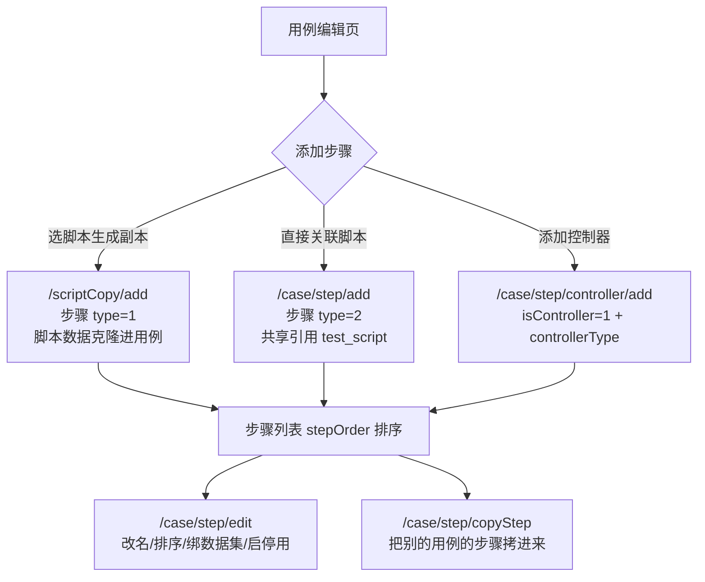

# 用例管理实现

> 产品视角的功能与操作说明见 [用例管理](../01-产品功能/用例管理.md)；本文是开发/维护视角的实现细节。

## 概述

用例（`test_case`）+ 步骤（`test_case_step`）+ 历史报告关联（`test_case_rel_report`）三表结构。步骤的 `scriptId` 是指向脚本表/脚本副本表的"多态外键"，控制器作为一种特殊步骤把子步骤 id 列表存在 JSON 字段里——这两个设计是本模块绝大部分复杂度的来源。

## 数据模型：用例 → 步骤 → 脚本/副本

```
test_case (dao/TestCaseDo.java)
├── caseNumber        项目内自增编号（TestCaseService.java）
├── caseModuleId      所属模块（test_module, type=CASE）
├── name / tag / priority(P0-P4) / status(0-5)
├── maintainerId      维护人（已存档状态下仅维护人可改）
├── lastResult        最近一次执行结果
├── reportId          最近执行报告 id      ┐
├── debugReportId     最近调试报告 id      ├─ 指向 test_report
├── executionStatus   执行中状态           ┘
├── executionMode     执行模式（串行等）
├── executeOnFailure  失败后是否继续
└── caseStep (BLOB)   步骤快照 JSON（编辑时回显用）

test_case_step (dao/TestCaseStepDo.java)   ← 一个用例 N 条
├── caseId            所属用例
├── scriptId          多态外键：type=1→test_script_copy.id；type=2→test_script.id
├── type              1=脚本副本步骤，2=直接关联脚本步骤
├── stepOrder         顺序号
├── isController      1=控制器步骤（此时 type 为 null）
├── controllerType    1 foreach / 2 if / 3 count / 4 while
│                     （commons/constants/StepControllerType.java）
├── controllerContent 控制器配置 JSON（BLOB，含 stepIds 子步骤列表）
├── datasetId / datasetDetails (BLOB)   步骤级数据集覆盖
└── status            启用/停用
```

关键点：**控制器也是一条步骤记录**（`isController=1`），它管辖的子步骤 id 列表存在自己的 `controllerContent` JSON 里（`entity/request/CaseStepController.java`：`stepIds` + 四种控制器配置各一个字段：`testinForEachController`/`ifController`/`countController`/`whileController`），而不是靠父子外键。用例删除时步骤物理删除（`TestCaseService.java` `batchDelete`），用例本体快照进[回收站](../01-产品功能/回收站.md)。

前端展示层的补充（`EditCase.vue`）：控制器在步骤表格里渲染为"开始行 + 结束行"两行（结束行 order=0、不落库），内部步骤打 `isInner=<控制器stepId>` 标记；`frontOrder` 是纯前端展示序号，`handleStepData()` 负责按 `controllerContent.stepIds` 把内部步骤重排到控制器行之后。拖拽排序用 sortable，拖拽结束重算 order 并同步维护各控制器的 stepIds（拖入/拖出控制器区间时增删）。

## 步骤编排方式

页面在 `src/views/case/EditCase.vue`（约 1570 行，是全平台最重的编辑页之一）：左侧 `ChooseScript.vue` 选脚本（底部"另存副本"/"直接关联"两个提交按钮），中间步骤表格，右侧 `stepInfo/HttpStepInfo.vue` 抽屉编辑选中步骤的请求；控制器有独立编辑组件 `components/controller/{ForEach,If,Count,while}Controller.vue`；"调用用例步骤"复用 `src/views/testTask/components/TaskSelectCaseDialog.vue`（referer=case）。



后端编排逻辑全部在 `service/TestCaseStepService.java`：

| 操作 | 要点 |
|---|---|
| 关联脚本步骤  | 批量按 scriptId 建 type=2 步骤，脚本 `request` 里绑了数据集的话同步到步骤的 `datasetId/datasetDetails` |
| 编辑步骤  | 批量改名称、顺序、数据集、启停用；控制器步骤一并改 `controllerType/controllerContent` |
| 加控制器  | 新增 `isController=1` 步骤，默认名"控制器" |
| 删控制器  | 连带删除其 `controllerContent.stepIds` 里的子步骤；子步骤是 type=1 时同时清理脚本副本数据 |
| 跨用例复制步骤  | type=1 步骤深拷贝副本+断言并重新绑定新用例；type=2 步骤只带 scriptId 引用；**第二趟循环重映射控制器里 stepIds 到新步骤 id** |

所有步骤写操作先过用例级[编辑锁](编辑锁机制.md)（锁的是 caseId，不是 stepId）。四种控制器的执行语义（JMX 如何生成对应 JMeter 控制器）见[控制器与流程编排](../04-复杂功能细节/控制器与流程编排.md)与[JMX生成与解析](JMX生成与解析.md)。

## 用例与报告的关系

用例本体只留"最近一次"的执行指针（`reportId`/`debugReportId`/`lastResult`）；完整历史走独立的用例-报告关联表：

```
test_case_rel_report (dao/TestCaseRelReportDo.java)
├── caseId / caseName
├── reportId           对应 test_report.id
├── executionType      报告类型（1用例执行/2任务执行/3用例批量/4任务并行/5用例调试）
├── executionResult    当次结果
└── taskId / taskName  由任务触发时记录来源任务
```

- 写入时机：执行结束聚合报告详情时批量插入（`TestCaseRelReportService.java` `batchInsert`，按 50 条分批）；**脚本执行与 DEBUG 调试不写历史表**（`reportTypes` 白名单）；任务/并行类型额外记录 taskId/taskName
- 查询：`GET /caseRelReport/list`（`TestCaseRelReportContorller.java`）。查询时会校验 reportId 对应的报告是否还存在——**报告被清理后，历史记录的 reportId 被置空并异步批量回写**（`TestCaseRelReportService.java`），前端表现为"有历史记录但报告打不开"
- 前端展示：用例编辑页的"报告历史"tab（`components/CaseReportHistoryListTable.vue`，每 10 秒静默刷新），调试结果在 `CaseDebugResult.vue`；列表页"查看报告"直接新开 `#/report/1?reportId=...` 窗口
- 报告本身的结构与分享见[测试报告与分享](../01-产品功能/测试报告与分享.md)

## 用例分析（失败原因归因）

用例分析是挂在**报告详情**上的归因记录：某次执行失败后，分析人针对"报告详情 × 用例"填写失败原因与说明。

- 入口 `POST /analysis/save`、`GET /analysis/view?reportDetailId&caseId`（`controller/TestCaseAnalysisController.java`）
- 逻辑 `service/TestCaseAnalysisService.java`：按 reportDetailId + caseId 查已有分析，没有则返回预填了分析人/项目信息的空壳，保存时自动带上用例名与分析人姓名
- `cause`（原因分类）的字典由"问题原因配置"维护（`ProblemCauseConfigController`）
- 报告维度的分析保存走另一个入口 `POST /case/report/analysis`（`TestCaseController.java`），保存后联动刷新报告统计；前端 API 在 `src/api/analysis.ts`

## 状态、优先级与维护人

- 状态枚举 `enums/CaseStatusEnums.java`：`0 待评审 / 1 待设计 / 2 设计中 / 3 已启用 / 4 已弃用 / 5 已存档`；优先级 `enums/CasePriorityEnums.java`：P0-P4。前端同款常量在 `src/views/case/config.ts`（CASE_STATUS_LIST / CASE_PRIORITY_LIST / CASE_TYPE_LIST 正反例 / CASE_EXECTION_MODE_LIST 自动化执行、手动调试）
- **已存档保护**：用例状态为"已存档"时只有维护人本人能修改（`TestCaseService.java`）；把用例改为"已存档"的人自动成为维护人。前端判定函数 `isCaseArchivedAndNotMaintainer`（`src/views/case/config.ts`），列表批量操作前 `batchValidateIsHasProtectedCase` 自动剔除被保护用例并提示
- 批量操作：改状态（`/case/batchUpdateStatus/{status}/{userId}`）、改优先级、批量绑数据集（`/case/batchUpdateCaseDataSet`）
- 多选用例可直接生成[测试任务](../01-产品功能/测试任务.md)：`/case/generationTask`（`TestCaseController.java`），删除用例前可查关联任务数 `/case/checkTaskCase/{caseId}`；前端弹窗 `components/CreateTask.vue`
- 模块树与接口/脚本共用 `test_module`（type=`CASE`），树深度上限 8 层（`commons/constants/TestCaseConstants.java`）
- 导入导出仅支持平台自导出格式（`/case/export`、`/case/import`），同受 `TestImportLock` 全局锁限制；导入弹窗（`importCaseDialog.vue`）可指定关联脚本/接口/数据集的落位目录（`associated.scriptModuleId/interfaceModuleId/datasetModuleId`）

## 关键代码位置表

| 功能 | 位置 |
|---|---|
| 用例 REST 入口（/case） | `testin-api-backend/src/main/java/cn/testin/controller/TestCaseController.java` |
| 用例保存（新增/修改、存档保护、步骤同步更新） | `testin-api-backend/src/main/java/cn/testin/service/TestCaseService.java` |
| 用例删除（步骤级联、回收站、任务关系修复） | `testin-api-backend/src/main/java/cn/testin/service/TestCaseService.java` |
| 用例复制（含步骤/副本/控制器深拷贝） | `testin-api-backend/src/main/java/cn/testin/service/TestCaseService.java`、 |
| 步骤 REST 入口（/case/step） | `testin-api-backend/src/main/java/cn/testin/controller/TestCaseStepController.java` |
| 直接关联脚本步骤（type=2） | `testin-api-backend/src/main/java/cn/testin/service/TestCaseStepService.java` |
| 步骤编辑（排序/数据集/控制器内容） | `testin-api-backend/src/main/java/cn/testin/service/TestCaseStepService.java` |
| 控制器新增/删除 | `testin-api-backend/src/main/java/cn/testin/service/TestCaseStepService.java`、 |
| 跨用例复制步骤 | `testin-api-backend/src/main/java/cn/testin/service/TestCaseStepService.java` |
| 控制器内容结构（stepIds + 四种配置） | `testin-api-backend/src/main/java/cn/testin/entity/request/CaseStepController.java` |
| 控制器类型枚举 | `testin-api-backend/src/main/java/cn/testin/commons/constants/StepControllerType.java` |
| 用例历史报告写入/查询 | `testin-api-backend/src/main/java/cn/testin/service/TestCaseRelReportService.java`、 |
| 用例分析保存/查询 | `testin-api-backend/src/main/java/cn/testin/service/TestCaseAnalysisService.java` |
| 用例分析 REST 入口（/analysis） | `testin-api-backend/src/main/java/cn/testin/controller/TestCaseAnalysisController.java` |
| 用例/步骤/历史数据模型 | `testin-api-backend/src/main/java/cn/testin/dao/TestCaseDo.java`、`dao/TestCaseStepDo.java`、`dao/TestCaseRelReportDo.java` |
| 前端用例页骨架 | `testin-api-frontend/src/views/case/index.vue` |
| 前端用例列表 | `testin-api-frontend/src/views/case/CaseList.vue` |
| 前端用例编辑页（步骤编排） | `testin-api-frontend/src/views/case/EditCase.vue` |
| 前端用例基本信息表单 | `testin-api-frontend/src/views/case/components/CaseBasicInfo.vue` |
| 前端选择脚本弹窗（副本/直接关联） | `testin-api-frontend/src/views/case/components/ChooseScript.vue` |
| 前端步骤详情抽屉 | `testin-api-frontend/src/views/case/components/stepInfo/HttpStepInfo.vue` |
| 前端四种控制器编辑组件 | `testin-api-frontend/src/views/case/components/controller/` |
| 前端历史报告列表 | `testin-api-frontend/src/views/case/components/CaseReportHistoryListTable.vue` |
| 前端用例调试结果 | `testin-api-frontend/src/views/case/components/CaseDebugResult.vue` |
| 前端用例 API 层 | `testin-api-frontend/src/api/case.ts` |
| 前端用例分析 API | `testin-api-frontend/src/api/analysis.ts` |

## 注意事项与坑

1. **步骤 `scriptId` 是多态外键**（type=1→`test_script_copy`、type=2→`test_script`），控制器步骤 `type` 为 null 且 `scriptId` 无意义；任何按步骤查脚本数据的代码必须先判 type，这是本模块最容易写错的一点。
2. **控制器的子步骤列表存在 JSON 里**（`controllerContent.stepIds`），不是数据库外键：复制步骤、删控制器都要手工维护这份 id 列表（`TestCaseStepService.java` 的重映射就是典型样板），新增步骤操作时要检查是否遗漏同步。前端拖拽（`EditCase.vue` 的 sortable onEnd）同样手工维护 stepIds 的增删，改拖拽逻辑时注意这条不变量。
3. **编辑锁锁的是用例不是步骤**：所有步骤接口（add/edit/delete/copyStep）都按 caseId 查锁，两个用户同时编辑同一用例的不同步骤也会被互斥。
4. **历史报告可能"有记录无报告"**：报告被定时清理后，`test_case_rel_report.reportId` 会被查询逻辑顺手置空（`TestCaseRelReportService.java`），这是设计行为不是 bug；排查"历史报告打不开"先查报告是否已清理。
5. **DEBUG/脚本类执行不进用例历史**（`TestCaseRelReportService.java`），用户在调试后看不到历史记录属正常。
6. **用例删除是物理删除 + 回收站快照**（`TestCaseService.java`）：步骤、副本关系一并删，回收站只存用例本体 JSON；还原能力有限，别把回收站当版本管理。
7. **已存档用例的维护人语义**：非维护人修改会被拒（报"权限不足"），批量改状态接口单独传 userId 也是为此；产品上容易误报成"bug"。
8. `TestCaseDo.caseStep`（BLOB）是步骤快照冗余字段，保存用例时同步刷新（`TestCaseService.java` `updateStep`）；以 `test_case_step` 表为准，不要反向依赖 caseStep 做逻辑判断。
9. 前端 `EditCase.vue` 体量极大且混用了页面锁（getPageLockByApi/addLockByApi/delPageLockByApi）的显式加解锁，改动该文件时注意锁的释放路径，避免造成"永远被锁定"的假死（[编辑锁机制](编辑锁机制.md)）。
10. **控制器"结束行"是纯前端幻影**：`EditCase.vue` 为每个控制器额外渲染一条 order=0 的结束行用于视觉包裹，所有写回后端的数组都要先 `filter(item => item.order)` 把结束行剔掉（保存、拖拽、删除路径上都有这个过滤），漏掉会把幻影行存进库。
