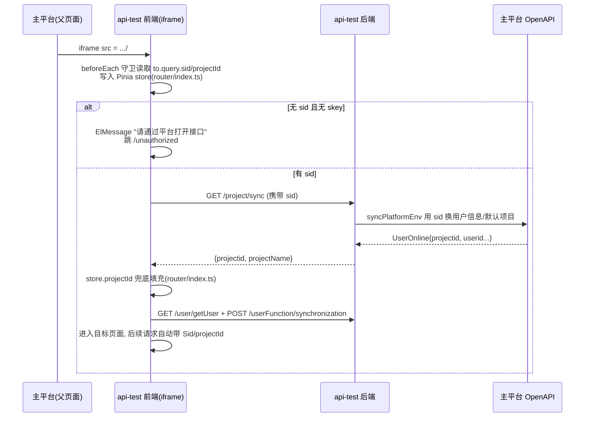

# 登录态与主平台集成

## 概述

本平台**没有自己的登录页**，运行形态是作为私有云主平台的子系统，通过 **iframe 嵌入**主平台页面（`src/App.vue` 注释与 `--iframe-height` 全局 CSS 变量即为嵌入而设）。登录态完全来自主平台，传入有两条通道：

1. **iframe URL query**：主平台拼 iframe src 时带上 `?sid=xxx&projectId=yyy`——这是**当前生效的主通道**。
2. **postMessage**：主平台向 iframe 推送 `projectInfo/userOnline` JSON——代码还在（`src/utils/Login.ts`），但**当前没有被任何文件 import，处于休眠状态**（`src/main.ts` 里等价的 `dealMessage` 整段被注释）。

前端拿到 sid/projectId 后：路由守卫校验 → 调后端 `/project/sync` 向主平台核验并同步项目与用户 → 之后每个请求由 axios 拦截器自动携带（机制详见 [前端HTTP层与响应约定](前端HTTP层与响应约定.md)）→ 后端 `KeyInterceptor` 解析 sid 换用户、写 session。

另有一条**免登例外**：报告分享页通过 URL 上的 `skey`（分享 key）跳过全部登录态校验。

## 逻辑详解

### iframe 嵌入与登录态进入

### 前端守卫的处理顺序

全局守卫 `router.beforeEach`（`src/router/index.ts`）的登录态分支：

1. **取登录态**：`to.query.sid ?? sessionStorage.store.sid`，projectId 同理。query 优先是为了支持主平台切项目后重开 iframe；sessionStorage 兜底是为了解决"初始化带 sid 进入，之后切菜单/刷新页面 sid 丢失"。
2. **skey 短路**：`to.query.skey` 存在 → 跳过 sid 校验（分享报告场景）。
3. **无 sid 拦截**：非 `/unauthorized` 路径且无 sid → toast"请通过平台打开接口"并跳 401 页。
4. **首次进入做项目同步**：模块级标志位 `isSyncProject` 保证只调一次 `syncProject()`（`src/api/project.ts` → `GET /project/sync`）；成功后用返回值兜底 projectId、记录 projectName，并顺带拉协议列表与 OEM 配置；失败跳 `/unauthorized`。
5. **之后才进入权限判定**（见 [权限体系](权限体系.md)）。

### 后端如何取 sid 与 projectId

后端没有登录接口，所有请求的登录态解析集中在 `KeyInterceptor`：

- **sid**（`src/main/java/cn/testin/interceptor/KeyInterceptor.java` `getUserId`）：按 `Sid` 请求头 → `sid` query 参数 → 请求体 JSON 的 `sid` 字段，三级查找；都找不到抛 `TIException("无效的Sid")`。拿到 sid 后先查 session，没有再 `userService.findUserBySid` 查库，库也没有则 `projectService.syncPlatformEnv(null, sid)` 向主平台同步建用户，最终把 `userDo` 和 sid 写进 **HttpSession**（`SessionUtil.setUserDoSession/setSidSession`）。
- **projectId**（`KeyInterceptor.java` `saveProjectIdToSession`）：同样按 `projectId` 请求头 → query 参数 → body JSON 三级查找，写入 session。`SessionUtil.setProjectIdSession`（`src/main/java/cn/testin/commons/utils/SessionUtil.java`）会校验**必须是纯数字**（`^[0-9]+$`），不是数字直接抛异常——兼容测管平台场景下 projectId 为空则跳过不存。
- session 超时固定一天（`SessionUtil.java`，`MAX_INACTIVE_INTERVAL = 60*60*24`），每次 `getSession` 都会重设。
- controller 业务代码不直接碰 request，统一用 `SessionUtil.getUserDoSession()/getProjectIdSession()/getSidSession()` 读上下文；取不到会抛 `TIException`。

### 主平台同步：/project/sync

`ProjectController.syncPlatformEnv`（`src/main/java/cn/testin/controller/ProjectController.java`）调 `ProjectService.syncPlatformEnv`，用 sid 经主平台 OpenAPI（`platform.url`，`application-test.yml`）核验登录态、换取用户信息和默认项目，把用户/项目/环境等落本地库。该接口在 `KeyInterceptor` 白名单里（`KeyInterceptor.java`）——因为它本身就是登录态建立环节，不能要求先有 session。

权限串的同步（`/userFunction/synchronization`）是另一条线，见 [权限体系](权限体系.md)。

### postMessage 通道（休眠代码）

`src/utils/Login.ts` 的 `login()`：挂 `window.onmessage`，解析主平台推来的 JSON——`data.projectInfo` 里取 projectId/projectName、`data.userOnline` 里取 sid，写 store 后调 `loginByApi`（`src/api/login.ts`，`POST /platformInfo/save` 把原始消息落库）。`src/main.ts` 有一份等价实现但整段注释。**现状是没有任何 import 触发它**：如果未来主平台改成 postMessage 推登录态，把 `login()` 在 `main.ts` 里调起来即可，解析逻辑现成。

### iframe 内的导航与会话保持细节

嵌入形态带来几个特有的交互补丁：

- **store 持久化**：`src/main.ts` 用 `store.$subscribe` 把主 store（projectId/sid/id/name/projectName/url，`src/stores/index.ts`）在每次变更时全量写入 `sessionStorage.store`。守卫和 HTTP 拦截器的"兜底读取"都依赖这份拷贝——它是跨页签/刷新保持会话的关键，但**只在同一会话的同源页签间有效**（sessionStorage 语义）。
- **Ctrl+点击菜单开新页签**：`sidebarItem.vue` 会把当前 sid 拼进新页签 URL（`.../#/path?sid=xx`），让新页签走"query 优先"分支直接建立上下文，不依赖 sessionStorage。
- **报告页新页签**：列表页 `window.open` 打开报告（如 `src/views/case/CaseList.vue`），新页签首屏请求靠 sessionStorage 恢复 store（`src/utils/Http.ts`）。
- **退出按钮 = 关 iframe 页签**：`AppHeader.vue` 的 `quit()` 按浏览器内核分别用 `window.open('about:blank','_self').close()` 等方式关闭当前页，把用户还给主平台，而不是跳什么"登录页"——本平台没有登录页。
- **iframe 高度适配**：`App.vue` 把 app 高度写进全局 CSS 变量 `--iframe-height`，供内部滚动容器使用。

### 分享免登：skey 链路

测试报告可以生成外部分享链接（形如 `/#/share/report/2?reportId=xx&skey=yy`），接收人没有平台账号也能看：

- 路由：`/share/report/1`、`/share/report/2`（`src/router/index.ts`），组件 `src/views/share/report.vue` 只是给 `TaskReport` 包了 `is-share=true`。
- 守卫对 `to.query.skey` 一律放行（`src/router/index.ts`），不调 `syncProject`。
- 报告组件取 `route.query.skey`（`src/views/report/TaskReport.vue`），`isShareReport` 为真时改调分享接口：`/share/task/getReport/{skey}`、`/share/case/getReport/{skey}`、`/share/*/new/getReportDetailList/{skey}`（`src/api/report.ts`）。
- 后端 `/share` 在 KeyInterceptor 白名单（`KeyInterceptor.java`），`TestReportShareController`（`src/main/java/cn/testin/controller/TestReportShareController.java`）全程用 skey 换报告数据，不碰 session。

## 关键代码位置表

| 位置 | 作用 |
|---|---|
| `testin-api-frontend/src/router/index.ts` | 全局守卫：登录态读取、skey 短路、无 sid 拦截、首次 syncProject |
| `testin-api-frontend/src/router/index.ts` | sid/projectId 的 query 优先 + sessionStorage 兜底 |
| `testin-api-frontend/src/api/project.ts` | `syncProject()` → `GET /project/sync` |
| `testin-api-frontend/src/utils/Login.ts` | postMessage 登录态通道（休眠） |
| `testin-api-frontend/src/api/login.ts` | `loginByApi` → `POST /platformInfo/save` 落库主平台推送 |
| `testin-api-frontend/src/main.ts` | store 全量持久化 sessionStorage（新页签恢复） |
| `testin-api-frontend/src/views/share/report.vue` | 分享报告页外壳（is-share） |
| `testin-api-frontend/src/views/401/index.vue` | 未授权页 |
| `testin-api-backend/src/main/java/cn/testin/interceptor/KeyInterceptor.java` | sid 三级查找 + 用户落 session |
| `testin-api-backend/src/main/java/cn/testin/interceptor/KeyInterceptor.java` | projectId 三级查找 + 落 session |
| `testin-api-backend/src/main/java/cn/testin/commons/utils/SessionUtil.java` | session 读写工具，超时一天 |
| `testin-api-backend/src/main/java/cn/testin/controller/ProjectController.java` | `/project/sync` 登录态核验与项目同步 |
| `testin-api-backend/src/main/java/cn/testin/service/UserService.java` | `findUserBySid` 等用户查询 |
| `testin-api-backend/src/main/java/cn/testin/controller/TestReportShareController.java` | 分享报告接口（skey 免登） |

## 注意事项与坑

- **直接开浏览器访问一定跳 401**：没有 sid 的访问被守卫拦下（"请通过平台打开接口"），本地开发时要把测试环境 iframe 地址（带 sid/projectId）复制出来用，或先连测试环境代理让 `/project/sync` 能核验。
- **projectId 必须纯数字**：`SessionUtil.java` 的校验会让非数字 projectId 的请求直接 500（"存入session中的项目id格式错误"）。主平台传错格式时后端报错信息有迷惑性。
- **session 是一天的 HttpSession**：意味着登录态实质上由"网关/前置代理的 session 亲和 + sid 重解析"共同维持；session 丢了不致命，`KeyInterceptor` 会用请求里的 sid 重新查库/同步重建（`KeyInterceptor.java`），所以**请求里带 sid 是永远的真实来源，session 只是缓存**。
- **刷新/新页签丢 projectId 的排查路径**：先查 `sessionStorage.store` 有没有值（`main.ts` 订阅写入），再查守卫  的读取，最后查请求拦截器的恢复逻辑（`src/utils/Http.ts`）。
- **skey 分享页不做任何权限校验**：`/share` 全白名单，skey 即凭证。不要把 skey 链接当成"内部可见"，任何拿到链接的人都能看报告。
- **postMessage 代码是休眠的**：排查"主平台推了消息 iframe 没反应"时先确认——当前版本本来就不收（`main.ts` 里注释掉了），不是 bug 是现状。
- **主平台用户首访问可能略慢**：本地库查不到用户时会同步调主平台 OpenAPI 建档（`KeyInterceptor.java`），首请求耗时包含一次远程调用。
- 登录态在请求链路上的完整流转（含 body 多次读取为何可行）见 [后端请求处理管线](后端请求处理管线.md)；权限串的获取见 [权限体系](权限体系.md)。
