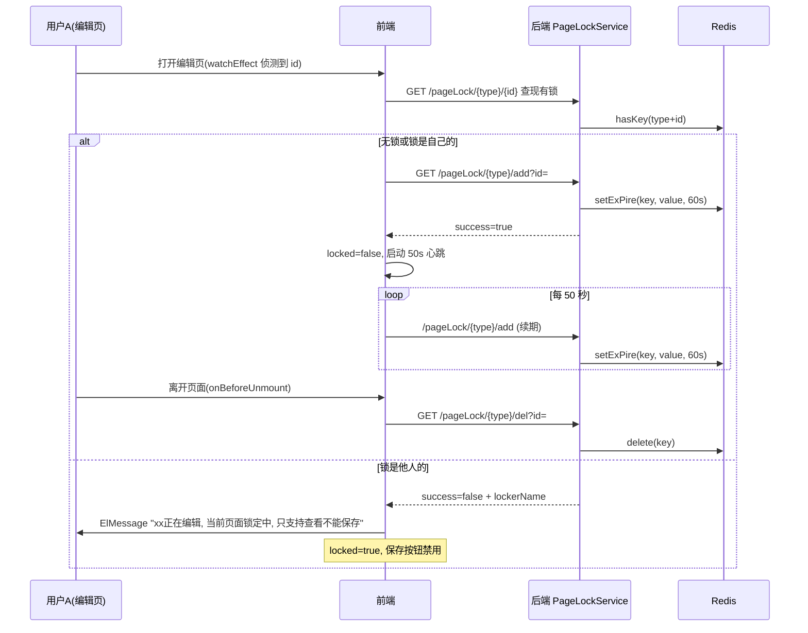
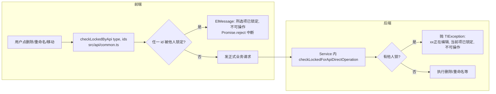

# 编辑锁机制

## 概述

编辑锁（PageLock）解决的是多人协作场景下的**并发编辑冲突**：当一个用户打开某个接口/脚本/用例/数据集的编辑页时，该资源被锁定，其他用户只能只读查看，不能保存；列表页上的批量操作（重命名、删除、移动、复制、打标签）在执行前也会先检查目标是否被他人锁定。

实现上是一把**带 60 秒 TTL 的 Redis 分布式锁**，靠前端每 50 秒一次的"心跳续期"保持活锁。锁不存数据库、没有后台清理任务，持有者掉线/关页后最多 60 秒锁自动失效，属于典型的"乐观、可自动恢复"设计。

- 锁粒度：**资源类型 + 资源 id**（Redis key 为 `ModuleType枚举名 + id` 拼接，如 `CASE12345`）。
- 锁值：`PageLockValueDTO{userId, lockTime, lockerName}` 的 JSON。
- 锁的范围：ModuleType 枚举共 8 种（`INTERFACE, SCRIPT, CASE, TASK, DATASET, ENUM, ENV, PLAN`，见 `src/main/java/cn/testin/enums/ModuleType.java`），但前端实际对编辑页加锁的只有 4 种：`CASE / INTERFACE / SCRIPT / DATASET`（`src/api/common.ts`）。

## 逻辑详解

### 编辑页加锁与心跳续期

以脚本编辑页为例（`src/views/script/components/ScriptDefinition.vue`，接口页 `ApiDefinition.vue`、用例页 `EditCase.vue` 同构）：

时序细节：

- **进入编辑页**：先 `getPageLockByApi` 查锁（`src/api/common.ts`），无锁或锁属本人 → `addLockByApi` 加锁（`src/api/common.ts`）；锁属他人 → 弹 10 秒提示并把页面置为只读（`ScriptDefinition.vue`）。
- **心跳**：`setInterval` 每 **50 秒**调一次 `addLockByApi`（`ScriptDefinition.vue`）。后端 `addPageLock` 对"锁已存在且属本人"的情况就是重写一次 60 秒 TTL（`PageLockService.java`），所以心跳=续期。心跳间隔 50s < TTL 60s，留了 10 秒网络余量。
- **抢锁失败处理**：心跳过程中若发现锁被抢走（`lockSuccess.success === false`），立即清掉定时器并把页面置只读（`ScriptDefinition.vue`）。
- **离开页面**：`onBeforeUnmount` 清定时器，只有自己持锁才调 `delPageLockByApi` 主动解锁（`ScriptDefinition.vue`）；后端 `delPageLock` 也会再校验一次"锁属本人才删"（`PageLockService.java`），防止误删他人锁。用户直接关浏览器则等 60 秒 TTL 过期。

### 后端锁接口

`PageLockController`（`src/main/java/cn/testin/controller/PageLockController.java`）提供 6 个接口，全部薄封装到 `PageLockService`（`src/main/java/cn/testin/service/PageLockService.java`）：

| 接口 | 说明 | Service 方法 |
|---|---|---|
| `GET /pageLock/{type}/add?id=` | 加锁/续期（二合一） | `addPageLock`（`PageLockService.java`） |
| `GET /pageLock/{type}/del?id=` | 解锁（仅本人） | `delPageLock`（`PageLockService.java`） |
| `GET /pageLock/{type}/{id}` | 查单个资源的锁 | `getPageLock`（`PageLockService.java`） |
| `GET /pageLock/{type}/listAll` | 列出该类型所有被锁 id | `listPageLockKeyIds`（`PageLockService.java`，用 `keys type*` 扫描） |
| `POST /pageLock/{type}/list` | 入参 id 列表中返回被锁的 | `listPageLockKeyIds(moduleType, ids)`（`PageLockService.java`） |
| `POST /pageLock/{type}/checkLock` | 这批 id 是否有**他人**持锁 | `checkLocked`（`PageLockService.java`） |

`addPageLock` 的三种分支（`PageLockService.java`）：无 key → 写锁返回 success；有 key 且 userId 相同 → 重写续期返回 success；有 key 且属他人 → 返回 `success=false + lockerName`。锁归属判定用的 userId 来自 session（`SessionUtil.getUserDoSession()`），即当前登录用户。

### 操作前检查：前端 checkLockedByApi 与后端双重校验

编辑页锁保护"保存"，但**重命名/删除/移动/复制/批量打标签**这些不经编辑页的操作，走的是"操作前检查"模式：

- 前端检查 scattered 在各 api 文件中，例如重命名接口（`src/api/interface.ts`）、删除接口（`src/api/interface.ts`）、用例操作（`src/api/case.ts`）、移动（`src/api/common.ts` 的 `commonMoveByApi`，只对 `CASE/INTERFACE/SCRIPT/DATASET` 四类检查）、批量打标签（`src/api/common.ts`）。列表页多选时用 `src/utils/PageLock.ts` 的 `updateOperationLock` 统一刷新勾选集合的锁状态。
- 后端兜底在业务 Service 里逐个调用 `checkLockedForApiDirectOperation`（`PageLockService.java`），发现他人持锁直接抛 `TIException("lockerName 正在编辑，当前项已锁定，不可操作")`。接入点举例：`InterfaceService.java/302`（接口删除/重命名）、`ScriptService.java/408`、`TestCaseService.java/313/655/1160`、`TestDataCollectService.java`（数据集）、`InterfaceMockService.java`。

### 并发编辑的冲突表现

- 后到者打开同一资源编辑页 → 顶部弹"xx正在编辑，当前页面锁定中，只支持查看不能保存"，保存不可用。
- 后到者在列表页对被锁资源做删除/重命名/移动 → 提示"所选项已锁定，不可操作"。
- 持锁者掉线 60 秒内，资源处于"无人编辑但锁还在"的状态，他人依然被挡；60 秒后锁自动释放。
- 前端检查与后端写库之间没有事务化：极端并发下（两人同时点删除且都通过检查）仍可能双双执行，锁只保证"编辑中不被打扰"，不保证强互斥。

## 关键代码位置表

| 位置 | 作用 |
|---|---|
| `testin-api-backend/src/main/java/cn/testin/service/PageLockService.java` | 锁全部逻辑；TTL 常量 `EXPIRE_TIME = 60` |
| `testin-api-backend/src/main/java/cn/testin/controller/PageLockController.java` | 锁 REST 接口 |
| `testin-api-backend/src/main/java/cn/testin/enums/ModuleType.java` | 锁的资源类型枚举（key 前缀） |
| `testin-api-backend/src/main/java/cn/testin/entity/dto/PageLockValueDTO.java` | 锁值结构 userId/lockTime/lockerName |
| `testin-api-frontend/src/api/common.ts` | `checkLockedByApi` 操作前检查 |
| `testin-api-frontend/src/api/common.ts` | add/get/del/list 锁 API 封装 |
| `testin-api-frontend/src/utils/PageLock.ts` | 列表页多选锁状态刷新工具 |
| `testin-api-frontend/src/views/script/components/ScriptDefinition.vue` | 编辑页加锁 + 50s 心跳 + 卸载解锁的范本实现 |
| `testin-api-frontend/src/views/api/components/ApiDefinition.vue` | 接口编辑页同构实现 |
| `testin-api-frontend/src/views/case/EditCase.vue` | 用例编辑页同构实现 |

## 注意事项与坑

- **Redis key 无前缀、无项目维度**：key 就是 `CASE + id` 这种裸拼接（`PageLockService.java`），与平台其他 Redis key 规范不统一，且在多项目共用 Redis 时靠资源 id 全局唯一才不打架。排查锁问题时直接在 Redis 里 `keys CASE*` 即可。平台 Redis key 的整体设计见 [Redis通信与Key设计](Redis通信与Key设计.md)。
- **TTL 60s 与心跳 50s 是硬编码**：改 TTL（`PageLockService.java`）必须同步改前端 4 个编辑页的心跳间隔，且心跳要小于 TTL。目前没有配置化。
- **TASK/ENUM/ENV/PLAN 四类没有编辑页锁**：枚举在 ModuleType 里但前端 `pageLockModuleTypeList` 不含它们，移动等操作也不查锁。给这些模块新增并发保护时需要前后端一起补。
- **del 是 GET 请求**：`/pageLock/{type}/del`、`/add` 都是 GET（`PageLockController.java/35`），注意别被网关/浏览器缓存坑（目前前端都走 axios 带时间戳参数，尚无问题）。
- **`listPageLockKeyIds`（listAll）用 `keys type*` 全量扫描**（`PageLockService.java`），Redis key 量大时有性能风险，且会把 key 里的类型前缀用 `replace` 去掉——如果资源 id 本身以类型名开头会被误截。
- **锁只能本人解**：没有"管理员强制解锁"入口；某用户挂着锁休假了，只能等 TTL 或手动删 Redis key。
- **分享/报告页不涉及锁**；锁只覆盖编辑态。新资源的"保存前加锁"接入方式：编辑页 `watchEffect` 里照抄 `ScriptDefinition.vue` 的三段式（查锁→加锁→失败置只读），业务 Service 写库前加 `checkLockedForApiDirectOperation`。
