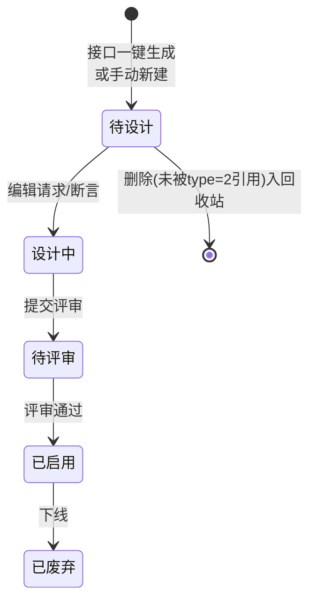
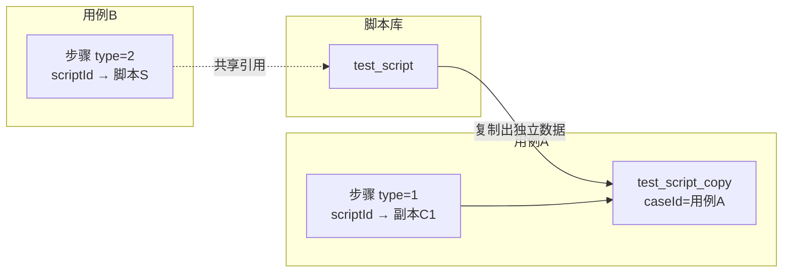

# 脚本管理实现

> 产品视角的功能与操作说明见 [脚本管理](脚本管理.md)；本文是开发/维护视角的实现细节。

## 概述

脚本（`test_script`）是接口（`test_interface`）的可执行实例，请求体 JSON 结构与接口完全同构；断言独立存表；脚本被用例引用时分为"直接关联"（共享引用）与"脚本副本"（`test_script_copy` 独立拷贝）两条路径，是本模块最容易踩坑的设计。

## 脚本的三种存在形态

```
接口 (test_interface)                      ← 定义，不可执行
  │ 一键生成 / 手动新建（带 interfaceId 关联）
  ▼
脚本 (test_script)                         ← 可执行模板，模块树管理，可调试
  │ 被用例引用时产生两条路径：
  ├─ 直接关联：用例步骤 type=2 ──→ 步骤共享引用 test_script 本体
  └─ 生成副本：用例步骤 type=1 ──→ 脚本副本 (test_script_copy)
                                    属于具体用例的独立拷贝，改副本不影响原脚本
```

> "脚本复制"一词在代码里有**两个含义**，极易混淆，本文严格区分：
> - **复制脚本（copyScript）**：脚本列表页的"复制"按钮，把一条脚本克隆到某个模块下（`ScriptService.copyScript`）
> - **脚本副本（ScriptCopy）**：脚本被拉进用例时生成的、挂在用例下的独立数据（`test_script_copy` 表 + `/scriptCopy/*` 接口）

## 数据模型

主表 `dao/TestScriptDo.java`：`id`、`projectId`、`name`、`interfaceId`（来源接口，可为空）、`protocol`、`status`、`path`、`method`、`tags`、`scriptNumber`（项目内自增编号，从 100001 开始，`ScriptService.java`）、`moduleId`、`serverId`、`assertionId`（指向独立断言表 `test_script_assertion`，`TestScriptDo.java`）、`scriptType`（`TestScriptDo.java`，"1"=功能脚本；前端另有 "2"=空脚本，`src/utils/ConstantConfig.ts` 的 `SCRIPT_TYPE_LIST` / `isEmptyScript`）。

大字段 `dao/TestScriptDoWithBLOBs.java`：`description`、`request`（请求参数 JSON，结构与接口的 `requestParam` 完全一致，见[接口管理实现](接口管理实现.md)的数据结构一节）、`environmentConfig`。

脚本副本表 `dao/TestScriptCopyDo.java` 字段与脚本表几乎相同，多两个关键列：`caseId`（所属用例）和 `scriptId`（源脚本 id）。

前端 `Script` 类型（`src/vite-env.d.ts`）与 `request` JSON 的解析在 `src/api/script.ts`（`getScriptByApi`）——**这里给 tcp/dubbo/webSocket/grpc/graphQL/mqtt/fix 七个协议参数块各写死了一份默认值**，保证老数据缺字段时页面不崩。

## 脚本与接口的关系

- 手动新建脚本时可不关联接口；更多时候由接口派生：
  - **接口页"生成脚本"**：`POST /script/generateScriptByInterfaceIds`（`ScriptController.java`），批量把接口拷成脚本——`requestParam` 原样变成脚本的 `request`，`interfaceId` 记录来源，状态初始为"待设计"，目标模块重名自动加 `_N+1` 后缀（`ScriptService.java`）
  - 脚本编辑页内也可以重新选择关联接口（前端 `src/views/script/components/ScriptSelectApiDialog.vue`），选择后前端把接口的名称/标签/协议/方法/路径/七个协议参数块整体拷贝进表单（`ScriptDefinition.vue` 的 `selectApi`）
- 关联是**弱引用**：接口后续修改不会同步到已生成的脚本；接口删除时若有脚本引用则直接拒绝删除（`InterfaceService.java`）
- 脚本是接口的"实例"，断言单独存表（`assertionId` 外键），复制脚本/生成副本时都会深拷贝断言记录

## 脚本的生命周期



状态枚举本身只是字符串列表（`ScriptService.java`），没有状态机校验——前端（`src/views/script/config.ts` 同款 SCRIPT_STATUS_LIST）控制可选项，后端只负责存储与批量更新（`/script/batchUpdateStatus`）。调试不要求特定状态，任何状态的脚本都能跑。

脚本编辑页（`src/views/script/components/ScriptDefinition.vue`）与接口编辑页共用同一套请求参数表单组件，差别在于脚本多了：

- **断言规则编辑**：结果写入独立的 `test_script_assertion` 表而非 `request` JSON（靠 `assertionId` 外键关联）
- **数据集绑定**：`request.dataSet` 存 `{id, name, column, originList}`，执行时按列取数（[数据集与数据枚举](../01-产品功能/数据集与数据枚举.md)）
- **调试按钮与结果面板**：选环境（`getAllEnvListByApi`，选择记忆在 localStorage 的 `debugEnvOfScript`）→ 触发一次真实执行 → 每秒轮询 `/script/getRunStatus/{reportId}`，状态为 `STOP` 后取 `/script/getRunResult/{reportId}` 渲染到响应面板

## 脚本的增删改查与调试

页面（`src/views/script/index.vue`）与接口页同构：左树（模块 type=`SCRIPT`）+ 右 tabs（`ScriptListTable.vue` 列表 + `ScriptDefinition.vue` 编辑表单）。

| 操作 | 后端逻辑要点 |
|---|---|
| 保存 `ScriptService.java/169` | 同模块名称唯一（`checkNameExist`）；`request` 以 JSON 串整体落库 |
| 删除 `ScriptService.java` | 先查[编辑锁](编辑锁机制.md)；**被用例步骤直接关联（步骤 type=2）的脚本禁止删除**；删除入[回收站](../01-产品功能/回收站.md) |
| 复制脚本 `ScriptService.java` | 克隆到新 id；同模块或重名时命名 `原名_副本_xxxx`（UUID 前 4 位，`getCopyName`）；有断言则同步深拷贝断言记录 |
| 调试 | 前端 `debugScriptByApi`（`src/api/script.ts`）→ `POST /test/automation/script/run` 走[任务执行链路](任务执行链路.md)，轮询 `/script/getRunStatus/{reportId}`、取结果 `/script/getRunResult/{reportId}` |
| 导入/导出 | 仅支持平台自导出格式（`testIn-script-export.json`，`ScriptService.java/784`），与接口一样受 `TestImportLock` 全局锁保护；导入弹窗可同时指定关联接口/数据集的落位目录（`importScriptDialog.vue` 的 `associated.interfaceModuleId/datasetModuleId`） |
| 状态批量修改 | `/script/batchUpdateStatus`，状态枚举与接口一致：待评审/待设计/设计中/已启用/已废弃（`ScriptService.java`） |

脚本本身**没有版本/历史机制**——变更追踪只有 `test_script` 上的 updateTime/updateUserId 和用户行为记录（`userBehaviorService`）；执行历史体现在脚本调试报告（[测试报告与分享](../01-产品功能/测试报告与分享.md)）。

## 脚本副本（ScriptCopy）：用例里的"私有拷贝"

脚本进入[用例](../01-产品功能/用例管理.md)有两种方式，由步骤表的 `type` 列区分：



- **type=1 脚本副本**：`/scriptCopy/add`（`TestScriptCopyService.java`）把脚本（或另一个副本）整体克隆进 `test_script_copy`，绑定 `caseId`，断言同步深拷贝，随后生成步骤（`createStep` ，步骤的 `scriptId` 指向副本 id）。副本可在用例内独立编辑（`/scriptCopy/edit`），改请求参数不影响源脚本。
- **type=2 直接关联**：`/case/step/add`（`TestCaseStepService.java`）不复制数据，步骤的 `scriptId` 直接指向 `test_script`，所有引用该脚本的用例共享同一份请求定义。前端弹窗 `ChooseScript.vue` 底部两个按钮"另存副本"（走 addScriptCopyApi）和"直接关联"（走 addScriptApi）对应这两条路径。
- **出参同步**：同一脚本被多个用例以副本引用时，在一个用例里改了出参/断言，可勾选同步到其他用例的同名副本——`POST /scriptCopy/updateSameScriptCopy`（`TestScriptCopyService.java`，前端 `src/api/scriptCopy.ts`），同步范围是 afterActionList 与 assertionRuleList 的增删。
- 删除约束是对称的：脚本被 type=2 步骤引用时禁删（`ScriptService.java`）；副本删除走 `/scriptCopy/delete`（`TestScriptCopyService.java`），步骤删除时也会连带尝试清理副本（`TestCaseStepController.java`，注释明确"直接关联的类型在脚本副本表删不掉"）。

副本的查看接口 `/scriptCopy/view/{id}/{stepId}`（`ScriptCopyController.java`）带 stepId 是因为**数据集可以按步骤覆盖**：步骤上存了 `datasetId`/`datasetDetails` 时优先用步骤的数据集，否则用脚本自身 `request` 里的（`TestScriptCopyService.java` `dealScriptDataSet`，脚本侧同款逻辑在 `ScriptService.java`）。数据集的取值细节：按 `column`（冒号分隔的列名）从数据集详情 JSON 数组里逐行映射出参变量，表头前两行是元数据、从第 3 行（下标 2）开始才是数据行（`ScriptService.java`）。数据集机制见[数据集与数据枚举](../01-产品功能/数据集与数据枚举.md)。

### 副本相关操作的入口对照

| 用户操作 | 前端 API | 后端入口 | 作用对象 |
|---|---|---|---|
| 用例里"添加脚本"（副本模式） | `addScriptCopyApi`（`src/api/scriptCopy.ts`） | `/scriptCopy/add`（`TestScriptCopyService.java`） | 新建副本 + type=1 步骤 |
| 用例里编辑副本的请求 | `editScriptCopyApi`（`src/api/scriptCopy.ts`） | `/scriptCopy/edit`（`TestScriptCopyService.java`） | 只改副本，不动源脚本 |
| 同步出参到其他用例 | `updateSameScriptCopy`（`src/api/scriptCopy.ts`） | `/scriptCopy/updateSameScriptCopy`（`TestScriptCopyService.java`） | 批量改其他用例下同源副本 |
| 删除副本 | `deleteScriptCopyApi`（`src/api/scriptCopy.ts`） | `/scriptCopy/delete`（`TestScriptCopyService.java`） | 副本本体 |

## 关键代码位置表

| 功能 | 位置 |
|---|---|
| 脚本 REST 入口（/script） | `testin-api-backend/src/main/java/cn/testin/controller/ScriptController.java` |
| 脚本保存（新增/修改） | `testin-api-backend/src/main/java/cn/testin/service/ScriptService.java`、 |
| 脚本删除（type=2 关联拦截、回收站） | `testin-api-backend/src/main/java/cn/testin/service/ScriptService.java` |
| 复制脚本（列表页"复制"） | `testin-api-backend/src/main/java/cn/testin/service/ScriptService.java` |
| 接口一键生成脚本 | `testin-api-backend/src/main/java/cn/testin/service/ScriptService.java` |
| 脚本导出 / 导入 | `testin-api-backend/src/main/java/cn/testin/service/ScriptService.java`、 |
| 脚本数据模型 | `testin-api-backend/src/main/java/cn/testin/dao/TestScriptDo.java`、`dao/TestScriptDoWithBLOBs.java` |
| 脚本副本 REST 入口（/scriptCopy） | `testin-api-backend/src/main/java/cn/testin/controller/ScriptCopyController.java` |
| 生成脚本副本并建步骤（type=1） | `testin-api-backend/src/main/java/cn/testin/service/TestScriptCopyService.java`、 |
| 副本编辑 | `testin-api-backend/src/main/java/cn/testin/service/TestScriptCopyService.java` |
| 副本出参/断言跨用例同步 | `testin-api-backend/src/main/java/cn/testin/service/TestScriptCopyService.java` |
| 断言深拷贝 | `testin-api-backend/src/main/java/cn/testin/service/TestScriptCopyService.java` |
| 副本数据模型 | `testin-api-backend/src/main/java/cn/testin/dao/TestScriptCopyDo.java` |
| 前端脚本页骨架 | `testin-api-frontend/src/views/script/index.vue` |
| 前端脚本编辑表单 | `testin-api-frontend/src/views/script/components/ScriptDefinition.vue` |
| 前端脚本列表 | `testin-api-frontend/src/views/script/components/ScriptListTable.vue` |
| 前端选择关联接口弹窗 | `testin-api-frontend/src/views/script/components/ScriptSelectApiDialog.vue` |
| 前端脚本导入弹窗 | `testin-api-frontend/src/views/script/components/importScriptDialog.vue` |
| 前端脚本 API 层（含协议参数默认值） | `testin-api-frontend/src/api/script.ts` |
| 前端脚本副本 API 层 | `testin-api-frontend/src/api/scriptCopy.ts` |
| 前端 `Script` 类型 | `testin-api-frontend/src/vite-env.d.ts` |
| 脚本类型枚举（功能/空脚本） | `testin-api-frontend/src/utils/ConstantConfig.ts`（SCRIPT_TYPE_LIST） |

## 注意事项与坑

1. **"复制脚本"和"脚本副本"是两套代码**：前者 `ScriptService.copyScript`（克隆 `test_script`），后者 `TestScriptCopyService`（操作 `test_script_copy`）；排查"复制"相关 bug 时先确认用户操作的是列表页复制还是用例内引用。
2. **步骤的 `scriptId` 是指向两张表的"多态外键"**：type=1 指向 `test_script_copy.id`，type=2 指向 `test_script.id`，联表查询必须按 type 分支，直接用 id 查错表会查空。
3. **脚本删除的拦截只挡 type=2**（`ScriptService.java`）：脚本被引用生成副本（type=1）后不挡删除，因为副本已是独立数据；但此时副本的 `scriptId` 列还留着源脚本 id，源删除后该列成为悬空引用（当前代码按"仅记录来源"使用，不影响执行）。
4. **断言存独立表**（`test_script_assertion`，脚本只存 `assertionId`）：复制脚本、生成副本时忘记深拷贝断言会导致两条数据共享一份断言、互相污染——现有代码两处都处理了（`ScriptService.java`、`TestScriptCopyService.java`），新增克隆逻辑时别漏。
5. **`request` 是裸 JSON 无 schema**：前端 `getScriptByApi` 靠七份硬编码默认值兜底老数据（`src/api/script.ts`）；后端 `ScriptService.java` 等处理文件/数据集的逻辑按固定 key 解析，新增协议或参数块要前后端一起改。
6. **脚本没有版本管理**：不要去找 history 表；用户行为日志（`userBehaviorService`）只记动作不记内容快照，回收站里的快照是删除时点的最终态。
7. 调试报告与脚本 id 弱关联：调试走通用执行链路产出 reportId（[任务执行链路](任务执行链路.md)），前端轮询状态接口拿结果；报告过期清理后脚本页只能看到"无数据"。
8. 模块树与接口共用 `test_module` 表（type=`SCRIPT`），但脚本的 `/script/module/{moduleId}` 返回的是该目录下"文件夹 + 脚本"的混合列表（`ScriptController.java`），与树的 `/module/list` 是两个接口，别混用。
9. 空脚本（scriptType=2）前端会隐藏关联接口/协议/接口请求表单项，且跳过接口请求必填校验（`isEmptyScript`），后端保存逻辑要兼容这些字段为空。
