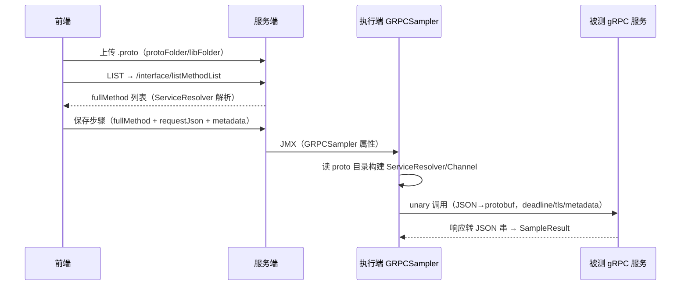

# Dubbo与GRPC支持

## 概述

平台对两种 RPC 协议的支持都遵循同一套路：**前端编辑参数 → 平台元素（`TestinDubboSampler` / `TestinGRPCSampler`）→ JMX → 执行端用第三方 JMeter 插件完成真实调用**。两个插件（`jmeter-plugins-dubbo`、`jmeter-grpc`/zalopay benchmark）的源码被**直接内嵌**在后端工程的 `src/main/java/io/github/ningyu/` 与 `src/main/java/vn/zalopay/` 下（二方库改造），因此服务端与执行端用同一份代码构建即可运行，见 [后端双形态架构](../02-技术架构/后端双形态架构.md)。

- **Dubbo**：泛化调用（`GenericService.$invoke`），不需要业务方 API jar；注册中心/配置中心在环境配置里维护，可在线拉取 Provider 列表和方法签名；
- **GRPC**：基于 proto 文件的动态反射调用（非服务端反射），请求体用 JSON 表达，由插件按 proto 描述动态编解码。

相关文档：[JMX生成与解析](../03-实现逻辑/JMX生成与解析.md)、[环境与配置管理](../01-产品功能/环境与配置管理.md)、[执行端Runner详解](../03-实现逻辑/执行端Runner详解.md)。

## 一、Dubbo

### 1. 环境配置：注册中心/配置中心

环境的 `dubboServerConfigList` 里维护 `DubboServerConfig`（`src/main/java/cn/testin/entity/dto/environment/DubboServerConfig.java`）：`id`、`name`、`type`（`registry` 注册中心 / `config` 配置中心）、`protocol`、`address`、`group`、`namespace`、`userName`、`password`、`timeout`。底层依赖 Dubbo 2.7.8（`pom.xml`），含 `dubbo-registry-zookeeper/nacos/redis` 与 `dubbo-configcenter-zookeeper/nacos`（pom.xml）。

### 2. Provider 在线查询

前端 `DubboRequestParameters.vue`（`testin-api-frontend/src/components/RequestParameters/DubboRequestParameters.vue`）：

1. 配置中心/注册中心两个下拉共用同一份列表 `getEnvConfigListByApi('Dubbo')`——即环境配置里 type 为 registry/config 的条目都会出现在两个下拉里，由用户自行选对；
2. 点"获取Provider列表"先选环境（`RunDialog`），再调 `POST /interface/dubbo/providers`（`api/interface.ts`）；
3. 后端 `InterfaceDubboService.getProviderList`（`src/main/java/cn/testin/service/InterfaceDubboService.java`）按 `envId + serverId` 找到环境里的注册中心配置（type 必须是 `registry`），用插件的 `ProviderService.get(address)` 连注册中心，`getProviders(protocol, address, group)` 拉出全部服务；再对每个服务 `findByService` 取 Dubbo URL 里的 `methods` 参数拆出方法列表，并尝试读 `{method}.parameterTypes` / `{method}.args` 作为参数类型线索（目前只打印未利用）；
4. 前端选择 Interface + Method 后自动回填版本号，参数在"Args设置"弹层里按 `paramType + paramValue` 逐行录入（如 `java.lang.String` + `abc`），另有 Attachment Args（隐式传参）。

RPC 协议下拉固定为 `dubbo://`、`rmi://`、`hessian://`、`webservice://`、`memcached://`、`redis://`；消费端参数含 timeout/version/retries/group/connections/loadbalance/async/cluster。

步骤 JSON 里三类配置对象的结构（`src/main/java/cn/testin/entity/request/dubbo/`）：

- `TestinRegistryCenter`：`registryProtocol`、`registryGroup`、`registryUserName`、`registryPassword`、`address`、`registryTimeout`；
- `TestinConfigCenter`：`configCenterProtocol/Group/Namespace/UserName/Password/Address/Timeout`；
- `TestinConsumerAndService`：`timeout`、`version`、`retries`、`group`、`connections`、`loadbalance`、`async`、`cluster`。

注意前端选择的只是环境配置的 `serverId`，真正发到执行端的是展开后的完整配置对象。

### 3. 执行：泛化调用

`TestinDubboSampler`（`src/main/java/cn/testin/entity/vo/request/element/TestinDubboSampler.java`，type=`DubboSampler`，`protocol` 固定 `dubbo://`）的 `toHashTree`把三类配置经 `Constants.setXxx` 写进 `DubboSample`（内嵌插件 `io/github/ningyu/jmeter/plugin/dubbo/sample/DubboSample.java`）：配置中心、注册中心、消费端与接口方法参数。方法入参 `methodArgs` 与隐式参数 `attachmentArgs` 都是插件的 `MethodArgument`（paramType/paramValue）列表。

执行时 `DubboSample` 构建 `ReferenceConfig`，缓存后取 `GenericService` 并泛化调用（`DubboSample.java` 取缓存、 `genericService.$invoke(methodName, parameterTypes, parameterValues)`）。**泛化调用意味着执行端不需要被测系统的接口 jar**，只要注册中心可达即可；入参按 `paramType` 全限定类名 + JSON 字面值反序列化。

与 FIX/TCP 一样，用例步骤执行前会过 `ElementUtil.dealDubboSamplerProxy`（`ElementUtil.java`）/ `dealGRPCSamplerProxy`做步骤元信息回填与调试/用例两种模式分流（GRPC 在此按 serverId 从环境 `grpcServerConfigList` 解析 host/port），再进 `toHashTree`。

## 二、GRPC

### 1. proto 文件管理

GRPC 不用服务端反射，而是**上传 proto 文件**到平台：

- 前端 `GrpcRequestParameters.vue` 提供 ProtoFile / LibFile（依赖的 import 文件）两个上传区，文件落到服务端目录 `uploads/gRPC/{interfaceOrScriptId}/protoFolder|libFolder`（组件初始化时按注入的接口/脚本 id 自动拼路径并列已传文件）；
- 上传走通用文件接口 `fileUploadByApi`，**必须先保存接口拿到 id 才能传**；
- 点 LIST 调 `GET /interface/listMethodList?protoFolder=uploads/...&libFolder=uploads/...`，后端 `InterfaceGRPCService.listMethodList`（`src/main/java/cn/testin/service/InterfaceGRPCService.java`）用插件的 `ClientList.getServiceResolver(protoFolder, libFolder, true)` 解析 proto、列出全部 `包名.服务/方法` 供下拉选择。

### 2. 请求参数与执行

`TestinGRPCSampler`（`src/main/java/cn/testin/entity/vo/request/element/TestinGRPCSampler.java`，type=`GRPCSampler`）字段：`protoFolder`、`libFolder`、`fullMethod`、`requestJson`、`metadata`、`timeout`(deadline)、`tls`、`tlsDisableVerification`、`channelAwaitTermination`、`maxInboundMessageSize`（默认 4MB）、`maxInboundMetadataSize`（默认 8KB）；host/port 来自环境里的 `GRPCServerConfig`（domain/connectTimeout/metadata/tls 等，见 `entity/dto/environment/GRPCServerConfig.java`）。

`toHashTree`生成 `vn.zalopay.benchmark.GRPCSampler`（内嵌于 `src/main/java/vn/zalopay/benchmark/`），执行时按 protoFolder/libFolder 动态构建 protobuf `ServiceResolver`，把 `requestJson` 映射为 protobuf 消息发 unary 调用；`requestJson`/`metadata` 为 null 时归一为空串，避免 JMX 序列化后出现字符串 "null"。插件侧属性键名为 `GRPCSampler.protoFolder/libFolder/fullMethod/requestJson/metadata` 等（`GRPCSampler.java`），JMX 排查时按这些键名检索。

## 关键代码位置

| 功能 | 位置 |
|---|---|
| Dubbo Provider 查询接口 | `src/main/java/cn/testin/controller/InterfaceDubboController.java` |
| Dubbo Provider 查询实现 | `src/main/java/cn/testin/service/InterfaceDubboService.java` |
| Dubbo 步骤配置对象 | `src/main/java/cn/testin/entity/request/dubbo/TestinRegistryCenter.java` 等 |
| Dubbo JMX 元素 | `src/main/java/cn/testin/entity/vo/request/element/TestinDubboSampler.java` |
| Dubbo 泛化调用 | `src/main/java/io/github/ningyu/jmeter/plugin/dubbo/sample/DubboSample.java` |
| 执行前步骤解析 | `src/main/java/cn/testin/entity/vo/request/ElementUtil.java`（Dubbo）、（GRPC） |
| GRPC 方法列表接口 | `src/main/java/cn/testin/controller/InterfaceController.java` |
| GRPC 方法列表实现 | `src/main/java/cn/testin/service/InterfaceGRPCService.java` |
| GRPC JMX 元素 | `src/main/java/cn/testin/entity/vo/request/element/TestinGRPCSampler.java` |
| GRPC 执行 Sampler（内嵌插件） | `src/main/java/vn/zalopay/benchmark/GRPCSampler.java` |
| 环境配置：注册中心 | `src/main/java/cn/testin/entity/dto/environment/DubboServerConfig.java` |
| 环境配置：GRPC | `src/main/java/cn/testin/entity/dto/environment/GRPCServerConfig.java` |
| 前端 Dubbo 编辑 | `testin-api-frontend/src/components/RequestParameters/DubboRequestParameters.vue` |
| 前端 GRPC 编辑 | `testin-api-frontend/src/components/RequestParameters/GrpcRequestParameters.vue` |

## 注意事项与坑

1. **Dubbo 是泛化调用**：参数类型必须写全限定类名，自定义对象参数值写 JSON；执行端没有业务 jar，类型名写错会在 `$invoke` 反序列化阶段报错。
2. Provider 查询要求环境配置的 `type=registry`，配成 `config` 会直接报"请选择类型为注册中心的服务"（`InterfaceDubboService.java`）；查询走的是**服务端**网络，服务端连不通注册中心时列表必失败。
3. Dubbo 依赖锁定 2.7.8 且排除了 `netty-all`（pom.xml 附近），升级到 Dubbo 3.x 需要同步验证内嵌插件源码兼容性。
4. **GRPC proto 文件存在服务端磁盘** `uploads/gRPC/{id}/` 下，执行端跑用例时按 JMX 里的路径再找文件——分布式执行机部署时必须保证文件同步机制可用（执行端按需向服务端拉取上传文件，见 [执行端Runner详解](../03-实现逻辑/执行端Runner详解.md)），否则报 "Proto folder path is empty"（`InterfaceGRPCService.java`）。
5. GRPC 仅支持 unary（一元）调用；流式 RPC 不支持。`maxInboundMessageSize` 默认 4MB，大报文响应要调大。
6. protobuf 依赖是 `testin.protobuf-java` 3.17.1 的 **system scope 本地 jar**（pom.xml，包名被改造成 `com.google.testin.protobuf` 以避开依赖冲突），换版本要同时替换 `lib/` 下的两个 jar；grpc-netty/stub 为 1.38.1。
7. 两个插件源码都在本仓库内（`io/github/ningyu/`、`vn/zalopay/`），**改它们等于改平台代码**，服务端和执行端两个产物（pom.xml / runnerPom.xml）都要重新构建部署，见 [部署与打包](../02-技术架构/部署与打包.md)。
8. GRPC 的 `tlsDisableVerification` 仅在 `tls=true` 时有意义；测试自签名证书服务时两个开关都要勾。
