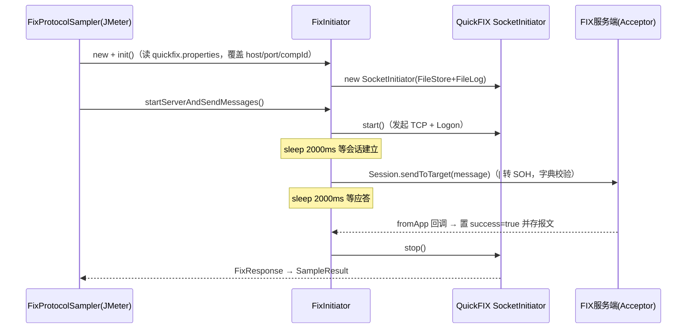

# FIX协议支持

## 概述

FIX（Financial Information eXchange）是证券/基金行业的标准报文协议。平台基于 **QuickFIX/J 2.3.0**（`pom.xml` 引入 `org.quickfixj:quickfixj-all`）实现 FIX 4.4 协议的接口测试：前端按数据字典选择报文类型、可视化填写字段并拼成 `|` 分隔的报文串；后端把 FIX 步骤转成自定义 JMeter Sampler，执行时由执行端（Runner）临时拉起一个 QuickFIX SocketInitiator 会话完成登录、发报文、收应答。

整条链路分三段：

1. **报文结构元数据**：内置数据字典 `FIX44.modified.xml`，通过两个 REST 接口向前端提供报文类型列表和字段树；
2. **报文编辑**：前端 `FixRequestParameters.vue` 把字段值拼成 `8=FIX.4.4|35=D|...|10=100|` 形式的 message 字符串；
3. **执行**：`TestinFixSampler` → JMX → Runner 上的 `FixProtocolSampler` → QuickFIX/J 会话。

相关文档：[JMX生成与解析](../03-实现逻辑/JMX生成与解析.md)、[执行端Runner详解](../03-实现逻辑/执行端Runner详解.md)、[环境与配置管理](../01-产品功能/环境与配置管理.md)。

## 逻辑详解

### 1. 数据字典与报文结构接口

平台内置一份 FIX 4.4 数据字典 `src/main/resources/FIX44.modified.xml`（QuickFIX 标准 XML 字典格式），并用一个改造过的字典解析类 `DictionaryUtils`（`src/main/java/cn/testin/protocol/fix/util/DictionaryUtils.java`，是 QuickFIX `DataDictionary` 的定制拷贝，约 1400 行）解析它。

后端提供两个只读接口（`src/main/java/cn/testin/controller/InterfaceFixController.java`，权限 key `api-interface-view`）：

- `GET /interface/fix/messageTypes`— 返回全部报文类型（name + msgType），如 `NewOrderSingle(D)`；
- `GET /interface/fix/messageFields/{msgType}`— 返回该报文类型的字段树 `MessageField`（编号/名称/类型/是否必填/值/子组）。

`InterfaceFixService`（`src/main/java/cn/testin/service/InterfaceFixService.java`）**每次请求都从 classpath 重新加载字典 XML**，无缓存。字段树对 `NUMINGROUP`（重复组）类型字段递归展开 children（`DictionaryUtils.getMessageFields` 、`getGroupFields`），前端据此支持"添加/删除组"。

字段树节点 `MessageField`（`src/main/java/cn/testin/protocol/fix/entity/MessageField.java`）：`id`（后端生成 UUID，前端定位行用）、`groupName`（所属重复组名）、`name`、`number`（tag 号）、`type`（STRING/INT/PRICE/NUMINGROUP 等 QuickFIX FieldType）、`required`、`value`（用户填的值）、`children`（重复组子字段）。

会话模板 `src/main/resources/quickfix.properties` 的默认值：`ConnectionType=initiator`、`HeartBtInt=30`、`ReconnectInterval=10`、`BeginString=FIX.4.4`、`ResetOnLogon=Y`、`ResetSeqNumFlag=Y`、`StartTime=00:00:00`/`EndTime=23:59:59`、`FileStorePath=fileStore`、`FileLogPath=log`；`UseDataDictionary=N`——即 QuickFIX 引擎层面不做字典校验，字典只在手工拼报文解析时用到（见下文 `parseStringMessage`）。

### 2. 前端报文编辑

`src/components/RequestParameters/FixRequestParameters.vue`（在 [接口管理](../01-产品功能/接口管理.md) 的接口/脚本编辑页中，协议选 FIX 时由 `RequestParameters.vue` 挂载）：

- 填写 `senderCompId` / `targetCompId`；
- 点 messageType 输入框弹出"选择消息类型"对话框（名称/类型双条件筛选）；
- 选定后拉取字段树，在"请设置值"对话框里逐字段填值，必填项标红星，可按"必选项/全部"过滤；重复组可"添加/删除"（至少保留一条）；
- 确认后把整棵树拍平拼成报文串（`generatorMessage`）：

```
8=FIX.4.4|9=143|35={messageType}|34=1|49={senderCompId}|52={当前时间}|56={targetCompId}|{字段值...}10=100|
```

注意 `9=`（BodyLength）和 `10=`（CheckSum）是占位假值，真正的长度和校验和由 QuickFIX 引擎在发送时重算。生成的串同时回显在 message 输入框，可手工再改。

报文头各 tag 含义（平台固定拼法）：`8`=BeginString（协议版本）、`35`=MsgType（报文类型）、`34`=MsgSeqNum（序号，固定写 1，实际发送时由会话层按 ResetOnLogon 重排）、`49`=SenderCompID、`52`=SendingTime（`yyyyMMdd-HH:mm:ss.SSS`）、`56`=TargetCompID。字段值按 `tag=value|` 追加在其后；重复组字段（NUMINGROUP）不出现在串里的行会被跳过，组内子字段递归拼接（`transMessage`）。

已保存的接口再次打开时，字段树直接取步骤 JSON 里存的 `messageFields` 回填，不会重新拉字典——字典升级后旧接口的字段树不会自动刷新，需要重选报文类型。

### 3. JMX 转换

FIX 步骤对应的平台元素是 `TestinFixSampler`（`src/main/java/cn/testin/entity/vo/request/element/TestinFixSampler.java`，`@JSONType(typeName = "Sampler")`、`type = "FIXSampler"`），承载字段：`message`、`socketConnectHost`、`socketConnectPort`、`targetCompId`、`senderCompId`。

- 用例/任务执行前，`ElementUtil.dealFixSamplerProxy`（`src/main/java/cn/testin/entity/vo/request/ElementUtil.java` 附近）按步骤选择的 serverId 在当前环境的 `fixServerConfigList` 里找 `FixServerConfig`（id/name/address，见 `entity/dto/environment/FixServerConfig.java`），把 `address` 按 `host:port` 拆开填进 sampler；找不到环境配置直接抛"找不到环境配置"。
- `toHashTree`（`TestinFixSampler.java`）生成 `FixProtocolSampler`，写入 host/port/compId/message 及平台公共属性（`executeOnFailure`、`globalVariableJson`、`runMode`、`isFirstStep`）。

### 4. 执行时序（Runner 侧）



- `FixProtocolSampler`（`src/main/java/cn/testin/protocol/fix/FixProtocolSampler.java`）每次采样都新建 `FixInitiator` 走完整流程。
- `FixInitiator.init()`（`initiator/FixInitiator.java`）从 classpath 读 `src/main/resources/quickfix.properties` 作为会话模板（`ConnectionType=initiator`、`BeginString=FIX.4.4`、`ResetOnLogon=Y` 等），再覆盖 `SocketConnectHost/Port` 与两个 CompID；消息存储用 `FileStoreFactory`、日志用 `FileLogFactory`（会在执行机工作目录写 `fileStore/`、`log/`）。
- `FixInitiatorApplication`（`initiator/FixInitiatorApplication.java`）是 QuickFIX 回调实现：
  - `sendMessage`把 `|` 替换成 SOH（``），用 `DefaultMessageFactory(ApplVerID.FIX44)` + `DataDictionary("FIX44.modified.xml")` 解析并发送；
  - `fromApp`收到应用层应答即置 `success=true`，报文里 SOH 换回 `|` 存入 `FixResponse`；
  - `toAdmin`/`fromAdmin`若管理报文带 58 域（Text，通常是拒绝原因）则把本次调用置失败。
- 成功与否回写 JMeter `SampleResult`：成功 `responseCode=200` + 应答报文；失败 `responseCode=500` + 异常堆栈（`FixProtocolSampler.java`），进入统一报告与断言体系。
- 应答载体 `FixResponse`（`protocol/fix/specification/FixResponse.java`）：`success` + `throwable` + `output` 列表；只有一条应答时返回该条原文，多条时返回整个列表的 toString。

## 关键代码位置

| 功能 | 位置 |
|---|---|
| 报文类型/字段接口 | `src/main/java/cn/testin/controller/InterfaceFixController.java` |
| 字典加载服务 | `src/main/java/cn/testin/service/InterfaceFixService.java` |
| 字典解析（定制 DataDictionary） | `src/main/java/cn/testin/protocol/fix/util/DictionaryUtils.java` |
| 字段树节点实体 | `src/main/java/cn/testin/protocol/fix/entity/MessageField.java` |
| 数据字典文件 | `src/main/resources/FIX44.modified.xml` |
| QuickFIX 会话模板 | `src/main/resources/quickfix.properties` |
| JMX 元素 | `src/main/java/cn/testin/entity/vo/request/element/TestinFixSampler.java` |
| 环境地址解析 | `src/main/java/cn/testin/entity/vo/request/ElementUtil.java` |
| 执行 Sampler | `src/main/java/cn/testin/protocol/fix/FixProtocolSampler.java` |
| QuickFIX 会话封装 | `src/main/java/cn/testin/protocol/fix/initiator/FixInitiator.java` |
| QuickFIX 回调（收发包） | `src/main/java/cn/testin/protocol/fix/initiator/FixInitiatorApplication.java` |
| 前端报文编辑 | `testin-api-frontend/src/components/RequestParameters/FixRequestParameters.vue` |
| 前端字典接口封装 | `testin-api-frontend/src/api/common.ts` |

## 注意事项与坑

1. **每个 FIX 步骤都新建/销毁一次 QuickFIX 会话**（连接→Logon→等 2 秒→发送→等 2 秒→断开），单步至少 4 秒，且依赖服务端容忍频繁重连与序号重置（模板里 `ResetOnLogon=Y`）。批量用例跑 FIX 明显慢，属预期行为。
2. **CompID 写入有疑似反转**：`FixInitiator.java` 把 `TargetCompID` 设为前端填的 senderCompId、`SenderCompID` 设为 targetCompId；但发报文用的 `SessionID`又是按 sender/target 正常构造的。联调不通时先核对这个互换是否与你对端柜台的配置匹配。
3. **`FixInitiator.startServerAndSendMessages` 的 finally 块调的是 `startServer()` 而不是 stop**，随后  才 `stopServer()`——异常路径下会多start一次再停，遇到端口/会话残留问题先查这里。
4. `TestinFixSampler.toHashTree` 末尾把 `TEST_CLASS` 写成了 `TCPSampler` 的全限定名，而实际创建的是 `FixProtocolSampler`；`GUI_CLASS` 是 `FIXSamplerGui`。导出的 JMX 用原生 JMeter 打开会有异常表现，属已知遗留。
5. 字典解析**每请求全量加载 XML**，报文字段接口响应不算快；前端 `getMessageTypeListByApi` 在组件初始化时就会调一次（`FixRequestParameters.vue`）。
6. 仅内置 FIX 4.4 一套字典；要支持券商自定义字典（通常是 `FIX44.modified.xml` 的变体）必须替换 jar 内资源重新打包，见 [构建与部署FAQ](../05-常见问题/构建与部署FAQ.md)。
7. 前端拼报文时 `9=`/`10=` 是假值，QuickFIX 会重算，不要在断言里对这两个字段做等值判断。
8. `FixProtocolLogonSampler`（`protocol/fix/FixProtocolLogonSampler.java`）是空实现，目前没有独立的"登录/登出"步骤类型，登录动作隐含在每次会话建立中。
9. FIX 会话文件（`fileStore/`、`log/`）写在执行机工作目录，长跑执行机注意磁盘清理，见 [任务执行问题排查](../05-常见问题/任务执行问题排查.md)。
10. 报文以 `|` 作字段分隔符录入，执行时全局替换成 SOH（`FixInitiatorApplication.java`）——**字段值本身不允许包含 `|`**；反过来手工在 message 里直接写 SOH 也不会被识别。
