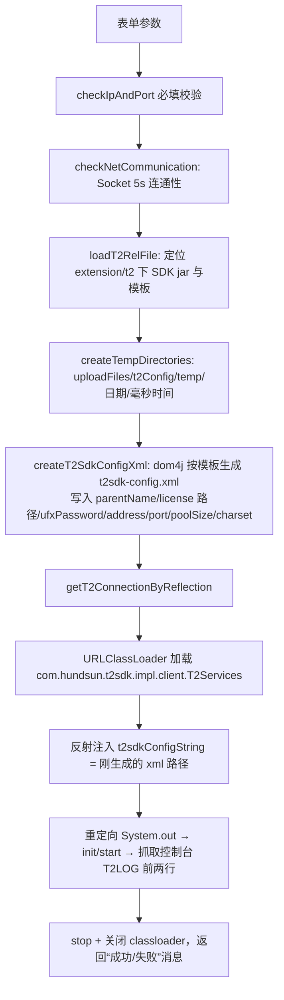

# T2协议支持

## 概述

T2 是恒生电子（Hundsun）证券交易系统的专有协议，基于恒生 T2SDK 长连接通信。平台对它的支持方式是**"HTTP 代理"模式**而不是原生 Sampler：

- 平台服务端在本机为每条 T2 连接**拉起一个独立 Java 进程**（`testinT2-1.0.jar`，一个内嵌 T2SDK 的 Spring Boot HTTP 服务），它监听用户指定的 `httpPort`，把 HTTP 请求翻译成 T2 报文发给恒生柜台，再把结果转回 HTTP 响应；
- 平台里的 T2 接口本质是**普通 HTTP 接口**（POST `/t2/{功能号}`，form-data 报文字段），环境配置指向本机代理端口即可参与用例编排、断言、报告，与 HTTP 接口完全同构；
- T2 连接的增删改查、测试、连接、断开由"协议配置管理"页面完成，状态由后台定时监听维护。

SDK 与代理程序不以 Maven 依赖引入，而是放在 **`extension/t2/` 目录**随部署包分发，运行期通过反射 URLClassLoader 加载。另有独立插件工程 `testin-plugin-t2` 负责开发 `testinT2-1.0.jar` 本身，本文只讲平台使用侧。相关文档：[协议配置管理](../01-产品功能/协议配置管理.md)、[接口管理](../01-产品功能/接口管理.md)、[部署与打包](../02-技术架构/部署与打包.md)。

## extension/t2 目录内容

```
extension/t2/                                （位于服务端 jar 同级目录）
├── com.hundsun.t2sdk-ext-1.1.18.jar   恒生 T2SDK（反射加载，验证连接用）
├── testinT2-1.0.jar                   T2 HTTP 代理服务（独立进程，来自 testin-plugin-t2 工程）
├── application.yml                    代理服务配置模板（默认端口 8899、extraconfig.path、t2config.timeout=40000ms）
├── t2sdk-config-template.xml          T2SDK 连接配置模板（parents/parent/member 结构）
└── returnFields.json                  功能号 → 返回字段名映射（代理服务解析 T2 返回包用）
```

运行期路径推算：`TestT2ProtocolConnectionService.getT2ExtensionPath`（`src/main/java/cn/testin/service/TestT2ProtocolConnectionService.java`）取主类 `cn.testin.Application` 的 jar 位置，拼 `extension/t2/`。动态生成的配置（license、t2sdk-config.xml、application.yml）写到 `uploadFiles/t2Config/` 下。

## 逻辑详解

### 1. 连接管理（CRUD）

数据库表 `TestT2ProtocolConnManagement`（`src/main/java/cn/testin/dao/TestT2ProtocolConnManagement.java`）：`projectId`、`envConnection`（环境连接名）、`httpPort`（本地代理端口）、`t2Ip`/`t2Port`（柜台地址）、`t2CertificateName`/`t2CertificateContent`（license 文件名与 Base64 内容）、`charset`、`poolSize`、`ufxPassword`、`t2Status`（0 断开 / 1 已连接）、`extra`。

接口在 `TestT2ProtocolConnectionManagementController`（`src/main/java/cn/testin/controller/TestT2ProtocolConnectionManagementController.java`，`/t2Connection`）：

| 端点 | 权限 key | 说明 |
|---|---|---|
| `POST /add` / `POST /update` | `api-T2-save` | 新增/修改（multipart，带 license 文件） |
| `GET /list` / `GET /view` | `api-T2-view` | 分页/详情 |
| `GET /delete` | `api-T2-delete` | 按 ids 删 |
| `POST /test` | `api-T2-connect` | 用表单参数即时试连（不入库） |
| `GET /launchConnection` | `api-T2-connect` | 启动代理进程并置"已连接" |
| `GET /disConnect` | `api-T2-connect` | 断开并杀进程 |

`TestT2ProtocolManagementService`（`service/TestT2ProtocolManagementService.java`）的约束：license 文件 < 1MB；同项目内 `envConnection` 唯一、`httpPort` 全局唯一；`t2Port` 不允许等于平台自身 `server.port`；新增时 `extra` 初始化 `{"returnType":"jsonObject"}`（键名来自 `enums/T2ExtraEnum`）；**更新后状态强制置回"断开"**。

前端页面 `testin-api-frontend/src/views/t2Config/index.vue`（路由 `/system/t2Config`，`router/index.ts`）：列表 + 新增/编辑弹层（字符集选项在 `config.ts` 的 `CHARSET_TYPE_LIST`，默认 utf-8），操作列提供"测试连接 / 连接 / 断开"，接口封装在 `src/api/t2Config.ts`。

### 2. 测试连接：反射拉起 T2SDK

`testT2Connection`（`TestT2ProtocolConnectionService.java`）流程：



关键细节：

- SDK **不进 Maven**，用 `new URLClassLoader(jarUrl)` 现加载，`T2Services.init/start/stop` 全部反射调用；
- 连接结果靠**劫持标准输出**再正则 `^T2LOG:\[(.*?)\](.*)$` 提取，返回内容包含"成功"才算通过；
- license 文件落到临时目录后在 xml 里写绝对路径（`setLicenseFileConfig`）。

### 3. 启动连接：拉起代理进程

`launchT2Connection(id)`→ `launchT2`：

1. 生成固定目录 `uploadFiles/t2Config/{id}_{httpPort}_{t2Ip}_{t2Port}`（`setExtraConfigPath`）作为 `extraconfig.path`；
2. 把模板 `application.yml` 的 `server.port` 改为 `httpPort`、`extraconfig.path` 改为该目录，写出新 yml（`setYmlParams`）；同目录生成 `t2sdk-config.xml`（license 从库中 Base64 解码）并拷贝 `returnFields.json`；
3. 先做网络连通检查 + 反射试连 T2（复用第 2 节逻辑），失败则置断开并返回；
4. `stopT2SdkConnection` 先杀 `httpPort` 上的残留进程；
5. `execCommandLine`另起线程用 commons-exec 执行 `java -Xms2g -Xmx4g ... -jar testinT2-1.0.jar --spring.config.location={yml}`，主线程每 500ms 轮询 `OSUtil.getProcessId(httpPort)`（`commons/utils/OSUtil.java`），**20 秒内端口起来**即"连接成功"，库状态置 1。

### 4. 断开与状态监听

- 断开：先 `GET http://127.0.0.1:{httpPort}/t2/stopT2/-1` 让代理优雅断开 T2 长连接（`stopT2SdkConnectionByHttp` ，该端点由 testinT2-1.0.jar 提供），再按端口取 PID 杀掉（`stopT2ServerProcess`），状态置 0。
- 状态监听：`T2PortListenerExecutor.listenT2Status()`（`config/Listener/t2/T2PortListenerExecutor.java`）在 `Application.main`（`Application.java`）中启动，5 线程调度池**每 60 秒**扫全量连接：端口无进程但库里是"已连接"的，改回"断开"。这样进程崩溃/被 kill 后页面状态能自愈。

### 5. 用例怎么调 T2

T2 接口以 HTTP 形态存在，路径 `/t2/{功能号}`、form-data 放报文字段、header 里 `"46"` 键表示环境编号（system_no）。证据是 JMX 导入器 `JmeterImportT2`（`entity/dto/parse/jmeter/JmeterImportT2.java`）：它把 JMeter 里的恒生 `T2Sampler` 插件（`com.hundsun.jmeter.protocol.t2.sampler.T2Sampler`，见 `JmeterParser.java`）转成平台 HTTP 接口—— 拼 path、 写 46 头、 把 `T2Sampler.arguments` 转 form-data。执行时代理服务按 `returnFields.json` 把 T2 返回包解析成 JSON，前端/断言看到的就是普通 HTTP JSON 响应。环境配置把 HTTP 域名指向服务端所在机的 `httpPort` 即可，见 [环境与配置管理](../01-产品功能/环境与配置管理.md)。

### 6. 与 testin-plugin-t2 工程的边界

`testinT2-1.0.jar`（HTTP→T2 代理）的源码在独立插件工程 `testin-plugin-t2` 维护，本仓库**只消费产物**：平台侧负责拼配置（application.yml/t2sdk-config.xml/returnFields.json）、拉起与看护进程；代理内部的 `/t2/{functionNo}` 路由、T2 报文编解码、`/t2/stopT2/-1` 优雅停机端点都在插件工程里。代理行为变更（如返回字段解析规则）需要改插件工程并把新 jar 替换进 `extension/t2/`。

## 关键代码位置

| 功能 | 位置 |
|---|---|
| 连接管理 Controller | `src/main/java/cn/testin/controller/TestT2ProtocolConnectionManagementController.java` |
| CRUD 服务 | `src/main/java/cn/testin/service/TestT2ProtocolManagementService.java` |
| 测试/启动/断开服务 | `src/main/java/cn/testin/service/TestT2ProtocolConnectionService.java` |
| 反射连 T2SDK | `src/main/java/cn/testin/service/TestT2ProtocolConnectionService.java` |
| 启动代理进程命令行 | `src/main/java/cn/testin/service/TestT2ProtocolConnectionService.java` |
| 端口状态定时监听 | `src/main/java/cn/testin/config/Listener/t2/T2PortListenerExecutor.java` |
| SDK/代理目录 | `extension/t2/`（部署在服务端 jar 同级） |
| T2Sampler → HTTP 导入转换 | `src/main/java/cn/testin/entity/dto/parse/jmeter/JmeterImportT2.java` |
| 前端页面 | `testin-api-frontend/src/views/t2Config/index.vue`（路由 `/system/t2Config`） |
| 前端 API | `testin-api-frontend/src/api/t2Config.ts` |

## 注意事项与坑

1. **代理进程跑在平台服务端所在机器上**，不是执行机。执行机访问 T2 时网络必须能到"服务端 IP:httpPort"，别把环境地址写成服务端容器内才通的 `127.0.0.1`。
2. `extension/t2/` 必须与主 jar 保持"同级目录"关系部署；用 IDE 本地启动时 `getMainProcessJarPath` 拿到的是 `target/classes`，需要按代码注释（`TestT2ProtocolConnectionService.java`）手工指定 SDK jar 与配置路径。
3. Linux 启动代理的 JVM 参数里**日志路径硬编码**为 `/home/syy/data/logs/t2Server/...`，部署目录不同会导致 GC 日志写不进去（不影响功能但排障时少一份证据）。
4. `httpPort` 是全局唯一校验（跨项目），规划端口时避开平台端口与其他 T2 连接；杀进程完全按"端口找 PID"实现，同机混部其他服务时勿复用端口。
5. 连接状态是**被动探测**（60 秒一轮），代理宕机后最长 60 秒页面才显示断开；`listenT2Status` 注释写"20 秒"但代码是 `60L`，以代码为准。
6. 更新连接配置后状态被强制置"断开"，需要重新点"连接"才会生效；编辑时 license 为必传文件，不支持只改描述不传文件。
7. 测试连接的结果是抓控制台 `T2LOG` 前两行文本判"成功"字样，T2SDK 升级或日志格式变化会直接破坏该判断。
8. form-data 的值带 `${}` 变量引用时不要额外加双引号，否则 T2 报文出错——`TestinHTTPSamplerProxy.java` 的注释专门记录了西部证券这个坑。
9. 权限分四个 key（`api-T2-view/save/delete/connect`），新环境接入时前端 `v-auth` 与后端 `@ApiConfigKey` 要同时配，见 [权限体系](../03-实现逻辑/权限体系.md)。
