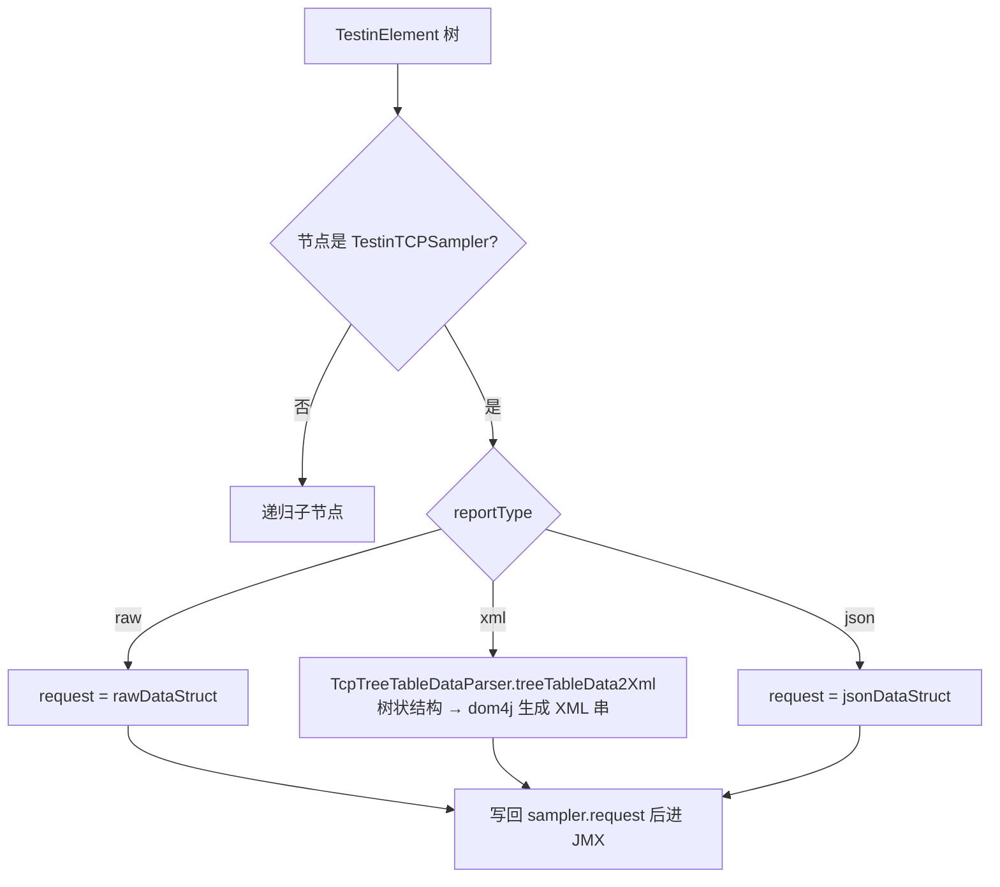
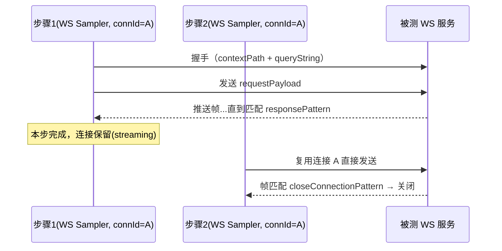

# TCP与WebSocket支持

## 概述

平台支持 TCP 与 WebSocket 两种长连接类协议的接口测试，二者都复用 JMeter 生态组件：

- **TCP**：转成 JMeter 原生 `TCPSampler`（`org.apache.jmeter.protocol.tcp.sampler.TCPSampler`），报文支持 raw 文本 / XML 树状结构 / JSON 三种录入方式，执行前由服务端统一拍平成字符串；
- **WebSocket**：转成内嵌的第三方插件 `JMeter.plugins.functional.samplers.websocket.WebSocketSampler`（源码在 `src/main/java/JMeter/plugins/functional/` 下，二方库改造），通过 connectionId / streamingConnection / responsePattern 等机制在一次执行内管理长连接。

相关文档：[JMX生成与解析](../03-实现逻辑/JMX生成与解析.md)、[执行端Runner详解](../03-实现逻辑/执行端Runner详解.md)、[Mock服务](Mock服务.md)（TCP 接口可做 Mock）。

## 一、TCP

### 1. 前端参数编辑

`testin-api-frontend/src/components/RequestParameters/TcpRequestParameters.vue` 提供：连接复用 `reUseConnection`（默认 true）、`closeConnection`、`nodelay`（TCP_NODELAY）、`classname`（TCP 客户端实现，下拉三项）、`SO_LINGER`、`EOL`（结束符字节值）、`sendText`（报文原文）、username/password。

`classname` 对应 JMeter 三种报文读写策略——**平台没有自定义"定长/分隔符"协议层，报文分帧完全由所选 client 决定**：

| classname | 含义 |
|---|---|
| `TCPClientImp` | 纯文本，按 EOL 字节判定报文结束（默认换行） |
| `BinaryTCPClientImpl` | 十六进制字符串转二进制收发，按 EOM 结束 |
| `LengthPrefixedBinaryTCPClientImpl` | 长度前缀二进制报文（金融报文常用） |

### 2. 报文三种录入方式与执行前拍平

平台元素 `TestinTCPSampler`（`src/main/java/cn/testin/entity/vo/request/element/TestinTCPSampler.java`，type=`TCPSampler`）除连接参数外还有 `reportType`（`raw`/`xml`/`json`）与三份报文载体：`rawDataStruct`、`xmlDataStruct`（`List<TcpTreeTableDataStruct>` 树状结构）、`jsonDataStruct`。

执行前服务端会递归扫描整棵元素树，把 TCP 步骤的最终报文算出来——`TcpApiParamService.checkTestElement`（`src/main/java/cn/testin/service/TcpApiParamService.java`），被 `TestExecuteService`（`service/execution/TestExecuteService.java`）与 `ScriptService` 在调试/执行入口调用：

- XML 树状结构节点 `TcpTreeTableDataStruct`（`entity/request/TcpTreeTableDataStruct.java`）：name/value/type/systemName/contentType/condition/required/children；
- `treeTableData2Xml`（`entity/request/parse/TcpTreeTableDataParser.java`）多根节点时自动包一层 `<ROOT>`，输出 UTF-8 带缩进的 XML；
- 解析失败抛"数据定义错误~"（`TcpApiParamService.java`）。

### 3. 执行前的环境地址解析

用例/任务执行前，步骤上的 serverId 要在当前环境里解析成真实地址，入口 `ElementUtil`（`src/main/java/cn/testin/entity/vo/request/ElementUtil.java`）——按步骤类型分发（TCP、 WebSocket）：

- TCP：`dealTCPSamplerProxy`在 `tcpServerConfigList`（`TCPServerConfig`：domain 形如 `host:port` + 连接/响应超时）中按 serverId 查找，拆出 server/port 并回填超时；两个隐藏加工点——①报文里的 `${var}` 变量会被改写成 `${用例标记_var}` 实现用例间变量隔离；②前端的短名 `TCPClientImp` 在这里被替换成 JMeter 全限定类名 `org.apache.jmeter.protocol.tcp.sampler.TCPClientImpl`；
- WebSocket：`dealWebSocketSamplerProxy`在 `webSocketServerConfigList` 中找配置，`domain` 按 URI 解析，scheme 即 `ws/wss` 协议，端口缺省补 80；前端填的"发送请求参数"被转成 JMeter `HTTPArgument` 列表挂到握手 URL 上。

找不到所选服务分别抛"找不到所选服务"/"找不到环境配置"。

### 4. JMX 转换

`TestinTCPSampler.toHashTree`生成 JMeter `TCPSampler`：server/port、连接与读超时（`ctimeout`/`timeout`）、`setRequestData`（null 归一为空串）、`setEolByte`、复用/关闭/NODELAY、classname、SO_LINGER、用户名密码，并写平台公共属性（`executeOnFailure`、`isFirstStep`、`globalVariableJson`、`runMode`）。执行结果、断言、报告与 HTTP 步骤一致。

## 二、WebSocket

### 1. 前端参数

`testin-api-frontend/src/components/RequestParameters/WebSocketRequestParameters.vue`：`contentEncoding`（默认 UTF-8）、`connectionId`、`ignoreSSLCertificateErrors`、`streamingConnection`（默认 true）、`requestData`（发送帧内容）、`responsePattern`、`closeConnectionPattern`、`messageBacklog`、`sendParameters`（握手 URL 的 query 参数弹层编辑）。

### 2. 长连接在一次执行中的处理

平台元素 `TestinWebSocketSampler`（`src/main/java/cn/testin/entity/vo/request/element/TestinWebSocketSampler.java`，type=`WebSocketSampler`）转成插件 Sampler 时写入的关键属性：

- 地址：`serverAddress/serverPort` 取步骤的 domain/port，`protocol` 为 `ws`/`wss`，`contextPath` + query 参数拼握手 URL；`implementation` 固定 `"RFC6455 (v13)"`；
- **连接标识 `connectionId`**：同一次执行（同一 JMeter 线程）内，相同 connectionId 的步骤复用同一条连接——第一个步骤建立连接，后续步骤直接用；留空则每次新建；
- **`streamingConnection=true`**：保持流式连接，服务端后续主动推送的帧也会收进 backlog；
- **响应等待 `responsePattern`**：正则，收到匹配的帧才算本步响应完成（配合 `responseTimeout` 超时）；
- **连接关闭 `closeConnectionPattern`**：收到匹配该正则的帧后主动关闭连接；否则连接随线程组结束释放；
- `messageBacklog`：保留的帧数量上限，防止推送洪峰撑爆内存。

## 关键代码位置

| 功能 | 位置 |
|---|---|
| TCP 执行前报文拍平 | `src/main/java/cn/testin/service/TcpApiParamService.java` |
| 拍平调用点（调试/执行） | `src/main/java/cn/testin/service/execution/TestExecuteService.java` |
| TCP 环境地址解析 | `src/main/java/cn/testin/entity/vo/request/ElementUtil.java` |
| WebSocket 环境地址解析 | `src/main/java/cn/testin/entity/vo/request/ElementUtil.java` |
| TCP JMX 元素 | `src/main/java/cn/testin/entity/vo/request/element/TestinTCPSampler.java` |
| TCP XML 树状报文生成 | `src/main/java/cn/testin/entity/request/parse/TcpTreeTableDataParser.java` |
| TCP 树节点结构 | `src/main/java/cn/testin/entity/request/TcpTreeTableDataStruct.java` |
| WebSocket JMX 元素 | `src/main/java/cn/testin/entity/vo/request/element/TestinWebSocketSampler.java` |
| WebSocket 插件源码（内嵌） | `src/main/java/JMeter/plugins/functional/samplers/websocket/` |
| 前端 TCP 编辑 | `testin-api-frontend/src/components/RequestParameters/TcpRequestParameters.vue` |
| 前端 WebSocket 编辑 | `testin-api-frontend/src/components/RequestParameters/WebSocketRequestParameters.vue` |

## 注意事项与坑

1. **TCP 分帧方式由 classname 决定**：文本协议选 `TCPClientImp` 且必须填对 EOL 字节值（十进制，如 `13` 表示 \r），填错表现为"读超时无响应"；二进制/长度前缀协议务必选对实现类，平台本身不做定长或特殊分隔符解析。
2. `reportType` 为空时执行前不会重写 `request`，此时直接用 sampler 上已有的 `request` 值；三种载体里**只有与 reportType 对应的那份会生效**，其余两份不参与执行。
3. XML 树状报文多个顶层节点会被自动包 `<ROOT>`，对端若严格要求单根报文，建模时只留一个顶层节点。
4. TCP 步骤的用户名/密码只是透传给 JMeter TCPSampler（写进报文前缀与否取决于 client 实现），不是通用认证机制，多数场景留空。
5. WebSocket 复用连接依赖 connectionId **在同一个 JMeter 线程内**；跨线程组/跨用例不共享。连接未关时整个线程组结束才释放，批量执行大量 WS 步骤注意执行机连接数。
6. `responsePattern` 是正则，元字符要转义；留空时行为是"收到第一帧即返回"，推送型接口容易拿到非预期帧，建议必填。
7. `TestinWebSocketSampler` 里 `implementation` 被写死为 RFC6455，前端传的值不生效——不要在前端依赖该字段切换实现。
8. TCP/WebSocket 的变量引用、前后置、断言与 HTTP 步骤一致（报文串支持 `${}` 变量），见 [变量体系与参数提取](变量体系与参数提取.md)、[前置后置处理器与断言](前置后置处理器与断言.md)。
9. `TestinWebSocketSampler.toHashTree` 里 `contextPath` 在执行前被 `dealWebSocketSamplerProxy` 置空（`ElementUtil.java`），路径要连同 query 参数一起靠环境域名 + sendParameters 表达，不要指望步骤上的 contextPath 字段。
