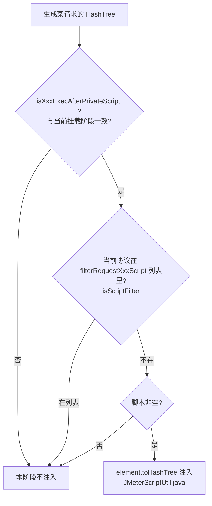

---
tags:
  - 复杂功能细节
---

# 全局脚本与自定义函数

## 概述

本文讲清四个容易混淆的概念，它们名字相近但机制完全不同：

1. **环境级全局脚本**：环境配置里的 `preProcessor` / `postProcessor`，语义是"该环境下每个请求都执行一遍"的 JSR223 脚本，带**协议过滤**与**执行顺序**两个开关（filter 机制）；
2. **环境级全局动作（GlobalAction）**：环境配置里的全局前置/后置/断言列表，语义与步骤级前后置完全一致，生成 JMX 时合并进每个步骤——**这是当前真正生效的全局机制**；
3. **用户自定义函数**：平台不写自己的函数语法，直接复用 JMeter 函数 `${__xxx(...)}`，另通过一个 system-scope jar 提供 `${__MockFunction(...)}`（Mock.js 语法）；前端有专门的函数文档页；
4. **TestUserFunctionService**：名字叫"用户函数"，实际是**用户权限同步**服务（从主平台拉角色权限），与脚本函数毫无关系——读代码时最大的坑。

相关文档：[前置后置处理器与断言](前置后置处理器与断言.md)（步骤级前后置如何生成）、[变量体系与参数提取](变量体系与参数提取.md)（函数赋值的前缀处理）、[权限体系](../03-实现逻辑/权限体系.md)（TestUserFunction 的真实用途）、[环境与配置管理](../01-产品功能/环境与配置管理.md)。

## 逻辑详解

### 1. 环境级全局脚本与 filter 机制

配置模型在 `entity/dto/environment/EnvironmentConfig.java`：

| 字段 | 类型 | 语义 |
|---|---|---|
| `preProcessor` / `postProcessor` | `TestinJSR223PreProcessor` / `TestinJSR223PostProcessor` | 每个请求都执行的全局前置/后置脚本 |
| `preStepProcessor` / `postStepProcessor` | `TestinJSR223Processor` | 只在全部步骤之前/之后执行一次 |
| `globalScriptConfig` | `GlobalScriptConfig` | 过滤与顺序开关 |

`GlobalScriptConfig`（`entity/dto/environment/GlobalScriptConfig.java`）四个开关：

- `filterRequestPreScript` / `filterRequestPostScript`：要**排除**的请求协议列表，枚举值来自 `commons/constants/GlobalScriptFilterRequest.java`——`HTTP, TCP, JDBC, DUBBO`；
- `isPreScriptExecAfterPrivateScript` / `isPostScriptExecAfterPrivateScript`：全局脚本排在请求**自有脚本之后**还是之前；
- `connScenarioPreScript` / `connScenarioPostScript`：是否统计到场景。

注入逻辑在 `commons/utils/JMeterScriptUtil.java`：

核心判定 `setScript`（`JMeterScriptUtil.java`）：顺序开关与"当前是否私有脚本之后"匹配、且协议未被过滤、且脚本非空，三个条件同时满足才注入。

> **现状提示**：当前代码库里 `setScriptByEnvironmentConfig`/ `setScriptByHttpConfig`**没有存活调用方**，前端环境配置页（`src/views/envList/components/`）也没有全局脚本编辑入口——该能力是从 MeterSphere 继承的遗留模型，配置只能直接写环境 config JSON。新需求请优先用下面的 GlobalAction。

### 2. 全局动作（GlobalAction）——当前生效的全局机制

环境配置里的 `globalAction`（`EnvironmentConfig.java`，实体 `entity/dto/environment/GlobalAction.java`）包含三个列表：`globalBeforeAction` / `globalAfterAction` / `globalAssertion`，元素结构与步骤级前后置/断言完全相同（`BeforeAfterCommon` / `AssertionOperation`）。

生效链路：

1. 执行装配时 `TestExecuteService.setGlobalAction`（`service/execution/TestExecuteService.java`）把环境里这三组动作逐条打上 `isGlobal=true` 标记，塞进 `ParameterConfig`；
2. 每个步骤生成前后置/断言时，`ElementUtil.generateBeforeOrAfterOrAssertion`（`entity/vo/request/ElementUtil.java`）把全局列表**合并**进步骤自己的列表；
3. 转换时按 `isGlobal` 拆开、分两轮执行转换——**步骤级在前、全局级在后**。也就是说同一请求上：步骤前置 → 全局前置 → 发请求 → 步骤后置 → 全局后置 → 步骤断言 → 全局断言。

由于复用步骤级的转换代码，全局动作支持的类型与 [前置后置处理器与断言](前置后置处理器与断言.md) 完全一致（var/varProcess/sql/script/javascript/BeanShell/断言各类型）。

### 3. 脚本安全过滤（ScriptFilter）——黑名单机制

`commons/filter/ScriptFilter.java` 设计为脚本语言的敏感函数黑名单校验：`verify(language, label, script)`按语言读 `/blacklist/beanshell.bk`、`groovy.bk`、`python.bk` 资源文件，脚本包含黑名单条目即抛"脚本内包含敏感函数"。

**注意两个现状**：

- 仓库里 `src/main/resources/` 下**不存在 blacklist .bk 文件**，`blackList()` 读资源抛异常被 catch 掉，verify 实际不拦截任何内容；
- 唯一调用点在 `element/TestinLoopController.java`，而该行**位于被注释掉的代码块内**。

结论：安全过滤当前是空转的保留设施，不要依赖它挡恶意脚本；如要启用需补齐 `.bk` 资源并恢复调用点。

### 4. 用户自定义函数：JMeter 函数 + MockFunction

平台不提供自研函数语法，用户可写的是两类：

**a) JMeter 内置函数** `${__xxx(...)}`。前端有完整中文文档页 `testin-api-frontend/docs/Function.md`（vitepress 构建产物 `/docs/Function.html`，前置/后置编辑框旁的问号按钮直接打开，`RequestAction.vue`），覆盖 `__regexFunction`、`__counter`、`__intSum`、`__Random`、`__RandomString`、`__RandomDate`、`__UUID`、`__BeanShell`、`__groovy`、`__javaScript`、`__time`、`__timeShift`、`__digest`、`__split`、`__eval`、`__evalVar`、`__changeCase` 等。

**b) 平台扩展函数** `${__MockFunction(...)}`。后端以 system scope 引入 `lib/ApacheJMeter-associate-api-functions.jar`（`pom.xml`），内含 `io.metersphere.jmeter.functions.MockFunction` 及 `mock.js` / `func.js`（Mock.js 语法引擎），可生成 mock 数据（如 `${__MockFunction({string|'@email'})}` 风格）。

后端对函数赋值的特殊处理（`ElementUtil.java`）：

- `isJmeterFunction`：值以 `${__` 开头即判定为函数；
- `handleJmeterFunction`：`${__BeanShell(...)}` 单独包一层；其他函数的目标变量名加 `JMeterFunction_` 前缀（常量 `TextConstants.JMETER_FUNCTION`，`commons/constants/TextConstants.java`），执行端按此前缀做函数结果与普通变量的差异化日志；
- 变量注入处的值也会统一过一遍函数解析：`ParameterConfig.valueSupposeMock`（`entity/dto/environment/ParameterConfig.java`）对 Arguments 每个值调 `ScriptEngineUtils.buildFunctionCallString`；`ElementUtil.getEvlValue`对 `@` 开头的值调 `ScriptEngineUtils.calculate`。

### 5. "用户函数"服务其实是权限同步（重要防混淆）

`controller/TestUserFunctionController.java`（`POST /userFunction/synchronization`）和 `service/TestUserFunctionService.java` 的命名极易误导。它们的真实职责：

1. 用 `sid` + `userId` 调主平台 usermanager 接口拿 roleId（`TestUserFunctionService.java`）；
2. 再调 realcfg 接口拿该角色的功能权限列表（`configKey`）；
3. 同步落本地 `test_user_function` 表（`synchronousPermission`），后续由 `KeyInterceptor`（`interceptor/KeyInterceptor.java`）从本地表读权限做接口鉴权。

即"Function"指的是**功能权限项**，不是可调用函数。两个硬编码的管理员 sid 直接给全权限（`TestUserFunctionService.java`）。

## 关键代码位置

| 位置 | 说明 |
|---|---|
| `testin-api-backend/src/main/java/cn/testin/entity/dto/environment/EnvironmentConfig.java` | 全局脚本/全局动作在环境配置里的字段 |
| `entity/dto/environment/GlobalScriptConfig.java` | 全局脚本过滤与顺序开关 |
| `commons/constants/GlobalScriptFilterRequest.java` | 可过滤协议枚举：HTTP/TCP/JDBC/DUBBO |
| `commons/utils/JMeterScriptUtil.java` | 全局脚本注入判定（filter + 顺序 + 非空） |
| `entity/dto/environment/GlobalAction.java` | 全局前置/后置/断言模型 |
| `service/execution/TestExecuteService.java` | GlobalAction 打 isGlobal 标记并入 ParameterConfig |
| `entity/vo/request/ElementUtil.java` | 全局动作与步骤动作合并、分组转换 |
| `commons/filter/ScriptFilter.java` | 脚本黑名单校验（当前空转） |
| `ElementUtil.java` | JMeter 函数识别与函数赋值脚本生成 |
| `pom.xml` + `lib/ApacheJMeter-associate-api-functions.jar` | `__MockFunction` 扩展函数（system scope） |
| `testin-api-frontend/docs/Function.md` | 函数文档页源码（构建成 /docs/Function.html） |
| `testin-api-frontend/src/components/RequestParameters/RequestAction.vue` | 函数文档入口按钮 |
| `service/TestUserFunctionService.java` / `controller/TestUserFunctionController.java` | **权限同步**（非函数），KeyInterceptor 的数据源 |

## 注意事项与坑

- **最大的命名陷阱**：搜"用户函数/custom function"会命中 `TestUserFunctionService`，但那是权限同步；真正的函数能力是 JMeter 函数 + MockFunction jar。
- **全局脚本（preProcessor/globalScriptConfig）当前无前端入口、无存活调用方**：改这块前先确认产品是否还要；要实现"每个请求都跑一段脚本"请走 GlobalAction（有完整合并链路）。
- **GlobalAction 的执行顺序固定为"步骤级先于全局级"**，没有提供反向开关；全局断言失败同样计入步骤结果。
- **ScriptFilter 不拦任何脚本**：`.bk` 黑名单资源缺失且唯一调用点被注释；安全诉求需在评审/执行机隔离层面解决，不能指望这个类。
- **函数赋值的变量带 `JMeterFunction_` 前缀**：直接在 JMX 或调试日志里找变量时要知道这个前缀的存在（`ElementUtil.java`）。
- **`__MockFunction` 依赖 system-scope jar 的类加载顺序**：pom 注释说明靠 `lib/` 目录按文件名排序让第三方 jar 优先于 JMeter 自带包加载（见 `testin-api-backend/CLAUDE.md`），新增同类扩展 jar 时命名要注意排序。
