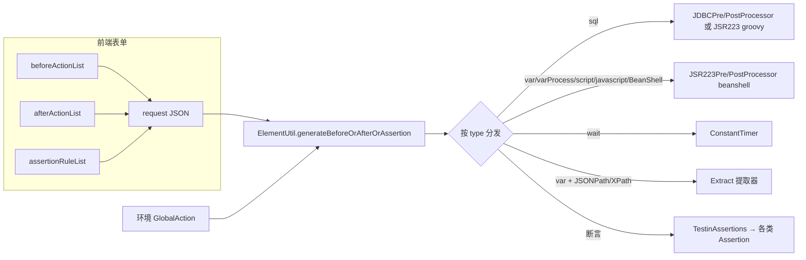

# 前置后置处理器与断言

## 概述

每个请求步骤（HTTP、Dubbo、TCP、WebSocket、gRPC、GraphQL、MQTT、FIX 等全部协议共用）都可以挂三类"动作"：**前置操作**（请求发出前执行）、**后置操作**（响应回来后执行）、**断言规则**（对响应做校验）。前端只做表单编辑，把 `beforeActionList` / `afterActionList` / `assertionRuleList` 三个列表原样存进脚本的 `request` JSON；真正的"翻译"发生在后端生成 JMX 时——`ElementUtil` 把每条动作转成 JMeter 元件（JSR223 Pre/PostProcessor、JDBC Pre/PostProcessor、ConstantTimer、各类 Assertion、提取器 Extract）。

阅读本文前建议先了解 [JMX生成与解析](../03-实现逻辑/JMX生成与解析.md) 的整体流程；变量的存储与作用域细节见 [变量体系与参数提取](变量体系与参数提取.md)；环境级"全局前置/后置/断言"见 [全局脚本与自定义函数](全局脚本与自定义函数.md)。

## 逻辑详解

### 1. 前端：动作类型与表单

前置/后置编辑组件是 `src/components/RequestParameters/RequestAction.vue`，断言是 `src/components/RequestParameters/RequestAssertionRule.vue`，两者由 `RequestParameters.vue` 的 tab 配置挂载（`前置操作`/`后置操作`/`断言规则` 三个 tab 对所有协议开放，`RequestParameters.vue` 的 `publicProtocolType`）。

支持的动作类型（`src/utils/ConstantConfig.ts`）：

| type | 界面名称 | 前置 | 后置 | 关键字段 |
|---|---|---|---|---|
| `var` | 变量赋值 | 是 | 是 | `expression`（值/表达式）、`variable`（目标变量）、`varType` |
| `varProcess` | 变量处理 | 是 | 是 | `processType`（`calc` 计算 / `regexReplaceAll` 正则替换） |
| `sql` | SQL语句执行 | 是 | 是 | `databaseId`、`query`、`variableNames`（逗号分隔） |
| `script` | python脚本 | 是 | 是 | `expression`（脚本）、`variable`（返回变量，逗号分隔） |
| `javascript` | javascript脚本 | 是 | 是 | `expression` |
| `BeanShell` | BeanShell脚本 | 是 | 是 | `expression` |
| `wait` | 等待 | 是 | **否** | `waitTime`（毫秒） |

几个前端细节：

- `varType` 不需要手选：`RequestAction.vue` 的 `varTypeChange` 按 `expression` 前缀自动推断——`${` 开头为 `var`（引用变量）、`$.` 开头为 `JSONPath`、`/` 开头为 `XPath`，其余为 `str`（字符串常量）。
- `varProcess` 的处理详情弹窗在 `RequestAction/varProcess.vue`：`calc` 支持四舍五入与保留小数位（`round`/`numCount`），`regexReplaceAll` 支持正则与替换值（`regexExpression`/`value`）。
- 后置页底部有一张"响应断言规则"勾选表（`RequestAction.vue`）：调试一次后可以把响应里识别出的 JSONPath/XPath 表达式一键添加为后置变量赋值（`addToRule`，`RequestAction.vue`）。
- 三个列表随脚本保存进 `requestParameters`（类型定义见 `src/vite-env.d.ts`），后端实体是 `entity/request/Requestparameters.java`。

断言规则的类型与操作符（`src/utils/ConstantConfig.ts`）：

- 类型：`inner`（内置变量）/ `Duration`（响应时间）/ `Variable`（自定义参数）/ `JSONPath` / `XPath`。
- 内置变量表达式：`$response.code`、`$response.data`、`$response.header`、`$response.time`（`ConstantConfig.ts`）。
- 操作符 `option`：`eq` `gt` `lt` `gteq` `lteq` `contains` `notcontains` `startwith` `endwith`（内置变量），JSONPath/Variable 另有 `regex` `numeq` `isnull` `notnull` `isExist` `notExist`。
- `changeExpression`（`RequestAssertionRule.vue`）做了联动：表达式选 `$response.time` 时类型自动变 `Duration`、操作符 `lt`。

### 2. 后端：总分发入口

生成 JMX 时，每个步骤的动作列表走 `ElementUtil.generateBeforeOrAfterOrAssertion`（`src/main/java/cn/testin/entity/vo/request/ElementUtil.java`）：

1. 把环境配置里的**全局动作**（`config.getGlobalAction()`，见 [全局脚本与自定义函数](全局脚本与自定义函数.md)）合并进步骤自己的三个列表；
2. 按 `isGlobal` 标记拆成"步骤级"和"全局级"两组，**步骤级先转、全局级后转**（各调两次 `setBeforeActionList` / `setAfterActionList` / `setAssertionList`）；
3. 前置有一个特殊过滤：若步骤配了**数据集输入数据**（`caseStep.getInputData()`），前置变量赋值中与数据集同名的变量会被剔除——**数据集优先级高于前置赋值**（`setBeforeActionList`）。

动作在 JMX 中的挂载位置由 `ElementUtil.order()`决定：前置组 → 采样器 → 后置组 → 断言组（`preOperates`/`postOperates` 类型清单）。

### 3. 前置操作 → JMeter 元件

分发代码 `getBeforeActionList`（`ElementUtil.java`）：

- **sql**（`generateBeforeSqlElement`）：按 `databaseId` 在当前环境的数据源列表里找 `DatabaseConfig`（`setDataSourceInfo`，找不到直接抛错终止执行）。关系型数据库生成 `TestinJDBCPreProcessor`（落成 JMeter `JDBCPreProcessor` + 一个独立的 `DataSourceElement` 数据源配置 + `Arguments`，见 `entity/vo/request/element/TestinJDBCPreProcessor.java`）；**MongoDB / Redis 数据源改走 `TestinJSR223PreProcessor`（groovy 脚本 + 内嵌数据源连接信息）**。`variableNames` 里的列名会逐个落成线程变量。
- **var（str/var）**（`handlePreVarAssignmentStrOrVar`）：生成 beanshell 语言的 `TestinJSR223PreProcessor`，脚本内容是 `vars.put(...)`。三种情况：
  - 值是 `${__xxx}` 形式的 **JMeter 函数**（`isJmeterFunction`）→ `handleJmeterFunction`，非 `__BeanShell` 的函数目标变量名加 `JMeterFunction_` 前缀；
  - 值是 `${xxx}` 变量引用（`varType=var`）→ 生成"先取局部变量、取不到再取全局变量"的 fallback 脚本（`handleStrOrVarBeanShellScript`）；
  - 常量（`varType=str`）→ 直接 `vars.put`；另外支持 `$response.header.xxx` / `$response.data` 取上一步响应。
- **varProcess**（`testinVarProcess`）：`calc` → `CalcWithJsr223`（生成算术求值脚本），`regexReplaceAll` → `strRegexReplaceAll`（生成 `replaceAll` 脚本）。
- **wait** → `generateWaitController`→ `TestinConstantTimer`（落成 JMeter `ConstantTimer`，见 `element/TestinConstantTimer.java`）。
- **script（python）**（`generateBeforeScriptElement` + `assemblePythonScript`）：**python 并不是直接在 JMeter 里跑**——后端把用户脚本拼进一段 BeanShell：先把 `${var}` 引用全部改写成 `vars.get("局部变量名")` 并做转义，剥离 `import` 行并补上默认 import（os/sys/subprocess/random/hashlib 等），运行时再起 python 进程执行，把 `return` 的元组按 `variable` 里的变量名逐个 `vars.put`。
- **javascript** → `generateBeforeJavaScriptElement`：`TestinJSR223PreProcessor`，`scriptLanguage=javascript`（在 `TestinJSR223PreProcessor.getJSR223PreProcessor` 里被归一成 rhino）。
- **BeanShell** → `generateBeforeBeanShellElement`，脚本里的 `${var}` 同样被替换为带用例前缀的 `vars.get(...)`（`handleBeanShellScript`）。

所有"代码型"元件都带 `innerScriptCode=true` 标记，表示这是平台生成的内部脚本、执行日志不暴露给前端；用户自己写的脚本块该标记为 false，日志可见（`TestinJSR223PreProcessor.java`）。

### 4. 后置操作 → JMeter 元件

分发代码 `getAfterActionList`（`ElementUtil.java`），与前置几乎对称，差异点：

- **`wait` 后置明确不做**（注释"目前先不做"）；
- **var 且 varType 为 `JSONPath`/`XPath`** 时不走脚本，而是生成 `TestinExtract` **提取器**（`generateAfterVarAssignment`）——这是"从响应提取变量"的主路径，细节见 [变量体系与参数提取](变量体系与参数提取.md)；
- sql 后置对称生成 `TestinJDBCPostProcessor`（`generateAfterSqlElement`），Mongo/Redis 同样降级为 groovy 脚本。

`TestinExtract`（`entity/vo/request/element/TestinExtract.java`）按子列表落成三种 JMeter 提取器：正则 `RegexExtractor`（模板固定 `$1$`）、XPath `XPathExtractor`/`XPath2Extractor`（按 `xpathType` 是 html 还是 xml 二选一）、JSON `JSONPostProcessor`。勾选"匹配多个"时 `matchNumber=-1`，产出 `var_1`、`var_2`… 系列变量，正好供 ForEach 控制器消费。

### 5. 断言 → JMeter 元件

`getAssertionlist`（`ElementUtil.java`）把断言规则按 `type` 分发，聚合成一个 `TestinAssertions` 元素追加到步骤末尾：

| 前端 type | 后端处理 | JMeter 元件 |
|---|---|---|
| `inner`（内置变量） | `setInnerRegexAssertion` | `ResponseAssertion`，按 `$response.code/header/data` 选择断言字段（`TestinAssertions.java`） |
| `JSONPath` | `setJSONPathAssertion` | `JSONPathAssertion`（`option=regex` 时按正则匹配，`TestinAssertions.java`） |
| `XPath` | `setXpathAssertion` | `XPath2Assertion` |
| `Duration` | `setDurationAssertion` | `DurationAssertion` |
| `Variable` | `setVariableAssertion` | 平台扩展的 `VariableAssertion` |
| `Regex` | `setCustomerRegexAssertion` | 平台扩展的 `TestinCustomerRegexAssertion` |
| `BeanShell` | `setBeanShellAssertion` | `BeanShellAssertion` |
| 文档结构校验 | `TestinAssertionDocument` | JSON/XML 结构校验（`TestinAssertions.addAssertions`） |

`TestinAssertions.toHashTree`（`element/TestinAssertions.java`）把每组规则逐个落成 JMeter 断言节点。几个要点：

- **断言名字里编码了报告展示信息**：`名称 + "split==" + 描述`（`delimiter`），`assertionDesc` 属性用同一分隔符拼"操作符描述+表达式+期望值"（`setJSONPathAssertion`），执行端解析结果时按此还原（见 [批次结果聚合](../03-实现逻辑/批次结果聚合.md)）。
- `option` 的中文描述由 `optionDesc`（`ElementUtil.java`）经 `AssertionEnums`（`src/main/java/cn/testin/enums/AssertionEnums.java`）映射；**传了未知 option 会直接抛异常终止用例**。
- 名称以 `ErrorReportAssertion:` 开头的是**误报断言**（反例用例专用），落成 `ErrorReportAssertion` 而非普通 `ResponseAssertion`（`TestinAssertions.java`）。
- 断言表达式为空的规则会在 `setAssertionList`前置校验时直接抛"断言规则列表中存在表达式缺失的元素"。

## 关键代码位置

| 位置 | 说明 |
|---|---|
| `testin-api-frontend/src/components/RequestParameters/RequestAction.vue` | 前置/后置操作编辑表格（类型下拉、变量类型推断、调试响应一键加提取） |
| `testin-api-frontend/src/components/RequestParameters/RequestAction/varProcess.vue` | 变量处理详情弹窗（calc/regexReplaceAll） |
| `testin-api-frontend/src/components/RequestParameters/RequestAssertionRule.vue` | 断言规则编辑 |
| `testin-api-frontend/src/utils/ConstantConfig.ts` | 前置/后置动作类型下拉（`action.optionsBefore/optionsAfter`） |
| `testin-api-frontend/src/utils/ConstantConfig.ts` | 断言类型/操作符/内置变量（`assertion`） |
| `testin-api-backend/src/main/java/cn/testin/entity/vo/request/ElementUtil.java` | 前置/后置/断言总分发，合并全局动作 |
| `ElementUtil.java` /  | 前置 / 后置按 type 生成元素 |
| `ElementUtil.java` | 断言按 type 聚合成 `TestinAssertions` |
| `element/TestinJSR223PreProcessor.java` | JSR223 前置元件（脚本语言归一、数据源属性透传） |
| `element/TestinJDBCPreProcessor.java` / `TestinJDBCPostProcessor.java` | JDBC 前后置（含数据源配置节点） |
| `element/TestinExtract.java` | 正则/XPath/JSONPath 提取器 |
| `element/TestinAssertions.java` | 断言总装（8 种断言 + 文档结构校验 + 误报断言） |
| `element/TestinConstantTimer.java` | 等待（ConstantTimer） |
| `org/apache/jmeter/threads/JMeterThread.java` | 执行端补丁：后置处理器执行日志与变量写回 |

## 注意事项与坑

- **后置没有"等待"**：前端下拉里没有，后端 switch 里也明确跳过；在步骤之间加等待只能用前置 `wait`（落成 ConstantTimer，作用于随后的采样器）。
- **python 脚本里禁用 `${}` 模板字符串**：`${}` 是平台的变量引用语法，会被 BeanShell 包装层提前替换（前端 `RequestAction.vue` 的 pythonPrompt 有明确提示）。
- **javascript 实际跑在 rhino 引擎**：`javascript`/`rhinoScript`/`nashornScript` 三种写法最终都被归一（`TestinJSR223PreProcessor.java`），不要依赖 nashorn 特有语法。
- **SQL 动作的 `databaseId` 是环境数据源 id，不是写死的连接**：换环境执行时按 id 重新匹配，环境里没配该数据源会直接抛错终止（`ElementUtil.java`）。
- **数据集变量覆盖前置赋值**：同名变量前置赋值会被静默剔除（`ElementUtil.java`），排查"赋值没生效"时先查数据集。
- **断言名称里的 `split==` 是协议**：手工构造/导入 JMX 时不要破坏该格式，否则报告页断言描述解析错乱。
- **动作抛错即终止**：前置/后置/断言任何一条生成失败都会抛 `TIException` 并带上用例名/步骤名，配合 [任务执行问题排查](../05-常见问题/任务执行问题排查.md) 定位。
