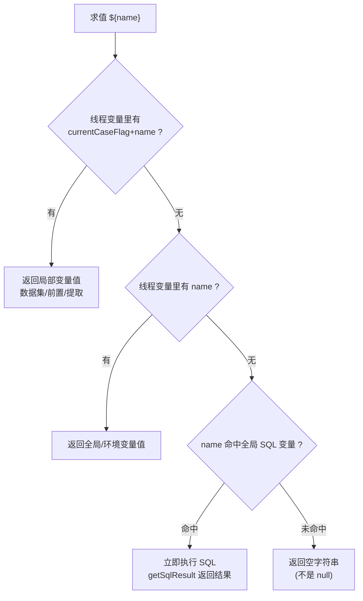

# 变量体系与参数提取

## 概述

平台的变量体系回答三个问题：变量**从哪来**（环境常量、全局参数、前置赋值、SQL 查询、响应提取、数据集）、**怎么引用**（`${var}`、`${__函数()}`）、以及**同名冲突时谁赢**（作用域与优先级）。实现上有一个关键手法：**平台魔改了 JMeter 源码**——`org.apache.jmeter.engine.util.SimpleVariable` 被覆盖（源码内置在 backend 工程里），`${var}` 的求值顺序被改成"先局部、后全局、再 SQL 懒查询"，从而支撑"同一任务里多个用例并行、变量互不串扰"。

局部变量隔离靠**用例前缀**：所有步骤级变量（数据集、前置/后置赋值、提取器产出）在生成 JMX 时都被加上 `PART_{reportId}|{caseId}|{caseNum}_` 前缀（`currentCaseFlag`），运行时 `${xxx}` 先按"前缀+原名"取值。

相关文档：[前置后置处理器与断言](前置后置处理器与断言.md)（动作如何落成提取器/赋值脚本）、[环境与配置管理](../01-产品功能/环境与配置管理.md)（环境变量的配置入口）、[数据集与数据枚举](../01-产品功能/数据集与数据枚举.md)、[JMX生成与解析](../03-实现逻辑/JMX生成与解析.md)。

## 逻辑详解

### 1. 变量的类型与来源

**环境通用变量**（`ScenarioVariable`，`src/main/java/cn/testin/entity/request/variable/ScenarioVariable.java`），类型枚举 `VariableTypeConstants`（`commons/constants/VariableTypeConstants.java`）：

| type | 含义 | JMX 落成 |
|---|---|---|
| `constant` | 常量键值对 | JMeter `Arguments`（用户定义的变量），见 `ElementUtil.getConfigArguments`（`entity/vo/request/ElementUtil.java`） |
| `list` | 逗号分隔列表 | （配合迭代场景使用） |
| `CSV` | CSV 文件数据 | `CSVDataSet` 元件（平台魔改版 `org/apache/jmeter/config/CSVDataSet.java`） |
| `counter` | 计数器（startNumber/endNumber/increment/格式） | `CounterConfig`（`ElementUtil.addCounter`） |
| `random` | 随机数（min/max/输出格式） | `RandomVariableConfig`（`ElementUtil.addRandom`） |
| `sql` | SQL 执行后赋值给全局变量的 key | 见下文"全局 SQL 变量" |

**环境全局参数**（`GlobalVariable`，`entity/dto/environment/GlobalVariable.java`）：前端在环境配置页编辑（`src/views/envList/components/GlobalVariable.vue`），只有两种：`const`（常量）和 `sql`（`key = SQL 语句 @数据源`）。常量型在执行前被序列化成 `globalVariableJson` 挂到采样器属性上（`service/execution/TestExecuteService.java`），并生成 `Global_Arguments`（`ElementUtil.addGlobalVariablesProcessor`）。

**步骤级变量**：数据集输入数据（`handleInputData`，`ElementUtil.java`）、前置变量赋值、后置提取，全部带 `currentCaseFlag` 前缀写入线程变量。

### 2. 局部变量前缀（currentCaseFlag）

`currentCaseFlag` 的格式在 `ElementUtil.setCurrentCaseFlag`：

```
PART_{reportId}|{caseId}|{caseNum}_
```

- 前缀常量 `VAR_PART_PREFIX = "PART_"`（`commons/constants/VariableRelevanceConstants.java`）；全局 SQL 变量前缀 `VAR_GLOBAL_PREFIX = "TESTIN_GLOBAL_"`。
- 生成 JMX 时，前置赋值、数据集、提取器的目标变量名、ForEach 的输入/输出变量名都会被拼上该前缀（例如 `generateAfterVarJsonPath`）。
- 运行时由魔改 `JMeterThread.SetCaseFlagAndStepLog2ThreadVars`（`org/apache/jmeter/threads/JMeterThread.java`）把 `currentCaseFlag` 写进线程变量，供求值时使用。

### 3. 引用语法与求值顺序（核心）

用户在请求路径、请求体、前置后置表达式里写 `${var}`，真正求值发生在魔改的 `SimpleVariable.toString()`（`org/apache/jmeter/engine/util/SimpleVariable.java`）：



注意三个魔改点：

1. **局部优先于全局**：`SimpleVariable.java`——先取 `currentCaseFlag + name`，取不到再取 `name`。所以"步骤里赋的同名变量"天然覆盖"环境/全局变量"。
2. **SQL 全局变量是懒执行的**：`vars.getSqlResult(name, logDetails)`（`org/apache/jmeter/threads/JMeterVariables.java`）从采样器的 `globalSqlList` 属性（生成 JMX 时把 SQL 全局变量连数据源信息 JSON 序列化挂上去，如 `ElementUtil.java`、`TestinHTTPSamplerProxy.java`）里找到匹配 key，**在用到的当下才连库执行**。
3. **未定义变量返回空串而非 null**：`SimpleVariable.java` 注释说明原因——返回 null 会被 `CompoundVariable` 拼成字符串 "null" 污染请求参数。

另有 `${__metersphere_env_id}`（`RunningParamKeys.API_ENVIRONMENT_ID`，`commons/constants/RunningParamKeys.java`）在脚本处理时被替换成 `"MS.ENV.{环境id}."` 前缀引用（`TestinJSR223PreProcessor.java`），`MS.ENV.` 前缀常量在 `RunningParamKeys.java`。

### 4. 从响应提取变量

提取动作由后置"变量赋值"（`varType` 为 `JSONPath`/`XPath`）生成 `TestinExtract` 提取器（`ElementUtil.generateAfterVarAssignment`），落成 JMeter 元件（`element/TestinExtract.java`）：

| 提取方式 | 触发条件 | JMeter 元件 | 多值匹配 |
|---|---|---|---|
| JSONPath | `expression` 以 `$.` 开头 | `JSONPostProcessor`（`TestinExtract.java`） | `matchNumbers=-1`，`ComputeConcatenation` |
| XPath | `expression` 以 `/` 开头 | `XPathExtractor`（html）/ `XPath2Extractor`（xml，按 `xpathType` 区分） | `matchNumber=-1` |
| 正则 | 提取列表中的 regex 项 | `RegexExtractor`（模板固定 `$1$`） | `matchNumber=-1` |

提取结果写到哪个名字，决定作用域（`generateAfterVarXPath` ，JSONPath 同理）：

- 变量名**在全局参数 key 列表里**（`config.getGlobalVariableList()`）→ 不加前缀，直接写成全局变量，后续用例都能用；
- 否则加 `currentCaseFlag` 前缀 → 只有**当前用例本次执行**的后续步骤能引用。

多值提取产出 `var_1`、`var_2`、…、`var_matchNr`，正好供 ForEach 控制器迭代（见 [控制器与流程编排](控制器与流程编排.md)）。

### 5. 全局 SQL 变量的双通道

SQL 型全局参数有两条执行通道，生成 JMX 时都准备好：

1. **SetUp 线程组预执行**：`ElementUtil.assembleSetUpThreadGroup`把所有 SQL 全局变量生成一个 `setUpThreadGroup`，内含若干 `TestinJDBCSampler`，结果列名拼 `TESTIN_GLOBAL_` 前缀；JMeter 机制下这些值先进 properties，业务线程启动时由魔改 `JMeterThread.replaceTestinGlobalVarFromProperties`（`JMeterThread.java`）摘掉前缀搬进线程变量。
2. **懒执行兜底**：预执行没覆盖到时，`SimpleVariable` 求值阶段的 `getSqlResult` 现场查库（见第 3 节）。

### 6. 执行日志与变量回写

- 魔改 `JMeterThread.runPostProcessors`（`JMeterThread.java`）在执行每个后置元件后写"将【值】赋值给【变量】"级别的日志（`matchJdbcThreadVar` 、`matchJsonOrXpathThreadVar`、`matchPythonThreadVar`），这些日志进报告（见 [批次结果聚合](../03-实现逻辑/批次结果聚合.md)）。
- `JMeterThread` 还会把本次执行的变量快照写回 Redis（`getRunnerVariablesRedisKey`，`JMeterThread.java`，5 分钟过期），供调试页"响应断言规则/提取建议"使用。
- `EnvironmentRunningParamService`（`service/EnvironmentRunningParamService.java`）提供反向通道：把 `MS.ENV.{envId}.{key}=value` 形式的运行结果**回写进环境配置的 commonConfig.variables**（`parseEvn`），实现"执行过程中沉淀环境变量"。

## 关键代码位置

| 位置 | 说明 |
|---|---|
| `testin-api-backend/src/main/java/cn/testin/commons/constants/VariableTypeConstants.java` | 环境变量类型枚举（constant/list/CSV/counter/random/sql） |
| `commons/constants/VariableRelevanceConstants.java` | `PART_` 局部前缀 / `TESTIN_GLOBAL_` 全局前缀 |
| `commons/constants/RunningParamKeys.java` | `${__metersphere_env_id}` 与 `MS.ENV.` 前缀 |
| `org/apache/jmeter/engine/util/SimpleVariable.java` | **变量求值核心（魔改）**：局部→全局→SQL→空串 |
| `org/apache/jmeter/threads/JMeterVariables.java` | `getSqlResult`：SQL 全局变量懒执行 |
| `org/apache/jmeter/threads/JMeterThread.java` | 写入 currentCaseFlag / currentStepFlag |
| `org/apache/jmeter/threads/JMeterThread.java` | `TESTIN_GLOBAL_` properties → 线程变量 |
| `entity/vo/request/ElementUtil.java` | `setCurrentCaseFlag` 拼用例前缀 |
| `ElementUtil.java` /  /  | 环境变量 → Arguments / CounterConfig / RandomVariableConfig |
| `ElementUtil.java` | SQL 全局变量 → SetUp 线程组 + JDBC Sampler |
| `ElementUtil.java` | 后置变量赋值 → TestinExtract 提取器 |
| `entity/vo/request/element/TestinExtract.java` | 三种提取器的 JMeter 元件生成 |
| `entity/dto/environment/ParameterConfig.java` | `valueSupposeMock`：Arguments 值过一遍函数解析 |
| `testin-api-frontend/src/views/envList/components/GlobalVariable.vue` | 环境全局参数编辑（const/sql，支持批量文本模式） |
| `testin-api-frontend/src/components/RequestParameters/RequestAction.vue` | 按表达式前缀推断 varType（str/var/JSONPath/XPath） |

## 注意事项与坑

- **变量名冲突的实质是前缀优先级**：步骤内 `${token}` 永远先命中"本用例本次执行"的赋值/提取/数据集；想跨用例传值，必须把变量名登记进环境全局参数（`globalVariableList`），提取/赋值时才不会被加前缀（`ElementUtil.java`）。
- **未定义变量静默变空串**：`SimpleVariable.java` 有意为之。排障时看到请求参数莫名变空，先怀疑变量名拼写或作用域。
- **`isJmeterFunction` 只看前缀**：`${__` 开头即视为 JMeter 函数（`ElementUtil.java`），非 `__BeanShell` 的函数赋值目标变量会被加 `JMeterFunction_` 前缀，在后续步骤引用该变量时感知不到这个前缀（由同一套逻辑对齐），但直接在 JMX 里找变量时容易困惑。
- **ForEach 取不到 Arguments 里的变量**：JMeter 的 ForeachController 直接从变量表取值，平台因此在用例级把 Arguments 复制成 UserParameters（`TestinCase.java` 的 `argumentsToUserParameters`），改动变量注入逻辑时别破坏这段。
- **SQL 全局变量"多个匹配取最后一个"**：`JMeterVariables.getSqlResult` 里 `sql.getKey().contains(key)` 的过滤 + 取最后一个，key 命名要有区分度，避免子串误命中。
- **环境变量回写有 5 分钟窗口**：执行结果回写环境配置依赖 Redis 快照（`JMeterThread.java` 的 300 秒过期），超时后调试页拿不到变量建议。
