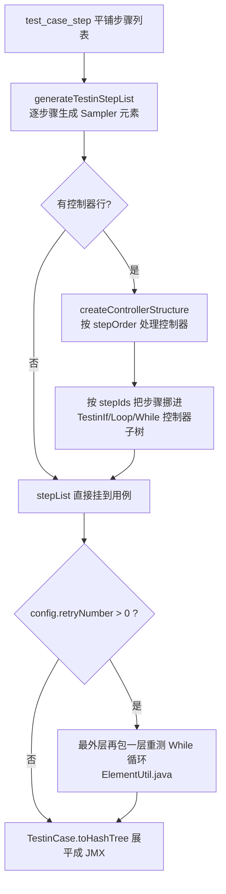

# 控制器与流程编排

## 概述

用例的执行步骤不是单纯的线性列表：用户可以在用例编辑页拖入"条件判断 / 循环 / while 循环 / 迭代（ForEach）"四种**步骤控制器**，把若干普通步骤圈进控制器的起止标记之间。控制器在数据库里是特殊的步骤行（`isController=1` + `controllerType` + `controllerContent` JSON），生成 JMX 时由 `ElementUtil.createControllerStructure` 把"控制器 + 被圈步骤"组装成 JMeter 的逻辑控制器子树，再随用例整体展平成 JMX。

支持的控制器类型（`commons/constants/StepControllerType.java`）：

| code | 枚举 | 界面文案 | 对应 JMeter 元件 |
|---|---|---|---|
| 1 | `FOREACH_CONTROLLER` | 迭代开始/结束 | `ForeachController` |
| 2 | `IF_CONTROLLER` | 条件判断开始/结束 | `IfController`（JEXL3 表达式） |
| 3 | `COUNT_CONTROLLER` | 循环开始/结束 | `IfController` 包 `LoopController` |
| 4 | `WHILE_CONTROLLER` | while循环开始/结束 | `WhileController` + 超时保护 Sampler |

相关文档：[用例管理](../01-产品功能/用例管理.md)（用例编辑页整体）、[变量体系与参数提取](变量体系与参数提取.md)（条件/迭代里引用的变量）、[JMX生成与解析](../03-实现逻辑/JMX生成与解析.md)（JMX 整体结构）。

## 逻辑详解

### 1. 前端编排模型：开始行 + 结束行

用例编辑页 `src/views/case/EditCase.vue` 把控制器渲染成**成对的两行**（开始行有 `order`，结束行 `order=0`），中间可以拖入普通步骤：

- 默认内容由 `getDefaultControllerContentByType`（`EditCase.vue`）按 `controllerType` 1/2/3/4 生成，如 If 是 `{variable, operator, value}`、While 多一个 `timeout`（默认 10000ms）、ForEach 是 `{inputVal, returnVal}`。
- 行序维护 `handleOrderOfAddStep`：`order` 给后端、`frontOrder` 给前端展示，控制器结束行只占 frontOrder 不占 order。
- 详情回显 `handleStepData`：**控制器内部步骤按 `controllerContent.stepIds` 的顺序重排**并标记 `isInner=控制器stepId`，而不是按原始 order 散落。
- 四个编辑组件在 `src/views/case/components/controller/`：`IfController.vue`（操作符 ==/!=/>/</is empty/is not empty，；`variable` 以 `${` 开头时隐藏操作符、整串当表达式）、`CountController.vue`（只填循环次数 loops）、`ForEachController.vue`（输入变量前缀 inputVal + 输出变量 returnVal）、`whileController.vue`（同 If 多一个超时 timeout）。
- 保存走 `controllerAddApi` / `controllerDelApi`（`EditCase.vue` 引入），控制器行与普通步骤行一样落 `test_case_step` 表。

### 2. 存储结构

控制器内容的 JSON 反序列化实体是 `CaseStepController`（`entity/request/CaseStepController.java`）：

```
{
  "stepIds": ["被圈步骤的stepId", ...],        // 顺序即执行顺序
  "testinForEachController": { "inputVal": "ids", "returnVal": "id" },
  "ifController":   { "variable": "...", "operator": "==", "value": "..." },
  "countController": { "loops": "3" },
  "whileController": { "variable": "...", "operator": "!=", "value": "...", "timeout": 10000 }
}
```

四类子实体在 `entity/request/loop/` 下（`IfController.java`、`CountController.java`、`TestinForEachController.java`、`TestinWhileController.java`）。注意 `CountController` 里还有 `interval`/`proceed`/`requestResult` 字段，当前前端只暴露 `loops`。

### 3. 生成 JMX：步骤树如何套上控制器

入口在 `ElementUtil.generateTestinStepList`（`entity/vo/request/ElementUtil.java`）：查出用例的全部控制器行（`caseStepService.findCaseControllerListByCaseId`），调 `createControllerStructure`：

1. 控制器按 `stepOrder` 排序；普通步骤先建成 `stepMap`（stepId → 元素）；
2. 逐个控制器处理：按 `stepIds` 把普通步骤**从平铺列表挪进控制器的 hashTree**，再把控制器元素 `stepList.add(stepOrder - 1, controller)` 插回原位置；最后 `stepList.removeAll(removeList)` 删除被挪走的步骤；
3. 变量名统一加用例前缀 `currentCaseFlag`（见 [变量体系与参数提取](变量体系与参数提取.md)）：ForEach 的 `inputVal`/`returnVal` 直接拼前缀；If/While 的 `variable` 若以 `${` 开头，用正则把 `"${xxx}"` 改写成 `"${PART_..._xxx}"`，裸变量名则直接拼前缀。



### 4. 四种控制器落成什么 JMeter 元件

**If 控制器**（`element/TestinIfController.java`）：落成 JMeter `IfController`，`useExpression=true`，条件由 `getCondition()`拼成 `${__jexl3(...)}`：

- 普通形式：`"${变量}" == "值"`；`<`/`>` 时值不加引号（按数值比较）；
- 操作符含 `~` 时按包含匹配（值包成 `(\n|.)*值(\n|.)*`）；
- `is empty` → `"${var}"=="\var" || empty("${var}")`（未赋值时 `${var}` 原样保留，利用这一点判空）；`is not empty` 对称取反。

**次数循环**（`element/TestinLoopController.java`）：先套一个 `${__jexl3(loops > 0)}` 的 IfController 再套 JMeter 原生 `LoopController`（loops 次数）。两个细节：`loops="-1"（无限循环）被强制改成 "1"`（`ElementUtil.java`）；`proceed` 被强制设 true，而 `proceed=false` 的场景会在循环下挂一个 `ResultAction`（`OnError.action=1000`，即出错停止循环，`TestinLoopController.java`）——用于"成功后轮询"语义的反面。

**ForEach 迭代**（`TestinLoopController.java` + `initForeachController`）：JMeter `ForeachController`，`inputVal` 是输入变量前缀（配合多值提取产出的 `ids_1`、`ids_2`…），`returnVal` 是每轮暴露的输出变量，`useSeparator=true`。

**While 循环**（`element/TestinWhileController.java`）：落成 JMeter `WhileController`，条件同样包 `${__jexl3(...)}` / `${__groovy(...)}`；**超时保护**在 `WhileController()`：循环前先插一个名为 `FOR_WHILE_CONTROLLER` 的 `JSR223Sampler`，写入 `EndTime{uuid} = 当前毫秒 + timeout`，循环条件追加 `&& ${__time()} < ${EndTime...}`——超时自动跳出，防止死循环拖死执行机。用户建的 while 带 `remark="user"` 标记（`ElementUtil.java`），与平台自动重测的 while 区分。

### 5. 自动重测：平台自己包的一层 While

当执行参数 `retryNumber > 0` 时，`ElementUtil.java` 在**整个用例步骤列表外面**再包一层 `TestinLoopController(loopType=WHILE)`：

- 循环条件：`("${retestStatus}"=="true") && ("${Vcount}" <= retryNumber+1)`；
- 循环体头部插一个 `EmptySamplerProxy`（名 `FOR_RETEST`），其前置脚本 `vars.put("retestStatus","false")` + 用 `${__counter(FALSE,Vcount)}` 计数；
- 每个步骤失败时由断言脚本把 `retestStatus` 置回 true 触发下一轮（`ElementUtil.java`：开启重测时向全局断言追加一段 BeanShell，`prev` 不成功即置位）。

### 6. 展平成 JMX 的最后一步

`TestinCase.toHashTree`（`element/TestinCase.java`）：整个用例先包一层 `TestinCriticalSectionController`（临界区控制器），注入环境变量 Arguments/UserParameters、计数器/随机数（`addCounter`/`addRandom`），然后对 hashTree 递归调 `toHashTree`——控制器元素在此刻才真正转成 JMeter 控制器的 HashTree 子树。JMX 反向导入（JMX → 平台步骤）由 `entity/dto/parse/JmeterCaseParser.java` 处理：识别 JMeter `IfController`/`LoopController` 回填成 `CaseStepController`。

## 关键代码位置

| 位置 | 说明 |
|---|---|
| `testin-api-backend/src/main/java/cn/testin/commons/constants/StepControllerType.java` | 控制器类型枚举（1-4） |
| `entity/request/CaseStepController.java` + `entity/request/loop/` | 控制器内容 JSON 实体 |
| `entity/vo/request/ElementUtil.java` | `createControllerStructure`：控制器组装主逻辑 |
| `ElementUtil.java` | 自动重测的 While 循环包装 |
| `element/TestinIfController.java` | If 条件 → `${__jexl3(...)}` 拼接 |
| `element/TestinLoopController.java` | `controller()`：三种 loopType 的元件选择 |
| `element/TestinWhileController.java` | While 条件 + EndTime 超时保护 |
| `element/TestinCase.java` | 用例 → JMX 子树展平（临界区包装） |
| `entity/dto/parse/JmeterCaseParser.java` | JMX 导入时反向解析控制器 |
| `testin-api-frontend/src/views/case/EditCase.vue` | 控制器默认内容、行序维护 |
| `testin-api-frontend/src/views/case/components/controller/*.vue` | 四个控制器编辑组件 |

## 注意事项与坑

- **控制器不支持嵌套**：`createControllerStructure` 基于平铺 `stepMap` 搬步骤，控制器的 `stepIds` 只能装普通步骤；嵌套场景需要自行拆用例。
- **被圈步骤从原列表删除**：组装后是"控制器元素 + 子 hashTree"结构，`stepList` 里不再保留原步骤，后续按 stepId 找步骤的逻辑要先展开控制器。
- **`loops="-1"` 不会无限循环**：会被改成 1 次，UI 上不要引导用户填 -1。
- **If/While 的 `${}` 变量会被改写**：`"${xxx}"` → `"${PART_reportId|caseId|caseNum_xxx}"`，导出 JMX 到原生 JMeter 打开时这些变量名不可读，属预期行为。
- **while 超时单位是毫秒**：前端默认 10000，后端 `RunTime`/EndTime 都按毫秒算（`TestinLoopController.java` 对 RunTime 做了 /1000），改单位时两头一起看。
- **结束行的 order 是 0**：`handleStepData` 里结束行 `order: 0`（`EditCase.vue`），凡按 order 排序/校验的逻辑要跳过结束行，否则顺序错乱。
- **删步骤要同步清 stepIds**：前端删除普通步骤时会把它从所属控制器的 `stepIds` 里剔除（`EditCase.vue`）；后端接口改动时保持同样语义，否则控制器里残留死 id（挪步骤时静默跳过，表现为"步骤没执行"）。
