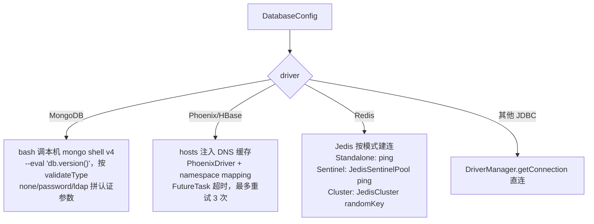

# 数据库与NoSQL测试

## 概述

平台把"数据库操作"作为用例的一类步骤/前后置能力来支持，覆盖关系库与 NoSQL 两大族：

- **关系库（JDBC）**：MySQL、Oracle、PostgreSQL、SQLServer、Phoenix（HBase 上的 SQL 层）。用例里可加 SQL 步骤（`TestinJDBCSampler`），或在任意步骤上挂 JDBC 前置/后置处理器；执行走 JMeter 的 `JDBCSampler` + `DataSourceElement` 连接池；
- **NoSQL**：MongoDB、Redis。不走 JMeter 组件，而是平台自写的执行模板——MongoDB 直接起进程调本机 mongo shell，Redis 用 Jedis `sendCommand` 发原始命令；二者主要在"全局 SQL 脚本"和"JSR223 后置处理器"里使用。

数据源统一在环境配置里维护（见 [环境与配置管理](../01-产品功能/环境与配置管理.md)），配好可先在线"测试连接"。相关文档：[前置后置处理器与断言](前置后置处理器与断言.md)、[变量体系与参数提取](变量体系与参数提取.md)、[执行端Runner详解](../03-实现逻辑/执行端Runner详解.md)。

## 一、数据源配置与连接测试

### 1. 驱动清单

环境配置的 `databaseConfigList` 元素是 `DatabaseConfig`（`src/main/java/cn/testin/entity/dto/environment/DatabaseConfig.java`）：`driver`、`url`、`userName`、`passWord`、`dbName`、`hosts`、`validateType`、`redisMode`、`redisMasterNode`、`maxConnections`、`timeout`。前端可选驱动（`testin-api-frontend/src/views/envList/components/DatabaseConfig.vue`）：

| driver | 数据库 | url 模板（前端自动填充） |
|---|---|---|
| `com.mysql.jdbc.Driver` | MySQL | `jdbc:mysql://host:port/db_name` |
| `oracle.jdbc.OracleDriver` | Oracle | `jdbc:oracle:thin:@//host:port/service_name` |
| `org.postgresql.Driver` | PostgreSQL | — |
| `com.microsoft.jdbc.sqlserver.SQLServerDriver` | SQLServer | — |
| `org.apache.phoenix.jdbc.PhoenixDriver` | Phoenix/HBase | `jdbc:phoenix:host:port` |
| `com.testin.MonogoDB.Driver` | MongoDB（伪驱动标识） | `host:port` |
| `com.testin.redis.Driver` | Redis（伪驱动标识） | `host:port[,host:port...]` |

后三个"驱动"是平台约定的标识串（`EnumDriver`，`src/main/java/cn/testin/commons/constants/EnumDriver.java`），用来路由到不同的校验/执行逻辑；Redis 还有 `redisMode`（Standalone/Sentinel/Cluster）与哨兵主节点名。

### 2. 连接测试

`POST /database/validate` → `DataBaseService.validate`（`src/main/java/cn/testin/service/DataBaseService.java`），按 driver 分四路：



- MongoDB 的认证方式枚举 `EnumMongoDbValidateType`（`commons/constants/EnumMongoDbValidateType.java`）：`NONE` / `PASSWORD` / `LDAP`（LDAP 走 `--authenticationMechanism PLAIN`，`DataBaseService.java`）；
- mongo shell 路径由配置项 `mongodbshell.path.v4` 注入 JVM 系统属性 `mongoShellPathV4`（`config/MongoShellPathProperty.java`）；
- Phoenix 的 `hosts`（如 `host1,host2`）通过 `DnsCacheManipulatorUtils.addHosts` 临时改写 JVM DNS 缓存，校验完 `removeHosts`——用来解决容器内无 /etc/hosts 解析 zk/HBase 主机名的问题。

## 二、SQL 步骤（JDBC）

### 1. 用例中的 SQL 步骤

`TestinJDBCSampler`（`src/main/java/cn/testin/entity/vo/request/element/TestinJDBCSampler.java`，type=`JDBCSampler`，`protocol="SQL"`）字段：`dataSource`（引用环境里的数据源）、`query`、`queryTimeout`、`resultVariable`、`variableNames`。`toHashTree`一次生成两个 JMeter 组件：

- `JDBCSampler`：`queryType="Callable Statement"`、`resultSetHandler="Store as String"`、结果存入 `resultVariable`/`variableNames`；
- `DataSourceElement`：JDBC 连接池配置（dbUrl/driver/账号密码，`poolMax=2`，`connectionAge=5000`，`trimInterval=6000`，`transactionIsolation=DEFAULT`）。

数据源为空直接抛"数据源为空请选择数据源"。

### 2. JDBC 前置/后置

`TestinJDBCPreProcessor`（`element/TestinJDBCPreProcessor.java`）/`TestinJDBCPostProcessor` 结构相同：前置可附带 `Arguments` 变量；`queryType` 对 Phoenix 用 `"Prepared Statement"`、其他用 `"Callable Statement"`。典型用法：前置 SQL 准备数据 / 取数写入变量供主请求引用，后置 SQL 校验落库结果。

### 3. 结果集断言

JDBC 结果以 "Store as String" 形式存进结果变量/列变量，断言复用平台通用断言规则（对变量值或响应文本做包含/等值/正则等），见 [前置后置处理器与断言](前置后置处理器与断言.md)；多行结果按 `variableNames` 拆列后可通过 `${列名_行号}` 形式引用，见 [变量体系与参数提取](变量体系与参数提取.md)。

## 三、NoSQL 执行（MongoDB / Redis）

统一抽象 `INosqlProcess.process(NosqlExecuteParams)`（`src/main/java/cn/testin/service/nosql/INosqlProcess.java`），参数含 url/command/账号/超时/dbName/redisMode/validateType（`nosql/NosqlExecuteParams.java`）。

### 1. MongoDB：起进程跑 mongo shell

`MongoDbExecuteTemplate`（`service/nosql/MongoDbExecuteTemplate.java`）：

- 命令预处理：`show dbs` / `show collections` 被替换成 `db.getMongo().getDBNames()` 等 JS 等价物；
- 拼 `cd {mongoShellPathV4} && ./mongo {url}/{dbName} [--authenticationDatabase ... -u -p / --authenticationMechanism PLAIN] --quiet --eval '{command}'`，`bash -c` 执行；
- 输出按首字符分流：`{` 开头按花括号配对切成多个文档逐个 `BsonDocument.parse`，`[` 开头按 `BsonArray` 解析，其他按原文返回；文档转 Map 时区分 timestamp/date/int32/int64/double/ObjectId/string 等类型，日期转 +8 时区 `LocalDateTime`；
- 进程退出码非 0 时把已收集输出当错误抛出。

### 2. Redis：Jedis 原始命令

`RedisExecuteTemplate`（`service/nosql/RedisExecuteTemplate.java`）：把用户输入的命令串 trim、压空格后按空格切分，第一个词作为 `Protocol.Command`、其余作为参数；三种模式分别用 `Jedis` / `JedisSentinelPool` / `JedisCluster` 的 `sendCommand` 下发。集群模式捕获 `JedisMovedDataException` 后解析新节点地址、取该节点连接重发命令。返回结果里 `List<byte[]>` 转字符串列表、`byte[]` 按 UTF-8 解码。

### 3. 两个调用入口

- **全局 SQL 脚本**：`NoSqlDataBaseUtil.execQuery`（`commons/utils/NoSqlDataBaseUtil.java`）——内部类 `JSR223TestElementProcessScript`按 driver 分发 Redis/Mongo 模板，其余走脚本引擎；结果统一 JSON 化，再按 `key`（逗号分隔的列名）拆成 `List<Map>` 供数据集/变量使用；
- **JSR223 后置处理器**：平台改造版 `org/apache/jmeter/extractor/JSR223PostProcessor.java`——属性 `nosqlScriptType` 非空时按 driver 走 NoSQL 模板，否则执行常规脚本；结果 JSON 化后 `assginVariable` 写回 JMeter 变量，供后续步骤引用或断言。

```mermaid
flowchart LR
    subgraph 用例执行（执行端）
        A[JSR223 后置处理器] -- nosqlScriptType=redis --> R[RedisExecuteTemplate]
        A -- nosqlScriptType=mongo --> M[MongoDbExecuteTemplate]
        J[JDBCSampler/前置后置] --> P[(关系库/Phoenix)]
    end
    M -->|bash mongo shell| MG[(MongoDB)]
    R -->|sendCommand| RD[(Redis)]
    G[全局 SQL 脚本] --> N[NoSqlDataBaseUtil] --> R & M
```

## 关键代码位置

| 功能 | 位置 |
|---|---|
| 连接测试接口 | `src/main/java/cn/testin/controller/DataBaseController.java` |
| 连接测试实现（四路分发） | `src/main/java/cn/testin/service/DataBaseService.java` |
| 驱动标识枚举 | `src/main/java/cn/testin/commons/constants/EnumDriver.java` |
| Mongo 认证方式枚举 | `src/main/java/cn/testin/commons/constants/EnumMongoDbValidateType.java` |
| mongo shell 路径配置 | `src/main/java/cn/testin/config/MongoShellPathProperty.java` |
| SQL 步骤元素 | `src/main/java/cn/testin/entity/vo/request/element/TestinJDBCSampler.java` |
| JDBC 前置处理器 | `src/main/java/cn/testin/entity/vo/request/element/TestinJDBCPreProcessor.java` |
| MongoDB 执行模板 | `src/main/java/cn/testin/service/nosql/MongoDbExecuteTemplate.java` |
| Redis 执行模板 | `src/main/java/cn/testin/service/nosql/RedisExecuteTemplate.java` |
| 全局 SQL 脚本入口 | `src/main/java/cn/testin/commons/utils/NoSqlDataBaseUtil.java` |
| 后置处理器 NoSQL 分发 | `src/main/java/org/apache/jmeter/extractor/JSR223PostProcessor.java` |
| 前端数据源配置 | `testin-api-frontend/src/views/envList/components/DatabaseConfig.vue` |

## 注意事项与坑

1. **MongoDB 依赖执行机本地安装 mongo shell v4**（旧版 `mongo` 客户端，不是 mongosh），且 `mongodbshell.path.v4` 必须指向其 bin 目录；命令是 `cd {path} && ./mongo` 形式（`MongoDbExecuteTemplate.java`），路径错/没装会在进程退出码处报奇怪错误。服务端"测试连接"与执行端跑用例用的是各自机器上的 shell，两边都要装。
2. Mongo 执行是**起外部进程**且没有超时控制，`--eval` 的 JS 死循环会一直挂住执行线程；避免在大并发热循环里跑 Mongo 步骤。
3. **EnumDriver 里 MongoDB 的标识有拼写错误**：`com.testin.MonogoDB.Driver`（Monogo），前端、后端、存量环境配置数据全都用错拼的串，改动时要三处一起改并迁移存量数据。
4. Redis 的 dbName 必须是数字（哨兵/集群下 、单机下会 `replaceAll("[^0-9]","")` 后 parseInt），业务库名习惯写法（如 `cache0`）在单机模式会被静默洗成 `0`，有歧义。
5. Redis 命令按空格切分参数，**值里带空格的命令（如 `SET k "a b"`）会被切坏**；不支持的命令名会抛 `IllegalArgumentException`（`Protocol.Command.valueOf`）。
6. Phoenix 连接前会向 JVM DNS 缓存注入 hosts，校验完移除；并发校验/执行同 hosts 不同 ip 的配置时存在竞态窗口。
7. JDBC 步骤的 `queryType` 固定为 Callable/Prepared Statement，**不支持 JMeter 的 "Select Statement" 等类型**，写多条 SQL 或 DDL 时行为依赖驱动对 CallableStatement 的实现；SQLServer 驱动类名用的是旧的 `com.microsoft.jdbc.sqlserver.SQLServerDriver`，新版 mssql-jdbc 是 `com.microsoft.sqlserver.jdbc.SQLServerDriver`，需手工改 url 栏旁的 driver 值。
8. `DataSourceElement` 的 `poolMax` 在 `TestinJDBCSampler` 里写死为 2，JDBC 前置处理器里才用数据源的 `maxConnections`（`TestinJDBCPreProcessor.java`）——两处连接池上限不一致，排查连接数问题注意区分。
9. NoSQL 结果 JSON 化只认 `{`/`[` 开头，其他原文按字符串处理；断言前先确认结果形态（见 [前置后置处理器与断言](前置后置处理器与断言.md)）。
10. 服务端与执行端是两个产物，NoSQL 模板类两端都用；改 `service/nosql/` 或 `EnumDriver` 后两个 pom 产物都要重新构建部署，见 [后端双形态架构](../02-技术架构/后端双形态架构.md)。
