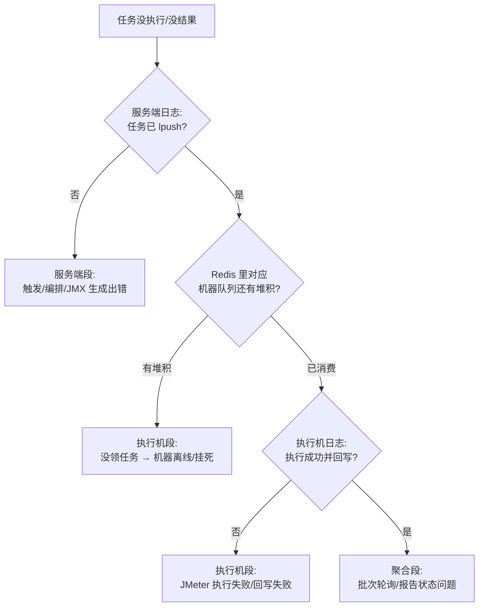

# 任务执行问题排查

> 排查总原则：执行链路跨三个进程（服务端 → Redis → 执行机），先定位断在哪一段，再看对应日志。链路全貌见 [任务执行链路](../03-实现逻辑/任务执行链路.md)。

## 定位三段法



## 服务端段：任务根本没发出去

- **JMX 生成失败**：看服务端日志 `service/jmeter/` 相关堆栈；常见原因是用例/接口引用了已删除的资源，或变量/脚本语法非法。见 [JMX生成与解析](../03-实现逻辑/JMX生成与解析.md)。
- **没有可用执行机**：调度需要一台在线执行机；查 [测试机管理](../01-产品功能/测试机管理.md) 页面机器状态，以及服务端 `TestMachineService.initRunner()` 监听日志。
- **环境/运行参数缺失**：执行引用环境配置（域名、DB 连接），环境被删或参数缺 key 会在编排期失败。见 [环境与配置管理](../01-产品功能/环境与配置管理.md)。

## Redis 段：任务在队列里躺着

```bash
# 1. 找到目标机器的队列 key（所有 key 规则见 Redis通信与Key设计）
# 2. 看队列是否堆积
LLEN <runnerLinter key>
# 3. 看 JMX 载体是否还在（有 TTL，过期即任务"蒸发"）
TTL <jmeterRunId key>
```

高频结论：

| 现象 | 结论 |
|---|---|
| 队列堆积增长 | 执行机没在消费：进程挂了 / machineId 对不上 / brpop 卡死 |
| 队列空但执行机说没任务 | key 拼错（machineId 不一致），两端 RedisKeyUtil 版本不一致 |
| JMX key 已过期 | 任务排队太久，载体 TTL 到期——执行机领到引用也取不到脚本 |

> **改 `RedisKeyUtil` 或传输 DTO 后只发了一个端**是经典事故：服务端按新 key lpush、执行机按旧 key brpop，任务永久沉默。两端必须同时发布。

## 执行机段：领了任务执行不了

- 执行机日志在部署机 `/home/syy/data/logs/` 下（含 OOM dump，JVM 参数里配了 `HeapDumpPath`）。
- **JMeter 初始化失败**：`resources/jmeter/` 运行时目录、jython 插件是否在包里（打包时从 `resources/jmeter/lib/ext/` 拷入）。
- **协议类失败**：
  - FIX：数据字典 `FIX44.modified.xml`、quickfix 配置 → [FIX协议支持](../04-复杂功能细节/FIX协议支持.md)；
  - T2：SDK 在 `extension/t2/`，连接配置在 [协议配置管理](../01-产品功能/协议配置管理.md) → [T2协议支持](../04-复杂功能细节/T2协议支持.md)；
  - Mongo 校验：执行机上要有 mongo shell（`mongodbshell.path.v4`）→ [数据库与NoSQL测试](../04-复杂功能细节/数据库与NoSQL测试.md)。
- **回写失败**：执行机回写结果也走 Redis/HTTP，网络分区会表现为"执行了但报告一直执行中"。

## 聚合段：执行完了报告状态不对

- 批次聚合由服务端 `TestTaskBatchPoller`（`@Scheduled` 每 3s）驱动；服务重启或批次登记丢失会导致批次停在"执行中"。见 [批次结果聚合](../03-实现逻辑/批次结果聚合.md)。
- 报告三级结构（批次→用例→步骤）某级缺失，先查 `TestTaskRelReportService` / `TestCaseRelReportService` 的关联数据。见 [测试报告与分享](../01-产品功能/测试报告与分享.md)。

## 定时任务没触发

- 先分清任务类型：xxl-job 调度（管理台 `http://<服务端>/job`，执行器 `testin-task-job-executor`）还是 `@Scheduled` 本地调度。见 [定时调度体系](../03-实现逻辑/定时调度体系.md)。
- xxl-job 执行器注册不上：查 8889 端口、`xxl.job.admin.addresses` 是否指向服务端自身。

## 源码走读确认的静默失败点

以下问题在界面上都没有明显报错，是逐行读执行链路代码确认的：

1. **DTO 已消费但 JMX key 过期/被删时，runner 直接 return、任务静默丢失**（`RunnerTestExecuteService.java`），无任何告警——"任务下发后没反应"先查 `JMETER_JMX_ID:{machineId}:{reportId}` 是否还在。
2. **runner 的 brpop 用裸 Jedis 连接且不会自动重连**：Redis 重启后消费线程死循环打日志但不恢复，**必须重启 runner 进程**。
3. **`/initMachine` 不幂等**：重复调用会给同一台 runner 起多个 brpop 线程，导致同一任务被**重复消费**（报告里同一用例出现多条结果）。machineId 初始化问题见 [执行端Runner详解](../03-实现逻辑/执行端Runner详解.md)。
4. **批次 RUNNING 标记有 2h TTL 兜底**：执行机宕机时报告会卡"执行中"至少 2 小时才被判死；反过来单批执行真超过 2 小时会出现两批并发下发、批次耗时统计失真。机制见 [批次结果聚合](../03-实现逻辑/批次结果聚合.md)。
5. **caseNum 是全链路结果对位锚点**：任务执行中改任务（增删用例/调序）导致 caseNum 错位，是报告卡死/结果写串行的根因；代码里为此做了 caseId 对位校验和续跑前一致性重算。

6. **BUFFER 队列 pop 后数据缺失不重试**：`TestTaskBatchPoller.java` 发现批次 JMX/DTO 缓存缺失只打 error 日志，该批次直接丢失，任务卡"执行中"直到人工干预——查服务端 error 日志里的批次缺失记录。

## 执行结果内容异常（执行成功但数据不对）

这类问题执行链路是通的，坑在变量/编排语义：

| 症状 | 根因 | 出处 |
|---|---|---|
| 请求参数莫名变空串 | 引用了未定义变量——平台变量解析对未定义变量**静默返回空串**（有意设计，不保留 `${var}` 原样） | [变量体系与参数提取](../04-复杂功能细节/变量体系与参数提取.md) |
| 前置"变量赋值没生效" | 同名变量被**数据集行覆盖**：数据集优先，前置赋值被静默剔除（`ElementUtil.java`） | [前置后置处理器与断言](../04-复杂功能细节/前置后置处理器与断言.md) |
| 控制器里某步骤"没执行" | 删除步骤时没同步从控制器 `stepIds` 剔除，残留死 id 被静默跳过 | [控制器与流程编排](../04-复杂功能细节/控制器与流程编排.md) |
| 并行任务只用了一台机器 | 过滤后用例不足 2 条时**静默退化为单机串行**（设计行为） | [测试任务](../01-产品功能/测试任务.md) |
| 导入后部分接口丢失 | 导入一次只导前端所选的一种协议，Swagger 里混协议接口被静默过滤 | [接口管理实现](../03-实现逻辑/接口管理实现.md) |
| Redis 数据源连错库 | 单机模式下 dbName 会被 `replaceAll("[^0-9]","")` 洗成纯数字，`cache0` 这种名字会变 `0` | [数据库与NoSQL测试](../04-复杂功能细节/数据库与NoSQL测试.md) |

## 相关阅读

- [任务执行链路](../03-实现逻辑/任务执行链路.md) / [Redis通信与Key设计](../03-实现逻辑/Redis通信与Key设计.md) / [执行端Runner详解](../03-实现逻辑/执行端Runner详解.md) / [测试机管理](../01-产品功能/测试机管理.md) / [构建与部署FAQ](构建与部署FAQ.md)
