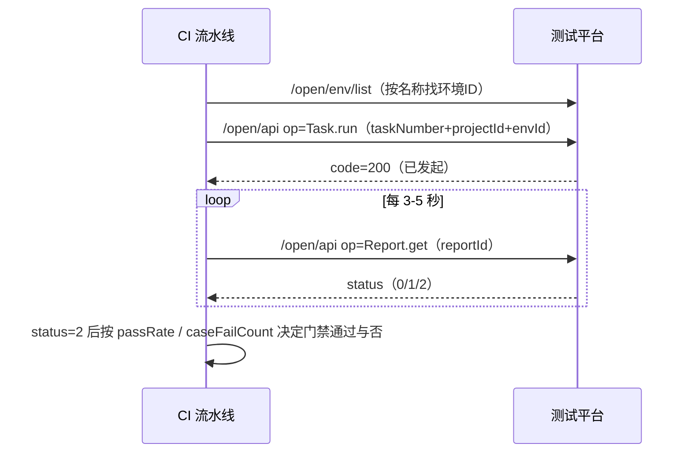

# 开放接口-通用调用

> `POST /open/api` 是一个**通用调度入口**：通过 `op` 参数路由到内部能力。这是 CI/CD 最常用的端点（跑任务、取报告）。
>
> ⚠️ 本端点返回 `ResponseResult` 包装（**`code === 200` 成功**），与其他 `/open/**` 端点的 `R` 包装（`code === 0`）**不是一套**，见 [开放接口总览](开放接口总览.md)。

## 请求结构

| 参数 | 类型 | 必填 | 说明 |
|---|---|---|---|
| sid | string | 是 | 会话凭证（也可走 `Sid` 头） |
| op | string | **是** | 操作类型，目前仅支持两个：`Task.run`、`Report.get` |
| action | string | 否 | 保留字段 |
| mkey | string | 否 | 保留字段 |
| data | object | **是** | 业务参数（结构随 op 不同） |

`op` 为空或不是上述两个值 → `1000503`（参数(op)不能为空 / 无效的参数(op)）。

## op = Task.run（执行任务）

按**任务编号**触发一个测试任务执行（串行模式，平台分配执行机）。

**data 参数：**

| 参数 | 类型 | 必填 | 说明 |
|---|---|---|---|
| taskNumber | int | **是** | 任务编号（任务列表页可见的编号，不是任务 ID） |
| projectId | string | **是** | 项目 ID |
| envId | string | **是** | 环境 ID（见 [开放接口-环境查询](开放接口-环境查询.md)） |

**请求示例：**

```bash
curl -X POST 'http://<host>/open/api' \
  -H 'Content-Type: application/json' -H 'Sid: <sid>' \
  -d '{"sid": "<sid>", "op": "Task.run",
       "data": {"taskNumber": 101, "projectId": "1", "envId": "2c4eb367-..."}}'
```

**响应**：`code === 200` 成功，`data` 为执行发起结果（含报告标识信息，用于 Report.get 轮询）。

**错误码：**

| code | 含义 |
|---|---|
| 10005 | data 为空 / taskNumber、projectId、envId 缺失 |
| 10300 | 任务不存在（任务编号与项目 ID 不匹配） |

**注意事项：**

1. 执行模式**固定为串行**（executeType=serial），不支持通过此接口指定并行/执行机/标签过滤。
2. 任务是异步执行的：返回 200 只代表"已成功发起"，用 `Report.get` 轮询直到报告状态完成。
3. 与 `task/create`（跑单个脚本）不同，本 op 跑的是**任务**（一批用例），产物是正式的任务报告（见 [测试任务](../01-产品功能/测试任务.md)）。

## op = Report.get（获取报告）

按报告 ID 查询任务报告主记录。

**data 参数：**

| 参数 | 类型 | 必填 | 说明 |
|---|---|---|---|
| reportId | string | **是** | 报告 ID |

**响应**：`data` 为报告对象，主要字段：

| 字段 | 说明 |
|---|---|
| id / name | 报告 ID / 名称 |
| type | 报告类型（0script 1case 2task 3batch） |
| status | **状态：0 未开始、1 执行中、2 已完成**（轮询终态判断用它） |
| caseTotalCount / caseSuccessCount / caseFailCount | 用例总数 / 成功数 / 失败数 |
| passRate | 通过率（字符串） |
| takeTime | 执行耗时（毫秒） |
| usedInterfaceCount / unusedInterfaceCount / interfaceTotal / usedInterfaceRate | 接口覆盖率统计 |
| envId / caseTags / datasetTags | 执行环境与提测标签快照 |

```json
{"code": 200, "msg": "成功", "data": {
  "id": "rpt-001", "name": "订单回归任务", "type": 2, "status": 2,
  "caseTotalCount": 50, "caseSuccessCount": 48, "caseFailCount": 2,
  "passRate": "96.00%", "takeTime": 83000
}}
```

**错误码：** `10005`（reportId 为空或报告不存在——"未找到报告！请检查报告ID"）。

**注意事项：**

1. 返回的是报告**主记录**（汇总统计），不含步骤级请求/响应明细；明细目前只能通过平台页面或分享链接查看（见 [测试报告与分享](../01-产品功能/测试报告与分享.md)）。
2. ⚠️ 报告会被平台的定期清理机制删除（永久保存标记除外）；已删除的报告本接口返回"未找到报告"——做质量门禁时应及时取数，见 [批次结果聚合](../03-实现逻辑/批次结果聚合.md) 与报告清理策略。
3. 轮询建议：间隔 3-5 秒，按 `status === 2` 判终态；长时间停在"执行中"的排查见 [任务执行问题排查](../05-常见问题/任务执行问题排查.md)。

## 典型 CI 集成流程



## 延伸阅读

- [开放平台OpenApi](../01-产品功能/开放平台OpenApi.md) / [开放平台OpenApi实现](../03-实现逻辑/开放平台OpenApi实现.md)
- [测试任务](../01-产品功能/测试任务.md) / [测试报告与分享](../01-产品功能/测试报告与分享.md)
