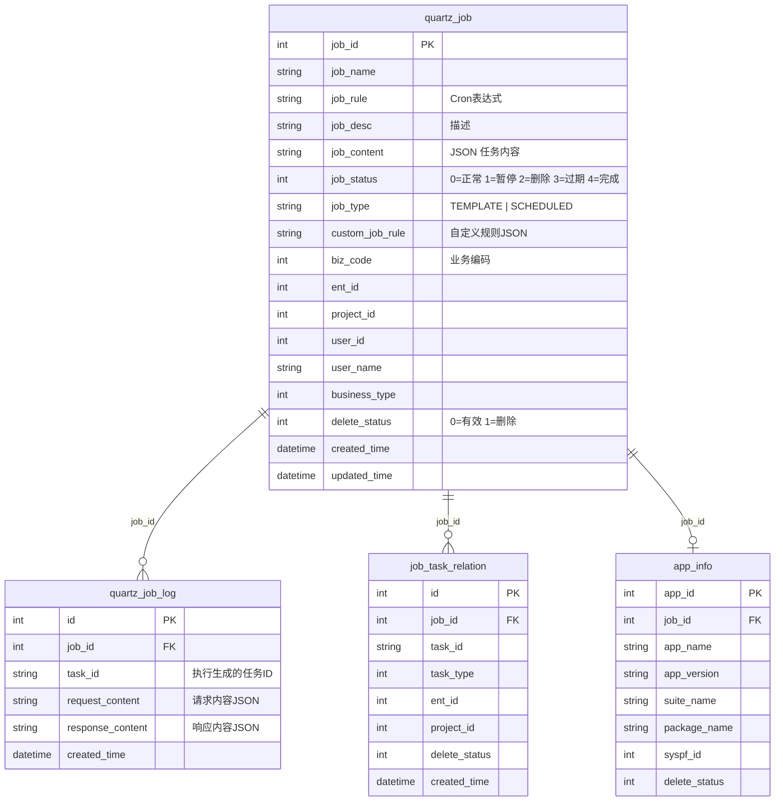

# SQL/db_common/ -- 库索引

公共数据：操作日志、定时任务、服务器监控、目录信息、心跳检测。

> 本库被 平台基础功能服务（testin-core）与 web/pc处理服务（real-web）共用。其中 quartz_job、quartz_job_log、job_task_relation 三表两服务均有文档记录，字段分歧已于 2026-08-12 对实库核实（均以 real-web 版本为准，详见各详页"字段定义核实结论"小节）。

| 表名 | 用途 | 详页 |
|------|------|------|
| action_log | 用户操作行为日志 | [action_log](action_log.md) |
| app_info | App 信息（兼容旧版）；web/pc 侧为应用信息，与 quartz_job 1:1（关联 job_id） | -- |
| dir_info | 目录信息（心跳检测模块） | [dir_info](dir_info.md) |
| dir_quartz_job | 目录-定时任务关联 | [dir_quartz_job](dir_quartz_job.md) |
| job_task_relation | 定时任务-测试任务关联 | [job_task_relation](job_task_relation.md) |
| operate_log | 后台操作日志 | [operate_log](operate_log.md) |
| quartz_job | 定时任务定义 | [quartz_job](quartz_job.md) |
| quartz_job_log | 定时任务执行日志 | [quartz_job_log](quartz_job_log.md) |
| server_disk_usage_records | 服务器磁盘使用记录 | [server_disk_usage_records](server_disk_usage_records.md) |
| server_info | 服务器节点信息 | [server_info](server_info.md) |
| server_mount_info | 服务器挂载点信息 | [server_mount_info](server_mount_info.md) |

## web/pc处理服务 视角

> 以下来自 web/pc处理服务 文档：该服务在 db_common 库中使用 quartz_job、quartz_job_log、job_task_relation、app_info 共 4 张表。

### ER 关系

### 使用摘要

- **quartz_job**：最核心表，被 `TemplateService`、各 `Quartz 服务`（AppQuartz/WebQuartz/McPcQuartz）、`QuartzJobServiceImpl`、`JobUpdateStrategy` 系列、`OperateLogStrategy` 系列读写。
- **quartz_job_log**：`QuartzLogService` 删除、`QuartzJobMapper.listTaskIdByJobId` 联查 taskId。
- **app_info**：仅 `AppQuartz` 场景使用，与 quartz_job 1:1。
- **job_task_relation**：`BaseQuartz` 的高级调度模式（`execAdvancedJob`）使用，用于 job 日频/总频限制和最近一次任务记录。

### 外部引用（web/pc处理服务 通过远程 API 间接访问的表）

| 外部库表 | 访问方式 | web/pc处理服务 代理类 |
|----------|---------|----------------|
| db_user.user_info | action=user, op=User.getUser | UserApi |
| db_user.project_info | action=user, op=Project.getUserProjectList | ProjectApi |
| db_realcfg.realcfg_biz_config | action=cfg, op=BizConfig.get | BizConfigApi |
| db_realcfg.timeout_config | action=cfg, op=Timeout.get | TimeoutApi |
| db_realcfg.realcfg_env_config | action=cfg, op=EnvCfg.get | EnvConfigApi |
| db_notice.*（email/sms/channel 等） | action=email/sms/newChannel/... | NoticeApi, EmailTempletApi, SmsTaskApi |
| db_plan.*（plan_info/execute_record 等） | GET/POST /v3/test_plan/* | TestPlanV3Api, PlanRecordApi, PlanRecordTaskApi |
| db_portal.portal_task_* | action=portal, op=Task.list/report | PortalApi, PortalTaskApi |
| db_client.* / db_device.* / db_pc.* | action=client/pc, op=* | ClientApi, PcApi, DeviceV3Api |
