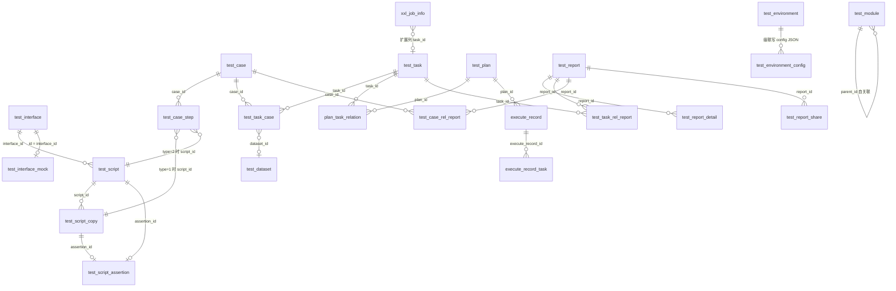

# 数据库表结构

> 数据来源：`testin_api_db`（测试环境 `10.33.84.100:3306`）`information_schema` 实查，行数为 2026-08 测试环境快照。配合 [数据存储设计](数据存储设计.md)（存储选型）阅读。
>
> **字段级完整字典**（全部 52 表逐列明细）：[数据库字段字典-接口与脚本](数据库字段字典-接口与脚本.md) · [数据库字段字典-用例与任务](数据库字段字典-用例与任务.md) · [数据库字段字典-报告与环境数据](数据库字段字典-报告与环境数据.md) · [数据库字段字典-治理与支撑](数据库字段字典-治理与支撑.md)

## 概述

库内共 **50 张表 + 1 个视图**，分四档：

| 档           | 数量  | 说明                                                  |
| ----------- | --- | --------------------------------------------------- |
| 业务核心表       | 36  | 接口/脚本/用例/任务/报告/环境/数据/机器等                            |
| 用户与统计表      | 8   | test_user、test_user_function、user_behavior、概览、问题配置等 |
| xxl-job 自带表 | 8   | xxl_job_*（内嵌调度中心，见 [定时调度体系](../../接口自动化/03-实现逻辑/定时调度体系.md)）                      |

**数据量级警示**（决定查询与清理策略）：

| 表                               | 行数快照       | 说明                          |
| ------------------------------- | ---------- | --------------------------- |
| test_case_rel_report            | **2849 万** | 用例-报告关联明细，全库最大表             |
| test_report_detail              | 170 万      | 报告步骤级详情（content 为 longtext） |
| test_user_function              | 2.4 万      | 用户权限串                       |
| user_behavior                   | 1.3 万      | 行为埋点                        |
| test_case_step / test_task_case | ~1.8 万     | 步骤与任务用例关联                   |
| test_case / test_interface      | ~1 万       | 主资产                         |

## 通用设计约定（读表前必知）

### 两种 ID / 时间风格并存

| 风格 | 表 | 说明 |
|---|---|---|
| `varchar(50)` UUID 主键 + `bigint(13)` 毫秒时间戳 | test_interface / test_script / test_case / test_task / test_report 等绝大多数 | 早期风格 |
| `int` 自增主键 + `datetime` | test_plan / execute_record* / test_report_share / plan_task_relation / xxl_job_* | 计划模块与后期功能风格 |

跨表 join 时注意两侧类型；ORM 映射在 `dao/` 的 DO 里已各自处理。

### 逻辑删除字段有四种写法（历史演进）

| 字段 | 取值 | 用于 |
|---|---|---|
| `is_deleted` | 0 否 1 是 | test_case、test_data_enum、test_environment、test_machine、test_file |
| `is_del` | 0 否 1 是 | test_task、problem_cause_config |
| `status` | 1 有效 0 无效 | test_plan、execute_record*、plan_task_relation |
| `delete_flag` | varchar | test_data_collect |

**写查询时不要用错字段**；删除语义大多是"进回收站快照 + 业务表物理删除"（见 [回收站](../../接口自动化/01-产品功能/回收站.md)），逻辑删除标记主要用于少量直接软删的场景。

### JSON 大字段是常态（无 schema 约束）

平台大量"结构灵活"的数据以 JSON 字符串存进 text/longtext 列：

| 表.列 | 内容 |
|---|---|
| test_interface.`request_param` / `response` | 接口请求/响应参数描述 |
| test_script.`request` / `environment_config` | 脚本请求体 / 环境配置项 |
| test_script_copy.`request` | 副本请求体（深拷贝自脚本） |
| test_case.`case_step` | 用例步骤快照（longtext，与步骤表并存） |
| test_task.`case_info` | 任务用例信息快照 |
| test_environment.`config` | 环境全量配置（各协议配置都在这一个 JSON 里） |
| test_report_detail.`content` | 步骤级执行详情（请求/响应/断言结果） |
| test_recycle_bin.`raw_data` | 删除资源的整条 JSON 快照 |
| test_data_enum.`detail` / test_dataset_detail.`data` | 枚举明细 / 数据集单行 |

这些列**没有数据库级约束，结构契约在代码里**——改 JSON 结构必须前后端同步（见 [开发约定与常见坑](../../接口自动化/05-常见问题/开发约定与常见坑.md) 深层约定第 6 条）。

### 状态枚举的"反向"取值

- `test_machine.is_connect`：**0=在线，1=离线**（反直觉）
- `test_environment.status`：**0=启用，1=禁用**（反直觉）
- `test_machine.status`：同上 0 启用 1 禁用

## 表清单（按业务域）

### 接口域 → [接口管理](../../接口自动化/01-产品功能/接口管理.md)

| 表 | 注释/行数 | 角色 |
|---|---|---|
| `test_interface` | 接口表 / 9668 | 接口定义主表：`protocol`（HTTP、DUBBO、T2、SQL…）、`path`、`request_param`(JSON)、`is_default_mock`、`interface_number` |
| `test_interface_mock` | 接口Mock表 / 294 | **主键就是 interface_id**（一对一）：`expect` 期望、`script` 脚本、`delay` 延时，见 [Mock服务](../../接口自动化/04-复杂功能细节/Mock服务.md) |
| `test_interface_module` | 接口模块表 / **0** | 遗留模块树，已被统一 `test_module` 取代 |
| `test_protocol_setting` | / 36 | 项目级协议开关：联合主键 `(protocol_name, project_id)`，无独立 id 列 |

### 脚本域 → [脚本管理](脚本管理.md)

| 表 | 注释/行数 | 角色 |
|---|---|---|
| `test_script` | 脚本表 / 5453 | 脚本主表：`interface_id` 关联接口、`request`(JSON)、`script_type`（1功能 2空 3性能）、`assertion_id` |
| `test_script_copy` | 脚本副本表 / 8616 | 用例步骤的私有拷贝：比脚本表多 `case_id`、`script_id`（回指原脚本） |
| `test_script_assertion` | 脚本断言表 / 706 | 独立断言表，复制脚本时**必须深拷贝**（见 [脚本管理](脚本管理.md)） |
| `test_script_execution_result` | 脚本执行结果 / 265 | 单脚本调试结果：`resource_id` 绑 script_id、`content` 详情、`env_config` 快照 |
| `test_file` | 文件上传表 / 11 | 脚本附件：`script_id` + `server_path`（文件服务器地址） |

### 用例域 → [用例管理](../../接口自动化/01-产品功能/用例管理.md)

| 表 | 注释/行数 | 角色 |
|---|---|---|
| `test_case` | 用例表 / 11568 | 用例主表：`case_number`、`priority`(P0-P4)、`status`（待评审…已废弃）、`case_step`(JSON 快照)、`report_id`/`debug_report_id`（最后一次执行/调试报告） |
| `test_case_step` | 用例步骤表 / 18788 | 步骤明细：`step_order` 排序、`type`（1关联副本 2自建/引用脚本）、`is_controller`+`controller_type`+`controller_content`（控制器）、`dataset_id`+`dataset_details` |
| `test_case_analysis` | 错误原因分析 / 0 | 失败归因记录：`cause`（1环境 2产品变更 3产品缺陷 4用例 5执行 6脚本 7工具） |
| `test_case_module` | 用例模块表 / **0** | 遗留，已被 `test_module` 取代 |

> **步骤表的多态外键**：`test_case_step.script_id` 在 `type=1` 时指向 `test_script_copy`，`type=2` 时指向 `test_script`——联表必须先判 type（见 [开发约定与常见坑](../../接口自动化/05-常见问题/开发约定与常见坑.md)）。

### 任务与计划域 → [测试任务](../../接口自动化/01-产品功能/测试任务.md) / [测试计划](测试计划.md)

| 表 | 注释/行数 | 角色 |
|---|---|---|
| `test_task` | 任务表 / 4466 | 任务主表：`task_number`、`env_id`/`env_name`、`report_id`（最后一次报告指针）、`case_info`(JSON 快照)、`retest_num`、`is_time`（是否定时） |
| `test_task_case` | 任务用例关联 / 16761 | 纯关系表 `(task_id, case_id, case_num)`——**case_num 是执行结果对位锚点**（见 [批次结果聚合](../../接口自动化/03-实现逻辑/批次结果聚合.md)） |
| `test_task_module` | 任务模块表 / **0** | 遗留，已被 `test_module` 取代 |
| `test_task_supplement_history` | 补测历史 / 0 | 补测内容快照：`supplement_id`+`supplement_num`（第几次补测） |
| `test_plan` | / 49 | 测试计划（int id + datetime 风格） |
| `plan_task_relation` | / 273 | 计划-任务关系：`order_num` 执行顺序、`execute_type`（1串行 2并行）、env/machine/标签覆盖 |
| `execute_record` | / 354 | 计划的一次执行记录：`execute_status`（0未执行 1执行中 2完成 3中断） |
| `execute_record_task` | / 8970 | 执行记录里的任务明细：`report_id` 指回该次执行产生的报告 |

### 报告域 → [测试报告与分享](../../接口自动化/01-产品功能/测试报告与分享.md)

| 表 | 注释/行数 | 角色 |
|---|---|---|
| `test_report` | 报告主表 / 7102 | `type`（0script 1case 2task 3batch）、`status`（0未开始 1执行中 2完成）、`case_total/success/fail_count`、`pass_rate`、`permanent_flag`（永久保存标记，清理豁免） |
| `test_report_detail` | 报告详情 / 170万 | 步骤级详情：**预插槽位**（exe_result 为空=未执行），按 `(report_id, case_num, machine_id)` 对位回写，`content` longtext |
| `test_case_rel_report` | / **2849万** | 用例-报告关联（用例视角的执行历史）：`execution_type`、`execution_result`；⚠️ `report_id` 列注释误写为"任务id" |
| `test_task_rel_report` | / 4147 | 任务-报告关联（任务视角的执行历史） |
| `test_report_share` | / 35 | 分享链接：`skey` 唯一标识 + `expire_time` + `status`，见 [测试报告与分享](../../接口自动化/01-产品功能/测试报告与分享.md) |
| `test_schedule_task_view` | 视图 | 定时任务列表视图：join xxl_job_info 与任务信息（`available` 为 json 类型列） |

### 环境与数据域 → [环境与配置管理](../../接口自动化/01-产品功能/环境与配置管理.md) / [数据集与数据枚举](../../接口自动化/01-产品功能/数据集与数据枚举.md)

| 表 | 注释/行数 | 角色 |
|---|---|---|
| `test_environment` | 环境表 / 189 | `domain` + `config`(JSON 全量配置)、`platform_id`（与主平台环境映射） |
| `test_environment_config` | 环境配置表 / 342 | 配置项注册表：`(name, type, project_id)` 驱动各环境 config JSON 的级联写 |
| `test_dataset` | 数据集表 / 0 | 数据集主表 |
| `test_dataset_detail` | 数据集详情 / 0 | 单行数据 `data`(JSON) + `data_order` |
| `test_data_enum` | 数据枚举表 / 148 | `detail`(JSON 明细) + `enum_number` |
| `test_data_collect` | / 464 | 数据收集（目录树结构：`parent_id`+`parent_ids` 逗号分隔全路径） |

### 执行机与协议域 → [测试机管理](../../接口自动化/01-产品功能/测试机管理.md) / [协议配置管理](../../接口自动化/01-产品功能/协议配置管理.md)

| 表 | 注释/行数 | 角色 |
|---|---|---|
| `test_machine` | 执行机表 / 10 | `machine_ip:machine_port` 定位、`ratio` 调度权重、`is_connect`（0在线 1离线） |
| `test_t2_protocol_connection_management` | T2连接 / 3 | T2 连接全参数：`http_port`（全局唯一约束）、`t2_certificate_content`(text 存证书)、`t2_status`，见 [T2协议支持](../../接口自动化/04-复杂功能细节/T2协议支持.md) |

### 治理与统计域

| 表                                    | 角色                                                                                   |
| ------------------------------------ | ------------------------------------------------------------------------------------ |
| `test_recycle_bin`                   | 回收站：id 同原资源 id，`raw_data` 整条 JSON 快照，`module_type` 区分资源类型 → [回收站](../../接口自动化/01-产品功能/回收站.md)                  |
| `test_user`                          | 本地用户缓存：`sid`、`project_id`（多项目逗号分隔） → [登录态与主平台集成](../../接口自动化/03-实现逻辑/登录态与主平台集成.md)                                   |
| `test_user_function`                 | 用户权限串：`(user_id, function_id, function_config_key)`，**无主键无 id 列** → [权限体系](../../接口自动化/03-实现逻辑/权限体系.md)         |
| `user_behavior`                      | 行为埋点：`type`（1环境配置 4接口 6脚本 7用例 11任务…）、`action`（1增改 2删）、`before`/`after` → [概览分析与消息](../../接口自动化/01-产品功能/概览分析与消息.md) |
| `user_overview` / `project_overview` | 用户/项目维度的创建数统计（快照式，定时重算）                                                              |
| `test_project`                       | 项目缓存（id、name）                                                                        |
| `problem_cause_config`               | 问题原因配置：`type` 0系统默认 1手动添加                                                            |
| `test_require` / `test_require_case` | 大模型生成测试需求点及用例关系（`create_user_id` 为 null 表示 AI 生成；当前 0 行未启用）                          |

### xxl-job 自带表（8 张）

`xxl_job_info`（任务定义，**平台扩展了 `task_id`/`task_info` 两列关联 test_task**）、`xxl_job_log`（调度日志）、`xxl_job_group`（执行器组）、`xxl_job_registry`（注册心跳）、`xxl_job_log_report`（日报）、`xxl_job_logglue`、`xxl_job_lock`、`xxl_job_user`。改动这些表结构会影响内嵌调度中心，见 [定时调度体系](../../接口自动化/03-实现逻辑/定时调度体系.md)。

## 核心关系图

## 核心表字段详解

> 通用审计列（`create_user_id` / `update_user_id` / `create_time` / `update_time`）各表都有，下表不再重复列出。

### test_interface（接口表）

| 列 | 类型 | 说明 |
|---|---|---|
| id | varchar(50) PK | UUID |
| project_id | varchar(50) | 项目隔离字段（**全库通用**） |
| protocol | varchar(50) | HTTP、DUBBO、T2、SQL 等 |
| method / path | varchar | 请求方式 / 路径 |
| request_param / response | longtext | 请求/响应参数描述（JSON，无 schema） |
| module_id / module_path | | 挂统一模块树 test_module |
| environment_id | varchar(50) | 默认环境 |
| is_default_mock | tinyint | 0 非默认 1 默认（Mock 路由依据，见 [Mock服务](../../接口自动化/04-复杂功能细节/Mock服务.md)） |
| server_id | varchar(50) MUL | 服务 ID（按服务分组过滤） |
| interface_number | int | 项目内接口编号（展示用） |

### test_script / test_script_copy（脚本与副本）

两张表结构几乎一致，副本表多 3 列：

| 副本表特有列 | 说明 |
|---|---|
| `case_id` | 所属用例（副本是用例私有的） |
| `script_id` MUL | 回指原始脚本（出参同步、源脚本变更追踪用） |

共同关键列：`interface_id`（关联接口）、`request`(JSON)、`environment_config`(JSON)、`script_type`（1功能 2空 3性能）、`assertion_id`（→ test_script_assertion，复制时深拷贝）。

### test_case_step（用例步骤表，全平台最关键的关系表）

| 列 | 说明 |
|---|---|
| case_id MUL | 所属用例 |
| step_order | 顺序 |
| type | **1=关联脚本副本（script_id→test_script_copy），2=自建/引用脚本（script_id→test_script）** |
| is_controller / controller_type / controller_content | 控制器步骤：类型（1=foreach 等）+ 内容 JSON（含子步骤 stepIds），见 [控制器与流程编排](../../接口自动化/04-复杂功能细节/控制器与流程编排.md) |
| dataset_id / dataset_details | 步骤级数据集覆盖（longtext 存勾选的行/列） |
| status | 1 启用 0 禁用 |

### test_task_case（任务用例关联）

只有 5 列：`(id, project_id, task_id, case_id, case_num)`。`case_num` 是执行时报告回写的对位序号——**同一用例在任务里出现多次时靠 case_num 区分**（见 [批次结果聚合](../../接口自动化/03-实现逻辑/批次结果聚合.md)）。

### test_report / test_report_detail（报告主表与详情）

主表关键列：`type`（0script 1case 2task 3batch）、`status`（0未开始 1执行中 2已完成）、`case_total/success/fail_count`、`pass_rate`、`permanent_flag`（=1 永久保存，清理豁免）、`last_supplement_id`/`supplement_total`（补测）、`env_id`、`case_tags`/`dataset_tags`（提测标签快照）、接口覆盖率四列（`used/unused_interface_count` 等）。

详情表关键列：

| 列 | 说明 |
|---|---|
| report_id MUL | 所属报告 |
| case_num MUL | 对位锚点：与 test_task_case.case_num 对应 |
| machine_id | 执行机（对位键第三部分） |
| exe_result | **预插为空=未执行槽位**，回写写 成功/失败 |
| content | longtext，步骤级请求/响应/断言详情 |
| supplement_id MUL / retest_num | 补测归属与重测次数 |
| analysis_id/desc/user | 失败归因（冗余自 test_case_analysis） |

### test_environment / test_environment_config

- `test_environment.config`（text）：一个 JSON 装下该环境全部协议配置（HTTP 域名、DB、Dubbo 注册中心、T2…）——改配置项要走级联写，见 [环境与配置管理](../../接口自动化/01-产品功能/环境与配置管理.md)。
- `test_environment_config`：项目级配置项注册表，决定 config JSON 里有哪些 key。

### test_machine（执行机表）

`machine_ip` + `machine_port` 定位执行机；`ratio` 调度权重；`is_connect`（**0 在线 1 离线**）由服务端守护线程维护（见 [测试机管理](../../接口自动化/01-产品功能/测试机管理.md)）。

### test_recycle_bin（回收站表）

id 与被删资源同 id；`raw_data` 存整条 JSON 快照；`module_type` 区分资源类型（INTERFACE/SCRIPT/CASE/TASK/DATASET…，**ENUM/PLAN 不在保护范围**）。见 [回收站](../../接口自动化/01-产品功能/回收站.md)。

## 数据层注意事项与坑

1. **`test_case_rel_report.report_id` 列注释是错的**（写成了"任务id"）——实际是报告 id；读表结构时以代码为准。
2. **`test_user_function` 没有主键**，`(user_id, function_config_key)` 靠代码保证唯一，清数据时小心整行误删。
3. **`test_protocol_setting` 是联合主键** `(protocol_name, project_id)`，另有 id 列但不是键。
4. **`test_case.case_step` 与 `test_task.case_info` 是冗余快照**：步骤/关联数据在关系表之外还存了一份 JSON 在主表——两边可能不一致，以关系表为准，快照用于展示与执行瞬间固化。
5. **大表操作**：`test_case_rel_report`（2800 万行）任何不带索引列（report_id/case_id/create_time）的查询都是全表扫描；批量清理走 `schedule/FolderClean` 的既有机制，不要手写大范围 DELETE（见 [定时调度体系](../../接口自动化/03-实现逻辑/定时调度体系.md)）。
6. **报告清理的连锁反应**：报告被清理后，`test_case.report_id` / `test_case_rel_report` 指向空——查询侧有"置空自愈"逻辑，不是数据异常（见 [用例管理](../../接口自动化/01-产品功能/用例管理.md)）。
7. **遗留空表不要复用**：`test_interface_module` / `test_case_module` / `test_task_module` 均为 0 行遗留表，模块树统一走 `test_module`（`type` 列区分接口/脚本/用例/任务）。
8. **xxl_job_info 被平台扩展**（加了 `task_id`/`task_info` 列）：升级 xxl-job 版本时注意保留扩展列，`test_schedule_task_view` 视图依赖它们。

## 延伸阅读

- [数据存储设计](数据存储设计.md) — Redis 侧存什么、被测数据源清单
- [用例管理](../../接口自动化/01-产品功能/用例管理.md) / [测试任务](../../接口自动化/01-产品功能/测试任务.md) / [测试报告与分享](../../接口自动化/01-产品功能/测试报告与分享.md) — 各表的业务语义
- [开发约定与常见坑](../../接口自动化/05-常见问题/开发约定与常见坑.md) — JSON 大字段与多态外键的代码侧约定
