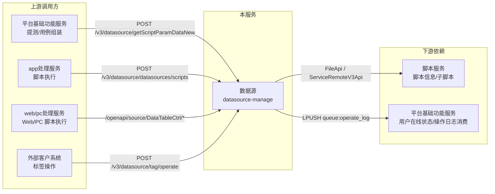

# 产品概述

> **Git 仓库**：`git@git.testin.cn:stock/backend/datasource-manage.git`　**分支**：`syy.release.z7.8.1.0`

## 这是什么

数据源（datasource-manage）是 Testin 云真机平台的**数据源/变量参数化中台**：一个独立部署的 Spring Boot 服务，统一管理"脚本变量表（datatable）"的存储、组织与检索，并在脚本/用例**执行时**把变量值注入执行上下文。它解决三类问题：

1. **变量资产管理**：把脚本执行所需的参数（账号、金额、股票代码等业务数据）按"数据源 → 全局表/实例表 → 行列 → 单元格"的结构统一登记，按目录树组织，按项目（projectId）与企业（eid）隔离。
2. **执行时参数注入**：app处理服务、web/pc处理服务、平台基础功能服务 在执行脚本或提测时，通过开放接口批量取回变量值（含标签筛选、全局变量引用解析），填充到脚本上下文中。
3. **数据治理**：标签（行标记/造数失败标记）、导入导出（Excel/JSON 跨环境搬迁）、历史数据迁移、SQL 表达式取值。

## 用户与使用场景

| 角色 | 典型场景 |
|---|---|
| 测试工程师 | 给脚本建实例表 → 填变量行列数据 → 打标签分组 → 执行时按标签选数据行 |
| 执行引擎（app处理服务 / web/pc处理服务） | 执行脚本前调 `/datasources/scripts` 查脚本绑定的数据源，执行时注入变量值 |
| 提测业务（平台基础功能服务） | 调 `/datasource/getScriptParamDataNew` 取脚本参数数据（含行标签） |
| 外部客户（如国金证券） | 调 `/datasource/tag/operate` 给造数失败的变量值批量打标签 |
| 运维 | Excel 导入导出搬迁数据源、历史数据迁移 |

## 上下游关系

- **被调用**：执行类服务通过 `/openapi/v3/*`（MVC）与 `/openapi/source/*`（ApiServlet）两组入口消费数据，详见 [脚本变量填充实现](../03-实现逻辑/脚本变量填充实现.md) 与 [端到端-脚本全生命周期](../../跨模块链路/端到端-脚本全生命周期.md)。
- **依赖别人**：通过 `api/` 包的远程客户端（`ApiUtil.doPress` + MD5 签名）调 脚本服务 查脚本与子脚本（`FileApi.getChildScriptNos`），调 平台基础功能服务 查用户在线状态；操作日志 LPUSH 到 Redis 队列 `queue:operate_log` 由 平台基础功能服务 消费入库。

## 核心概念

| 概念 | 定义 | 代码/表锚点 |
|---|---|---|
| **数据源（DataSource）** | 一棵变量资产树的根节点，挂在项目目录下；创建时自动带一个全局表和一个 SQL 管理目录 | `source_config` type=1（`SourceTypeEnum.DATA_SOURCE`）；`SourceConfig.java` 注释另提到 type=20 环境数据源，但枚举未定义该值 |
| **目录** | 纯组织节点，最多五层 | `source_config` type=0 |
| **全局表** | 数据源级别的共享变量表，所有实例表可引用；创建数据源时自动创建 | `source_config` type=2，自动创建见 `src/main/java/cn/testin/business/impl/SourceConfigServiceImpl.java` |
| **实例表** | 绑定某个脚本（`script_no`）的变量表；行 = 一组参数取值，列 = 一个变量 | `source_config` type=3 |
| **datatable** | 实例表/全局表的表格实体：`datatable_config`（行列顺序）+ `datatable_col_config`（变量定义）+ `datatable_values`（单元格值） | 见 [datatable_values](../../数据库管理/db_source/datatable_values.md) |
| **变量（列）** | 表的一列即一个变量，含名称、类型、**scope**（global/local）、`show_in_report` | `datatable_col_config` |
| **标签（Tag）** | 打在数据行上的标记（如"造数失败"），用于执行时按标签筛选/排除数据行 | `tag_info` + `datatable_tag_config` |
| **script_no** | 脚本编号，实例表与脚本的绑定键；`unique_scriptno` 唯一约束保证一个数据源内脚本编号不重复 | `source_config.script_no` |

## 三套表族并存

本服务维护三套独立的数据源表族（架构演进的结果），新产品功能主要落在 case/normal 体系：

| 表族 | 场景 | 入口风格 |
|---|---|---|
| legacy（`source_config` + `datatable_*`） | 脚本变量表，功能最全（全局引用/SQL/随机值/标签） | ApiServlet + 部分 MVC |
| case（`case_source` + `case_*`） | 用例数据源，支持用例-数据行绑定（回放指定行） | MVC |
| normal（`normal_source` + `normal_*`） | 简化通用表格数据 | MVC |

详见 [横切-三套数据源表族](../04-复杂功能细节/横切-三套数据源表族.md)。

## 延伸阅读

- [功能总览](功能总览.md) — 逐功能清单与数据模型要点
- [00-首页](../00-首页.md) — 分支无关的技术总览（双入口、技术栈、包结构）
- [术语表](../06-开发指南/术语表.md) — 全局表/实例表/script_no 等概念速查
