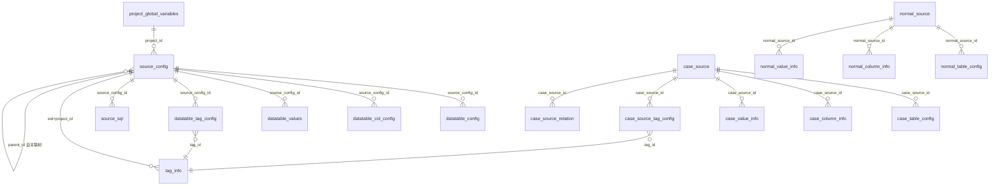

# 存储总览

> 表文档统一集中在 [数据库管理](../../数据库管理/00-数据库总览.md) 维护，本页仅列本服务使用的库并做引用。

数据源 使用以下存储层：

## MySQL（3 个库）

| 库名 | 用途 | 索引页 |
| --- | --- | --- |
| [db_source](../../数据库管理/db_source/00-表索引.md) | 数据源配置、数据表、列定义、值存储、标签、SQL、全局变量（主库） | [00-表索引](../../数据库管理/db_source/00-表索引.md) |
| [db_file](../../数据库管理/db_file/00-表索引.md) | 脚本文件、脚本参数源、脚本参数数据（只读关联查询） | [00-表索引](../../数据库管理/db_file/00-表索引.md) |
| [db_user](../../数据库管理/db_user/00-表索引.md) | 项目信息（只读关联查询） | [00-表索引](../../数据库管理/db_user/00-表索引.md) |

## Elasticsearch

- **用途**：数据源全文检索。`source_config` 表数据同步至 ES，支持按名称、脚本编号、变量名/值等搜索。
- 相关类：`SourceConfigServiceImpl.syncEs()`、ES 索引 `es_datasource`

## Redis

- **用途**：缓存、分布式锁、Token 管理。
- 相关类：`JedisConfig`、`RedisService`
- 配置：`application.yml` 中 `spring.redis`

## 表关系

### db_source 核心表 ER

### 三套表族说明

数据源 有三套独立的数据源表族，服务于不同场景：

| 表族 | 前缀 | 场景 | 状态 |
| --- | --- | --- | --- |
| legacy 数据源 | `source_config` + `datatable_*` | 脚本变量数据驱动测试（历史方案） | 维护中 |
| 用例数据源 | `case_source` + `case_*` | 测试用例关联数据源与回放调度 | 当前主力 |
| 普通数据源 | `normal_source` + `normal_*` | 通用表格数据存储与查询 | 当前主力 |
