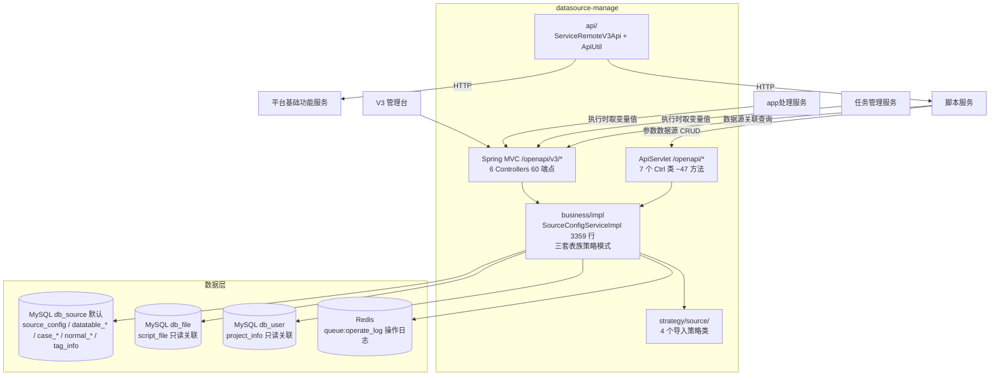

# 总体架构

## 平台定位

数据源（datasource-manage）是 Testin 平台的**数据中心**，负责所有测试数据源的全生命周期管理：脚本变量表（legacy 数据源）、用例数据源、普通数据源（通用表）、项目全局变量、SQL 表达式、标签系统。它为测试执行提供变量参数化能力——测试脚本中的 `${variable}` 在执行时由数据源服务填充实际值。

数据源管理是三套表族并存（legacy `datatable_*` + 用例 `case_*` + 普通 `normal_*`），外部服务（app处理服务、任务管理服务）在脚本执行前调用 `/openapi/v3/datasource/*` 获取变量值注入脚本。

## 系统上下文

## 核心架构决策

### 1. 双入口架构（V1 + V3 共存）

`/openapi/*` → `ApiServlet`：处理 `service/source/` 包下的 Ctrl 类（SourceConfigCtrl / DataTableCtrl / SelectCtrl / SqlCtrl / TagInfoCtrl / ColConfigCtrl / MigrateCtrl），方法入参 `ApiRequest`，返回 JSON 字符串。
`/openapi/v3/*` → `DispatcherServlet`：标准 Spring MVC，6 个 Controller（CaseSourceController 27 端点最大, NormalSourceController, DataSourceController 等），60 个端点。

### 2. 三套数据源表族并存

| 表族 | 用途 | 表 |
|---|---|---|
| legacy（datatable_*） | 脚本变量表，历史遗留 | source_config / datatable_config / datatable_col_config / datatable_values |
| case_* | 用例关联数据源（新） | case_source / case_column_info / case_value_info / case_source_relation / case_source_tag_config / case_table_config |
| normal_* | 通用表数据源（新） | normal_source / normal_column_info / normal_value_info / normal_table_config |

三套表族各自独立，无外键关联。legacy 表仍在维护，用例场景已迁移到 case_* 表族。详见 [横切-三套数据源表族](../04-复杂功能细节/横切-三套数据源表族.md)。

### 3. 多数据源只读关联

除默认 `db_source` 外，`db_file` 和 `db_user` 两个库通过 `@DS` 注解只读关联查询（查脚本信息、项目信息）。不写这两个库——数据源管理负责"数据"，脚本/用户是"元数据"。

### 4. 数据源导入导出策略模式

`strategy/source/` 包 4 个策略类处理不同导入场景：环境数据源导入、全局表导入、实例表导入、用例数据源导入等。`SourceConfigCtrl` 提供 `importDataSourceInfo` / `importVerify` / `getExportSourceTreeNode`。

### 5. ES 同步已废弃

`syncEs()` 方法为空实现，pom 中 ES 5.6.5 依赖残留但代码中无 ES 客户端调用。操作日志走 Redis 队列 `queue:operate_log`（`OperateLogService` LPUSH），由平台基础功能服务消费入库。

## 代码工程一览

| 工程 | 技术栈 | 产物 | 说明 |
|---|---|---|---|
| `datasource-manage` | Java 1.8 / Spring Boot 2.3.7 / Undertow / MyBatis Plus / dynamic-datasource / Druid | jar | 独立 Maven 工程，双 Servlet 注册，Swagger2 |

## 延伸阅读

- [存储总览](00-存储总览.md) — 3 个 MySQL 库 + Redis
- [专题索引](../04-复杂功能细节/专题-索引.md)
- [横切-三套数据源表族](../04-复杂功能细节/横切-三套数据源表族.md)
- [横切-数据源导入策略](../04-复杂功能细节/横切-数据源导入策略.md)
- [核心链路-脚本变量填充](../04-复杂功能细节/核心链路-脚本变量填充.md)
