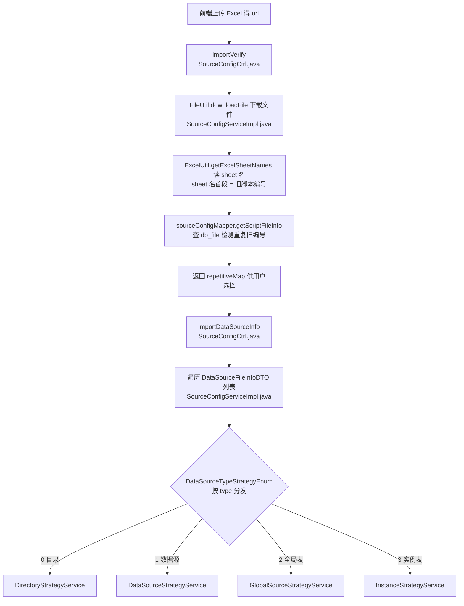

# 数据源管理实现

## 概述

本文描述 legacy 数据源（`source_config` 表族）的管理侧实现：树形存储模型、节点 CRUD、脚本绑定，以及导入导出的代码链路。数据模型概览见 [功能总览](../01-产品功能/功能总览.md)，取值链路见 [脚本变量填充实现](脚本变量填充实现.md)。

## 树形存储模型

全部节点（目录/数据源/全局表/实例表/SQL）存同一张 `source_config`，`parent_id` 自关联成树，`source_id` 指向所属数据源根（`src/main/java/cn/testin/pojo/SourceConfig.java`）。节点类型枚举 `SourceTypeEnum`（type 注释见 `SourceConfig.java`）：

| type | 节点 | 关键字段 |
|---|---|---|
| 0 | 目录 | 仅组织用途 |
| 1 | 数据源 | 树根，创建时 `source_id = 自身 id`（`SourceConfigServiceImpl.java`） |
| 2 | 全局表 | 随数据源自动创建，name="全局表" |
| 3 | 实例表 | `script_no` 绑脚本；`bind=1` 表示默认绑定 |
| 4 / 5 | SQL 管理目录 / 具体 SQL | 后者 `sql_id` 关联 `source_sql` |

辅助表：`datatable_config`（行列序）/ `datatable_col_config`（变量）/ `datatable_values`（值）/ `datatable_tag_config`（行标签）+ `source_sql`。

## 节点 CRUD 链路

入口是 ApiServlet 风格（完整前缀 `/openapi/source/SourceConfigCtrl`，路由机制见 [横切-双入口路由机制](../04-复杂功能细节/横切-双入口路由机制.md)）：

| 方法 | Ctrl | Service | 要点 |
|---|---|---|---|
| 新增 | `SourceConfigCtrl.add`（SourceConfigCtrl.java） | `SourceConfigServiceImpl.add` | 见下 |
| 改名 | `updateById` | `syncSave` | 强制 `projectId=null` 防串项目 |
| 删除 | `delete` | `cascadeRemoveById` | 级联软删子树 |
| 移动 | `moveTo` | `moveTo` | 撞 unique_scriptno 返回重复脚本编号提示 |
| 复制 | `copyTo` | `copyTo` | 深拷贝子树 |
| 树查询 | `getTree` | `getTree` | 支持懒加载（lazy=0） |
| 批量移动 | MVC `DataSourceController.batchMove`（DataSourceController.java） | `batchMoveDataSource` | 较新入口 |

### add 的四道关卡（SourceConfigServiceImpl.add）

1. **项目隔离校验**：创建数据源时校验根目录 projectId 与请求一致；创建目录/实例表时校验所属数据源 projectId——防止切项目组后脏写。
2. **层级限制**：目录向上回溯最多 5 次到数据源根，超出报"目录层级不能超过五层"。
3. **自动骨架**：创建数据源（type=1）时，先回填 `source_id=自身 id`，再自动创建**全局表**（type=2，含 `createConfig` 建 datatable_config）和 **SQL 管理目录**（type=4）；创建实例表（type=3）时自动建表格配置。
4. **唯一约束**：`unique_scriptno` 保证同一数据源内 script_no 唯一；撞索引时 Ctrl 层捕获异常信息里的 `unique_scriptno` 关键字，返回"存在重复脚本编号"（`SourceConfigCtrl.java`，add/moveTo/copyTo 三处都有）。

### 树查询自动建根

MVC 版 `getDataSourceTree`（`SourceConfigServiceImpl.java`）：parentId=0 且项目下无根节点时，自动插入名为"全部数据源"的项目根（type=0）；`lazyTree=0` 只返回当前层，否则一次 DFS 拼全树（`dfsDataSourceTree`）。

### 删除的特殊处理

`batchDeleteInstanceTable`：因 `unique_scriptno` 是**物理唯一索引**而删除是逻辑删（status=0），批量删实例表前先 `physicalBatchDeleteBySourceIds` 物理清掉已逻辑删的记录，再按 50 个一批 `deleteBatchIds`。

## 脚本绑定

| 方法 | 说明 |
|---|---|
| `bindDefaultSource`（SourceConfigCtrl.java） | 脚本绑定默认实例表（scriptNo + sourceConfigId） |
| `bindOtherSource` | 把脚本从原实例表改绑到其它数据源（targetId 文件夹） |
| `selectScriptNoList` | 查脚本是否已被选择（防重复绑定） |
| `selectInfoByScriptNo` | 按 scriptNo 查默认绑定实例表及其全局表 id |
| `syncSourceName` | 脚本改描述时同步实例表名称为 `scriptNo + 描述`（SourceConfigServiceImpl.java，全库按 script_no 扫） |

## 导入导出实现

### 导出

`SourceConfigCtrl.getExportSourceTreeNode`（SourceConfigCtrl.java）→ `SourceConfigServiceImpl.getExportSourceTreeNode`：按 `sourceIdList + scriptNoList` 选定数据源与脚本，构建导出树（数据源=文件夹、实例表=Excel），scriptNoList 为空直接报错。

### 导入（两步）

- **策略装配**：`InitDataSourceImportStrategy`（`src/main/java/cn/testin/strategy/source/InitDataSourceImportStrategy.java`）`@PostConstruct` 把 4 个 Spring 策略 bean 塞进枚举单例，`initMap()` 建 type→枚举映射；分发时 `DataSourceTypeStrategyEnum.getStrategyByType(type).getService().dealDataSourceFileInfo(...)`（`SourceConfigServiceImpl.java`）。
- 注意：策略存在**枚举单例的实例字段**里（非 Spring 注入查找），多实例部署无问题，但新增类型必须同步改枚举 + 装配类。
- 详细导入策略行为见 [横切-数据源导入策略](../04-复杂功能细节/横切-数据源导入策略.md)、[核心链路-数据源导入导出](../04-复杂功能细节/核心链路-数据源导入导出.md)。

### 其它批量/运维能力

| 方法 | 位置 | 说明 |
|---|---|---|
| `batchCopyByScriptNos` | SourceConfigServiceImpl.java | 批量复制脚本时连带复制数据源与实例表（Ctrl:643） |
| `historyDataMigration` |  | 历史数据迁移（运维） |
| `syncEs` |  | **空实现，直接 return true**——ES 同步已废弃，接口保留 |
| `operateTagForNumberGenerationFailed` / `operateTag` |  | 造数失败/通用批量打标签（MVC `/datasource/tag/operate`） |

## 横切：操作日志

管理侧写操作的日志由 `OperateLogService`（`src/main/java/cn/testin/business/impl/log/`）**同步 LPUSH** 到 Redis 队列 `queue:operate_log`，由 平台基础功能服务 消费入库；不走 `task/` 包的 AsyncManager 异步框架。详见 [横切-操作日志与异步任务](../04-复杂功能细节/横切-操作日志与异步任务.md)。

## 关键代码位置表

| 环节 | 类 / 方法 | 位置 |
|---|---|---|
| 树节点实体 | SourceConfig（@TableName source_config） | src/main/java/cn/testin/pojo/SourceConfig.java |
| ApiServlet 入口 | SourceConfigCtrl | src/main/java/cn/testin/service/source/SourceConfigCtrl.java |
| 新增（含骨架） | SourceConfigServiceImpl.add | src/main/java/cn/testin/business/impl/SourceConfigServiceImpl.java |
| 级联删除 | cascadeRemoveById | src/main/java/cn/testin/business/impl/SourceConfigServiceImpl.java |
| 移动 / 复制 | moveTo / copyTo | src/main/java/cn/testin/business/impl/SourceConfigServiceImpl.java |
| 树查询（自动建根） | getDataSourceTree | src/main/java/cn/testin/business/impl/SourceConfigServiceImpl.java |
| 批量删实例表 | batchDeleteInstanceTable | src/main/java/cn/testin/business/impl/SourceConfigServiceImpl.java |
| 导入预检 | importVerify | src/main/java/cn/testin/business/impl/SourceConfigServiceImpl.java |
| 导入分发 | importDataSourceInfo | src/main/java/cn/testin/business/impl/SourceConfigServiceImpl.java |
| 导出树 | getExportSourceTreeNode | src/main/java/cn/testin/business/impl/SourceConfigServiceImpl.java |
| 策略枚举 / 装配 | DataSourceTypeStrategyEnum / InitDataSourceImportStrategy | src/main/java/cn/testin/strategy/source/DataSourceTypeStrategyEnum.java / InitDataSourceImportStrategy.java |
| 批量移动（MVC） | DataSourceController.batchMove | src/main/java/cn/testin/controller/DataSourceController.java |

## 注意事项与坑

1. **`SourceConfigServiceImpl` 是 3359 行的上帝类**：树 CRUD、导入导出、迁移、标签操作全在里面，改动影响面大；`currentProxy`（自注入代理）用于绕开同类内 `@Transactional` 自调用失效。
2. **unique_scriptno 依赖异常字符串匹配**：Ctrl 层靠 `e.getMessage().contains("unique_scriptno")` 识别重复键（SourceConfigCtrl.java），换数据库/驱动导致错误消息变化时该分支静默失效。
3. **物理删 + 逻辑删混用**：批量删实例表先物理清 status=0 记录——逻辑删除配置在 `application.yml`（status 0=删 1=有效），直接手写 SQL 查数据时**必须带 status 条件**。
4. **导入是"下载远端文件"模式**：`importVerify` 收的是文件 url 而非文件流（`FileUtil.downloadFile`），文件需先传到文件服务拿 url；`config.properties` 的 `file.tmp.path` 决定临时目录。
5. **syncSourceName 全库扫**：按 script_no 查 `source_config` 无项目/eid 限定，同一 scriptNo 跨项目的实例表都会被改名。
