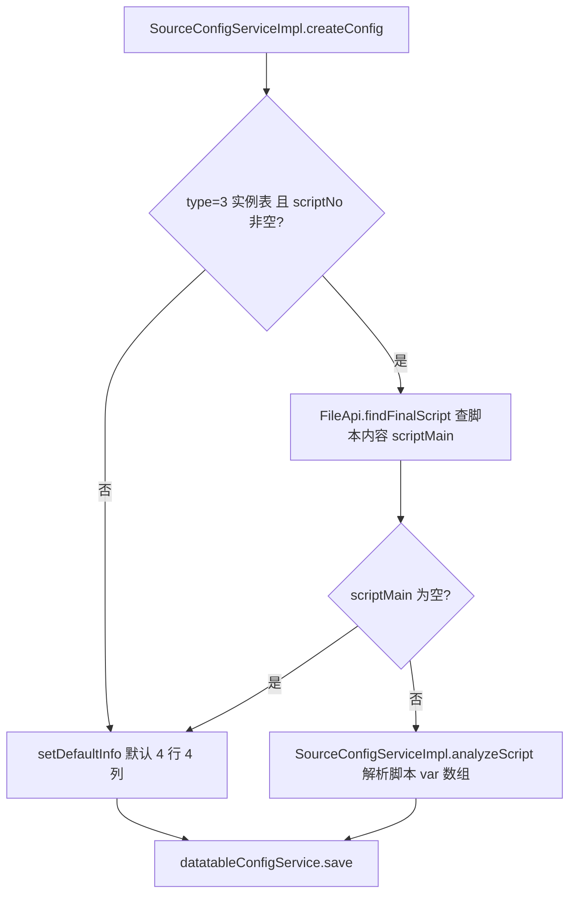
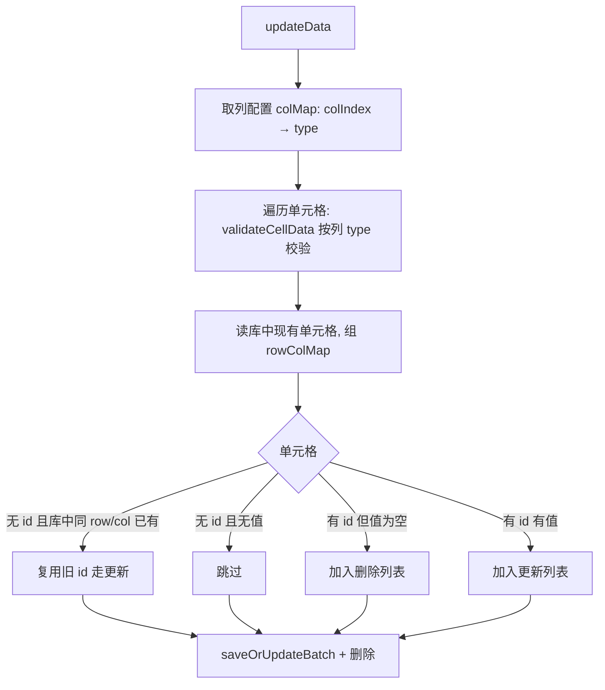

# 数据表与列配置实现

## 概述

`source_config` 的全局表（type=2）与实例表（type=3）节点，各自对应一套「表格实体」，由三张表共同描述：

| 表 | 作用 | 关键字段 |
|---|---|---|
| `datatable_config` | 行列顺序与最大索引 | `rowOrder`/`colOrder`（逗号分隔序号串）、`rowMaxIndex`/`colMaxIndex` |
| `datatable_col_config` | 列 = 变量定义 | `name`（变量名）、`type`、`scope`（GLOBAL/LOCAL）、`quoteType`、`showInReport`、`colIndex` |
| `datatable_values` | 单元格值 | `rowIndex`/`colIndex`、`paramValue`、`valueType`（0手动/1全局引用/2SQL/3随机） |

三者以 `source_config_id` 关联到表节点。本页描述表结构的创建、行列增删、列配置与单元格更新；读取装配见 [数据读取实现](数据读取实现.md)。

## 表创建：createConfig

`SourceConfigServiceImpl.createConfig(sourceConfig)` 在新增全局表/实例表节点时创建 `datatable_config`：

- `setDefaultInfo`：`rowOrder`/`colOrder` 均置 `"1,2,3,4"`，`rowMaxIndex`/`colMaxIndex` 均置 4——全局表和无脚本信息的实例表默认四行四列。
- `analyzeScript`：解析脚本主串 `var` 数组，仅取 `scope=LOCAL` 的变量为列，逐列写 `datatable_col_config`（`getColConfig` 补默认 type/scope/quoteType），再按列写入 `datatable_values`（`valueType=MANUAL_INPUT`），最后调用 `DatatableValuesServiceImpl.updateData` 落库。实例表首次创建且脚本唯一时置 `bind=1`（`createConfig` 内）。

## 行列增删

`DatatableConfigServiceImpl` 维护 `rowOrder`/`colOrder` 序号串与 `rowMaxIndex`/`colMaxIndex`：

- `insertRowOrCol(dto)`：`dto.type` 为 `"1"` 插入行、`"2"` 插入列。取当前 `MaxIndex`，按 `insertCount` 生成新序号 `indexList`，更新 `MaxIndex`；`startNumber=0` 插入到最前，否则插入到指定序号之后（该序号已被他人删除则抛「请重新插入」）。最后把 `rowOrder`/`colOrder` 序列化为逗号串写回。
- `deleteRowOrCol(dto)`：删行（type=1）时删除 `datatable_values`（`row_index in`）与 `datatable_tag_config`（`row_index in`）；删列（type=2）时删除 `datatable_values` 与 `datatable_col_config`（`col_index in`），并同步收缩 `rowOrder`/`colOrder`。注释标注「第一期只能删除一行」。

## 列配置：configCol

`DataTableCtrl.configCol`（ApiServlet `/source/DataTableCtrl/configCol`）→ `ColConfigService.saveConfigCol`：新增或编辑一列（`id` 为空新增、非空编辑），字段含 `name`/`type`/`descr`/`scope`/`colIndex`/`quoteType`/`sqlCol`。约束：`name` 非空；同名触发 `unique_name` 唯一键（返回「存在重复变量名」），同列号触发 `unique_colIndex`（返回「重复的列号」）。

## 行标签：configTag

`DataTableCtrl.configTag` → `TagConfigService.saveConfigTag`：给某行（`rowIndex`）打标签（`tagId`），唯一约束 `unique_tag`。

## 单元格更新：updateData

`DatatableValuesServiceImpl.updateData(dto)` 按「有无 id / 有无值」做 upsert/删除：

- 实例表且单元格含 `${var}` 引用时，先查全局表 `globalMap` 与全局列配置，`validateCellData` 校验引用变量是否存在。
- 值类型校验：`ColConfigEnums` 定义列类型 DEFAULT(0)/STRING(1)/NUMBER(2)/OBJECT(3)/ARRAY(4)；`quoteType` ALL_COLUMN(1，全局整列引用)/MANUAL_SET(2，手动设置单元格)。

## 涉及表

- `source_config`、`datatable_config`、`datatable_col_config`、`datatable_values`、`datatable_tag_config`（db_source，见 [datatable_config](../../数据库管理/db_source/datatable_config.md) 等）。

## 关键代码位置

| 环节 | 类.方法 |
|---|---|
| 表创建 | `SourceConfigServiceImpl.createConfig` / `analyzeScript` / `setDefaultInfo` |
| 行列增删 | `DatatableConfigServiceImpl.insertRowOrCol` / `deleteRowOrCol` |
| 列配置 | `DataTableCtrl.configCol` → `ColConfigService.saveConfigCol` |
| 行标签 | `DataTableCtrl.configTag` → `TagConfigService.saveConfigTag` |
| 单元格更新 | `DatatableValuesServiceImpl.updateData` / `validateCellData` |
