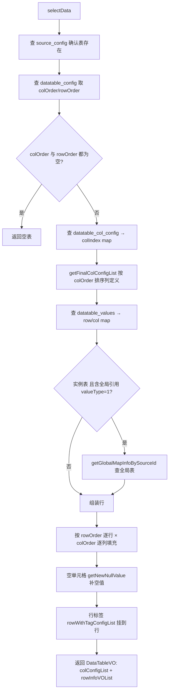

# 数据读取实现

## 概述

数据源服务的「读」侧统一以**内存装配**方式出数：不写复杂 SQL 联表，而是先把 `datatable_config` 的行列序、`datatable_col_config` 列定义、`datatable_values` 单元格值、行标签一次性读出，在内存里按序拼装。本页覆盖表格读取 `selectData`、全局引用解析、表达式取值与四维检索；脚本执行侧取值见 [脚本变量填充实现](脚本变量填充实现.md)。

## selectData：表格内存装配

`DatatableValuesServiceImpl.selectData(dto)`：

- `getFinalColConfigList`：列配置缺省时补「局部变量、字符串类型、报告不显示」的空列定义，保证界面列完整。
- 全局引用：值形如 `${var}` 且 `valueType=GLOBAL` 时，`dealTrueValueWithGlobalTable` 用全局表实际值填 `trueValue`，并给 `errorMsg` 打「找不到此全局变量/未设置全局变量值」的提示。

## 全局引用解析

- `judgeGlobal(str)`：正则 `\$\{(.+?)\}` 提取变量名，未命中返回空串。
- `getGlobalMapInfoBySourceId(sourceId)`：定位数据源下全局表 → 查列配置与单元格值 → 组装 `变量名 → DatatableValues` map（仅取非空值）。
- `dealTrueValueWithGlobalTable(globalMap, dv)`：命中引用则把全局表实际值写入 `trueValue`，供界面展示真实值。

## 表达式取值与全局表桩实现

`DatatableValuesServiceImpl.selectValueByExpression(dto)` 支持 `全局表.变量名.行号` 形式取值：

- 表达式按 `.` 切分，长度 == 3 时 `colName=split[1]`、`index=split[2]`，调 `selectGlobalData` 取该全局变量第 N 行的值；否则返回空串。
- **`selectGlobalData` 当前为桩实现**：只解析并校验 `dto.index`（非数字或 <=0 返回错误码），随后直接返回空 `DataTableVO`，**未查库、未设置 `value`**。因此 `selectValueByExpression` 实际拿到的 `value` 恒为 null——该能力疑似未完成/已废弃，调用方需注意。

## 四维检索

`SelectCtrl`（ApiServlet）对外提供四维检索：`selectSourceConfig`（目录树）、`selectByVariableName`（变量名）、`selectByParamValue`（变量值）、`selectByTagName`（标签名）。其中值/标签检索底层在 `DatatableValuesServiceImpl`：

- `selectByParamValue(dto)`：按变量值模糊检索，`datatableValuesMapper.findPage` 分页（代码注释说明本版弃用 ES，聚合分页不便，直接用 MySQL）。
- `selectByTagName(dto)`：按标签名检索，`tagConfigMapper.findPage` 分页。
- 查询后经 `setSourceConfig` 反查 `source_config` 补目录树信息。

## SQL 表达式取值与连接元数据

`valueType=SQL` 的单元格不在本服务执行 SQL，仅存储「取值来源为 SQL 表达式」的标记；真正的 SQL 表达式在 `source_sql`（`Sql` 实体）登记，由执行侧结合连接元数据执行：

- `SqlCtrl`（ApiServlet `/source/SqlCtrl`）提供 `save`/`selectPage`/`selectAll`/`delete`，落库 `source_sql`。
- `source_sql` 字段：`sourceConfigId`（所属数据源）、`name`、`content`（SQL 内容）、`dbName`（数据库实例名）、`envId`/`dbAlias`/`dbConfigId`（连接元数据）。
- `source_config` 亦带 `sqlId`（type=5 具体 SQL 关联）、`envId`/`dbAlias`/`dbConfigId`；`SourceTypeEnum` 仅定义到 type=4（SQL_SOURCE「SQL语句管理」），type=5 与 type=20（环境数据源）只存在于 `SourceConfig.type` 注释中。

## 涉及表

- `source_config`、`datatable_config`、`datatable_col_config`、`datatable_values`、`datatable_tag_config`、`source_sql`（db_source）。

## 关键代码位置

| 环节 | 类.方法 |
|---|---|
| 表格装配 | `DatatableValuesServiceImpl.selectData` |
| 全局引用 | `DatatableValuesServiceImpl.judgeGlobal` / `getGlobalMapInfoBySourceId` / `dealTrueValueWithGlobalTable` |
| 表达式取值 | `DatatableValuesServiceImpl.selectValueByExpression` / `selectGlobalData` |
| 四维检索 | `DatatableValuesServiceImpl.selectByParamValue` / `selectByTagName` |
| SQL 管理 | `SqlCtrl.save` / `selectPage` / `selectAll` / `delete` |
