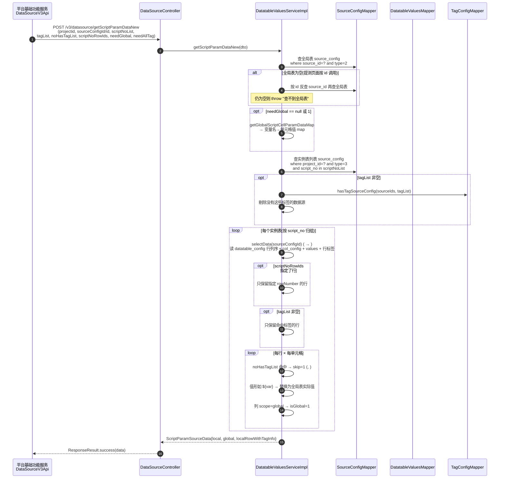
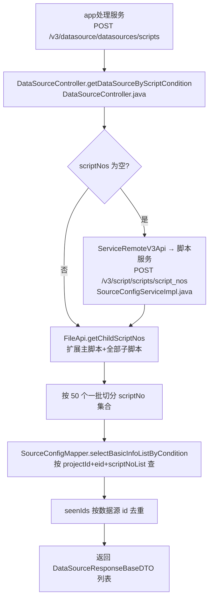

# 脚本变量填充实现

## 概述

本文描述 数据源 最核心的一条对外链路：**执行/提测时如何从 `datatable_values` 取回脚本变量值并注入执行上下文**。主力接口是 `POST /openapi/v3/datasource/getScriptParamDataNew`（提测业务），配套接口 `POST /openapi/v3/datasource/datasources/scripts`（按脚本查数据源清单）。跨模块视角见 [端到端-脚本全生命周期](../../跨模块链路/端到端-脚本全生命周期.md) 第 3 节。

两个接口分工：

| 接口 | 消费方 | 返回 |
|---|---|---|
| `POST /v3/datasource/datasources/scripts` | app处理服务（执行前） | 脚本绑定的数据源**基本信息**清单（含子脚本扩展） |
| `POST /v3/datasource/getScriptParamDataNew` | 平台基础功能服务（提测，`DataSourceV3Api.listScriptParamDataByScriptNoNew`） | 实例表**行列变量值** + 全局变量 map + 行标签 |

## 链路一：getScriptParamDataNew 执行时取值

### 时序图

### 输出结构

`ScriptParamSourceData`（`cn.testin.pojo.third`）三段（`DatatableValuesServiceImpl.java`）：

| 字段 | 结构 | 含义 |
|---|---|---|
| `local` | `Map<scriptNo, List<List<ScriptCellParamData>>>` | 每个脚本的实例表数据：外层行、内层单元格（paramName/paramValue/skip/isGlobal/colId/rowId） |
| `global` | `Map<变量名, ScriptCellParamData>` | 全局表变量（单行值） |
| `localRowWithTagInfo` | `Map<scriptNo, List<List<TagInfo>>>` | 每行携带的完整标签（`needAllTag=1` 时返回） |

### 关键规则（代码依据）

1. **行数即参数组数**：`local` 中每个 list 是一行（一组参数取值），执行侧按行循环驱动脚本参数化。
2. **include 标签（tagList）两级过滤**：先过滤数据源（`tagConfigMapper.hasTagSourceConfig`），再过滤行——行内任一标签命中 tagList 即保留。
3. **exclude 标签（noHasTagList）不删行、打 skip 标记**：命中行内所有单元格 `skip=1`，由执行侧跳过。
4. **全局引用解析**：单元格值形如 `${var}` 时剥壳取变量名，从 globalMap 取实际值替换；全局表无此变量或值为空时**保留原 `${var}` 字面值**。
5. **行/列定位**：`colId`/`colIndex`、`rowId`/`rowIndex` 跟随单元格下发，行列的真实顺序由 `datatable_config.colOrder/rowOrder` 逗号串决定（`selectData`）。
6. **异常吞没**：整个方法 try/catch，异常仅 `Logit.errorLog` 后 **return null**；Controller 仍 `ResponseResult.success(null)`（`DataSourceController.java`）——调用方必须判空。

## 链路二：datasources/scripts 按脚本查数据源

要点：

- **参数校验**：`scriptNos` 与 `condition.scriptType` 同时为空直接报"参数错误"（`DataSourceController.java`）；查完仍无脚本报"无脚本信息，无法查询数据源"（`SourceConfigServiceImpl.java`）。
- **子脚本扩展**：`FileApi.getChildScriptNos` 走 V1 RPC 向 脚本服务 查子脚本，主脚本+子脚本一起去重后查数据源——脚本内引用的子脚本变量一并覆盖。
- **分批 50**：scriptNo 集合用 `JSONArrayUtil.splitJsonArray(..., 50)` 分批查库，避免 IN 过长。

## 涉及表

| 表 | 库 | 作用 | 文档 |
|---|---|---|---|
| `source_config` | db_source | 树节点：定位全局表(type=2)/实例表(type=3)，`script_no` 关联脚本 | [source_config](../../数据库管理/db_source/source_config.md) |
| `datatable_config` | db_source | 行列顺序（colOrder/rowOrder） | [datatable_config](../../数据库管理/db_source/datatable_config.md) |
| `datatable_col_config` | db_source | 变量定义（name/type/scope/descr） | [datatable_col_config](../../数据库管理/db_source/datatable_col_config.md) |
| `datatable_values` | db_source | 单元格值（param_value/value_type/skip） | [datatable_values](../../数据库管理/db_source/datatable_values.md) |
| `datatable_tag_config` | db_source | 行标签关联（include/exclude 过滤依据） | [datatable_tag_config](../../数据库管理/db_source/datatable_tag_config.md) |
| `tag_info` | db_source | 标签定义（needAllTag 时返回名称） | [tag_info](../../数据库管理/db_source/tag_info.md) |

## 关键代码位置表

| 环节 | 类 / 方法 | 位置 |
|---|---|---|
| MVC 入口（取值） | DataSourceController.getScriptParamDataNew | src/main/java/cn/testin/controller/DataSourceController.java |
| 取值主逻辑 | DatatableValuesServiceImpl.getScriptParamDataNew | src/main/java/cn/testin/business/impl/DatatableValuesServiceImpl.java |
| 全局表变量 map | getGlobalScriptCellParamDataMap | src/main/java/cn/testin/business/impl/DatatableValuesServiceImpl.java |
| 表格数据装配 | DatatableValuesServiceImpl.selectData | src/main/java/cn/testin/business/impl/DatatableValuesServiceImpl.java |
| MVC 入口（按脚本查） | DataSourceController.getDataSourceByScriptCondition | src/main/java/cn/testin/controller/DataSourceController.java |
| 按脚本查主逻辑 | SourceConfigServiceImpl.getDataSourceByScriptCondition | src/main/java/cn/testin/business/impl/SourceConfigServiceImpl.java |
| 子脚本扩展 | FileApi.getChildScriptNos | src/main/java/cn/testin/api/FileApi.java |
| 脚本编号条件查询 | ServiceRemoteV3Api → /v3/script/scripts/script_nos | src/main/java/cn/testin/business/impl/SourceConfigServiceImpl.java |
| ApiServlet 旧版取值 | DataTableCtrl.getScriptParamData | src/main/java/cn/testin/service/source/DataTableCtrl.java |

## 注意事项与坑

1. **getScriptParamDataNew 失败返回 null 而非报错**：catch 一切异常后 return null（`DatatableValuesServiceImpl.java`），上游拿到的仍是 success 响应——"查不到全局表"等硬错误也被吞掉，排查执行侧变量为空时先看服务端日志。
2. **全局表是硬依赖**：实例表取值前先定位全局表，找不到直接抛异常（被吞为 null）；`needGlobal=0` 只控制是否返回全局变量值，**不跳过全局表定位**。
3. **tagList 与 noHasTagList 语义不对称**：include 是"过滤"（行整个移除），exclude 是"打 skip 标记"（行保留、skip=1 下发）；旧版 `getScriptParamData`里 skip=1 的行还会用于计算下发总行数，新版没有该逻辑。
4. **`selectData` 全程内存装配**：行列序、列定义、全部单元格、行标签一次读出在内存里拼（-），大实例表（几千行 × 几十列）单次调用内存压力可观；批量脚本场景按实例表逐个调用，无批量 SQL。
5. **旧版接口仍在服役**：`DataTableCtrl.getScriptParamData`（ApiServlet，支持 include/exclude 标签列表）与新版并存，改取值逻辑时需确认调用方走哪个入口，见 [横切-双入口路由机制](../04-复杂功能细节/横切-双入口路由机制.md)。
6. **scriptType 兼容**：`datasources/scripts` 不传 scriptNos 时依赖 脚本服务 的条件接口，跨服务故障会直接抛"无脚本信息"；`getChildScriptNos` 失败同样中断整链。
