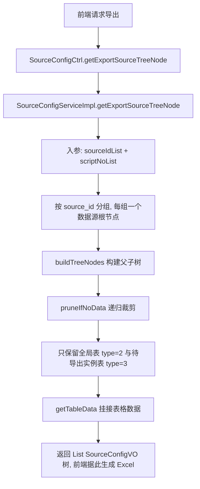
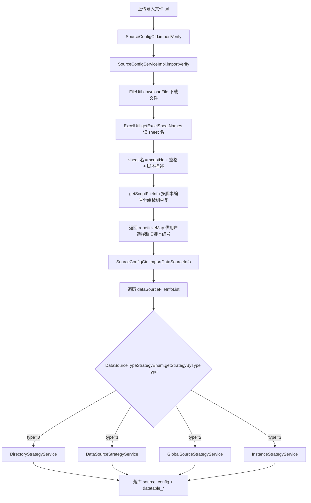

# 核心链路-数据源导入导出

> 数据源跨环境搬迁链路：导出侧返回树结构由前端生成 Excel，导入侧解析 Excel sheet 名并按 `type` 策略分发落库。本服务不负责 ES 同步。

## 导出流程

要点：

- 导出返回的是 `SourceConfigVO` 树对象（带 `childrenList` 与 `tableData`），**不在本服务内生成 Excel 文件**，Excel 序列化由前端完成。
- `pruneIfNoData` 递归裁剪：实例表不在 `scriptNoList` 中则移除；叶子节点非全局表/实例表则移除。
- `getTableData` 对每个保留的表节点调用 `DatatableValuesServiceImpl.selectData` 读取列配置与单元格值，挂到 `tableData` 字段。

## 导入流程

要点：

- 校验（`importVerify`）只做格式与重复脚本编号检测，真正的落库在 `importDataSourceInfo`。
- `importDataSourceInfo` 按 `DataSourceFileInfoDTO.type` 逐个分发到策略，**不调用 syncEs**。
- 每个数据源文件（`DataSourceFileInfoDTO`）以 `nextFile` 链表承载其子表/子节点。

## 关于 syncEs

`SourceConfigServiceImpl.syncEs` 是**空实现**（`return true`），不写任何 Elasticsearch 索引；导入完成后也不会触发 ES 同步。历史文档中「导入后同步 ES 索引 es_datasource」的表述与代码不符。

## 涉及接口

| 入口 | 方法 | 说明 |
| --- | --- | --- |
| ApiServlet | `SourceConfigCtrl.importVerify` | 导入前校验（下载文件 + 解析 sheet 名 + 重复脚本编号检测） |
| ApiServlet | `SourceConfigCtrl.importDataSourceInfo` | 执行导入（策略分发落库） |
| ApiServlet | `SourceConfigCtrl.getExportSourceTreeNode` | 导出树构建（返回 VO 树，前端生成 Excel） |
| ApiServlet | `SourceConfigCtrl.syncEs` | 空实现（return true） |
| ApiServlet | `SourceConfigCtrl.batchCopyDataTableByScriptNos` | 按脚本编号批量复制数据表 |
| ApiServlet | `SourceConfigCtrl.historyDataMigration` | 历史数据迁移 |

## 关键类

- `DataSourceImportStrategy`（抽象策略基类）
- `DirectoryStrategyService` / `DataSourceStrategyService` / `GlobalSourceStrategyService` / `InstanceStrategyService`（4 个具体策略）
- `DataSourceTypeStrategyEnum`（策略枚举，type → 策略映射）
- `InitDataSourceImportStrategy`（`@PostConstruct` 注册策略）
- `SourceConfigServiceImpl.getExportSourceTreeNode` / `importVerify` / `importDataSourceInfo` / `syncEs`
