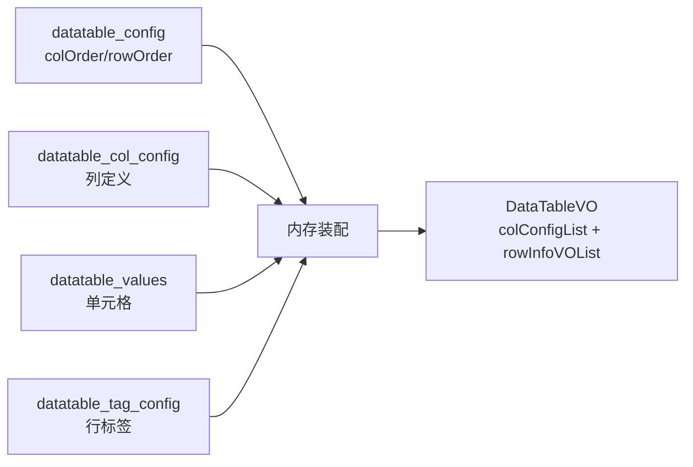

# 核心链路-数据读取

> 分支无关。数据源服务如何把「表 + 列 + 值 + 标签」四类数据装配成可下发的表格/脚本参数。

## 两条读取出口

| 出口 | 入口 | 场景 |
|---|---|---|
| 表格视图 | `DataTableCtrl.selectData`（ApiServlet）→ `DatatableValuesServiceImpl.selectData` | 数据源管理界面展示表格 |
| 脚本参数 | `DataSourceController.getScriptParamDataNew`（MVC）→ `DatatableValuesServiceImpl.getScriptParamDataNew` | 执行/提测批量取变量值 |

两条出口都复用 `selectData` 完成表格装配，区别在于 `getScriptParamDataNew` 在装配结果之上再叠加标签筛选与全局引用解析（见 [脚本变量填充实现](../03-实现逻辑/脚本变量填充实现.md)）。

## 装配核心：selectData

`DatatableValuesServiceImpl.selectData` 是唯一的内存装配入口：

- 顺序由 `colOrder`/`rowOrder` 字符串决定，与数据库物理行无关。
- 缺失的单元格补空值 `getNewNullValue`；缺失的列定义补「局部变量 + 字符串 + 报告不显示」空列。
- 实例表含 `valueType=GLOBAL` 引用时，先查全局表 map，`dealTrueValueWithGlobalTable` 把 `trueValue` 填为实际值。

## 全局引用解析链路

`${变量名}` → `judgeGlobal` 提取变量名 → `getGlobalMapInfoBySourceId` 定位全局表并组 `变量名→值` map → 替换。仅 `valueType=GLOBAL` 才触发，SQL/随机/手动输入不参与。

## 表达式取值与已知风险

- `selectValueByExpression`：`全局表.变量名.行号` → `selectGlobalData` 取第 N 行。
- **风险**：`selectGlobalData` 只校验 index、不查库、不设 value，`selectValueByExpression` 返回值恒为空——该能力疑似未完成，消费方不应依赖。

## 涉及接口

| 入口 | 接口 | 说明 |
|---|---|---|
| ApiServlet | `DataTableCtrl.selectData` | 表格视图 |
| ApiServlet | `DataTableCtrl.selectGlobalData` | 全局表值（桩） |
| ApiServlet | `DataTableCtrl.selectValueByExpression` | 表达式取值 |
| ApiServlet | `SelectCtrl.selectByParamValue` / `selectByTagName` | 值/标签检索 |
| MVC | `DataSourceController.getExecutiveSummaries` | 报告执行摘要（仅 show_in_report=1 列） |
| MVC | `DataSourceController.getScriptParamDataNew` | 脚本参数批量取值 |

## 关联

- [数据读取实现](../03-实现逻辑/数据读取实现.md)
- [脚本变量填充实现](../03-实现逻辑/脚本变量填充实现.md)
