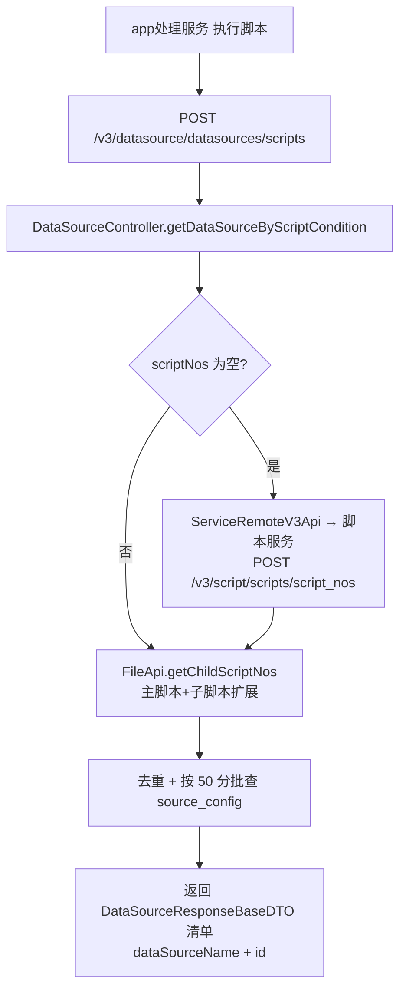

# 核心链路-脚本变量填充

> 脚本执行/提测时，外部服务如何从 数据源 获取变量值注入执行上下文。链路分两步：先按脚本查数据源清单，再按数据源取行列变量值。

## 两步链路

| 步骤 | 接口 | 消费方 | 返回 |
|---|---|---|---|
| 1. 查数据源清单 | `POST /v3/datasource/datasources/scripts` | app处理服务（执行前） | 脚本绑定的数据源**基本信息**（id、dataSourceName），含子脚本扩展 |
| 2. 取变量值 | `POST /v3/datasource/getScriptParamDataNew` | 平台基础功能服务（提测） | 实例表行列变量值 + 全局变量 map + 行标签 |

> 注：第 1 步返回的是数据源**基本信息清单**，不是变量值列表；真正的变量值注入由第 2 步完成。旧版 ApiServlet 入口 `DataTableCtrl.getScriptParamData` 与第 2 步等价，支持 include/exclude 标签列表。

## 第 1 步：按脚本查数据源（datasources/scripts）



- 这一步给执行侧提供「这个脚本绑定了哪些数据源」，执行侧据此再取每个数据源的具体变量值。
- 不传 scriptNos 时先依赖 脚本服务 的条件查询接口 `/v3/script/scripts/script_nos`（`ApiConstant.SCRIPT_NOS_BY_CONDITION`）取脚本编号，再统一走 `FileApi.getChildScriptNos` 扩展子脚本。

## 第 2 步：取变量值（getScriptParamDataNew）

```mermaid
flowchart TD
    A[平台基础功能服务 提测] --> B[POST /v3/datasource/getScriptParamDataNew]
    B --> C[DatatableValuesServiceImpl.getScriptParamDataNew]
    C --> D[定位全局表 type=2]
    C --> E[查实例表 type=3 列表]
    E --> F[tagList 过滤数据源 + 行]
    F --> G[selectData 内存装配<br/>colOrder/rowOrder + col_config + values + 行标签]
    G --> H{单元格值形如 ${var}?}
    H -->|是| I[用全局表实际值替换]
    H -->|否| J[保留原值]
    I --> K[noHasTagList 命中 → skip=1]
    J --> K
    K --> L[返回 ScriptParamSourceData<br/>local + global + localRowWithTagInfo]
```

返回 `ScriptParamSourceData{local, global, localRowWithTagInfo}`：`local` 按脚本号分组（外层行、内层单元格），`global` 全局变量单值 map，`localRowWithTagInfo` 行标签。

## 关键规则

1. **include 标签（tagList）两级过滤**：先按 `hasTagSourceConfig` 过滤数据源，再按行内任一标签命中保留该行。
2. **exclude 标签（noHasTagList）不删行**：命中行所有单元格打 `skip=1`，由执行侧跳过。
3. **全局引用解析**：单元格值 `${var}` 剥壳取变量名，从全局表 map 取实际值；全局表无此变量则保留 `${var}` 字面值。
4. **异常吞没**：`getScriptParamDataNew` 全程 try/catch，异常 return null（Controller 仍返回 success）——调用方必须判空。

## 涉及接口（外部服务消费视角）

| 入口 | 接口 | 说明 |
| --- | --- | --- |
| MVC | `POST /datasources/scripts` | 按脚本条件查数据源基本信息清单 |
| MVC | `POST /getScriptParamDataNew` | 提测取脚本参数数据（变量值 + 标签） |
| ApiServlet | `POST /source/DataTableCtrl/getScriptParamData` | 旧版取值（带 include/exclude 标签） |
| ApiServlet | `POST /source/DataTableCtrl/selectData` | 查询全局/实例表数据 |
| ApiServlet | `POST /source/DataTableCtrl/selectGlobalData` | 查询全局表值 |
| ApiServlet | `POST /source/DataTableCtrl/selectValueByExpression` | 按表达式列表取值 |

## 关联

- 详见 [脚本变量填充实现](../03-实现逻辑/脚本变量填充实现.md)（含时序图、输出结构、注意事项）。
- 跨模块视角：[端到端-脚本全生命周期](../../跨模块链路/端到端-脚本全生命周期.md)。
