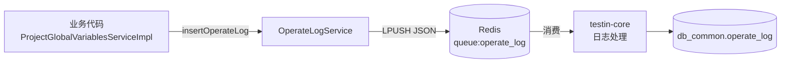

# 横切-操作日志与异步任务

> 分支无关。记录 数据源 的操作日志上报机制与异步任务框架现状。

## 操作日志：Redis 队列上报（不落本库）

数据源 的操作日志**不写本地 MySQL、也不走 HTTP 远程调用**，而是推送到 Redis 队列，由 平台基础功能服务 消费入库：

- 入口：`cn.testin.business.impl.log.OperateLogService#insertOperateLog`
- 队列名常量：`OPERATE_LOG_QUEUE = "queue:operate_log"`（代码注释明确标注"平台基础功能服务 日志处理 队列名称"）
- 报文：`OperateLogDTO`（projectId / moduleType / operateObject / operateType / operateStatus / content / detailContent / createUserId / createUserName / createTime）
- 操作类型枚举：`cn.testin.enums.log.OperateLogEnum`（操作对象 + 操作类型），状态枚举 `OperateLogStatusEnum`（成功/失败）
- 容错：整个推送包裹 try/catch，失败仅 `Logit.errorLog`，不影响主流程

### 当前接入点

本分支仅**项目全局变量**的增/删/改接入了操作日志（`ProjectGlobalVariablesServiceImpl` 中 `add`/`del`/`edit`/`editByVarName` 4 个方法共 10 处调用，成功/失败各上报一次，`edit` 与 `editByVarName` 各含一处额外失败分支）：

| 操作 | OperateLogEnum |
| --- | --- |
| 新增全局变量 | `PROJECT_GLOBAL_VARIABLES_ADD` |
| 删除全局变量 | `PROJECT_GLOBAL_VARIABLES_DELETE` |
| 编辑全局变量 | `PROJECT_GLOBAL_VARIABLES_UPDATE` |

数据源（legacy/case/normal 三套表族）的 CRUD 当前**未接入**操作日志。

## 异步任务框架：已搭好但无业务使用

`cn.testin.task` 包提供了与 平台基础功能服务 同款的异步框架：

- `AsyncManager`（单例，内部 `ThreadPoolExecutor`）
- `AsyncFactory`（任务工厂）
- `Threads`（线程工具）
- `ShutdownManager`（`@PreDestroy` 时 `AsyncManager.me().shutdown()` 优雅关停）
- `AsyncConfig`（`ThreadPoolTaskExecutor`，核心线程 = CPU × 2，`@EnableAsync`）

**现状**：全代码库没有任何 `AsyncManager.me().execute(...)` / `AsyncFactory.xxx(...)` 调用，也没有 `@Async` 方法——框架是从 平台基础功能服务 平移过来的骨架，当前仅关停钩子被使用。操作日志推送是**同步** lpush，并未走该异步框架。

## 关联

- 消费方：平台基础功能服务（queue:operate_log 消费端，见 [横切-模块间通信](../../平台基础功能服务/04-复杂功能细节/横切-模块间通信.md)）
- 接口文档：[ProjectGlobalVariablesController](../07-开放接口文档/数据源管理/ProjectGlobalVariablesController.md)
- 相关专题：[横切-双入口路由机制](横切-双入口路由机制.md)
