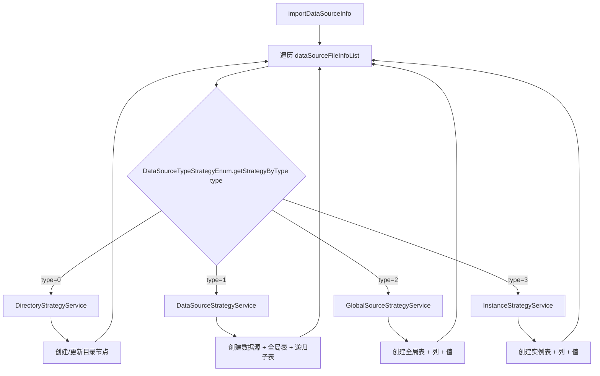

# 横切-数据源导入策略

> 数据源导入使用策略模式，4 个具体策略类分别处理不同类型节点的导入逻辑。

## 策略类结构

```
strategy/source/
├── DataSourceImportStrategy.java      // 抽象策略基类
├── DataSourceStrategyService.java     // 数据源导入策略（type=1）
├── DataSourceTypeStrategyEnum.java    // 策略枚举（type → 策略映射）
├── DirectoryStrategyService.java      // 项目组节点/目录导入策略（type=0）
├── GlobalSourceStrategyService.java   // 全局表导入策略（type=2）
├── InstanceStrategyService.java       // 实例表导入策略（type=3）
└── InitDataSourceImportStrategy.java  // 策略初始化/注册
```

## 策略分发

`DataSourceTypeStrategyEnum.getStrategyByType(type)` 根据 `source_config.type` 分发到对应策略；映射由 `InitDataSourceImportStrategy.init`（`@PostConstruct`）注入并调用 `initMap` 建索引：

| type | SourceTypeEnum | 策略类 | 导入内容 |
|---|---|---|---|
| 0 | PROJECT_SOURCE（项目组节点/根目录） | `DirectoryStrategyService` | 创建/定位目录 |
| 1 | DATA_SOURCE（数据源） | `DataSourceStrategyService` | 创建数据源节点 + 补全局表 + 递归子表 |
| 2 | GLOBAL_SOURCE（全局表） | `GlobalSourceStrategyService` | 创建全局表 + 列 + 值 |
| 3 | LOCAL_SOURCE（局部表/实例表） | `InstanceStrategyService` | 创建实例表 + 列 + 值 |

> type=5（具体 SQL）与 type=20（环境数据源）不在 `SourceTypeEnum` 中，导入策略未覆盖。

## 入口

`SourceConfigServiceImpl.importDataSourceInfo` 遍历 `dataSourceFileInfoList`，对每个 `DataSourceFileInfoDTO` 按 `type` 取策略执行 `dealDataSourceFileInfo`。

## 导入流程



> 注：`DataSourceStrategyService` 处理 type=1 时先创建数据源节点（`source_id` 自指），若 `nextFile` 中无全局表则调用 `createDefaultGlobalTable` 兜底补建，再递归处理其余子表。
