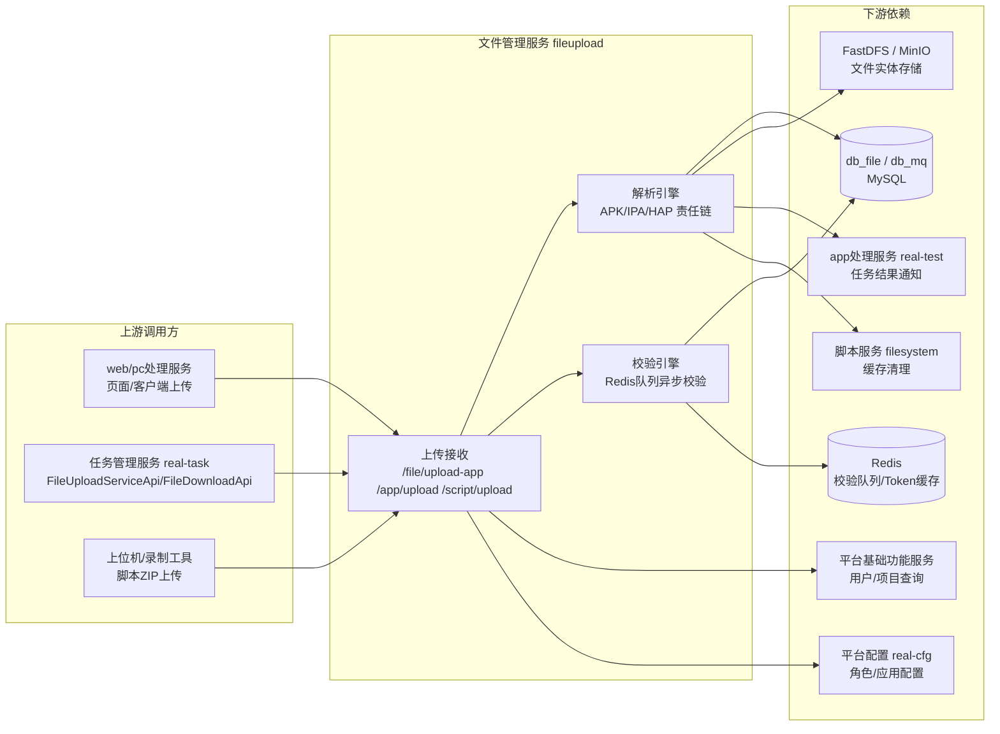

# 产品概述

> **Git 仓库**：`git@git.testin.cn:stock/backend/fileupload.git`　**分支**：`syy.release.z7.8.1.0`

## 这是什么

文件管理服务（工程名 `fileupload`，WAR 包 `fileupload-web`）是 Testin 云真机平台的**文件上传解析中心**：所有进入平台的文件类资源（App 安装包、自动化脚本、结果文件、附件）都经由它接收、存储、解析与校验，然后以 **URL 形式**（appUrl / scriptUrl）在全链路流转——上位机与各下游服务只拿 URL，自行下载文件实体。

它解决四类问题：

1. **App 包上传与解析**：接收 APK（Android）/ IPA（iOS）/ HAP（鸿蒙）安装包，自动解析出包名、版本、图标、MD5、RSA 签名，登记入库并产出可下载的 appUrl。
2. **脚本上传**：Web 录制脚本、ZIP 脚本包的接收与存储，维护脚本版本、步骤明细与父子调用关系。
3. **脚本异步校验**：对脚本做 URL 可达性、步骤合法性、依赖有效性校验，校验任务经 Redis 队列异步执行，结果回写库表并同步给用例侧。
4. **文件存储与查询**：统一登记所有文件元数据（common_file 表），底层存储在 FastDFS / MinIO 之间按部署配置二选一。

## 用户与使用场景

| 角色 | 典型场景 |
|---|---|
| 测试工程师（页面） | 上传 App 安装包 → 平台解析出包信息 → 在任务中选择该 App 提测 |
| 上位机 / 客户端 | 录制脚本后上传 ZIP → 平台异步校验脚本可用性 → 脚本状态回显 |
| 任务管理服务（real-task） | 通过 FileUploadServiceApi / FileDownloadApi 调用本服务 `/openapi` 体系存取任务相关文件 |
| 内部运维 | 调用 `/api/checkScript` 批量重检历史脚本、清理磁盘、重签 keystore |

## 与脚本服务的分工与表共享

文件管理服务与**脚本服务**（工程名 filesystem）共享 `db_file` 表族，是同一个数据域的两个进程：

| 维度 | 文件管理服务（fileupload） | 脚本服务（filesystem） |
|---|---|---|
| 职责 | 文件**写入侧**：上传、解析、校验、入库 | 脚本**读取/管理侧**：脚本 CRUD、版本管理、查询展示 |
| 共享表 | common_file / script_file / script_step / script_check / script_relation / script_at_last 等 db_file 表族 | 同左 |
| 交互 | 写完后通过 `FileApi.cleanCacheByFileId` 通知脚本服务清缓存（`src/main/java/cn/testin/filecloud/core/chain/processor/AppFileProcessor.java`） | 缓存失效后回源 db_file |

分工记忆法：**文件管理服务管"进"，脚本服务管"用"**。文件进来时的一切副作用（解析、校验、建关系、发通知）在本服务；脚本被任务/用例消费时的查询与编辑在脚本服务。

## 上下游

- **上游**：页面端（经 web/pc处理服务转发）、任务管理服务（real-task，通过 `/openapi` 体系的 FileDownloadApi/FileUploadServiceApi）、上位机录制工具。
- **下游存储**：MySQL 双库（db_file 业务 + db_mq 消息）、Redis（校验队列、Token 缓存）、FastDFS 或 MinIO（文件实体，部署时二选一）。
- **下游服务**：平台基础功能服务（用户/项目信息）、平台配置（real-cfg）、app处理服务（real-test，任务完成通知）、脚本服务（缓存清理）。

## 核心概念

| 概念 | 含义 |
|---|---|
| appUrl / scriptUrl | 文件在平台上的唯一流转凭证。全链路只传 URL，不传文件实体；消费方自行下载。URL = `Config.getPublicFileBaseUrl()` + 存储返回的 fileId/objectName（`src/main/java/cn/testin/utils/Config.java`） |
| common_file | 文件注册中心表，所有上传文件的元数据（MD5、URL、大小、过期时间）都在此登记，见 [common_file](../../数据库管理/db_file/common_file.md) |
| 责任链处理 | 上传后由 `FileProcessFactory` 按 `@ProcessorOrder` 排序逐个 `care()` 匹配处理器（ApkFileProcessor / IpaFileProcessor / HapFileProcessor / 脚本/视频处理器），见 [横切-文件上传责任链](../04-复杂功能细节/横切-文件上传责任链.md) |
| 校验任务（ScriptCheckTask） | 脚本校验的载体对象，携带 scriptFile、scriptUrl、步骤列表，经 Redis 队列 `:fileupload:script.check` 异步消费，见 [脚本校验引擎实现](../03-实现逻辑/脚本校验引擎实现.md) |
| MD5 查重 | 同一文件重复上传不重复存储：按 MD5 命中 common_file 直接复用已有记录与 URL |
| 双入口 | Spring MVC（`/`, `/openapi/v3/*`）+ 原生 ApiServlet（`/*`，`action=fs&op=类.方法` 反射调用）+ 旧版原始 Servlet（`/HttpPostUpload` 等），详见 [00-首页](../00-首页.md) |

## 延伸阅读

- [功能总览](功能总览.md) — 逐功能清单与端点速查
- [App包上传与解析实现](../03-实现逻辑/App包上传与解析实现.md) / [脚本校验引擎实现](../03-实现逻辑/脚本校验引擎实现.md) — 两条核心链路的代码级实现
- [表关系总览](../02-技术架构/表关系总览.md) — db_file 表 ER 图
- [端到端-App包上传与使用](../../跨模块链路/端到端-App包上传与使用.md) / [端到端-脚本全生命周期](../../跨模块链路/端到端-脚本全生命周期.md) — 跨模块视角
