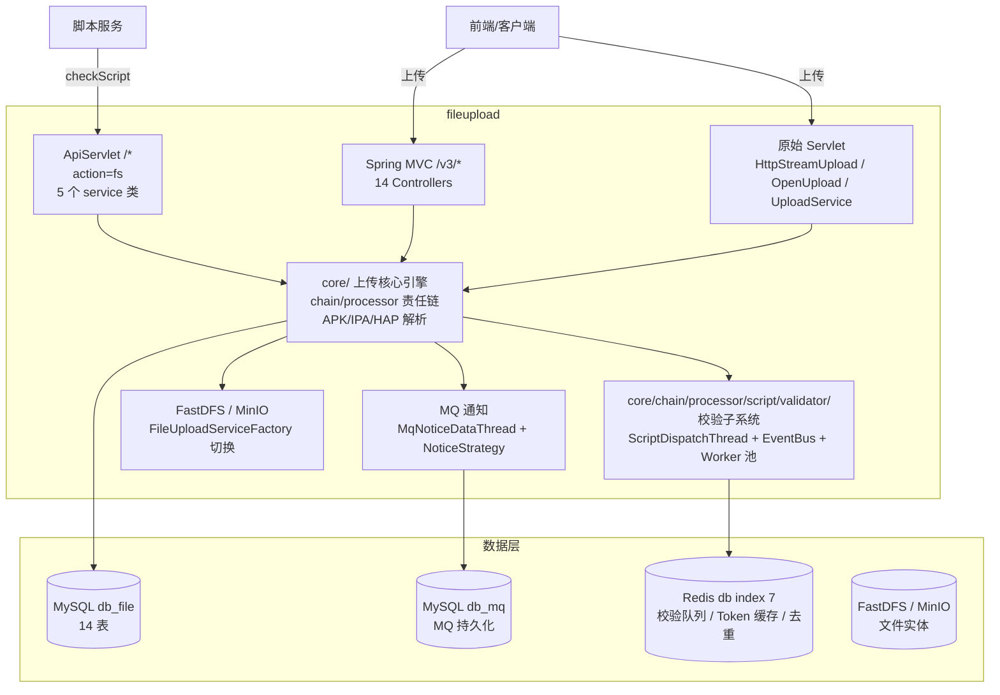

# 总体架构

## 平台定位

文件管理服务（fileupload）是 Testin 平台的**文件中心**，负责：APP 文件上传与解析（APK/IPA/HAP）、脚本文件上传（ZIP/Web 录制）、脚本校验（步骤合法性/URL 可达性）、分片上传与断点续传、文件存储（FastDFS/MinIO 双后端）。

它与脚本服务（filesystem）**共享 db_file 数据库**——文件管理服务管上传解析与校验引擎（生产者），脚本服务管 V3 管理台与业务编排（消费者）。两服务通过 `checkScript` API 和 db_file 表族耦合。

## 系统上下文

## 核心架构决策

### 1. 非 Spring Boot（传统 Spring 4.x WAR）

文件管理服务是整个平台中唯一不使用 Spring Boot 的服务。Spring Framework 4.x + XML 配置 + Tomcat WAR 部署。这是历史最久的服务，先于公司微服务化改造。依赖注入混合 Spring XML + `@Resource`/`@Autowired` 注解。

### 2. 责任链模式处理多种文件类型

`GenericFileProcess.processsFacade()` → `FileProcessFactory` 责任链：`ApkFileProcessor`（APK 解析，AAPT）→ `IpaFileProcessor`（IPA 解析，PlistHandler）→ `HapFileProcessor`（鸿蒙 HAP）→ `DefaultUploadFileProcessor`（通用文件）→ `VideoFileProcessor`（视频）。每种 Processor 可独立启用/禁用。

### 3. 双文件存储后端（FastDFS + MinIO）

通过 `FileUploadServiceFactory` 根据配置切换。FastDFS 是传统分布式文件系统（历史遗留），MinIO 是 S3 兼容对象存储（新方案）。两套实现都实现 `IFileUploadService` 接口，上传方无感知。

### 4. 脚本校验 EventBus + Redis 队列

`ScriptFileProcessorV3` 上传后触发 `SyncCheckScriptService.asyncCheck()` → 任务进 Redis 队列 → `ScriptDispatchThread` 消费 → `CheckTaskSupport` 分派给 Worker 线程池 → EventBus 发布校验事件 → 观察者处理（步骤合法性 `CheckScriptStepTask`、URL 可达性 `CheckScriptUrlTask`）。校验结果回调通知脚本服务。

### 5. 分片上传（chunk check → upload → merge）

大文件分片上传三步：`/app/checkChunk` 检查已有分片（断点续传）→ `/app/upload` 逐个上传分片 → `/app/mergeChunk` 合并分片。合并由 `FileMergeThread` 从 Redis 队列消费分片合并任务。

## 代码工程一览

| 工程 | 技术栈 | 产物 | 说明 |
|---|---|---|---|
| `fileupload` | Java 1.8 / Spring 4.x / Tomcat 8+ / MyBatis / Druid / FastDFS + MinIO | WAR | 传统 Maven WAR 工程，`web.xml` + Spring XML 配置 |

## 端口与地址速查

| 项 | 值 | 说明 |
|---|---|---|
| 服务 HTTP | 8080（Tomcat 默认） | WAR 部署 |
| 上传端点 | `/file/upload-app` | APP 上传 |
| 分片上传 | `/app/upload`, `/app/checkChunk`, `/app/mergeChunk` | 大文件分片 |
| 脚本校验 | `/checkScript` | 内部接口，脚本服务调用 |
| FastDFS tracker | 配置于 `fdfs_client.conf` | — |

## 延伸阅读

- [存储总览](00-存储总览.md) — db_file 14 表 + db_mq + Redis + FastDFS/MinIO
- [专题索引](../04-复杂功能细节/专题-索引.md)
- [横切-文件上传责任链](../04-复杂功能细节/横切-文件上传责任链.md)
- [横切-脚本校验链路](../04-复杂功能细节/横切-脚本校验链路.md)
- [核心链路-APP上传与解析](../04-复杂功能细节/核心链路-APP上传与解析.md)
- [跨模块：App 包上传与使用](../../跨模块链路/端到端-App包上传与使用.md)
