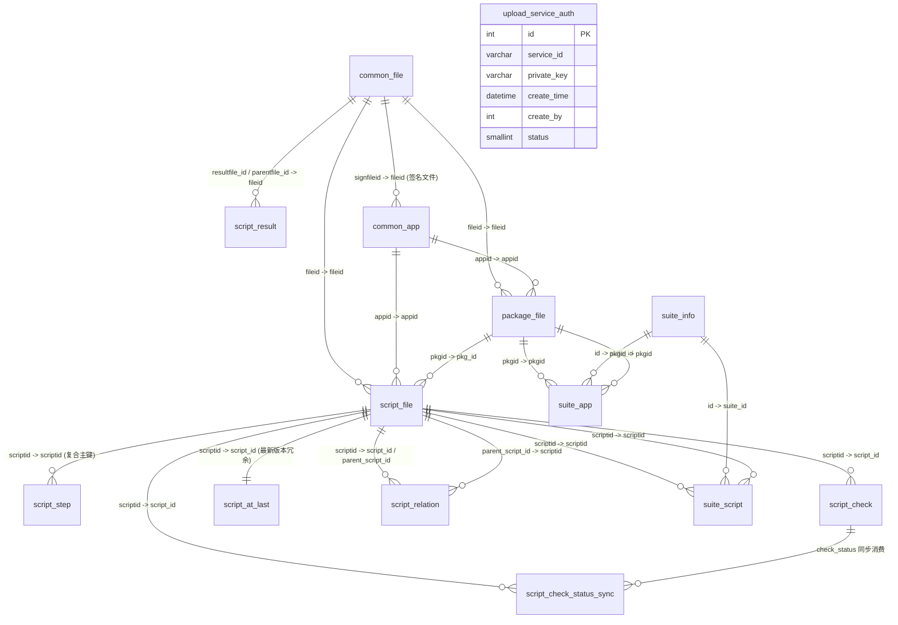

# db_file 表关系总览

> 数据库：`db_file`
> 项目模块：文件管理服务
> 分支：syy.release.z7.8.1.0

## ER 图（Mermaid）



## 核心实体关系说明

### 文件系统链（File Storage Chain）

```
common_file (文件注册中心)
  ├── package_file  (APK/IPA 包文件)
  ├── script_file   (脚本文件)
  └── script_result (结果文件/父文件)
```

[common_file](../../数据库管理/db_file/common_file.md) 是整个系统的文件注册中心，所有上传的实体文件均在此登记元数据。[package_file](../../数据库管理/db_file/package_file.md)、[script_file](../../数据库管理/db_file/script_file.md)、[script_result](../../数据库管理/db_file/script_result.md) 通过 `fileid` 外键关联。

### 应用版本链（App Version Chain）

```
common_app (应用注册)
  └── package_file (版本包, 1:N)
        └── script_file (脚本, 1:N)
```

一个应用可以上传多个版本包，每个包可以被多个脚本引用。

### 脚本核心链（Script Core Chain）

```
script_file (脚本实体, 版本化存储)
  ├── script_step    (步骤明细, 1:N, 复合主键)
  ├── script_check   (有效性检查, 1:1 per scriptid)
  ├── script_relation (父子调用关系, N:M to self)
  ├── script_at_last  (最新版本冗余, 1:1 per script_no+project_id)
  └── script_check_status_sync (跨节点同步队列)
```

[script_file](../../数据库管理/db_file/script_file.md) 是整个自动化测试系统的核心表。同一脚本名（scriptno）保留所有历史版本（scriptid），通过 `history` 字段区分当前版本和历史版本。

### 套件聚合链（Suite Aggregation Chain）

```
suite_info (套件主表)
  ├── suite_app    (绑定应用, N:M)
  └── suite_script (绑定脚本, N:M)
```

一个套件可以包含多个应用和多个脚本，实现灵活的测试组合。[suite_app](../../数据库管理/db_file/suite_app.md) 和 [suite_script](../../数据库管理/db_file/suite_script.md) 是典型的多对多关联表。

### 异步同步链（Sync Chain）

```
script_check (检查结果)
  └── script_check_status_sync (同步队列)
```

当脚本在某节点完成有效性检查后，[script_check_status_sync](../../数据库管理/db_file/script_check_status_sync.md) 记录待同步任务，后台任务消费并推送到其他节点。

## 非规范化表

| 表名 | 源表 | 用途 |
|---|---|---|
| [script_at_last](../../数据库管理/db_file/script_at_last.md) | script_file | 按 script_no + project_id 缓存每个脚本的最新版本，加速查询 |

由存储过程 `script_to_last()` 全量刷新。

## 视图

| 视图名 | 涉及表 | 用途 |
|---|---|---|
| `view_app_info` | common_app + package_file + common_file | 聚合应用+包+文件完整信息 |
| `view_suite_app` | suite_info + suite_app | 聚合套件+应用信息（含 projectid, eid） |

## 存储过程 / 函数

| 名称 | 说明 |
|---|---|
| `getParentScripts(scriptNo INT)` | 递归查询 script_relation 表，返回指定脚本的所有父级脚本编号（逗号分隔） |
| `script_to_last()` | TRUNCATE 后全量重建 script_at_last 表，按 scriptno 分组取 max(scriptid) |
