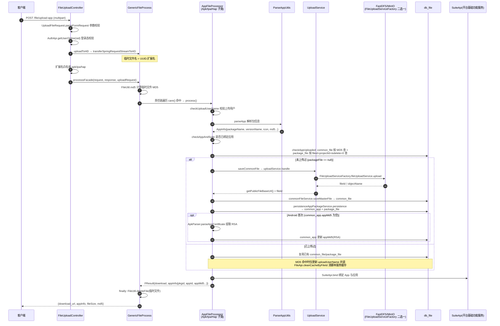

# App包上传与解析实现

> 本文描述 `POST /file/upload-app` 从 HTTP 接收到产出 appUrl 的代码级全链路：临时落盘 → 责任链分发 → App 解析 → MD5 查重 → 文件存储（FastDFS / MinIO）→ 三表入库 → 绑定应用 → 返回下载地址。产品视角见 [核心链路-APP上传与解析](../04-复杂功能细节/核心链路-APP上传与解析.md)，分片与 URL 两种变体见 [核心链路-分片上传](../04-复杂功能细节/核心链路-分片上传.md) / [核心链路-URL上传](../04-复杂功能细节/核心链路-URL上传.md)——三者最终都汇聚到本文的解析入库段。

## 链路总览

整条链路可概括为 7 步：

1. `FileUploadController.uploadApp` 校验参数与 sid 登录态（`src/main/java/cn/testin/filecloud/web/controller/FileUploadController.java`）；
2. multipart 流式写入本地临时文件（`transferSpringRequestStreamToHD`，`src/main/java/cn/testin/filecloud/core/GenericFileProcess.java`），扩展名白名单校验（仅 apk/ipa/hap，`FileUploadController.java`）；
3. `GenericFileProcess.processsFacade` 计算临时文件 MD5，遍历责任链找到第一个 `care()` 命中的处理器（`GenericFileProcess.java`）；
4. `ApkFileProcessor`/`IpaFileProcessor`/`HapFileProcessor` 命中后委托父类 `AppFileProcessor.process` 统一处理（`src/main/java/cn/testin/filecloud/core/chain/processor/AppFileProcessor.java`）；
5. `ParseAppUtils.parseApp` 解析包信息（包名/版本/图标/MD5），按 MD5 + 项目查重（`checkAppUploaded`，`AppFileProcessor.java`）；
6. 未上传过则 `UploadService.handle` 上传到文件存储（FastDFS 或 MinIO），登记 `common_file`，`PersistenceAppPackageService.persistence` 写 `common_app` + `package_file`，Android 首次上传提取 RSA 签名（`buildAppRSA`，`AppFileProcessor.java`）；
7. `SuiteApi.bind` 绑定 App 与应用，组装返回 JSON（含 `download` appUrl、`appInfo{pkgid, appId, appMd5...}`）；`processsFacade` 的 `finally` 删除临时文件（`GenericFileProcess.java`）。

## 全链路时序图

## 逻辑详解

### 1. 入口与鉴权

`FileUploadController.uploadApp`（`FileUploadController.java`）：

- `public_access_auth` 默认为 true，此时必须带 sid，经 `AuthApi.getUserOnline(sid)` 换 uid/eid/uname 注入 uploadRequest；为 false 时跳过登录校验（内部调用）。
- 扩展名硬编码白名单 `apk/ipa/hap`，其余直接返回"该接口只接受App格式的文件"。
- 通过校验后把 bizCode 置为 `BizCode.parseApp`，交给 `processsFacade`。

### 2. 责任链分发

`processsFacade`（`GenericFileProcess.java`）从 Spring 取 `FileProcessFactory` 的有序处理器列表，逐个 `care(uploadRequest)`，第一个返回 true 的处理器独占处理。App 类处理器的关键点：

- 链上真正生效的 App 处理器是三个子类：`ApkFileProcessor`（order=2）、`IpaFileProcessor`（order=4）、`HapFileProcessor`（order=6），按扩展名 + bizCode 匹配后命中；父类 `AppFileProcessor` 虽标注 `@ProcessorOrder(order = 3)`，但不实现 `FileUploadProcessor` 接口、不会被工厂收集进链，仅供子类复用 `process(UploadFileRequest, ParseAppConfig)`（`AppFileProcessor.java`）；
- 任何异常都会尝试 `TransactionAspectSupport.currentTransactionStatus().setRollbackOnly()` 回滚事务，`RollbackTransactionException` 携带业务错误码透出给前端；
- **无论成败，finally 都删除临时文件**——临时文件不进清理队列，生命周期只覆盖这一次请求。

### 3. AppFileProcessor.process 主流程

`AppFileProcessor.process`（`AppFileProcessor.java`）按固定顺序做 8 件事，对应时序图 9-22 步。其中三个判断决定走向：

| 判断 | 方法 | 走向 |
|---|---|---|
| App 是否已绑定应用 | `checkAppAndSuite` | 页面上传且已绑定 → 抛 `SUITE_APP_BIND` 错误；V3 保存（from="/V3"）跳过该校验 |
| 文件是否上传过 | `checkAppUploaded` | MD5 在 common_file 存在 且 package_file 存在同项目未删记录 → 直接复用 |
| 是否首次上传 | `saveAppFile` | common_file 按 MD5 已存在 → 只更新上传人 + 清缓存；不存在 → 走完整存储+入库 |

注意查重是**两段式**：先 `commonFileMapper.selectByMd5AndUid` 按 MD5 找 common_file，再对每个候选查 `package_file` 的 `fileid + project_id + isdelete=0`。跨项目传同一个包会在各项目各建一条 package_file，但 common_file 与存储实体只有一份。

### 4. 文件存储：FastDFS / MinIO 二选一

存储层通过工厂做**部署期二选一**，不是运行时兜底：

- `FileUploadServiceFactory.getInstance`（`src/main/java/cn/testin/filecloud/core/FileUploadServiceFactory.java`）：`Config.MINIO_USABLE=true` 取 Spring bean `minioUploadService`（`MinioFileUploadServiceImpl`，`src/main/java/cn/testin/business/impl/MinioFileUploadServiceImpl.java`），否则取 `fastDFSFileUploadService`（`FastDFSFileUploadServiceImpl`，`src/main/java/cn/testin/business/impl/FastDFSFileUploadServiceImpl.java`）。结果缓存于静态字段 `fileUploadService`，进程内不再切换。
- `Config.MINIO_USABLE` 优先读环境变量 `MINIO_USABLE`，其次 `config.properties` 的 `minio.usable`（`src/main/java/cn/testin/utils/Config.java`）。
- 对外 URL 统一由 `Config.getPublicFileBaseUrl()` 拼前缀（`Config.java`）：MinIO 模式用 `MINIO_BASE_URL`，FastDFS 模式用 `TRACKER_SERVICE_PATH`，后缀是存储返回的 fileId/objectName；带原始文件名时拼 `?filename=xx.suffix`（`FastDFSFileUploadServiceImpl.java`）。
- FastDFS 侧内部按 10M 分档：≤10M 直接 `upload_file1`，>10M 走 `uploadFileByChunk` 断点续传（`src/main/java/cn/testin/filecloud/core/fdfs/FastDFSService.java`）。
- 入口统一收口在 `UploadService.handle`（`src/main/java/cn/testin/filecloud/core/UploadService.java`）：存储返回空则整体返回 null，上层 `AppFileProcessor.saveCommonFile` 据此抛 `SERVER_TO_FastDFS_ERROR`（`AppFileProcessor.java`）。

### 5. 入库与 RSA

`saveAppFile`（`AppFileProcessor.java`）→ `saveCommonFile`→ `PersistenceAppPackageService.persistence`：

- `common_file`：登记 MD5/URL/大小/过期时间/上传人，主键 fileid 是后续所有关联的锚点；
- `common_app`：以 `(packageName, platformId, ostype)` 为唯一键 `INSERT ... ON DUPLICATE KEY UPDATE`；
- `package_file`：appid + fileid 的版本包记录；
- Android 且 `common_app.appMd5` 为空时，`ApkParser.parseAppCertificate` 提取 RSA 签名回写（`AppFileProcessor.java`）——注意 **RSA 存在 common_app 的 appMd5 字段**，与文件 MD5 复用同一列。

### 6. 绑定与返回

`SuiteApi.bind`（`AppFileProcessor.java`）把 App 绑定到应用（suiteId 为空时自动新建绑定），返回 0 视为失败抛 `SUITE_APP_BIND_FAILED`。最终返回 JSON 关键字段：`download`（appUrl）、`appInfo.appId / pkgid / appMd5 / appVersion / commonFileId`。

## 涉及表

| 表 | 操作 | 说明 |
|---|---|---|
| [common_file](../../数据库管理/db_file/common_file.md) | 按 MD5 查 / insert / update | 文件注册中心，URL 唯一存放处 |
| [common_app](../../数据库管理/db_file/common_app.md) | upsert / update | 应用注册（包名+平台唯一），appMd5 列存 RSA 签名 |
| [package_file](../../数据库管理/db_file/package_file.md) | 查 / insert | 版本包记录（appid+fileid），按 project_id+isdelete 查重 |
| [suite_app](../../数据库管理/db_file/suite_app.md) | 查（绑定判断） | App 与应用的绑定关系，写库由 SuiteApi 远端完成 |

## 关键代码位置表

| 环节 | 类 / 方法 | 位置 |
|---|---|---|
| HTTP 入口 | FileUploadController.uploadApp | src/main/java/cn/testin/filecloud/web/controller/FileUploadController.java |
| 临时落盘 | GenericFileProcess.transferSpringRequestStreamToHD | src/main/java/cn/testin/filecloud/core/GenericFileProcess.java |
| 责任链门面 | GenericFileProcess.processsFacade | src/main/java/cn/testin/filecloud/core/GenericFileProcess.java |
| 解析主流程 | AppFileProcessor.process | src/main/java/cn/testin/filecloud/core/chain/processor/AppFileProcessor.java |
| MD5 查重 | AppFileProcessor.checkAppUploaded | src/main/java/cn/testin/filecloud/core/chain/processor/AppFileProcessor.java |
| 存储+入库 | AppFileProcessor.saveAppFile / saveCommonFile | src/main/java/cn/testin/filecloud/core/chain/processor/AppFileProcessor.java |
| RSA 提取 | AppFileProcessor.buildAppRSA | src/main/java/cn/testin/filecloud/core/chain/processor/AppFileProcessor.java |
| 存储统一入口 | UploadService.handle / dfsUpload | src/main/java/cn/testin/filecloud/core/UploadService.java |
| 存储后端选择 | FileUploadServiceFactory.getInstance | src/main/java/cn/testin/filecloud/core/FileUploadServiceFactory.java |
| FastDFS 上传 | FastDFSService.upload（10M 分档） | src/main/java/cn/testin/filecloud/core/fdfs/FastDFSService.java |
| MinIO 上传 | MinioFileUploadServiceImpl.upload | src/main/java/cn/testin/business/impl/MinioFileUploadServiceImpl.java |
| 应用绑定 | AppFileProcessor.setSuiteApp → SuiteApi.bind | src/main/java/cn/testin/filecloud/core/chain/processor/AppFileProcessor.java |

## 注意事项与坑

1. **存储后端是部署期二选一，没有运行时兜底**：`FileUploadServiceFactory.fileUploadService` 是静态字段，首次初始化后进程内不再切换（`FileUploadServiceFactory.java`）。FastDFS 挂了不会自动落到 MinIO，不要按"主备"理解。
2. **存储失败不抛异常而是返回 null**：`UploadService.handle` 捕获 IOException 后返回 null（`UploadService.java`），靠上层判空抛错；调用方若漏判会把 null URL 写进库。
3. **临时文件无条件删除**：`processsFacade` 的 finally 删除临时文件（`GenericFileProcess.java`），需要事后排查包内容只能看存储里的成品。
4. **MD5 查重跨用户**：`selectByMd5AndUid` 实际只按 MD5 查（uid 被注释，`AppFileProcessor.java`），A 用户传过的包 B 用户再传直接复用同一份存储实体——删除侧的权限要留意。
5. **common_app.appMd5 存的是 RSA 不是 MD5**：字段名有误导性（`AppFileProcessor.java`）。
6. **解析失败即整单回滚**：`parseApp` 失败抛 `RollbackTransactionException`，common_file/package_file 不落库，但存储里可能已留下实体文件（上传在入库前），靠后台清理 worker 兜底。
