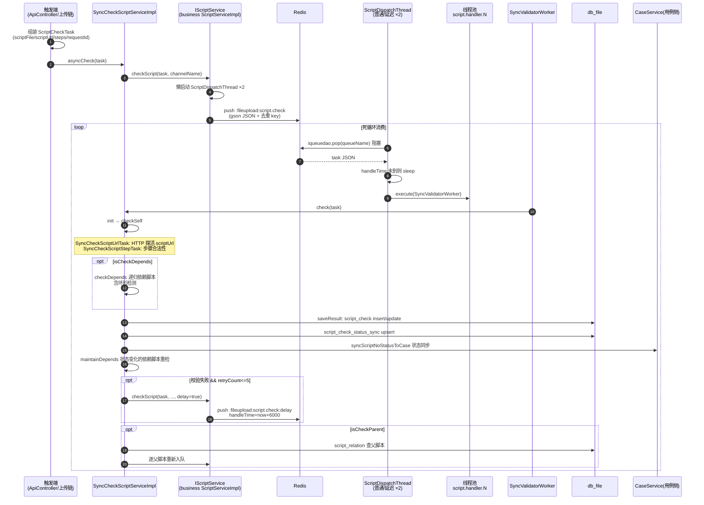

# 脚本校验引擎实现

> 本文描述脚本异步校验引擎的代码级链路：触发入口（`/api/checkScript` 等）→ 组装 `ScriptCheckTask` → Redis 队列（`:fileupload:script.check`）→ `ScriptDispatchThread` 消费分发 → 线程池执行校验 → 结果回写 script_check / script_check_status_sync → 父脚本传播与失败重试。横切视角与任务体系说明见 [横切-脚本校验链路](../04-复杂功能细节/横切-脚本校验链路.md)。

## 链路总览

1. 触发端组装 `ScriptCheckTask`（scriptFile + scriptUrl + 步骤列表 + requestId）；
2. `IScriptService.checkScript(task, channelName, delay)` 把任务 JSON 序列化后 push 进 Redis 队列，并**懒启动**两个消费线程（普通队列 + 延迟队列）（`src/main/java/cn/testin/business/impl/ScriptServiceImpl.java`）；
3. `ScriptDispatchThread.run` 在队列上阻塞 pop，反序列化后交 `SyncValidatorWorker` 进线程池执行（`src/main/java/cn/testin/filecloud/core/chain/processor/script/validator/ScriptDispatchThread.java`）；
4. `SyncCheckScriptServiceImpl.check` 主流程：init → checkSelf（URL + 步骤）→ checkDepends（依赖递归）→ saveResult（入库）（`src/main/java/cn/testin/filecloud/core/chain/processor/script/validator/SyncCheckScriptServiceImpl.java`）；
5. `saveResult` 写 script_check（insert/update）+ script_check_status_sync（upsert），并调 `CaseService.syncScriptNoStatusToCase` 把状态同步给用例侧；
6. 校验失败且重试次数 ≤5 时投递延迟队列重检（`retry`）；`checkParent=true` 时查 script_relation 触发所有父脚本重检（`checkScriptRelation`）。

## 触发入口

| 入口 | 位置 | 说明 |
|---|---|---|
| `GET /api/checkScript` | `src/main/java/cn/testin/filecloud/web/controller/ApiController.java` | 全量或按 scriptId 触发；`isSync=sync` 走 `syncCheckScriptService.asyncCheck`，否则直接 push 队列；硬编码 key 鉴权 |
| `GET /api/checkScriptAgain` | `ApiController.java` | 单脚本重检，`task.setRetry(false)` 不自动重试 |
| ApiServlet `Script.checkScript` | `src/main/java/cn/testin/service/fs/Script.java` | 旧反射体系入口，走 `IScriptService.checkScript(scriptid, sync, ignoreHost, checkType)` |
| 上传自动触发 | Web 录制上传 / ScriptFileProcessorV3 处理链 | 见 [核心链路-脚本录制上传](../04-复杂功能细节/核心链路-脚本录制上传.md) |

`/api/checkScript` 组装任务的两个细节：

- 步骤列表通过 HTTP 拉取：`HttpUtils.get(stepFileId)` 下载步骤 JSON 再 fastjson 反序列化（`ApiController.java`）——stepFileId 必须是 `http` 开头，否则该脚本被跳过；
- scriptUrl 取自 `common_file.url`（按 `scriptFile.fileid` 关联），印证"文件类资源全链路只传 URL"。

## 全链路时序图

## 逻辑详解

### 1. 队列生产

`business/ScriptServiceImpl.checkScript(task, channelName, delay)`（`src/main/java/cn/testin/business/impl/ScriptServiceImpl.java`）：

- 队列名由 `getRedisFieldKey("fileupload", "script.check")` 拼出，即 **`:fileupload:script.check`**；延迟队列在其后再拼一段，即 `:fileupload:script.check:delay`；
- 两个 `ScriptDispatchThread` 以双重检查锁**懒启动**——第一次有人发校验任务时消费者才存在，服务刚重启且从未触发校验时队列会积压；
- delay=true 时 `handleTime = now + 6000L` 并改投延迟队列；
- push 时携带 `uniquekey/uniqueval`（`scriptId_{id}` 或 `scriptNo_{no}`，,272-278）做队列内去重；
- 任务体用 **gson** 序列化（`Config.gson`），消费端同样用 gson 反序列化（`ScriptDispatchThread.java`）。

### 2. 队列消费与线程池

`ScriptDispatchThread`（`ScriptDispatchThread.java`）：

- `run()` 死循环 `iqueuedao.pop(queueName)` 阻塞消费，异常仅打日志不退出；
- `handleTime` 未到的延迟任务**在消费线程上 sleep 等待**——延迟队列是单线程串行 sleep，不会阻塞普通队列（两条线程各盯一个队列）；
- 线程池：`core=5, max=50, queue=1(ArrayBlockingQueue), keepAlive=5min`，拒绝策略 **`DiscardPolicy` 直接丢弃**。队列满 + 50 线程跑满时新任务静默丢失，没有补偿；
- 工作线程命名 `script.handler.{N}`。

`SyncValidatorWorker.run` 只是薄封装，调 `checkScriptService.check(task)`（`src/main/java/cn/testin/filecloud/core/chain/processor/script/validator/SyncValidatorWorker.java`）。

### 3. 校验主流程

`SyncCheckScriptServiceImpl.check`（`SyncCheckScriptServiceImpl.java`）用 StopWatch 分四段计时：

| 段 | 方法 | 内容 |
|---|---|---|
| init | `init` | 目前只打日志 |
| checkSelf | `checkSelf` | 依次跑 `SyncCheckScriptUrlTask`（URL 可达性）与 `SyncCheckScriptStepTask`（步骤合法性），结果入 `selfCheckResultArray`；**异常被 catch 住只记日志**，自身校验失败不会中断流程 |
| checkDepends | `checkDepends` | 仅 `isCheckDepends=true` 时执行；遍历步骤中引用的子脚本递归校验，环形引用经 tracesRoute 检测 |
| saveResult | `saveResult` | 见下节 |

`check` 返回 true 后，若 `isCheckParent` 还会触发 `checkScriptRelation` 父脚本传播。

### 4. 结果回写（saveResult）

`saveResult`：

1. `buildfinalResult` 把 self/depends 两个结果数组合成 JSON；
2. `CheckTaskSupport.parseCheckStatus` 从 JSON 算出总状态 checkStatus；
3. 以 `"ScriptCheck-{scriptId}"` 为 key 取内存锁（`ConcurrentHashMap<Object, AtomicInteger>`，,419-422），锁内先查 `script_check`：存在则 update checkStatus+checkContent，否则 insert；
4. 再以 `"ScriptCheckStatusSync-{scriptNo}"` 取第二把锁，upsert `script_check_status_sync`（同 scriptNo 只保留 scriptId 更大的那条），随后 `CaseService.syncScriptNoStatusToCase` 同步用例侧——该调用异常被吞掉只记日志，同步失败不影响主流程；
5. `maintainDepends`：把依赖检测结果中状态发生变化的依赖脚本（排除环形 code=3）重新入队，保证状态沿依赖链扩散；
6. 最后 `retry`（,645）。

锁的实现注意点：`getLock` 里新 key 放的是 `new AtomicInteger()`（初值 0），`releaseLock` 在计数 >0 时递减、否则移除 key；锁对象是 map 里的 AtomicInteger 实例，`synchronized(LOCK.get(key))` 在其上互斥。

### 5. 重试与父脚本传播

- **重试**（`retry`）：进程内 `retryMap`（ConcurrentMap）按 scriptId 计数，校验状态非 VALID 且次数 ≤5 时以 delay=true 重新入队；VALID 后清除计数。注释写"延迟1分钟"，实际 `handleTime=now+6000` 即 **6 秒**（`ScriptServiceImpl.java`），且 retryMap 是进程内存，重启清零。
- **父脚本传播**（`checkScriptRelation`）：按 `scriptNo + projectId + type=NORMAL` 查 `script_relation`，对每个父脚本构建新任务（`checkDepends=true`、沿用原 requestId、tracesRoute 追加父 scriptNo）重新入队；`recheckByScriptRelation` 先判断父脚本是否有必要重检，避免无限扩散。

## 涉及表与 Redis Key

| 对象 | 读写 | 说明 |
|---|---|---|
| [script_file](../../数据库管理/db_file/script_file.md) | 查 | 校验对象来源；stepFileId 必须 http 开头 |
| [common_file](../../数据库管理/db_file/common_file.md) | 查 | 按 fileid 取 scriptUrl |
| [script_check](../../数据库管理/db_file/script_check.md) | insert/update | 校验结果 JSON（checkContent）+ 总状态（checkStatus） |
| [script_check_status_sync](../../数据库管理/db_file/script_check_status_sync.md) | upsert | 按 scriptNo 保留最新 scriptId 的状态，供同步用例侧 |
| [script_relation](../../数据库管理/db_file/script_relation.md) | 查 | 父子调用关系，驱动父脚本传播 |
| Redis `:fileupload:script.check` | push/pop | 普通校验队列（list） |
| Redis `:fileupload:script.check:delay` | push/pop | 延迟重试队列，靠 handleTime + sleep 实现延迟 |

## 关键代码位置表

| 环节 | 类 / 方法 | 位置 |
|---|---|---|
| HTTP 触发 | ApiController.checkScript / checkScriptAgain | src/main/java/cn/testin/filecloud/web/controller/ApiController.java |
| 旧体系触发 | cn.testin.service.fs.Script.checkScript | src/main/java/cn/testin/service/fs/Script.java |
| 异步入口 | SyncCheckScriptServiceImpl.asyncCheck | src/main/java/cn/testin/filecloud/core/chain/processor/script/validator/SyncCheckScriptServiceImpl.java |
| 队列生产+懒启动消费者 | business ScriptServiceImpl.checkScript(task,channel,delay) | src/main/java/cn/testin/business/impl/ScriptServiceImpl.java |
| 队列消费 | ScriptDispatchThread.run | src/main/java/cn/testin/filecloud/core/chain/processor/script/validator/ScriptDispatchThread.java |
| 线程池初始化 | ScriptDispatchThread.init | src/main/java/cn/testin/filecloud/core/chain/processor/script/validator/ScriptDispatchThread.java |
| Worker 执行 | SyncValidatorWorker.run | src/main/java/cn/testin/filecloud/core/chain/processor/script/validator/SyncValidatorWorker.java |
| 校验主流程 | SyncCheckScriptServiceImpl.check | src/main/java/cn/testin/filecloud/core/chain/processor/script/validator/SyncCheckScriptServiceImpl.java |
| 自身校验 | SyncCheckScriptServiceImpl.checkSelf | 同上  |
| 依赖校验 | SyncCheckScriptServiceImpl.checkDepends | 同上  |
| 结果入库 | SyncCheckScriptServiceImpl.saveResult | 同上  |
| 状态同步用例侧 | SyncCheckScriptServiceImpl.sendCheckStatusToCase | 同上  |
| 依赖状态扩散 | SyncCheckScriptServiceImpl.maintainDepends | 同上  |
| 失败重试 | SyncCheckScriptServiceImpl.retry | 同上  |
| 父脚本传播 | SyncCheckScriptServiceImpl.checkScriptRelation | 同上  |

## 注意事项与坑

1. **消费者懒启动**：两个 `ScriptDispatchThread` 在第一次 push 时才启动（`ScriptServiceImpl.java`）。服务重启后若一直无人触发校验，Redis 里会积压任务；积压任务会在首次触发后被一次性消费。
2. **线程池拒绝策略是 DiscardPolicy**：queue=1 的有界队列 + 50 线程打满后，新校验任务被**静默丢弃**（`ScriptDispatchThread.java`），脚本会一直停留在未校验状态，只能等下一次触发或人工 `/api/checkScriptAgain`。
3. **延迟重试实际是 6 秒**：注释写"延迟1分钟"，代码是 `+6000L`（`ScriptServiceImpl.java`）；且延迟靠消费线程 `Thread.sleep` 实现（`ScriptDispatchThread.java`），长延迟会占住延迟队列的消费线程。
4. **retryMap 是进程内存**：重试次数重启清零（`SyncCheckScriptServiceImpl.java`），也意味着多实例部署时各实例独立计数，理论最大重试次数会被放大。
5. **"/api/checkScript 的 key 是硬编码**：`fa568093e6354882a534dbce946c9d53`（`ApiController.java`），三个 /api 端点共用，实质是内部约定口令，不要在公开文档/前端暴露。
6. **自身校验异常被吞**：`checkSelf` 里 try/catch 只记日志（`SyncCheckScriptServiceImpl.java`），URL/步骤校验器自身抛错时脚本可能带着空结果入库，表现为"状态莫名 VALID/INVALID"，排查先看日志而非结果表。
7. **gson 序列化协议**：任务体用 `Config.gson`（`ScriptServiceImpl.java`），改 `ScriptCheckTask` 字段要保证生产者（各触发端）与消费者（ScriptDispatchThread）同版本发版。
