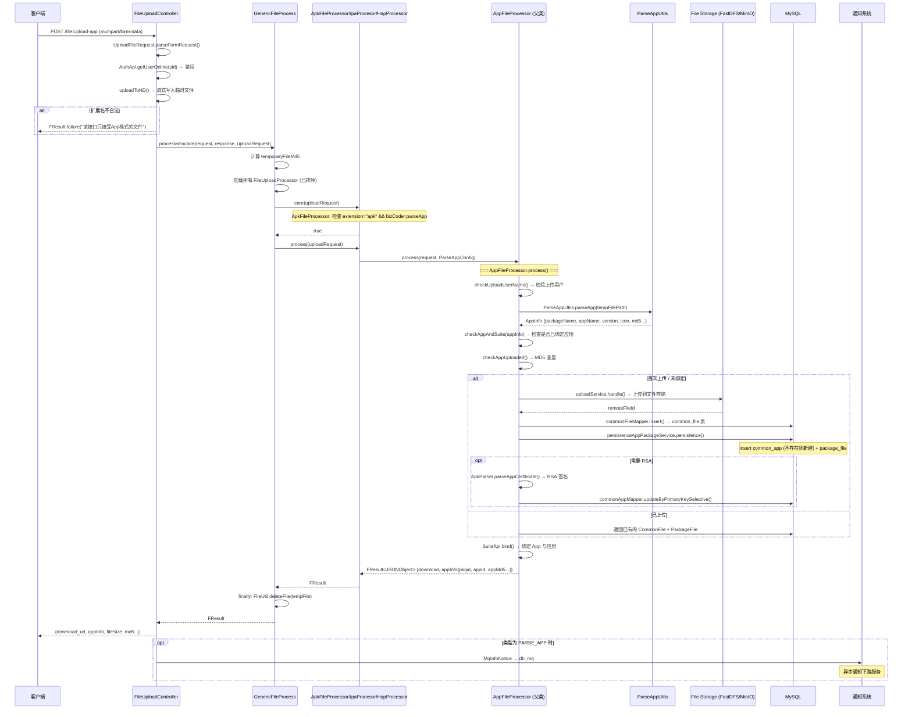

# 核心链路-APP上传与解析

> APP 文件（APK/IPA/HAP）从 HTTP 上传到最终解析入库、通知下游的端到端流程。入口为 `FileUploadController.uploadApp()`，经责任链分发到 `ApkFileProcessor`/`IpaFileProcessor`/`HapFileProcessor` 执行解析与持久化。

## 入口

**接口**: `POST /file/upload-app`
**Controller**: [FileUploadController](../07-开放接口文档/文件上传/FileUploadController.md)

```java
@RequestMapping(value = "/upload-app", method = RequestMethod.POST)
public FResult<?> uploadApp(...) {
    // 1. 公共参数校验与 SID 鉴权
    // 2. 流式写入临时文件
    // 3. 扩展名校验（仅允许 apk/ipa/hap）
    // 4. 调用 processsFacade() → 责任链处理
}
```

## 端到端流程



## AuthApi 鉴权

```java
String sid = uploadRequest.getAccessAuthValue();
AuthApi authApi = super.getBean(AuthApi.class);
UserOnline uo = authApi.getUserOnline(sid);
// 校验 uid, eid
uploadRequest.putJsonValue(UploadFileParam.PARAM_UID, uo.getUserid());
uploadRequest.putJsonValue(UploadFileParam.PARAM_EID, uo.getEid());
```

## 临时文件写入

`FileUploadController` 重写 `uploadToHD()` 调用父类 `transferSpringRequestStreamToHD()`：

```java
// GenericFileProcess.transferSpringRequestStreamToHD()
MultipartHttpServletRequest multiRequest = (MultipartHttpServletRequest) request;
MultipartFile multiFile = multiRequest.getFileMap().values().iterator().next();
String fileName = UUID.randomUUID() + "." + extension;
FileUtils.copyInputStreamToFile(multiFile.getInputStream(), new File(tempDir + fileName));
uploadRequest.setTemporaryFilePath(fileFullPath);
uploadRequest.setTemporaryFileSize(uploadTempFile.length());
```

## AppFileProcessor.process() 核心逻辑

```java
public FResult<JSONObject> process(UploadFileRequest uploadRequest, ParseAppConfig config) {
    // 1. 判断临时文件存在性
    // 2. checkUploadUserName() — 校验上传用户名
    // 3. parseApp() — 解析 App (ApkUtil/PlistHandler/HapUtil)
    // 4. checkAppAndSuite() — 检查 App 是否已绑定应用
    // 5. checkAppUploaded() — MD5 查重
    //    ├── 已存在: 直接返回已有记录
    //    └── 不存在: saveAppFile()
    //        ├── uploadService.handle() — 上传到文件存储
    //        ├── commonFileService.saveMasterFile() — 保存 common_file 记录
    //        ├── persistenceAppPackageService.persistence() — 保存 common_app + package_file
    //        └── buildAppRSA() — Rsa 签名提取（Android）
    // 6. SuiteApi.bind() — 绑定应用
    // 7. buildResult() — 组装返回 JSON
}
```

## APP 解析器

| 平台 | 解析工具 | 对外接口 |
|---|---|---|
| Android (APK) | `ApkUtil` (AAPT 命令行) / `ApkParser` (APKTool) | `ParseAppUtils.parseApp()` |
| iOS (IPA) | `PlistHandler` (plist XML 解析) | 同上 |
| 鸿蒙 (HAP) | `HapUtil` / `HapInfo` | 同上 |

解析出的 `AppInfo` 包含：

```java
class AppInfo {
    String packageName;   // 包名
    String appName;       // 应用名
    String versionName;   // 版本名
    String versionCode;   // 版本号
    String iconUrl;       // 图标地址
    String fileMd5;       // 文件 MD5
    int appId;            // common_app 主键
    String errorMsg;      // 解析失败信息
}
```

## 持久化流程

`PersistenceAppPackageService.persistence()` 执行两个数据库操作：

1. **common_app 表**: `INSERT ... ON DUPLICATE KEY UPDATE` -- 以 `(packageName, platformId, ostype)` 为唯一键
2. **package_file 表**: INSERT -- 绑定 appid + common_file 记录

## 通知下游

根据上传场景，可能发送 MQ 通知：

- **页面/接口上传**: 通过 `MqInfoNotice(PARSE_APP 类型)` 通知下游解析结果
- **URL 上传**: 通过 `MqInfoNotice(PARSE_APP_BY_URL_TASK → REPORT_REAL_TEST_TASK)` 通知 RealTest 服务

详见 [横切-通知系统](横切-通知系统.md)

## 关键文件

| 文件 | 职责 |
|---|---|
| [FileUploadController](../07-开放接口文档/文件上传/FileUploadController.md) | `POST /file/upload-app` 入口 |
| [ApkFileProcessor](ApkFileProcessor.md) | APK 责任链处理器 |
| [IpaFileProcessor](IpaFileProcessor.md) | IPA 责任链处理器 |
| [HapFileProcessor](HapFileProcessor.md) | HAP 责任链处理器 |
| [AppFileProcessor](AppFileProcessor.md) | APP 通用解析父类 |
| [GenericFileProcess](GenericFileProcess.md) | processsFacade() 入口 |
| [PersistenceAppPackageService](PersistenceAppPackageService.md) | APP 持久化服务 |
| `ParseAppUtils` | 多平台 APP 解析入口 |
| `ApkUtil` / `ApkParser` | Android APP 解析 |
| `PlistHandler` | iOS IPA 解析 |
| `HapUtil` | 鸿蒙 HAP 解析 |
| `UploadService` | 文件存储上传接口 |

## 关联专题

- [横切-文件上传责任链](横切-文件上传责任链.md) -- 处理器链选择机制
- [横切-通知系统](横切-通知系统.md) -- 上传完成后的通知分发
- [核心链路-分片上传](核心链路-分片上传.md) -- 大文件分片上传方式
- [核心链路-URL上传](核心链路-URL上传.md) -- 通过 URL 异步上传方式
