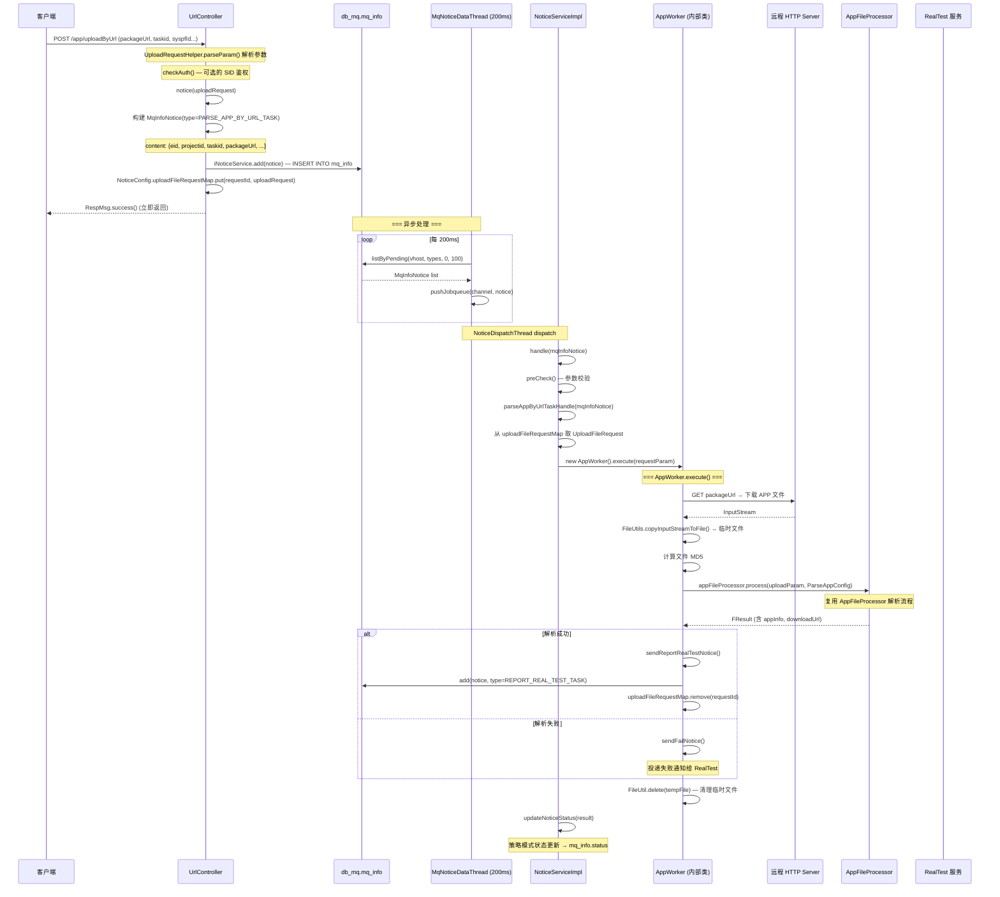

# 核心链路-URL上传

> 通过远程 URL 异步下载 APP 文件并解析的端到端流程。入口为 `UrlController.uploadyByUrl()`，不同于表单上传的同步处理，URL 上传通过 MQ 通知队列异步完成下载、解析、上报。

## 入口

**接口**: `POST /app/uploadByUrl`
**Controller**: [UrlController](../07-开放接口文档/文件上传/UrlController.md)

```java
@RequestMapping(value = "/app/uploadByUrl", method = RequestMethod.POST)
public RespMsg<String> uploadyByUrl(HttpServletRequest request, HttpServletResponse response) {
    UploadFileRequest uploadRequest = checkAuth(request, false);
    // 构建 MqInfoNotice → 写入 db_mq.mq_info → 立即返回
    Long result = notice(uploadRequest);
    return result > 0 ? RespMsg.success() : RespMsg.fail();
}
```

**响应语义**: 接口只负责投递任务到队列，不等待解析完成。成功投递即返回 `success`。

## 端到端流程



## checkAuth 鉴权

`UrlController` 的鉴权与表单上传不同：

```java
private UploadFileRequest checkAuth(HttpServletRequest request, boolean auth) {
    UploadFileRequest uploadRequest = UploadRequestHelper.parseParam(request);
    if (auth) {
        String sid = uploadRequest.getAccessAuthValue();
        UserOnline uploadUser = authApi.getUserOnline(sid);
        uploadRequest.putJsonValue(PARAM_UID, uploadUser.getUserid());
    }
    return uploadRequest;
}
```

注意：调用时 `checkAuth(request, false)` 传入 `auth=false`，当前版本不强制鉴权。

## 参数解析

使用 `UploadRequestHelper.parseParam(request)` 而非 `UploadFileRequest.parseFormRequest()`，因为 URL 上传不是 multipart 请求，参数通过请求头和表单域传递：

- **packageUrl**: APP 下载地址
- **syspfId**: 系统平台（1=Android / 2=iOS / 3=鸿蒙 / 4=鸿蒙NEXT）
- **taskid**: 任务标识
- **eid / projectid**: 企业和项目 ID

## notice() 通知构建

```java
private Long notice(UploadFileRequest uploadRequest) {
    MqInfoNotice notice = new MqInfoNotice();
    notice.setVhost(Constants.getModule_node_id());
    notice.setNoticemark(uploadRequest.getTaskid());
    notice.setUserid(uploadRequest.getUid());
    notice.setType(PARSE_APP_BY_URL_TASK);  // type=1
    notice.setPublishtime(System.currentTimeMillis());  // 即时发布
    notice.setExpiretime(System.currentTimeMillis() + 5 * 60 * 60 * 1000);  // 5小时过期

    JSONObject content = new JSONObject();
    content.put("eid", uploadRequest.getEid());
    content.put("projectid", uploadRequest.getProjectId());
    content.put("taskid", uploadRequest.getTaskid());
    content.put("packageUrl", uploadRequest.getPackageUrl());
    // ...
    notice.setContent(content.toString());

    Long noticeResult = iNoticeService.add(notice, null, true);

    // 缓存 UploadFileRequest，供后续处理使用
    if (noticeResult > 0) {
        NoticeConfig.uploadFileRequestMap.put(uploadRequest.getRequestId(), uploadRequest);
    }
    return noticeResult;
}
```

**为何需要 uploadFileRequestMap？**
`UploadFileRequest` 对象结构复杂（包含 JSON 嵌套），通过 `MqInfoNotice.content`(字符串) 传递会丢失类型信息。因此通过静态 Map 以 `requestId` 为 key 传递对象引用。

## AppWorker.execute(): 异步处理

```java
class AppWorker {
    void execute(UploadFileRequest uploadParam) throws UploadException {
        // 1. 生成临时文件
        File tempFile = generateTempFile(uploadParam);

        // 2. 获取解析配置
        ParseAppConfig config = getParseAppConfig(uploadParam);

        // 3. 调用 AppFileProcessor 解析
        FResult uploadResult = appFileProcessor.process(uploadParam, config);

        // 4. 成功 → 上报 RealTest
        if (uploadResult.success()) {
            // build JSON params
            sendReportRealTestNotice(uploadParam, jsonObject);
            uploadFileRequestMap.remove(uploadParam.getRequestId());
        } else {
            sendFailNotice(uploadParam, ...);
        }

        // 5. 清理临时文件
        FileUtil.delete(tempFile);
    }
}
```

### generateTempFile: 下载远程 APP

```java
private File generateTempFile(UploadFileRequest uploadParam) {
    // 1. 构建 HTTP GET 请求
    HttpUriRequest request = HttpFactory.getInstance().buildRequest(packageUrl, "GET");
    CloseableHttpClient httpClient = isHttps ? getHttpsClient() : getHttpClient();

    // 2. 执行请求
    CloseableHttpResponse response = httpClient.execute(request);
    if (response.getStatusLine().getStatusCode() != 200) {
        throw new UploadException(DOWNLOAD_APP_FAIL);
    }

    // 3. 流式写入临时文件
    InputStream stream = response.getEntity().getContent();
    String ext = syspfId == IOS_APP ? "ipa" : syspfId == ANDROID_APP ? "apk" : "hap";
    File tempFile = new File(Config.TEMP_DIR_PATH + "/" + UUID.randomUUID() + "." + ext);
    FileUtils.copyInputStreamToFile(stream, tempFile);

    // 4. 设置 UploadFileRequest 属性
    uploadParam.setOriginalExtName(ext);
    uploadParam.setTemporaryFilePath(tempFile.getAbsolutePath());
    uploadParam.setTemporaryFileMd5(FileUtil.md5(tempFile));
    uploadParam.setTemporaryFileSize(tempFile.length());

    return tempFile;
}
```

### getParseAppConfig: 平台判断

```java
ParseAppConfig config;
if (uploadParam.getSyspfId() == ANDROID_APP)       // 1
    config = ParseAppConfig.newOne().ostype(APK);
else if (uploadParam.getSyspfId() == IOS_APP)       // 2
    config = ParseAppConfig.newOne().ostype(IOS);
else if (uploadParam.getSyspfId() == HARMONYOS_APP)  // 3
    config = ParseAppConfig.newOne().ostype(HAP);
else if (uploadParam.getSyspfId() == HARMONYOSNEXT_APP) // 4
    config = ParseAppConfig.newOne().ostype(NextHAP);
```

## 通知下游 RealTest

解析成功后，通过第二层 MQ 通知 RealTest 服务：

```java
MqInfoNotice notice = new MqInfoNotice();
notice.setType(NoticeConfig.InfoNoticeType.REPORT_REAL_TEST_TASK.getValue());  // type=2
notice.setContent(parseResult.toString());  // appInfos JSON
iNoticeService.add(notice, null, true);
```

RealTest 服务接收到通知后调用 `RealTestApi.taskComplete()` 完成上线流程。

## 重试与降级

文件下载失败时，`RetryNoticeStrategy.handle()` 尝试重试：
- `execNum < normalExecTimes`: 立即重试
- `execNum >= normalExecTimes && < maxExecTimes`: 延迟 15 秒重试
- `execNum >= maxExecTimes`: 标记 INVALID，同时 `sendFailNotice()` 通知 RealTest 失败

## 关键文件

| 文件 | 职责 |
|---|---|
| [UrlController](../07-开放接口文档/文件上传/UrlController.md) | URL 上传入口 + notice() |
| `UploadRequestHelper` | URL 上传参数解析 |
| `NoticeServiceImpl` | 通知处理主流程 + AppWorker 内部类 |
| `NoticeConfig` | 通知类型枚举 + uploadFileRequestMap |
| `AppFileProcessor` | APP 解析复用 |
| `RealTestApi` | RealTest 服务 HTTP 回调 |

## 关联专题

- [横切-通知系统](横切-通知系统.md) -- MqNoticeDataThread / 策略模式完整流程
- [核心链路-APP上传与解析](核心链路-APP上传与解析.md) -- AppFileProcessor 解析逻辑
- [横切-文件上传责任链](横切-文件上传责任链.md) -- 处理器链匹配
- [横切-后台线程全景](横切-后台线程全景.md) -- MqNoticeDataThread / NoticeDispatchThread
