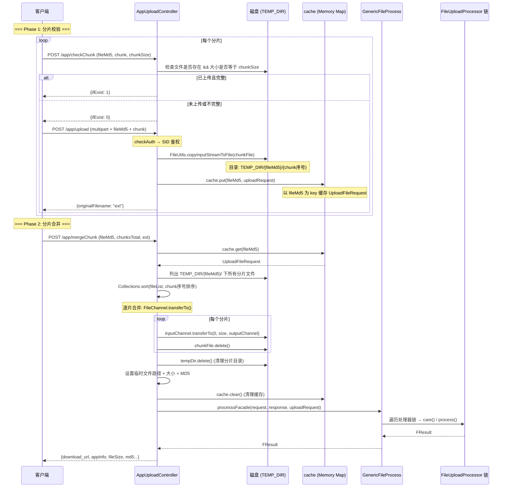

# 核心链路-分片上传

> 大文件分片上传（Chunked Upload）端到端流程：客户端将大文件切分为多个分片依次上传，服务端缓存分片上下文，最后合并分片为完整文件后进入责任链处理。

## 接口清单

| 接口 | 方法 | 说明 |
|---|---|---|
| `/app/checkChunk` | POST | 检查分片是否已上传（防重复上传） |
| `/app/upload` | POST | 上传单个分片到磁盘 |
| `/app/mergeChunk` | POST | 合并所有分片 → 责任链处理 |

**Controller**: [AppUploadController](../07-开放接口文档/文件上传/AppUploadController.md)

## 端到端流程



## checkChunk: 分片校验

```java
@RequestMapping(value = "/checkChunk")
public FResult<?> checkChunk(HttpServletRequest request) {
    String fileMd5 = request.getParameter("fileMd5");
    String chunk = request.getParameter("chunk");
    String chunkSize = request.getParameter("chunkSize");

    lock.readLock().lock();
    try {
        File checkFile = new File(TEMP_DIR + "/" + fileMd5 + "/" + chunk);
        boolean uploadComplete = checkFile.length() == Integer.parseInt(chunkSize);
        if (checkFile.exists() && uploadComplete) {
            return FResult.newSuccess({"ifExist": 1});   // 已上传
        }
        return FResult.newSuccess({"ifExist": 0});        // 需上传
    } finally {
        lock.readLock().unlock();
    }
}
```

- 使用 `ReentrantReadWriteLock` 保护并发读写
- 读取操作用 readLock，上传操作用 writeLock
- 校验标准：文件存在 && 文件大小等于声明的 chunkSize

## upload: 分片上传

```java
@RequestMapping(value = "/upload")
public FResult<?> uploadApp(...) {
    uploadRequest = checkAuth(request, public_access_auth);  // SID 鉴权 + 项目组校验

    String fileMd5 = request.getParameter("fileMd5");
    String currentChunk = request.getParameter("chunk");

    uploadToHD(uploadRequest, TEMP_DIR, request, fileMd5);  // 保存分片

    uploadRequest.putJsonValue("bizCode", BizCode.parseApp.getCode());
    cache.put(fileMd5, uploadRequest);  // 缓存请求上下文

    return FResult.newSuccess(...);
}
```

### uploadToHD: 分片写入磁盘

```java
protected FResult<String> uploadToHD(UploadFileRequest uploadRequest, String saveDir,
                                      HttpServletRequest request, String fileMd5) {
    lock.writeLock().lock();
    try {
        MultipartHttpServletRequest multipartRequest = (MultipartHttpServletRequest) request;
        for (MultipartFile mf : multipartRequest.getFiles("file")) {
            // 创建目录: TEMP_DIR/{fileMd5}/
            File dir = new File(saveDir + "/" + fileMd5);
            if (!dir.exists()) dir.mkdir();

            // 分片文件: TEMP_DIR/{fileMd5}/{chunk序号}
            File chunkFile = new File(saveDir + "/" + fileMd5 + "/" + currentChunk);
            FileUtils.copyInputStreamToFile(mf.getInputStream(), chunkFile);
        }
    } finally {
        lock.writeLock().unlock();
    }
}
```

- 分片按序号命名（0, 1, 2, ...），方便排序
- 并发控制: `ReadWriteLock` 保证写互斥

## mergeChunk: 分片合并

```java
@RequestMapping(value = "/mergeChunk")
public FResult<?> mergeChunk(HttpServletRequest request, HttpServletResponse response) {
    String fileMd5 = request.getParameter("fileMd5");
    String chunksTotal = request.getParameter("chunksTotal");
    String ext = request.getParameter("ext");

    UploadFileRequest uploadRequest = cache.get(fileMd5);  // 恢复请求上下文

    // 1. 列出所有分片文件
    File[] fileArray = new File(TEMP_DIR + "/" + fileMd5).listFiles();

    // 2. 按 chunk 序号排序
    Collections.sort(fileList, (o1, o2) -> Integer.compare(
        Integer.parseInt(o1.getName()), Integer.parseInt(o2.getName())));

    // 3. 生成目标文件名
    String fileName = UUID.randomUUID() + "." + ext;
    File outputFile = new File(TEMP_DIR + "/" + fileName);
    outputFile.createNewFile();

    // 4. FileChannel.transferTo() 逐片合并
    try (FileChannel outChannel = new FileOutputStream(outputFile).getChannel()) {
        for (File file : fileList) {
            try (FileChannel inChannel = new FileInputStream(file).getChannel()) {
                inChannel.transferTo(0, inChannel.size(), outChannel);
            }
            file.delete();  // 删除分片
        }
    }

    // 5. 删除分片目录
    new File(TEMP_DIR + "/" + fileMd5).delete();

    // 6. 构造完整文件的 UploadFileRequest
    uploadRequest.setTemporaryFilePath(TEMP_DIR + "/" + fileName);
    uploadRequest.setTemporaryFileSize(outputFile.length());

    cache.clear();  // 清理缓存

    // 7. 进入责任链处理
    return processsFacade(request, response, uploadRequest);
}
```

### 合并关键技术

- **FileChannel.transferTo()**: 零拷贝合并，高效利用操作系统 DMA
- **排序**: `Collections.sort()` 按数字序号排序，保证分片顺序正确
- **资源清理**: 每个分片合并后立即 `file.delete()`；最后删除分片目录
- **缓存管理**: `cache.clear()` 释放以 fileMd5 为 key 的请求上下文

## 并发控制

`AppUploadController` 使用单个 `ReentrantReadWriteLock` 保护所有分片操作：

| 操作 | 锁类型 | 说明 |
|---|---|---|
| checkChunk | readLock | 检查文件存在性，不修改 |
| upload (uploadToHD) | writeLock | 写入分片文件，互斥 |

这确保同一文件不会同时进行读检查与写操作。

## RequestContext 缓存

```java
// AppUploadController 中的静态 Map
private static Map<String, UploadFileRequest> cache = Maps.newHashMap();
```

- Key: `fileMd5`，Value: `UploadFileRequest`
- upload 时 `put()`，mergeChunk 时 `get()` + `clear()`
- 这是内存缓存，重启会丢失（意味着正在进行中的分片上传会在重启后不可恢复）

## 扩展名校验

`mergeChunk` 阶段进行扩展名白名单校验：

```java
if (Constants.limitSuffix() && !ArrayUtils.contains(Constants.getSupportFileSuffix(), ext)) {
    return FResult.newFailure(PARAM_VALUE_ERROR, "不支持的扩展名:" + ext);
}
```

## 鉴权

`checkAuth()` 方法执行完整的鉴权流程：
1. `AuthApi.getUserOnline(sid)` -- 校验登录信息
2. `AuthApi.myProjects(eid, userid)` -- 校验项目组归属
3. 校验 `suiteId` 有效性

## 关键文件

| 文件 | 职责 |
|---|---|
| [AppUploadController](../07-开放接口文档/文件上传/AppUploadController.md) | 分片上传三个接口 |
| `GenericFileProcess` | processsFacade() + transferSpringRequestStreamToHD() |
| `FileMergeThread` | SDK 分片合并后台线程（独立的合并队列，区别于 MVC 的 mergeChunk） |

## 关联专题

- [横切-文件上传责任链](横切-文件上传责任链.md) -- mergeChunk 最后进入的责任链处理
- [核心链路-APP上传与解析](核心链路-APP上传与解析.md) -- AppFileProcessor 的完整解析流程
- [横切-后台线程全景](横切-后台线程全景.md) -- FileMergeThread 后台合并线程
