# 核心链路-脚本录制上传

> Web 录制脚本提交的端到端流程。入口为 `ScriptController.scriptUpload()`，接收 JSON 格式的脚本录制数据，校验参数一致性、写入多张数据库表、上传步骤 JSON 到文件存储，最后投递异步校验任务。

## 入口

**接口**: `POST /script/upload`
**Controller**: [ScriptController](../07-开放接口文档/脚本管理/ScriptController.md)

```java
@RequestMapping(value = "/upload", method = RequestMethod.POST)
public RespMsg<String> scriptUpload(HttpServletRequest request,
                                     HttpServletResponse response,
                                     @RequestBody String jsonParam) {
    // 1. 解析 JSON Body
    // 2. 逐字段校验 (suiteId, name, actions, downloadUrl, upload_json...)
    // 3. scriptNo ↔ projectid 一致性校验
    // 4. 恒生客户回调 (可选)
    // 5. ScriptServiceImpl.saveScriptForWebRecording()
}
```

## 请求体结构

```json
{
    "suiteId": 123,
    "name": "100001",           // 脚本编号 (scriptNo)
    "callBlade": "0",           // 是否回调恒生 Blade
    "originScriptNo": "xxx",
    "declareVars": [],          // 声明的变量
    "components": [],           // UI 控件
    "browsers": [],             // 浏览器信息 (Web 脚本)
    "pc": {},                   // PC 信息 (PC 脚本)
    "actions": [],              // 脚本步骤
    "downloadUrl": "http://...",  // 脚本 ZIP 下载地址
    "upload_json": {            // 上传元数据
        "appid": 1,
        "eid": 100,
        "projectid": 200,
        "uid": 300,
        "pkgid": 400,
        "testCase": {...},
        "fileMd5": "abc123",
        "originalFilename": "script.zip",
        "fileSize": 102400,
        "osType": 1,
        "scriptType": 1
    },
    "settings": {...}           // 环境配置
}
```

## 端到端流程

```mermaid
flowchart TD
    A["POST /script/upload"] --> B["解析 JSON Body"]
    B --> C{"必备字段校验"}
    C -->|缺失| C1["返回 RespMsg.fail"]
    C -->|通过| D{"suiteId 校验"}
    D -->|scriptType==1 && appid>0| D1{"suiteId-projectId 匹配检查"}
    D1 -->|不匹配| D2["返回 fail: suiteId projectId does not match"]
    D1 -->|匹配| E
    D -->|不校验| E

    E["ScriptVo 组装"] --> F{"type 判断"}
    F -->|"browsers != null"| F1["type = 69 (Web)"]
    F -->|"pcInfos != null"| F2["type = 73 (PC)"]
    F -->|默认| F3["type = 66 (App)"]

    F1 & F2 & F3 --> G{"scriptNo ↔ projectid 一致性"}
    G -->|"FileApi.getLastestScriptWithNoApp() 返回已有脚本 && projectid 不一致"| G1["返回 fail: Script Related Projectid is invalid"]
    G -->|通过| H

    H["逐一校验 upload_json 子字段"] --> H1["appid / eid / projectid / uid / pkgid / testCase / fileMd5"]

    H1 --> I{"callBlade == '1'?"}
    I -->|Yes| I1["ScriptServiceImpl.callHundsunBlade()"]
    I1 --> I2["查询 ProjectApi → productNo"]
    I2 --> I3["BladeApi.saveScript() → 回调恒生平台"]
    I3 --> J
    I -->|No| J

    J["ScriptServiceImpl.saveScriptForWebRecording(ScriptVo, reqJson)"]

    subgraph saveScriptForWebRecording
        J --> J1["1. 校验 AppId 或 skip (appid=0)"]
        J1 --> J2["2. 插入 common_file 表"]
        J2 --> J3["3. 构建 ScriptFile 对象"]
        J3 --> J3a["计算 build: 查询已有脚本的 build+1，否则 1"]
        J3a --> J3b["生成/沿用 scriptUUID"]
        J3b --> J3c["处理 scriptMain: 合并 vars/controls/browsers/pcInfos/settings"]
        J3c --> J4["4. 插入 script_file 表"]
        J4 --> J5["5. noticeScriptAtLast: upsert script_at_last 表"]
        J5 --> J6["6. noticeScriptSuite: upsert suite_script 表 (type=1 or 7)"]
        J6 --> J7["7. 解析 actions → ScriptStep 列表"]
        J7 --> J8["8. 识别 CallScript/AreaMonitor/Catch/BusinessCheckEnd 步骤"]
        J7 --> J8a["设置 childScriptNo / childScriptId"]
        J8a --> J9["9. handleScriptStepfiles: 上传步骤 JSON → stepFileId"]
        J9 --> J10["10. 回写 script_file.stepFileId"]
        J10 --> J11["11. 构建 ScriptCheckTask → syncCheckScriptService.asyncCheck()"]
    end

    J11 --> K["返回 RespMsg.success"]
```



## 字段校验详解

### 基础字段

| 字段 | 校验规则 |
|---|---|
| `name` | 必须是数字 (脚本编号 scriptNo) |
| `actions` | 不能为空数组 |
| `downloadUrl` | 不能为空 |
| `upload_json` | 必须存在 |
| `upload_json.appid` | 非 0 时必须存在于 common_app 表 |
| `upload_json.eid` / `projectid` / `uid` / `pkgid` / `testCase` / `fileMd5` | 均不能为空 |

### scriptNo ↔ projectid 一致性

```java
Integer scriptNo = Integer.parseInt(name);
ScriptFileIce script = FileApi.getLastestScriptWithNoApp(scriptNo);
if (null != script && script.getProjectId() > 0 && (!projectid.equals(script.getProjectId()))) {
    return RespMsg.fail("Script Related Projectid is invalid");
}
```

防止多人使用同一账号导致项目组异常（A 账号的 scriptNo 不应关联到 B 的项目组）。

### suiteId ↔ projectId 匹配

```java
if (scriptVo.getScriptType() == 1 && scriptVo.getAppid() != null && scriptVo.getAppid() > 0 &&
    suiteScriptMapper.checkSuiteByProjectId(projectid, suiteId) == 0) {
    throw new CommonException("suiteId projectId does not match");
}
```

## saveScriptForWebRecording 持久化流程

### 1. common_file 插入

```java
CommonFile masterFile = new CommonFile();
masterFile.setFilemd5(scriptVo.getFileMd5());
masterFile.setSize(scriptVo.getFileSize());
masterFile.setUrl(scriptVo.getDownloadUrl());
// ... 填充 createuserid / uploadUserName 等
commonFileMapper.insertSelective(masterFile);
```

`fileid` 自增生成，后续 `script_file.fileid` 关联此记录。

### 2. ScriptFile 构建

```java
ScriptFile scriptFile = new ScriptFile();
int scriptNo = Integer.parseInt(scriptVo.getName());
scriptFile.setScriptno(scriptNo);

// build 自增逻辑
Map<String, Object> map = new HashMap<>();
map.put("scriptNo", scriptNo);
map.put("projectId", scriptVo.getProjectid());
ScriptFile sFile = scriptFileMapper.selectLastScriptFileByScriptNo(map);
if (sFile != null && sFile.getBuild() != null) {
    scriptFile.setBuild(sFile.getBuild() + 1);  // 版本号递增
} else {
    scriptFile.setBuild(1);  // 首次上传
}

// UUID 沿用或生成
if (sFile != null && StringUtils.isNotBlank(sFile.getScriptUUID())) {
    scriptFile.setScriptUUID(sFile.getScriptUUID());
} else {
    scriptFile.setScriptUUID(UUID.randomUUID().toString().replace("-", ""));
}

// scriptMain JSON 拼接
JSONObject result = new JSONObject();
result.put("var", GsonUtils.toList(scriptVo.getDeclareVars()));
result.put("control", GsonUtils.toList(scriptVo.getComponents()));
result.put("browsers", ...);
result.put("pcInfos", ...);
result.put("settings", ...);
scriptFile.setScriptmain(JSONUtil.toJsonStr(result));
```

### 3. script_at_last 表 upsert

```java
// noticeScriptAtLast()
ScriptAtLastExample example = new ScriptAtLastExample();
criteria.andScriptNoEqualTo(scriptNo).andProjectIdEqualTo(projectId);
List<ScriptAtLast> scriptAtLasts = scriptAtLastMapper.selectByExample(example);
if (CollectionUtils.isEmpty(scriptAtLasts)) {
    scriptAtLastMapper.insertSelective(newScriptAtLast);  // 首次
} else {
    scriptAtLastMapper.updateByPrimaryKeySelective(scriptAtLast);  // 更新
}
```

### 4. suite_script 表 insert (type==1 or 7)

```java
if (new Integer(1).equals(scriptType) || new Integer(7).equals(scriptType)) {
    noticeScriptSuite(scriptFile);
    // → SuiteApi.bind() 或直接 suiteScriptMapper.insert()
}
```

### 5. actions 解析 → ScriptStep

```java
String actions = scriptVo.getActions();
JSONArray actionsArry = new JSONArray(actions);
int stepId = 1;
while (it.hasNext()) {
    org.json.JSONObject ob = (org.json.JSONObject) it.next();
    ScriptStep record = new ScriptStep();
    record.setScriptid(scriptFile.getScriptid());
    record.setStepid((short) stepId);
    record.setStepname(testAction.getStepName());
    record.setStepdesc(testAction.getStepDesc());
    record.setSteptype(testAction.getStepType());
    // ...

    // 识别调用子脚本的步骤类型
    if (ActionType.call.getAction().equals(testAction.getStepType())
        || ActionType.screenAreaMonitor.getAction().equals(testAction.getStepType())
        || ActionType.catchAction.getAction().equals(testAction.getStepType())
        || ActionType.businessCheckEnd.getAction().equals(testAction.getStepType())) {

        String calledScriptName = testAction.getCalledScriptName();
        if (NumberUtils.isNumber(calledScriptName)) {
            int targetChildScriptNo = Integer.parseInt(calledScriptName);
            record.setChildScriptNo(targetChildScriptNo);
            // 查询子脚本是否存在
            ScriptFile lastScriptFile = scriptFileMapper.selectLastScriptFileByScriptNo(...);
            if (lastScriptFile != null) {
                record.setChildScriptId(lastScriptFile.getScriptid());
            }
        }
    }
    steps.add(record);
    stepId++;
}
```

### 6. 步骤文件上传

```java
// handleScriptStepfiles()
String stepFileId = uploadService.handle(
    jsonArray.toString().getBytes(StandardCharsets.UTF_8),
    "json", -1L, 5, FileTypeConstants.TYPE_SCRIPT);
// 回写 ScriptFile
scriptFile.setStepFileId(stepFileId);
scriptFileMapper.updateByPrimaryKeySelective(scriptFile);
```

步骤 JSON 不再写入 `script_step` 表的多行，而是整体上传到文件存储，以 `stepFileId` 引用。

### 7. 投递异步校验

```java
ScriptCheckTask task = new ScriptCheckTask();
task.setScriptFile(scriptFile);
task.setScriptNo(scriptNo);
task.setScriptUrl(scriptVo.getDownloadUrl());
task.setScriptStepUrl(stepFileId);   // 步骤文件 ID
task.setSteps(steps);
task.setCheckParent(true);           // 检测父脚本
task.setRetry(true);                 // 启用重试
task.setCheckDepends(true);          // 检测依赖脚本
task.setRequestId(CheckTaskSupport.getRequestId());

syncCheckScriptService.asyncCheck(task);
// → IScriptService.checkScript() → Redis RPUSH
```

## 恒生 Blade 回调（可选）

当 `callBlade == "1"` 时，通过 `ScriptServiceImpl.callHundsunBlade()` 回调恒生平台：

```java
ProjectInfo projectInfo = ProjectApi.get(projectid);
if (projectInfo != null && StringUtils.isNotBlank(projectInfo.getProductNo())) {
    // productNo 格式: {hundsunProjectId}_{vId}
    String[] productNoNum = productNo.split("_");
    BladeScript bladeScript = new BladeScript();
    bladeScript.setProjectId(productNoNum[0]);
    bladeScript.setvId(productNoNum[1]);
    bladeScript.setOriginScriptNo(vo.getOriginScriptNo());
    bladeScript.setNewScriptNo(vo.getName());
    // ...

    BladeApi.saveScript(bladeScript);  // HTTP POST 回调恒生
}
```

失败时不阻断主流程（catch 后仅记录日志）。

## 错误处理与回滚

- 步骤处理失败时调用 `scriptFileMapper.deleteByPrimaryKey(scriptFile.getScriptid())` 删除已插入记录
- `scriptFileMapper.insertSelective()` 由 MyBatis 生成主键自增回填
- `@Transactional` 注解在 `saveScriptForWebRecording` 中没有直接标注，依赖 MyBatis 的自动提交行为

## 涉及的数据库表

| 表 | 操作 | 说明 |
|---|---|---|
| `common_file` | INSERT | 文件主记录（md5, url, size） |
| `script_file` | INSERT | 脚本记录（scriptNo, build, UUID, stepFileId） |
| `script_at_last` | UPSERT | 最新脚本记录（scriptNo + projectId 唯一） |
| `suite_script` | INSERT (type=1,7时) | 脚本-应用关联 |
| `script_relation` | INSERT (有调用关系时) | 已被 saveScriptRelation() 废弃，在异步 check 中完成 |

## 关键文件

| 文件 | 职责 |
|---|---|
| [ScriptController](../07-开放接口文档/脚本管理/ScriptController.md) | `/script/upload` 入口 |
| `ScriptServiceImpl` | `saveScriptForWebRecording()` 核心逻辑 |
| `ScriptVo` | 上传请求 VO |
| `ScriptFile` / `CommonFile` / `ScriptAtLast` | 实体模型 |
| `SyncCheckScriptService` | 异步校验投递 |
| `FileApi` | scriptNo 查询（跨服务调用） |
| `BladeApi` | 恒生 Blade 回调 |
| `SuiteApi` | Suite 绑定 |

## 关联专题

- [横切-脚本校验链路](横切-脚本校验链路.md) -- asyncCheck() 投递后的完整校验流程
- [横切-文件上传责任链](横切-文件上传责任链.md) -- 脚本 ZIP 通过 ScriptFileProcessorV3 的处理
- [横切-通知系统](横切-通知系统.md) -- 脚本处理结果的 MQ 通知
