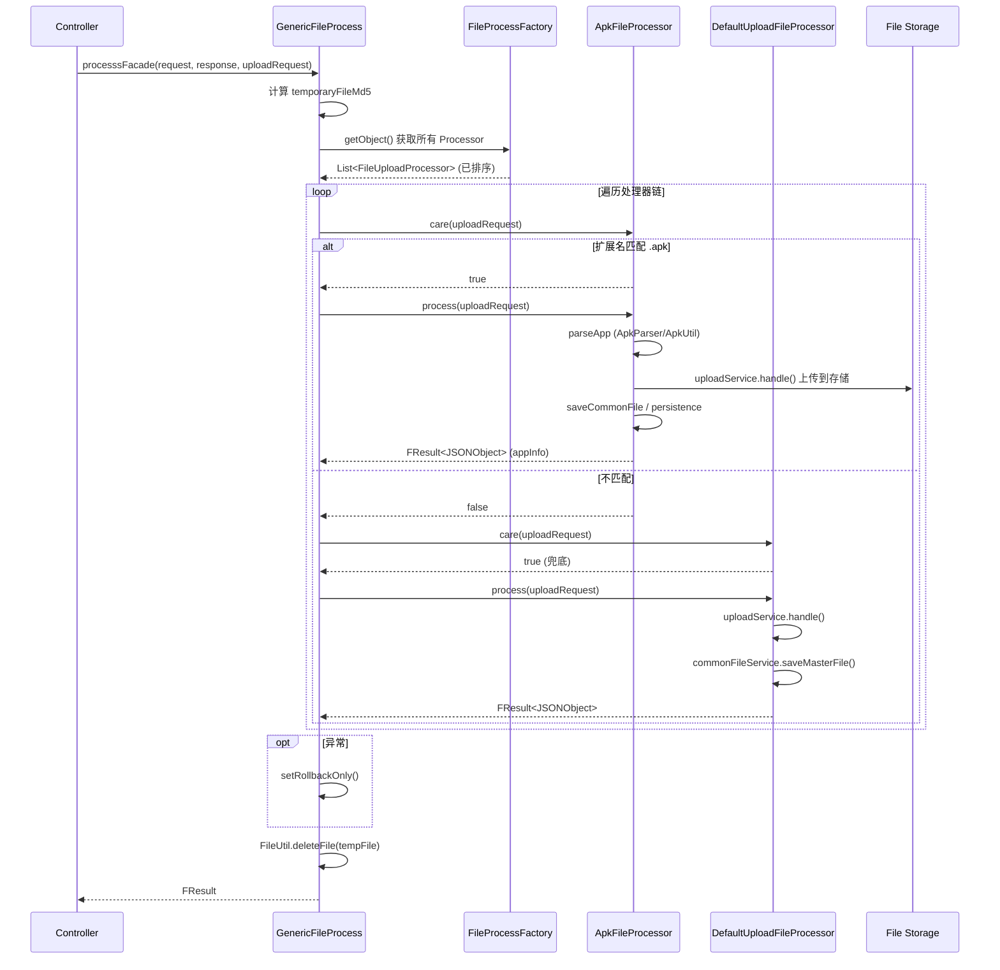

# 横切-文件上传责任链

> 文件上传的核心调度机制：通过责任链模式（Chain of Responsibility）将不同文件类型的处理逻辑解耦，由统一的 `processsFacade()` 入口驱动。

## 设计动机

文件管理服务 模块需要处理多种文件类型：APK、IPA、HAP、ZIP 脚本包、视频文件、通用文件等。每种类型的解析与持久化逻辑不同。使用责任链模式将"路由选择"与"业务处理"分离，新增文件类型只需增加一个处理器即可。

## 核心接口

```java
// FileUploadProcessor.java
public interface FileUploadProcessor {
    // 返回当前处理器是否匹配该请求
    boolean care(UploadFileRequest uploadFileRequest) throws IOException;
    // 处理文件，返回解析结果（含 appInfo / download / fileSize 等）
    FResult<JSONObject> process(UploadFileRequest request) throws Exception;
}
```

- `care()`: 前置条件判断，检查文件扩展名、bizCode 等
- `process()`: 执行实际的解析与持久化逻辑，通常在 `@Transactional` 内

## 处理器注册与排序

`@ProcessorOrder` 注解标记在处理器实现类上，设置 `order` 值控制链中顺序。`FileProcessFactory` 从 Spring 容器收集所有 `FileUploadProcessor` 的 Bean，并按 order 排序。

```java
// ApkFileProcessor 示例
@ProcessorOrder(order = 2)
@Service
public class ApkFileProcessor extends AppFileProcessor implements FileUploadProcessor {
    @Override
    public boolean care(UploadFileRequest uploadFileRequest) {
        boolean isApk = "apk".equalsIgnoreCase(FilenameUtils.getExtension(...));
        boolean isParseApp = uploadFileRequest.getBizCode() == BizCode.parseApp.getCode() && isApk;
        return isParseApp;
    }
}
```

排序越小的处理器越先被询问。`DefaultUploadFileProcessor` 的 `care()` 永远返回 `true`，作为链尾的兜底处理。

## 处理器链结构

```
FileUploadProcessor 接口（按 @ProcessorOrder.order 升序，越小越先被询问）
├── TestFileProcessor                  (order=0, 测试结果文件)
├── SimpleFileUploadProcessor          (order=1, 简单文件上传)
├── ApkFileProcessor                   (order=2, .apk)
├── IpaFileProcessor                   (order=4, .ipa)
├── ScriptFileProcessorV3              (order=5, ZIP 脚本包)
├── HapFileProcessor                   (order=6, .hap)
├── ScriptProcessor                    (order=7, 脚本处理)
├── AndroidKeystoreFileProcessor       (order=10, keystore 文件)
├── VideoFileProcessor                 (order=12, 视频文件)
└── DefaultUploadFileProcessor         (order=Integer.MAX_VALUE 默认值, care=true → 兜底)
```

> 说明：`AppFileProcessor` 虽标注 `@ProcessorOrder(order = 3)`，但它继承 `AbstractFileProcessor`、**不实现 `FileUploadProcessor` 接口**，因此不会被 `FileProcessFactory.getBeansOfType(FileUploadProcessor.class)` 收集进链；它只是 Apk/Ipa/Hap 三个子类的公共父类，三个子类命中后调用其 `process(UploadFileRequest, ParseAppConfig)` 统一处理。同理 `DefaultUploadFileProcessor` 的 `@ProcessorOrder` 未写 order 值，取注解默认值 `Integer.MAX_VALUE`，天然排在链尾作兜底。

## 调用入口

`GenericFileProcess.processsFacade()` 是所有上传请求的统一入口，被各个 Controller 继承调用：

```java
// GenericFileProcess.java
public FResult<?> processsFacade(HttpServletRequest request, HttpServletResponse response,
                                 UploadFileRequest uploadRequest) {
    try {
        // 1. 计算文件 MD5
        uploadRequest.setTemporaryFileMd5(FileUtil.md5(uploadRequest.getTemporaryFilePath()));

        // 2. 加载所有处理器（已排序）
        List<FileUploadProcessor> allFileUploadProcessor = getFileUploadProcessors();

        // 3. 遍历链，找到第一个 care()==true 的处理器执行
        for (FileUploadProcessor fileUploadProcessor : allFileUploadProcessor) {
            if (fileUploadProcessor.care(uploadRequest)) {
                processResult = fileUploadProcessor.process(uploadRequest);
                break;  // 只执行第一个匹配到的处理器
            }
        }
    } catch (RollbackTransactionException e) {
        // 事务回滚 + 返回错误信息
        TransactionAspectSupport.currentTransactionStatus().setRollbackOnly();
        return FResult.newFailure(e.getExceptionNumber(), "Upload failed:" + e.getExceptionTip());
    } finally {
        // 始终清理临时文件
        FileUtil.deleteFile(uploadRequest.getTemporaryFilePath());
    }
}
```

## 异常处理与事务回滚

- 处理器内部的 `@Transactional` 注解管理自身事务
- 业务逻辑中抛出 `RollbackTransactionException` 时，`processsFacade` 调用 `TransactionAspectSupport.currentTransactionStatus().setRollbackOnly()` 回滚当前事务
- `finally` 块始终执行 `FileUtil.deleteFile()` 清理临时文件

## 流程时序



## AbstractFileProcessor

提供统一的返回结果构建方法 `buildResult()`，所有处理器最终返回的 `FResult<JSONObject>` 中包含：

```
{
  originalFilename, fileSize, md5, download, fileid, appInfo, suiteId
}
```

## 关键文件

| 文件 | 职责 |
|---|---|
| [FileUploadProcessor](FileUploadProcessor.md) | 处理器接口 |
| [AbstractFileProcessor](AbstractFileProcessor.md) | 基类，提供 buildResult()（不实现 FileUploadProcessor，不参与链） |
| [ApkFileProcessor](ApkFileProcessor.md) | APK 处理器，order=2 |
| [IpaFileProcessor](IpaFileProcessor.md) | IPA 处理器，order=4 |
| [HapFileProcessor](HapFileProcessor.md) | HAP 处理器，order=6 |
| [AppFileProcessor](AppFileProcessor.md) | APP 通用处理器父类（不实现 FileUploadProcessor，子类命中后复用其 process） |
| [DefaultUploadFileProcessor](DefaultUploadFileProcessor.md) | 兜底处理器，order=Integer.MAX_VALUE（默认值） |
| [SimpleFileUploadProcessor](SimpleFileUploadProcessor.md) | 简单文件上传，order=1 |
| [ScriptFileProcessorV3](ScriptFileProcessorV3.md) | V3 脚本处理器，order=5 |
| [ScriptProcessor](ScriptProcessor.md) | 脚本处理器，order=7 |
| [TestFileProcessor](TestFileProcessor.md) | 测试结果文件处理器，order=0 |
| [VideoFileProcessor](VideoFileProcessor.md) | 视频文件处理器，order=12 |
| [AndroidKeystoreFileProcessor](AndroidKeystoreFileProcessor.md) | keystore 文件处理器，order=10 |
| [GenericFileProcess](GenericFileProcess.md) | processsFacade() 入口 |

## 关联专题

- [横切-通知系统](横切-通知系统.md) -- 上传成功后通过 MQ 通知下游
- [核心链路-APP上传与解析](核心链路-APP上传与解析.md) -- ApkFileProcessor 的详细处理流程
- [核心链路-脚本录制上传](核心链路-脚本录制上传.md) -- 脚本上传与 ScriptFileProcessorV3
