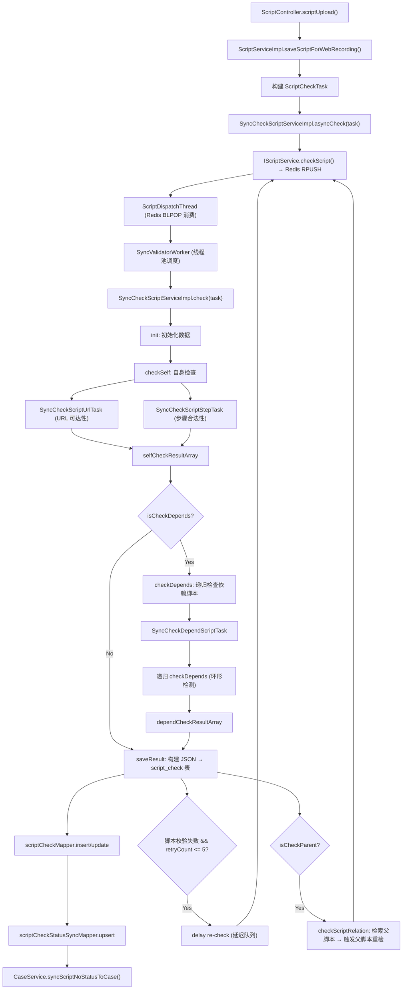

# 横切-脚本校验链路

> 脚本上传后异步执行的校验全链路：校验任务由 Redis 队列生产/消费、经 ScriptDispatchThread 分发到线程池、由 SyncCheckScriptServiceImpl 驱动多种校验 Task 并行执行，结果写入 `script_check` 表并通过 EventBus/ReportEvent 通知外部。

## 链路触发来源

1. **Web 录制上传**: `ScriptController.scriptUpload()` → `ScriptServiceImpl.saveScriptForWebRecording()` → 构建 `ScriptCheckTask` → `syncCheckScriptService.asyncCheck(task)`
2. **ApiController 内部触发**: `脚本处理链(ScriptFileProcessorV3)` → `ScriptProcessorHelper` → `syncCheckScriptService.asyncCheck(task)`
3. **依赖追溯重检**: 子脚本校验完成后 → `checkScriptRelation()` → 触达父脚本的重检

## 校验流程总览



## Redis 队列分发机制

### 入队（生产者）

`SyncCheckScriptServiceImpl.asyncCheck()` 调用 `IScriptService.checkScript()`，该方法内部将 `ScriptCheckTask` 序列化为 JSON 后通过 `IQueueDAO` RPUSH 到 Redis 队列（队列名由配置决定）。

### 出队（消费者）

`ScriptDispatchThread` 是一个独立的 `Runnable`，在后台线程中无限循环 `BLPOP` 消费：

```java
// ScriptDispatchThread.java
public void run() {
    while (true) {
        JSONObject taskJson = iqueuedao.pop(queueName);  // BLPOP 阻塞消费
        if (taskJson == null) continue;

        ScriptCheckTask task = Config.gson.fromJson(taskJson.toString(), ScriptCheckTask.class);

        // 处理延迟任务
        if (task.getHandleTime() != null) {
            Long delayTime = task.getHandleTime() - System.currentTimeMillis();
            if (delayTime > 0) Thread.sleep(delayTime);
        }

        SyncValidatorWorker handler = new SyncValidatorWorker(syncCheckScriptService, task);
        threadPool.execute(handler);  // 提交到线程池
    }
}
```

- 线程池配置: `corePoolSize=5, maxPoolSize=50, queueSize=1`, 超过 core 线程后空闲 5 分钟回收
- 命名规则: `script.handler.{N}`

### 双队列架构

根据启动配置，通常存在两个 ScriptDispatchThread 实例：
1. **普通队列**: 即时处理
2. **延迟队列**: 用于重试场景（`retry()` 方法给入队任务设置 `handleTime` 延迟 6 秒）

## 校验任务 Task 体系

| Task | 父类 | 职责 | 校验内容 |
|---|---|---|---|
| `SyncCheckScriptUrlTask` | `AbstractCheckTask` | URL 可达性检查 | HTTP HEAD 请求脚本 ZIP 下载地址 |
| `SyncCheckScriptStepTask` | `AbstractCheckTask` | 脚本步骤合法性检查 | JSON Schema 校验，步骤属性完整性 |
| `SyncCheckDependScriptTask` | `AbstractCheckTask` | 依赖脚本有效性检查 | 被调用子脚本是否存在、是否被删除、环形依赖检测 |
| `CheckScriptUrlTask` | `AbstractCheckTask` | 同步版本 URL 检查 | 同上，旧版本 |
| `CheckScriptStepTask` | `AbstractCheckTask` | 同步版本步骤检查 | 同上，旧版本 |

校验结果以 JSON 格式汇总，分为两大块：
- `selfCheckResultArray`: 自身校验结果（URL + 步骤）
- `dependCheckResultArray`: 依赖脚本校验结果（递归检测所有 call/screenAreaMonitor/catch 类步骤引用的子脚本）

### 环形依赖检测

`checkTracesRoute()` 方法检测调用链路中是否出现重复的 scriptNo，防止 A→B→C→A 环形引用。

## ListenableTaskMgr 任务生命周期管理

`ListenableTaskMgr` 基于 Guava `ListeningExecutorService` 管理并发校验任务：

```java
// 单例模式
ListenableTaskMgr taskMgr = ListenableTaskMgr.getInstance();
// 提交任务
taskMgr.submitTask("CHECK_URL", callableTask);
// 获取结果
List<ListenableFuture<JSONObject>> results = taskMgr.getTaskResultList();
// 清理
taskMgr.clear();
```

- 任务通过 `ListenableFuture` 可监听异步结果
- `clear()` 方法 shutdown 旧线程池并重建（用于每次校验会话的隔离）

## EventBus 事件通知

`EventBusCenter` 是基于 Google Guava EventBus 的单例事件总线：

```
EventBusCenter.post(ReportEvent) → ReportWatcher (监听) → 处理上报
```

```java
// EventBusCenter 使用方式
EventBusCenter.register(new ReportWatcher());
EventBusCenter.post(new ReportEvent(type, data));
EventBusCenter.unregister(watcher);
```

- `ReportEvent` 携带事件类型 `EventType` 和校验结果数据
- `ReportWatcher` 实现 `Watcher` 接口，在 `@Subscribe` 方法中处理事件回调
- 用于脚本校验结果的外部通知（如通知 RealTest 服务或 Case 服务）

## 结果持久化

校验完成后，`saveResult()` 方法写入两张表：

1. **script_check 表**: `insert` (首次) 或 `update` (已存在)，写入 `checkContent`(JSON) + `checkStatus`
2. **script_check_status_sync 表**: upsert 最新校验状态，用于 `CaseService.syncScriptNoStatusToCase()` 同步到用例服务

### 并发控制

使用 `ConcurrentHashMap<Object, AtomicInteger>` 作为内存锁：
- key 为 `"ScriptCheck-{scriptId}"`，控制对同一脚本的并发写
- `getLock(key)` / `releaseLock(key)` 获取/释放（AtomicInteger 计数模式）

## 重试机制

当校验结果非 VALID 且 retryCount <= 5 时：
- `retry() → IScriptService.checkScript(task, ..., true)` 延迟队列投递
- 延迟约 6 秒（`handleTime = now + 6000ms`）
- 用于处理"依赖脚本尚未上传"的时序问题（客户端批量上传）

## 父脚本传播

`checkScriptRelation()` 查询 `script_relation` 表获取"哪些父脚本引用了当前脚本"，对每个父脚本重新触发 check：

```java
// 查找所有引用了当前 scriptNo 的父脚本
List<ScriptRelation> relations = scriptRelationMapper.listByConditions(params);
for (ScriptRelation relation : relations) {
    buildCheckScriptTask(relation) → IScriptService.checkScript(...)
}
```

这确保子脚本状态变更后，父脚本的依赖检测结果也能及时更新。

## 关键文件

| 文件 | 职责 |
|---|---|
| `SyncCheckScriptService` | 校验服务接口（asyncCheck / check / sendCheckStatusToCase） |
| `SyncCheckScriptServiceImpl` | 校验主实现（init/checkSelf/checkDepends/saveResult） |
| `ScriptDispatchThread` | Redis 消费者线程（BLPOP → 线程池分发） |
| `SyncValidatorWorker` | Woker 执行器（封装 SyncCheckScriptService.check 调用） |
| `CheckTaskSupport` | 校验状态解析与常量 |
| `ScriptCheckTask` | 校验任务 VO |
| `SyncCheckScriptUrlTask` | URL 可达性校验 |
| `SyncCheckScriptStepTask` | 步骤合法性校验 |
| `SyncCheckDependScriptTask` | 依赖脚本有效性校验 |
| `ListenableTaskMgr` | 可监听任务管理器 |
| `EventBusCenter` | 事件总线（单例） |
| `ReportWatcher` | 报告事件监听器 |

## 关联专题

- [核心链路-脚本录制上传](核心链路-脚本录制上传.md) -- 校验链路的触发入口
- [横切-后台线程全景](横切-后台线程全景.md) -- ScriptDispatchThread / CleanResultWorker
- [ApiController](../07-开放接口文档/内部工具/ApiController.md) -- 内部校验触发接口
