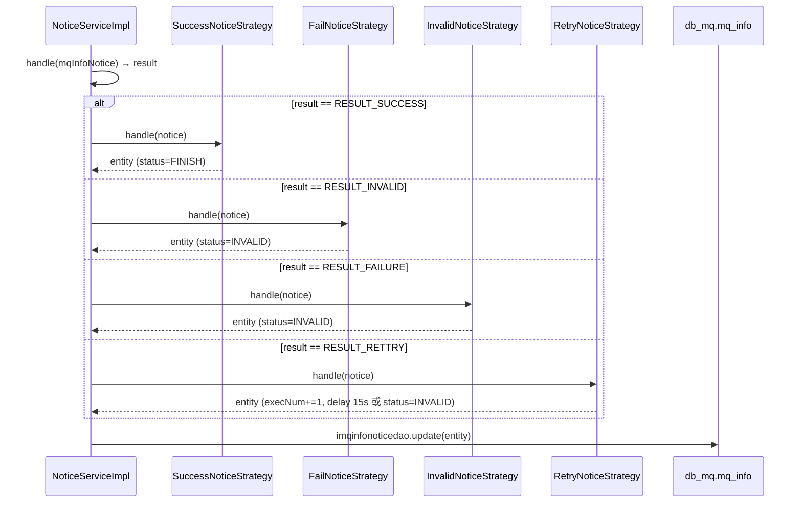

# 横切-通知系统

> 文件处理结果的通知分发机制：基于自建 MQ 表 `db_mq.mq_info` 的任务队列，采用生产者-消费者模式，通过策略模式（Success/Fail/Invalid/Retry）更新通知状态，并驱动异步处理（URL 下载解析 APP、上报 RealTest、解析测试结果文件）。

## 架构概览

通知系统不是传统的消息中间件（如 RabbitMQ），而是在 MySQL `db_mq` 库中建 `mq_info` 表作为持久化队列，配合 `MqNoticeDataThread` 定时（200ms）扫描待处理记录分发给消费者。

```
生产者                         队列                         消费者
=======                        ====                         ======
UrlController.notice()         MqInfoNotice                 MqNoticeDataThread
  → iNoticeService.add()         → db_mq.mq_info              → listByPending()
  → 写入 db_mq.mq_info                                       → pushJobqueue(channel)
  → uploadFileRequestMap.put()                               → NoticeDispatchThread
                                                               → NoticeServiceImpl.handle()
                                                                 → 策略模式更新状态
```

## 数据结构

### MqInfoNotice 关键字段

| 字段 | 说明 |
|---|---|
| `id` | 自增主键 |
| `vhost` | 虚拟主机（模块节点 ID） |
| `type` | 通知类型（1=URL解析APP / 2=上报RealTest / 3=解析测试文件） |
| `noticemark` | 通知标识（通常为 taskid） |
| `userid` | 用户 ID |
| `content` | JSON 负载 |
| `status` | 状态（PENDING / PROCESS / FINISH / INVALID） |
| `execNum` | 已执行次数 |
| `publishtime` | 发布时间（延迟发布） |
| `expiretime` | 过期时间（超时自动失效） |

### 通知类型枚举

```java
// NoticeConfig.InfoNoticeType
PARSE_APP_BY_URL_TASK(1, ...)     // 通过URL解析APP任务
REPORT_REAL_TEST_TASK(2, ...)     // 上报RealTest任务
PARSE_TEST_FILE_TASK(3, ...)      // 解析测试结果文件任务
```

## 生产者：发送通知

### URL 上传场景

`UrlController.notice()` 构建 `MqInfoNotice` 并发送：

```java
MqInfoNotice notice = new MqInfoNotice();
notice.setVhost(Constants.getModule_node_id());
notice.setNoticemark(uploadRequest.getTaskid());
notice.setUserid(uploadRequest.getUid());
notice.setType(NoticeConfig.InfoNoticeType.PARSE_APP_BY_URL_TASK.getValue());
notice.setPublishtime(System.currentTimeMillis() + delaytime);
notice.setExpiretime(System.currentTimeMillis() + validPeriod);
notice.setContent(param.toString());

Long noticeResult = iNoticeService.add(notice, null, true);

// 缓存请求对象，供消费时使用
NoticeConfig.uploadFileRequestMap.put(uploadRequest.getRequestId(), uploadRequest);
```

`NoticeConfig.uploadFileRequestMap` 是一个静态 `Map<String, UploadFileRequest>`，以 `requestId` 为 key 缓存上传请求对象。URL 上传场景中请求对象在 Controller 层产生，无法通过 MqInfoNotice 的 content 完整传递（Gson 序列化限制），故通过此 Map 传递。

## 消费者：启动与调度

### StartupListener

Spring Context 初始化完成后，`ApplicationContextAware.setApplicationContext()` 中启动消费者线程：

```java
// StartupListener.java
INoticeService inoticeservice = ...;

// 1. NoticeDispatchThread: 从 jobqueue 中取出通知并 dispatch
NoticeDispatchThread noticedispatchthread =
    new NoticeDispatchThread(inoticeservice, inoticeservice.jobqueue("fileupload"), 100, 10, 100);
new Thread(noticedispatchthread).start();

// 2. MqNoticeDataThread: 每 200ms 扫描 db_mq.mq_info 表
Integer[] tasknoticetypes = new Integer[]{
    PARSE_APP_BY_URL_TASK, REPORT_REAL_TEST_TASK, PARSE_TEST_FILE_TASK
};
MqNoticeDataThread taskmqnoticedatathread =
    new MqNoticeDataThread(vhost, tasknoticetypes, "fileupload", inoticeservice);
service.scheduleAtFixedRate(taskmqnoticedatathread, 1, 200, TimeUnit.MILLISECONDS);
```

### MqNoticeDataThread

每 200ms 执行一次，步骤如下：
1. `cleanByCompleted(vhost, types)`: 清理已完成/已过期的通知
2. `listByPending(vhost, types, 0, 100)`: 查询状态为 PENDING 的通知（每次最多 100 条）
3. `pushJobqueue(channel, notice)`: 将待处理通知推入内存队列

### NoticeDispatchThread

从 `jobqueue` 中取通知，按通知类型分发到对应业务处理器。实际 dispatch 到 `NoticeServiceImpl.handle()`。

## 消费者：NoticeServiceImpl.handle()

```java
public void handle(MqInfoNotice mqInfoNotice) {
    preCheck(mqInfoNotice);  // 参数校验

    MqInfoNotice dbNotice = imqinfonoticedao.get(vhost, type, id);
    if (dbNotice == null || !STATUS_PROCESS.equals(dbNotice.getStatus())) return;

    Integer result = RESULT_FAILURE;
    switch (mqInfoNotice.getType()) {
        case PARSE_APP_BY_URL_TASK:
            result = parseAppByUrlTaskHandle(mqInfoNotice);  // URL → 下载 → 解析 → APP 保存
            break;
        case REPORT_REAL_TEST_TASK:
            result = reportRealTestTask(mqInfoNotice);       // HTTP 通知 RealTest 服务
            break;
        case PARSE_TEST_FILE_TASK:
            result = parseTestResultTask(mqInfoNotice);      // 测试结果文件解析
            break;
    }
    updateNoticeStatus(mqInfoNotice, result);  // 策略模式更新状态
}
```

## 策略模式：状态更新



### 四种策略

| 策略 | 适用场景 | 操作 |
|---|---|---|
| `SuccessNoticeStrategy` | 处理成功 | status → FINISH |
| `FailNoticeStrategy` | 参数/业务异常 | status → INVALID |
| `InvalidNoticeStrategy` | 处理异常 | status → INVALID |
| `RetryNoticeStrategy` | 可重试失败 | execNum+1；超过 normalExecTimes 后延迟 15s；超过 maxExecTimes → INVALID |

### RetryNoticeStrategy 的降级通知

当重试次数达到上限（`execNum >= Config.maxExecTimes`）时：
- URL 解析失败 → 调用 `AppWorker.sendFailNotice()` 通知 RealTest 任务失败
- 测试结果解析失败 → 将 script_result 状态写入 PARSE_ERROR

## 处理流程详解

### PARSE_APP_BY_URL_TASK: URL 远程下载解析 APP

1. 从 `content` JSON 中取 `requestId`、`packageUrl`
2. 从 `NoticeConfig.uploadFileRequestMap` 取缓存的 `UploadFileRequest`
3. `AppWorker.execute()`:
   - `generateTempFile()`: HTTP GET 下载 APP 文件到本地临时目录
   - `appFileProcessor.process()`: 复用 `AppFileProcessor` 解析 APK/IPA/HAP
   - `sendReportRealTestNotice()`: 成功则下发 `REPORT_REAL_TEST_TASK` 通知
4. 清理临时文件

### REPORT_REAL_TEST_TASK: 上报 RealTest 服务

```java
result = RealTestApi.taskComplete(contentJson);  // HTTP POST 到 RealTest 服务
```

通知 RealTest 服务任务完成（APP 已解析成功），携带 appInfo 列表。

### PARSE_TEST_FILE_TASK: 测试结果文件解析

`TestFileParseTask.execute()`:
1. `buildHandleTarget()`: 通过 `TestFileHandler` 解析解压后的目录，构建待处理的 `ScriptResult` 列表
2. `handleTargetWithUpload()`: `TestFileWorker` 并发上传子文件（截图、日志等）
3. `combineResult()`: 合并所有子文件链接为汇总 JSON
4. `updateDB()`: 上传汇总 JSON，更新 `script_result` 表（`resultfileUrl` + `status=PARSED`）

## 关键文件

| 文件 | 职责 |
|---|---|
| `NoticeConfig` | 通知常量、枚举、uploadFileRequestMap |
| `NoticeServiceImpl` | 通知处理主流程 + AppWorker 内部类 |
| `MqNoticeDataThread` | 定时 200ms 扫描 db_mq 队列 |
| `StartupListener` | 启动 MqNoticeDataThread + NoticeDispatchThread |
| `SuccessNoticeStrategy` | 成功状态更新 |
| `FailNoticeStrategy` | 异常状态更新 |
| `InvalidNoticeStrategy` | 失败状态更新 |
| `RetryNoticeStrategy` | 重试/降级处理 |
| `TestFileParseTask` | 测试结果文件解析主流程 |
| `TestFileHandler` | 解压目录解析 |
| `TestFileWorker` | 子文件并发上传 |

## 关联专题

- [横切-后台线程全景](横切-后台线程全景.md) -- MqNoticeDataThread / NoticeDispatchThread 详情
- [核心链路-URL上传](核心链路-URL上传.md) -- PARSE_APP_BY_URL_TASK 的触发入口
- [核心链路-APP上传与解析](核心链路-APP上传与解析.md) -- AppFileProcessor.process() 的解析逻辑
- [UrlController](../07-开放接口文档/文件上传/UrlController.md) -- URL 上传接口
