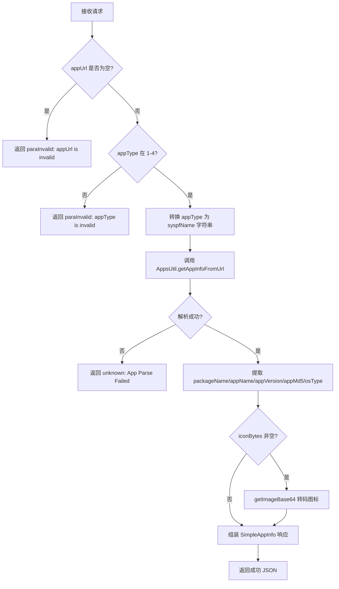
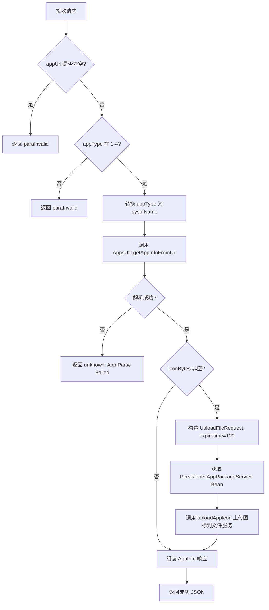

# service-App — APP 解析接口（ApiServlet）

> 分支：syy.release.z7.8.1.0
> 源文件：`src/main/java/cn/testin/service/fs/App.java`
> 基础类：`cn.testin.service.GenericBaseService`
> 机制：请求走 `ApiServlet /openapi` 入口，通过 `action=fs` + `op=App.方法名` 路由到此类的对应 public 方法；每个方法的参数为 `ApiRequest`，返回 JSON 字符串。
> - **action**: `fs`（对应包 `cn.testin.service.fs`）
> - **入口格式**：`{"op": "App.方法名", "action": "fs", "data": {...}}`
> 业务：APP 安装包信息解析（支持 Android / iOS / HarmonyOS / HarmonyOS Next），返回包名、应用名、版本号、图标等信息。

## op 列表总表

| # | op | 方法名 | 说明 |
|---|---|---|---|
| 1 | App.parse | parse | 解析 APP 安装包信息（返回图标 base64） |
| 2 | App.parseAppInfo | parseAppInfo | 解析 APP 安装包信息并上传图标到文件服务 |

---

## 1. op=App.parse — 解析 APP 信息

### 请求格式
```json
{"op": "App.parse", "action": "fs", "data": {"appUrl": "...", "appType": 1}}
```

### 参数

| 字段 | 类型 | 必填 | 说明 |
|---|---|---|---|
| appUrl | String | 是 | APP 安装包的下载 URL |
| appType | Integer | 是 | 平台类型：1=Android, 2=iOS, 3=HarmonyOS, 4=HarmonyOS Next |

### 核心逻辑

1. 校验 `appUrl` 非空，`appType` 在 1-4 范围内。
2. 根据 `appType` 转换为平台名称字符串 `syspfName`（android/ios/HarmonyOS/HarmonyOS Next）。
3. 调用 `AppsUtil.getAppInfoFromUrl(appUrl, syspfName)` 解析远程 APP 包，返回 `AppInfo` 对象。
4. 从 `AppInfo` 中提取 `packageName`、`appName`、`appVersion`、`appMd5`、`osType`。
5. 如果 `iconBytes` 非空，调用 `getImageBase64()` 将图标字节数组转为 Base64 字符串。
6. 组装为 `SimpleAppInfo` 返回。



**关键代码：**

```java
AppInfo appInfo = AppsUtil.getAppInfoFromUrl(appUrl, syspfName);
if (null == appInfo || StringUtils.isBlank(appInfo.getPackageName())) {
    return ApiUtil.getResult(apirequest, CommonCode.unknown.getValue(),
            String.format("%s(%s)", CommonCode.unknown.getDescr(), "App Parse Failed, url is: " + appUrl));
}
result = new SimpleAppInfo();
result.setPackageName(appInfo.getPackageName());
result.setAppName(appInfo.getAppName());
result.setAppVersion(appInfo.getAppVersion());
result.setAppMd5(appInfo.getAppMd5());
result.setOsType(appInfo.getOsType());
if (null != appInfo.getIconBytes() && appInfo.getIconBytes().length > 0) {
    result.setIcon(getImageBase64(appInfo.getIconBytes()));
}
```

### 响应

```json
{
  "error_code": 0,
  "msg": "success",
  "data": {
    "object": {
      "packageName": "com.example.app",
      "appName": "示例应用",
      "appVersion": "1.0.0",
      "appMd5": "d41d8cd98f00b204e9800998ecf8427e",
      "osType": "android",
      "icon": "iVBORw0KGgo...(base64)..."
    }
  }
}
```

**返回参数**

| 字段 | 类型 | 说明 |
|---|---|---|
| action | String | 回显请求 action（fs） |
| op | String | 回显请求 op（App.parse） |
| code | Integer | 状态码，0 成功 |
| msg | String | 提示信息 |
| data | JSONObject | 业务数据 |
| data.objInfo | JSONObject | SimpleAppInfo |
| data.objInfo.packageName | String | APP 包名 |
| data.objInfo.appName | String | APP 名称 |
| data.objInfo.appVersion | String | APP 版本 |
| data.objInfo.appMd5 | String | APP 文件 MD5 |
| data.objInfo.osType | Integer | 系统类型 |
| data.objInfo.icon | String | 图标信息（base64） |

---

## 2. op=App.parseAppInfo — 解析 APP 信息并上传图标

### 请求格式
```json
{"op": "App.parseAppInfo", "action": "fs", "data": {"appUrl": "...", "appType": 1}}
```

### 参数

| 字段 | 类型 | 必填 | 说明 |
|---|---|---|---|
| appUrl | String | 是 | APP 安装包的下载 URL |
| appType | Integer | 是 | 平台类型：1=Android, 2=iOS, 3=HarmonyOS, 4=HarmonyOS Next |

### 核心逻辑

1. 校验 `appUrl` 和 `appType`（逻辑同 `parse`）。
2. 调用 `AppsUtil.getAppInfoFromUrl(appUrl, syspfName)` 解析 APP 包。
3. 如果解析成功且 `iconBytes` 非空：
   - 构造 `UploadFileRequest`，设置过期时间为 120 天。
   - 通过 `SpringHelper` 获取 `PersistenceAppPackageService` Bean。
   - 调用 `persistenceAppPackageService.uploadAppIcon(appInfo, uploadFileRequest)` 将图标上传到文件存储服务（如 FastDFS）。
4. 与 `parse` 不同的是，本方法直接返回完整的 `AppInfo` 对象（而非 `SimpleAppInfo`），不将图标转 base64。



**关键代码：**

```java
if (null != appInfo.getIconBytes() && appInfo.getIconBytes().length > 0) {
    UploadFileRequest uploadFileRequest = new UploadFileRequest();
    JSONObject jsonObject = new JSONObject();
    jsonObject.put("expiretime", 120);
    uploadFileRequest.setUploadJSON(jsonObject);
    PersistenceAppPackageService persistenceAppPackageService =
        SpringHelper.getBean(PersistenceAppPackageService.class);
    persistenceAppPackageService.uploadAppIcon(appInfo, uploadFileRequest);
}
```

### 响应

```json
{
  "error_code": 0,
  "msg": "success",
  "data": {
    "object": {
      "packageName": "com.example.app",
      "appName": "示例应用",
      "appVersion": "1.0.0",
      "appMd5": "d41d8cd98f00b204e9800998ecf8427e",
      "osType": "android",
      "iconUrl": "http://fdfs-host/group1/M00/00/01/xxx.png"
    }
  }
}
```

**返回参数**

| 字段 | 类型 | 说明 |
|---|---|---|
| action | String | 回显请求 action（fs） |
| op | String | 回显请求 op（App.parseAppInfo） |
| code | Integer | 状态码，0 成功 |
| msg | String | 提示信息 |
| data | JSONObject | 业务数据 |
| data.objInfo | JSONObject | 完整 AppInfo（区别于 parse 返回 SimpleAppInfo） |
| data.objInfo.commonFileId | Long | 文件服务记录 ID |
| data.objInfo.checkApp | Integer | 应用监测状态：1=通过，0=未知，-1=未通过 |
| data.objInfo.appName | String | APP 名称 |
| data.objInfo.fullName | String | APP 完整文件名 |
| data.objInfo.appVersion | String | APP 版本 |
| data.objInfo.category | String | 应用分类 |
| data.objInfo.appMd5 | String | APP 文件 MD5 |
| data.objInfo.appSize | Long | APP 文件大小（字节） |
| data.objInfo.iconUrl | String | 图标上传后的 URL（本方法额外上传 icon，不内嵌 base64） |
| data.objInfo.appUrl | String | APP 下载 URL |
| data.objInfo.packageName | String | APP 包名 |
| data.objInfo.startupPath | String | 启动路径（启动 Activity） |
| data.objInfo.minSdk | String | 最低 SDK 版本 |
| data.objInfo.targetSdk | String | 目标 SDK 版本 |
| data.objInfo.appPermissions | String | 应用权限信息 |
| data.objInfo.appFeatures | String | 应用特性信息 |
| data.objInfo.exceed | Integer | 是否超出免费适配提交次数限制：0=不超出，1=超出 |
| data.objInfo.iTunesStore | Boolean | 是否 iTunes 商店应用 |
| data.objInfo.sdks | String | 集成的 SDK 信息 |
| data.objInfo.appSig | String | APP 签名信息 |
| data.objInfo.appResSig | String | APP 资源签名 |
| data.objInfo.appVersionCode | String | APP 版本号（versionCode） |
| data.objInfo.errorMsg | String | 解析错误信息 |
| data.objInfo.channelId | String | 渠道 ID |
| data.objInfo.pkgid | Integer | 提交解析请求的应用包 ID |
| data.objInfo.appId | Integer | 应用 ID |
| data.objInfo.parseMethod | String | 解析方法（区分 HarmonyOS / HarmonyOS Next 包） |
| data.objInfo.osType | Integer | 系统类型 |

> AppInfo 中标注 `@JsonIgnore` 的字段（`iconBytes`、`syspfName`、`syspfExt`、`signmd5`、`scan`、`appcheckinfo`、`applocalpath`、`appExtendInfos`）不会序列化到响应 JSON 中。

> **注意**：`parseAppInfo` 与 `parse` 的区别在于：
> - `parse` 将图标以 Base64 字符串内嵌在响应中返回。
> - `parseAppInfo` 将图标上传到文件存储服务，返回 `AppInfo`（含 `iconUrl`），图标不嵌在 JSON 中。

---

### 涉及表

- 无直接数据库表操作。APP 解析通过 `AppsUtil.getAppInfoFromUrl()` 进行，底层可能调用远程 API 或本地工具解析 APK/IPA 文件。
- 图标上传通过 `PersistenceAppPackageService.uploadAppIcon()` 写入文件存储（如 FastDFS），可能涉及 `db_app_package` 或相关持久化表。

### 辅助方法

- `getImageBase64(byte[] data)`：使用 `sun.misc.BASE64Encoder` 将图片字节数组转为 Base64 字符串，并去除所有空白字符。
